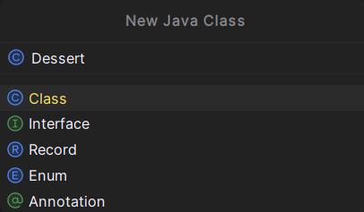
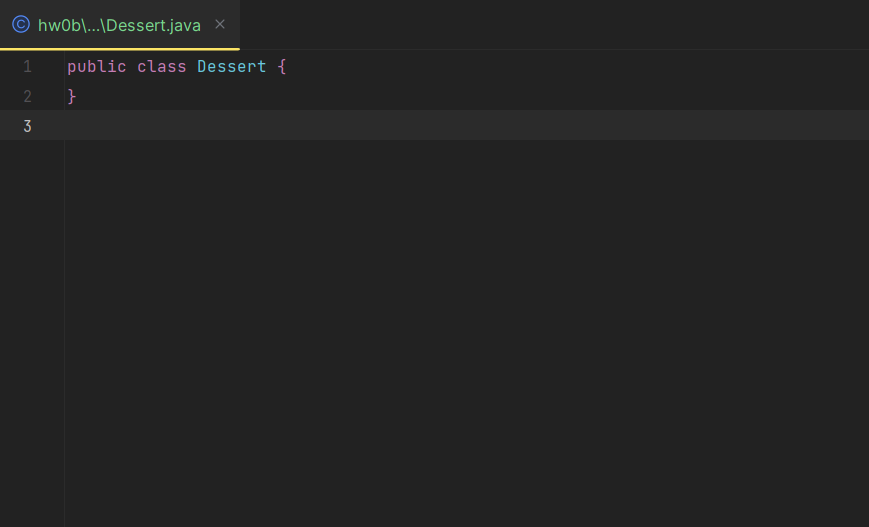

# 作业布置
请按照 [作业流程指南](https://sp25.datastructur.es/resources/guides/assignment-workflow/) 开始本次作业。本次作业名称为 hw0b。
# 代码风格
从这次作业开始，我们将 **严格要求代码风格** 。你必须遵循 [代码风格指南](https://sp25.datastructur.es/resources/guides/style/) ，否则自动评分时会被扣分。

你应该使用 CS 61B 插件在本地检查代码风格。
# 语言结构

## 类型
Java是一种静态类型语言，这意味着每个变量在编译时就已知的类型，也就是说你必须在代码中指定它。相比之下，Python是一种动态类型语言，这意味着变量的类型通常仅在运行时才可知，也就是说你无需在代码中指定它们。

在Java中，有两种类型：基本类型和引用类型。基本类型是小写的，我们在[A部分](https://sp25.datastructur.es/homeworks/hw0/hw0a/#types)列出了需要关注的类型：`boolean`、`int`、`char`、`double` 。几乎所有其他类型都是引用类型，比如`String` 。如果一个类型以大写字母开头，它很可能是引用类型。

在第4讲中你会更深入地学习基本类型和引用类型的区别，但对于这次作业，你需要知道每种基本类型都有对应的引用类型（`Boolean`、`Integer`、`Character`、`Double` ）。如果你使用“泛型”来声明一个数据结构，就必须使用引用类型。基本类型和其对应的引用类型之间通常可以无缝转换。 
## null
Java中也有`null` ，它大类似于Python中的`None` 。任何引用类型都可以被赋予`null` 值。如果我们尝试从一个值为`null` 的对象访问实例成员或调用实例方法，就会遇到名为`NullPointerException`（空指针异常 ）的错误。 

## Arrays（固定大小）
Java数组与Python列表有很多相似之处。但是，Java数组的大小是固定的，所以我们不能新增或删除元素（即没有`append`、`remove` 等操作 ）。

| Python | Java |
| ---- | ---- |
| <pre><code>zeroedLst = [0, 0, 0]<br>lst = [4, 7, 10]<br>lst[0] = 5<br><span style="color:blue">print</span>(lst[0])<br><span style="color:blue">print</span>(lst)<br><span style="color:blue">print</span>(<span style="color:green">len</span>(lst))</code></pre> | <pre><code><span style="color:blue">int</span>[] zeroedArray = <span style="color:green">new</span> <span style="color:blue">int</span>[3];<br><span style="color:blue">int</span>[] array = {4, 7, 10};<br>array[0] = 5;<br><span style="color:blue">System.out.println</span>(array[0]);<br><span style="color:blue">System.out.println</span>(<span style="color:blue">Arrays.toString</span>(array));<br><span style="color:blue">System.out.println</span>(array.length);</code></pre> | 

- 在`new int[3]` 中，`int` 是数组中的元素类型，`3` 是数组的长度。使用这种语法时，所有元素都采用其“默认值”。对于`int` 类型，默认值是0。

- 数组不能以理想的格式直接打印，这超出了作业0的范畴。要打印数组，可以调用`Arrays.toString(array)` 。 
- 数组没有`length` 方法。`length` 是一个实例变量，所以它后面没有括号。 
- Java不支持负索引或切片操作。 
## Foreach 循环/增强型For循环
| Python | Java |
| ---- | ---- |
| <pre><code>lst = [1, 2, 3]<br><span style="color:green">for</span> i <span style="color:green">in</span> lst:<br>    <span style="color:blue">print</span>(i)</code></pre> | <pre><code><span style="color:blue">int</span>[] array = {1, 2, 3};<br><span style="color:green">for</span> (<span style="color:blue">int</span> i : array) {<br>    <span style="color:blue">System.out.println</span>(i);<br>}</code></pre> |

- 注意迭代变量的类型声明，以及使用`:` 而非`in` 。

- 我们也可以在某些其他类型（如`List` 和`Set` ）上使用这种语法。 
## List（可调整大小）
| Python | Java |
| ---- | ---- |
| <pre><code>lst = []<br>lst.append("zero")<br>lst.append("one")<br>lst[0] = "zed"<br><span style="color:blue">print</span>(lst[0])<br><span style="color:blue">print</span>(<span style="color:green">len</span>(lst))<br><span style="color:green">if</span> "one" <span style="color:green">in</span> lst:<br>    <span style="color:blue">print</span>("one in lst")<br><br><span style="color:green">for</span> elem <span style="color:green">in</span> lst:<br>    <span style="color:blue">print</span>(elem)</code></pre> | <pre><code><span style="color:blue">List</span>&lt;<span style="color:blue">String</span>&gt; lst = <span style="color:green">new</span> <span style="color:blue">ArrayList</span>&lt;&gt;();<br>lst.add("zero");<br>lst.add("one");<br>lst.set(0, "zed");<br><span style="color:blue">System.out.println</span>(lst.get(0));<br><span style="color:blue">System.out.println</span>(lst.size());<br><span style="color:green">if</span> (lst.contains("one")) {<br>    <span style="color:blue">System.out.println</span>("one in lst");}<br><br><span style="color:green">for</span> (<span style="color:blue">String</span> elem : lst) {<br>    <span style="color:blue">System.out.println</span>(elem);<br>}</code></pre> |

- Java有`List` 接口。我们大多使用`ArrayList` 实现。

- `List` 接口通过尖括号`<>` 来指定其所存储元素的类型。 
- `List` 同样不支持切片或负索引。 
## Set
| Python | Java |
| ---- | ---- |
| <pre><code>s = <span style="color:green">set</span>()<br>s.add(1)<br>s.add(1)<br>s.add(2)<br>s.remove(2)<br><span style="color:blue">print</span>(<span style="color:green">len</span>(s))<br><span style="color:green">if</span> 1 <span style="color:green">in</span> s:<br>    <span style="color:blue">print</span>("1 in s")<br><br><span style="color:green">for</span> elem <span style="color:green">in</span> s:<br>    <span style="color:blue">print</span>(elem)</code></pre> | <pre><code><span style="color:blue">Set</span>&lt;<span style="color:blue">Integer</span>&gt; set = <span style="color:green">new</span> <span style="color:blue">HashSet</span>&lt;&gt;();<br>set.add(1);<br>set.add(1);<br>set.add(2);<br>set.remove(2);<br><span style="color:blue">System.out.println</span>(set.size());<br><span style="color:green">if</span> (set.contains(1)) {<br>    <span style="color:blue">System.out.println</span>("1 in set");}<br><br><span style="color:green">for</span> (<span style="color:blue">int</span> elem : set) {<br>    <span style="color:blue">System.out.println</span>(elem);<br>}</code></pre> |

- Java有`Set` 接口，主要有两种实现：`TreeSet` 和`HashSet` 。`TreeSet` 会将元素按顺序保存，且速度较快。与之相比，`HashSet` 没有定义的“顺序”，但（通常）速度极快 。

    - 在后续课程中学习渐近分析时，我们会正式明确这些关于“速度快”的概念。 
- `Set` 不能包含重复元素。如果尝试添加已在集合中的元素，不会产生任何效果。 
## Dictionaries / Maps

| Python | Java |
| ---- | ---- |
| <pre><code>d = {}<br>d["hello"] = "hi"<br>d["hello"] = "goodbye"<br><span style="color:blue">print</span>(d["hello"])<br><span style="color:blue">print</span>(<span style="color:green">len</span>(d))<br><span style="color:green">if</span> "hello" <span style="color:green">in</span> d:<br>    <span style="color:blue">print</span>('"hello" in d')<br><br><span style="color:green">for</span> key <span style="color:green">in</span> d.keys():<br>    <span style="color:blue">print</span>(key)</code></pre> | <pre><code><span style="color:blue">Map</span>&lt;<span style="color:blue">String</span>, <span style="color:blue">String</span>&gt; map = <span style="color:green">new</span> <span style="color:blue">HashMap</span>&lt;&gt;();<br>map.put("hello", "hi");<br>map.put("hello", "goodbye");<br><span style="color:blue">System.out.println</span>(map.get("hello"));<br><span style="color:blue">System.out.println</span>(map.size());<br><span style="color:green">if</span> (map.containsKey("hello")) {<br>    <span style="color:blue">System.out.println</span>('"hello" in map');}<br><br><span style="color:green">for</span> (<span style="color:blue">String</span> key : map.keySet()) {<br>    <span style="color:blue">System.out.println</span>(key);<br>}</code></pre> |

- Java有`Map` 接口，主要有两种实现：`TreeMap` 和`HashMap` 。与集合类似，`TreeMap` 会对键进行排序且速度较快；`HashMap` 没有定义的顺序，且（通常）速度极快 。

- `Map` 不能包含重复的键。如果尝试添加已存在于映射中的键，其对应的值会被覆盖。 
- 在尖括号中，我们首先指定“键类型”，然后是“值类型”。 
- `Map` 不能直接使用`:`进行`for` 循环。通常，我们调用`keySet` 来遍历键，然后使用这些键来检索值。也可以遍历`entrySet` 来同时获取键和值。 

## 类

| Python | Java |
| ---- | ---- |
| <pre><code><span style="color:green">class</span> Point:<br>    <span style="color:green">def</span> __init__(<span style="color:green">self</span>, x, y):<br>        <span style="color:green">self</span>.x = x<br>        <span style="color:green">self</span>.y = y<br><br>    <span style="color:green">def</span> distanceTo(<span style="color:green">self</span>, other):<br>        <span style="color:green">return</span> <span style="color:green">math.sqrt</span>(<br>            (<span style="color:green">self</span>.x - other.x) ** 2 +<br>            (<span style="color:green">self</span>.y - other.y) ** 2<br>        )<br><br>    <span style="color:green">def</span> translate(<span style="color:green">self</span>, dx, dy):<br>        <span style="color:green">self</span>.x += dx<br>        <span style="color:green">self</span>.y += dy</code></pre> | <pre><code><span style="color:green">public</span> <span style="color:green">class</span> Point {<br>    <span style="color:green">public</span> <span style="color:blue">int</span> x;<br>    <span style="color:green">public</span> <span style="color:blue">int</span> y;<br>    <span style="color:green">public</span> Point(<span style="color:blue">int</span> x, <span style="color:blue">int</span> y) {<br>        <span style="color:green">this</span>.x = x;<br>        <span style="color:green">this</span>.y = y;<br>    }<br>    <span style="color:green">public</span> Point() {<br>        <span style="color:green">this</span>(0, 0);<br>    }<br>    <span style="color:green">public</span> <span style="color:blue">double</span> distanceTo(Point other) {<br>        <span style="color:green">return</span> <span style="color:blue">Math.sqrt</span>(<br>            <span style="color:blue">Math.pow</span>(<span style="color:green">this</span>.x - other.x, 2) +<br>            <span style="color:blue">Math.pow</span>(<span style="color:green">this</span>.y - other.y, 2)<br>        )<br>    }<br>    <span style="color:green">public</span> <span style="color:blue">void</span> translate(<span style="color:blue">int</span> dx, <span style="color:blue">int</span> dy) {<br>        <span style="color:green">this</span>.x += dx;<br>        <span style="color:green">this</span>.y += dy;<br>    }<br>}</code></pre> | 

我们可以按如下方式使用这些类：

| Python | Java |
| ---- | ---- |
| <pre><code>p1 = Point(5, 9)<br>p2 = Point(-3, 3)<br><span style="color:blue">print</span>(f"Point 1: ({p1.x}, {p1.y})")<br><span style="color:blue">print</span>("Distance:", p1.distanceTo(p2))<br>p1.translate(2, 2)<br><span style="color:blue">print</span>(f"Point 1: ({p1.x}, {p1.y})")</code></pre> | <pre><code>Point p1 = <span style="color:green">new</span> Point(5, 9);<br>Point p2 = <span style="color:green">new</span> Point(-3, 3);<br><span style="color:blue">System.out.println</span>("Point 1: ( " + p1.x + ", " + p1.y + ")" );<br><span style="color:blue">System.out.println</span>("Distance: " + p1.distanceTo(p2));<br>p1.translate(2, 2);<br><span style="color:blue">System.out.println</span>("Point 1: ( " + p1.x + ", " + p1.y + ")" );</code></pre> |

## Main

Java程序中也可能有一个名为`main` 的特殊方法。当你执行一个程序时，`main` 方法会被调用。`main` 方法会运行它内部的代码，这些代码可能会调用程序中定义的其他方法。

我们用`public static void main(String[] args)` 这个签名来定义`main` 方法。在后续课程中你会学习这个签名中每一部分的含义。目前，你可以把`main` 方法当作你所编写代码的`运行按钮`。

为了运行上一个例子中的代码，我们可以在`Point` 类中创建一个`main` 方法，如下所示： 

| Python | Java |
| ---- | ---- |
| <pre><code><span style="color:green">class</span> Point:<br>    <span style="color:green">#</span> other methods...<br>    <span style="color:green">#</span> end of Point class<br><br><span style="color:green">if</span> __name__ == '__main__':<br>    p1 = Point(5, 9)<br>    p2 = Point(-3, 3)<br>    <span style="color:blue">print</span>(f"Point 1: ({p1.x}, {p1.y})")<br>    <span style="color:blue">print</span>("Distance:", p1.distanceTo(p2))<br>    p1.translate(2, 2)<br>    <span style="color:blue">print</span>(f"Point 1: ({p1.x}, {p1.y})")</code></pre> | <pre><code><span style="color:green">public</span> <span style="color:green">class</span> Point {<br>    <span style="color:green">//</span> other methods...<br><br>    <span style="color:green">public</span> <span style="color:green">static</span> <span style="color:blue">void</span> main(<span style="color:blue">String</span>[] args) {<br>        Point p1 = <span style="color:green">new</span> Point(5, 9);<br>        Point p2 = <span style="color:green">new</span> Point(-3, 3);<br>        <span style="color:blue">System.out.println</span>("Point 1: ( " + p1.x + ", " + p1.y + ")" );<br>        <span style="color:blue">System.out.println</span>("Distance: " + p1.distanceTo(p2));<br>        p1.translate(2, 2);<br>        <span style="color:blue">System.out.println</span>("Point 1: ( " + p1.x + ", " + p1.y + ")" );<br>    }<br><br>    <span style="color:green">//</span> end of Point class<br>}</code></pre> | 

注意，在Java中，`main` 方法是在类中定义的。

如果你在IntelliJ中进行编码，实际上可以“运行”`main` 方法！IntelliJ会在`main` 方法签名的左侧显示一个绿色的运行按钮。点击它即可运行其中的代码。 
# 程序
让我们来看一些使用数据结构和类的Java程序。这里有一些简单的示例，当你忘记如何做某些事情时，可能会用到它们来参考。 
## 数字列表的最小值索引

| Python | Java |
| ---- | ---- |
| <pre><code><span style="color:green">def</span> min_index(numbers):<br>    <span style="color:green">#</span> Assume len(numbers) >= 1<br>    m = numbers[0]<br>    idx = 0<br>    <span style="color:green">for</span> i <span style="color:green">in</span> <span style="color:green">range</span>(<span style="color:green">len</span>(numbers)):<br>        <span style="color:green">if</span> numbers[i] < m:<br>            m = numbers[i]<br>            idx = i<br>    <span style="color:green">return</span> idx</code></pre> | <pre><code><span style="color:green">public</span> <span style="color:green">static</span> <span style="color:blue">int</span> minIndex(<span style="color:blue">int</span>[] numbers) {<br>    <span style="color:green">//</span> Assume numbers.length >= 1<br>    <span style="color:blue">int</span> m = numbers[0];<br>    <span style="color:blue">int</span> idx = 0;<br>    <span style="color:green">for</span> (<span style="color:blue">int</span> i = 0; i < numbers.length; i++) {<br>        <span style="color:green">if</span> (numbers[i] < m) {<br>            m = numbers[i];<br>            idx = i;<br>        }<br>    }<br>    <span style="color:green">return</span> idx;<br>}</code></pre> | 

# Exceptions
最后，让我们结合前面的例子，看看与Python相比，在Java中如何抛出异常。 

| Python | 
| ---- |
| <pre><code><span style="color:green">def</span> minIndex(numbers):<br>    <span style="color:green">if</span> <span style="color:green">len</span>(numbers) == 0:<br>        <span style="color:green">raise</span> <span style="color:green">Exception</span>("There are no elements in the list!")<br>    m = numbers[0]<br>    idx = 0<br>    <br>    ...<br>    <br>    <span style="color:green">return</span> m</code></pre>

| Java |
| ---- |
| <pre><code><span style="color:green">public</span> <span style="color:green">static</span> <span style="color:blue">int</span> minIndex(<span style="color:blue">int</span>[] numbers) <span style="color:green">throws</span> <span style="color:green">Exception</span> {<br>    <span style="color:green">if</span> (numbers.length == 0) {<br>        <span style="color:green">throw</span> <span style="color:green">new</span> <span style="color:blue">IllegalArgumentException</span>("There are no elements in the array!");<br>    }<br>    <span style="color:blue">int</span> m = numbers[0];<br>    <span style="color:blue">int</span> idx = 0;<br>    <br>    ...<br>    <br>    <span style="color:green">return</span> m;<br>}</code></pre> |


# 编程练习

为了让你更熟悉Java语法和测试，这里有几道练习题需要你解答！在你完成函数编写后，我们提供了一些测试用例。尽管我们已提供测试，但也欢迎你自行编写！编写测试不仅在本课程中至关重要，还是一项通用的重要技能。它能强化我们对特定方法功能的理解，还能帮我们发现边界情况！在后续课程中你会有更多测试练习，我们希望你能尽早接触。

请先完成实验01，并参考[此处（更改链接）](https://sp25.datastructur.es/resources/guides/assignment-workflow/)了解如何开始本次作业。

在完成作业时，你可能需要使用不同的数据结构，如`ArrayList` 和`TreeMap` 。要导入这些类，如果你将鼠标悬停在使用数据结构的地方，IntelliJ会提供导入选项，或者你也可以手动添加以下代码：
```java
import java.util.ArrayList;
import java.util.TreeMap;
``` 

## 任务 1：Java 练习
在`JavaExercises.java` 中有4个不同的方法需要你完成：

- `makeDice`：该方法需返回一个新的整数数组`[1, 2, 3, 4, 5, 6]`。 

- `takeOrder`：此方法接收一个`String` 类型参数，返回一个包含顾客订单的新数组。如果顾客是`Ergun`，你应按顺序返回字符串数组`["beyti", "pizza", "hamburger", "tea"]` ；如果顾客是`Erik`，你应返回字符串数组`["sushi", "pasta", "avocado", "coffee"]` 。在其他情况下，返回一个长度为3且每个元素都为`null` 的字符串数组。
    - **注意**：`==` 对字符串的判断表现很奇怪,我们将在后续课程中讲解原因，。在Java中，你应该使用`s1.equals(s2)` 来检查字符串`s1` 和`s2` 是否相等。另外，在初始化的`string[]` 中，元素的默认值是`null`。 
- `findMinMax`：该方法接收一个`int[]` 数组，返回给定数组中最大元素与最小元素的差值（取正值）。你可以假定输入数组非空。 
- `hailstone`：此方法接收一个`int` 类型的`n` 作为输入，返回其冰雹序列（以整数列表形式）。冰雹序列的定义过程如下：选取一个正整数`n` 作为起始值。如果`n` 是偶数，将`n` 除以2；如果`n` 是奇数，将`n` 乘以3 再加1。重复此过程，直到`n` 等于1。

    - 你应该使用提供的辅助方法`hailstoneHelper` 通过递归计算该序列。

在这部分内容中，你可以导入`List` 和`ArrayList` 。 
## 任务 2：List 练习
在`ListExercises.java` 中有4个不同的方法需要你完成：
- `sum`：该方法接收一个`List<Integer>` 类型的列表`L` ，返回列表中元素的总和。如果列表为空，该方法应返回0。 

- `evens`：此方法接收一个`List<Integer>` 类型的列表`L` ，返回一个新列表，其中包含给定列表中的偶数。如果没有偶数元素，应返回一个空列表。 
- `common`：该方法接收两个`List<Integer>` 类型的列表`L1` 和`L2` ，返回一个新列表，包含在 `L1` `L2` 中都出现的元素。如果没有共同元素，应返回一个空列表。 
- `countOccurrencesOfc`：此方法接收一个列表和一个字符`List<String>` 类型的`words` 以及`char` 类型的`c` ，返回`c`在`words`中出现的次数。如果该字符在任何单词中都未出现，应返回0。 

在这部分内容中，你可以导入`ArrayList` 。 
## 任务 3：Map 练习

在`MapExercises.java` 中有3个不同的方法需要你完成：
- `letterToNum`：该方法返回一个映射，将每个小写字母对应到其在字母表中的序号，其中`'a'` 对应1，`'z'` 对应26。 

- `squares`：此方法接收一个`List<Integer>` 类型的列表`nums` ，返回一个`map`，将列表中的整数映射到其平方值。如果给定列表为空，应返回一个空`map`。 
- `countWords`：该方法接收一个`List<String>` 类型的列表`words` ，返回一个`map`，将列表中的单词映射到其出现的次数。如果给定列表为空，应返回一个空`map`。 

在这部分内容中，你可以导入`TreeMap` 。 
## 任务 4：Dessert.java

> ​**INFO**​  
> 与你之前上过的课程相比，61B 课程在作业方面可能会给你更多的发挥空间。
>
> 例如，这次练习没有提供框架代码，但是别担心！

创建一个名为`Dessert` 的类（你需要创建一个新文件，并将其添加到`src/` 文件夹下并且添加到Git中 ）。这个类应具备以下特性：
- 两个实例变量：`int flavor`（口味）和`int price`（价格） 。

- 一个构造函数，接收两个参数`int flavor` 和`int price` ，并相应地设置实例变量。 
- 一个静态变量`int numDesserts` ，用于追踪到目前为止创建的甜点数量。 
- 一个方法`public void printDessert()` ，用于打印甜点的口味、价格，以及到目前为止创建的甜点总数，各项之间用空格隔开。
    - 例如，如果我们创建一个口味为1、价格为2的甜点，然后调用它的`printDessert()` 方法，应该打印`1 2 1` 。

    - 如果我们再创建一个口味为3、价格为4的甜点，然后调用它的`printDessert()` 方法，应该打印`3 4 2` 。 
- 最后，方法`public static void main(String[] args)` ，执行时仅打印`I love dessert!`（我喜欢甜点！） 这一行内容。

务必准确实现上述功能，否则可能无法通过测试！

完成`Dessert.java` 后，取消注释`tests/DessertTest` 中相应的代码并运行测试。 


<details>
<summary style="background-color:rgb(255, 255, 255); padding: 8px; border: 1px solidrgb(255, 255, 255); border-radius: 4px; cursor: pointer;">如何在 IntelliJ 中创建类 </summary>

1. 在屏幕左侧的`src/ `文件夹上右键点击，然后选择 `New` > `Java Class`


2. 你应该会看到一个弹出窗口。在`Name`字段中，输入`Dessert`，然后按回车键。

3. 如果你看到类似下面这样询问是否将文件添加到Git的弹出窗口，选择“添加” 。

4. 你应该会在`src/` 文件夹中看到一个名为`Dessert.java` 的新文件。它应该是下面这样的，之后你可以对其进行修改以满足上述要求： 

</details>
<br>


<details>
<summary style="background-color:rgb(255, 255, 255); padding: 8px; border: 1px solidrgb(255, 255, 255); border-radius: 4px; cursor: pointer;">`Dessert`类在python中的实现 </summary>

```python
class Dessert:
    numDesserts = 0

    def __init__(self, flavor, price):
        self.flavor = flavor
        self.price = price
        Dessert.numDesserts += 1

    def printDessert(self):
        print(self.flavor, self.price, Dessert.numDesserts)

if __name__ == "__main__":
    print("I love dessert!")

```
</details>
<br>

# 测试和调式
如果你在运行代码时遇到问题，请在向课程工作人员求助前，先通读本节中的常见错误！
## 语法错误
如果你的代码包含语法错误，IntelliJ 将无法运行你的代码（绿色运行按钮不会出现）。

如果你的代码存在语法错误，你会在右上角看到一个红色感叹号，并且代码中会出现红色波浪线。你可以点击红色感叹号来查看语法错误在哪里。


如果你在尚未修改的代码部分看到语法错误，可能是代码前面存在语法错误（例如括号不匹配），导致后面的代码无法编译。

例如，在上面的图片中，`takeOrder` 方法在第19行缺少右括号。这就导致了第23行出现语法错误。 

# 作业提交
- `JavaExercises.java`

- `ListExercises.java`
- `MapExercises.java`
- `Dessert.java`

对于本次作业，你需要完成`JavaExercises`、`ListExercises` 和`MapExercises` 中的方法。你还需要创建一个新文件`Dessert.java` ，并按照要求进行实现。在将代码提交到Gradescope之前，务必进行测试。虽然本次作业没有提交次数限制，但在未来，建议在将代码提交给自动评分系统之前，使用现有的测试用例并自行编写测试，以检查方法是否正常工作，因为提交次数可能会有限制。

本次作业满分为`10分`，截止日期为`9月3日晚上11点59分`。 