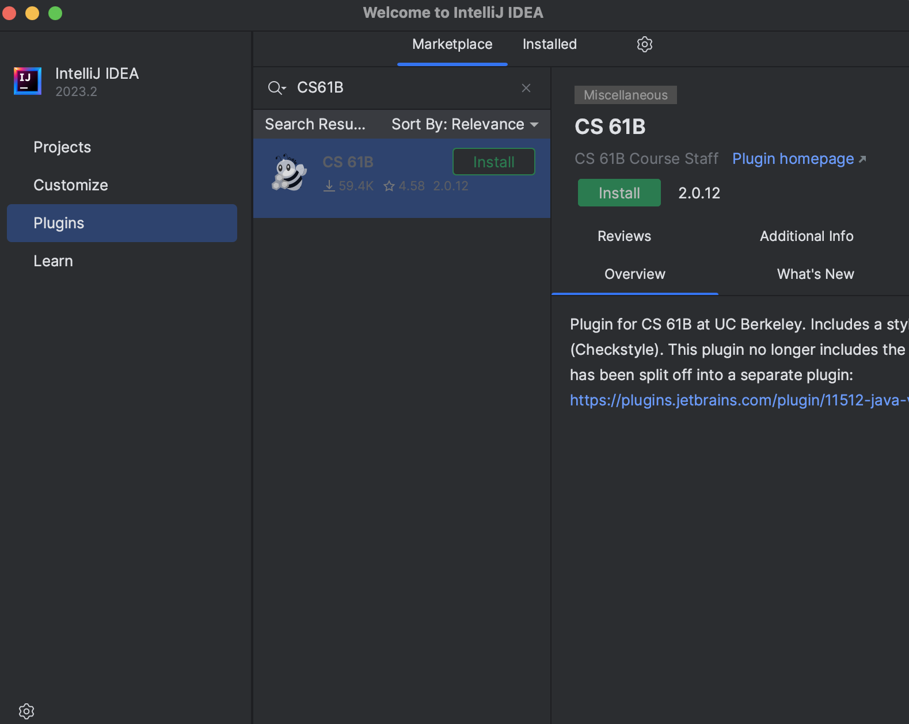
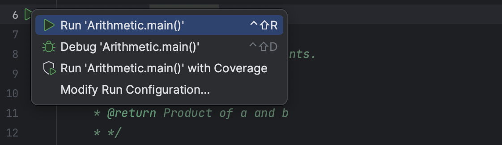
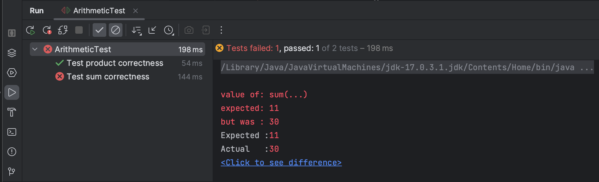

# Lab 01: Setup


## 常见问题

每次作业的顶部都会链接一个常见问题解答。实验 1 的常见问题解答位于[此处](https://sp25.datastructur.es/labs/lab01/faq/) 。 **常见问题解答是一份汇总了学生常遇到的问题和错误的列表，所以在向工作人员求助前，请先查阅此页面。**

## 欢迎来到 CS 61B!

我们非常期待本学期能与你一同学习！在开始之前，你需要有一台可以用来完成作业的电脑。在本课程中，你将使用实际应用中的工具，这意味着你可能会遇到实际应用中的问题。这些问题颇具难度，而软件工程师每天都会碰到！ **别灰心** ，遇到困难时一定要寻求帮助！

我们强烈建议你参加实验课，并在实验课期间寻求帮助。如果你在实验课之外的时间学习，可以在 Ed 平台提问或参加答疑时间。

!!! DANGER

    如果遇到问题， **请勿** 盲目尝试各种方法！请寻求帮助。你的实验助教（TA）会告知你如何排队。他们可能会选择使用白板排队系统或[在线答疑排队系统](https://oh.datastructur.es/)。

    一般来说，在等待时， **尽可能进行作业的下一步** 。

### 合作

CS 61B 课程的实验是 **单人** 进行的。这意味着你需要独立编写并提交自己的代码。特别是对于实验 1，你需要自行配置电脑。

不过，我们强烈鼓励你与其他同学合作！线下实验课是寻找合作小组的绝佳场合。

### 目标与工作流程

在本次实验中，我们将着手配置本课程会用到的软件。包括介绍终端、Git、Java 和 IntelliJ。我们还会完成一个小型 Java 程序，以便熟悉 Java 语言！

!!! INFO

    本实验会很长！ **请勿跳过任何步骤！**

## 个人计算机配置

### 任务：安装 Git

安装将有所不同，具体取决于您的操作系统。

- [Windows 说明](https://sp25.datastructur.es/labs/lab01/windows/)
- [macOS 说明](https://sp25.datastructur.es/labs/lab01/mac/)
- [Linux 说明](https://sp25.datastructur.es/labs/lab01/linux/)

!!! TASK

    按照您的操作系统的指南安装软件。

## 终端

### 终端指南

在 CS61B 课程中，我们会大量使用终端来操作 Git。终端还有一些其他命令，可用于操作文件夹或文件。我们在这份简要指南中对其进行了汇总，请务必阅读：[如何使用终端](https://sp25.datastructur.es/labs/lab01/terminal/) 。

在终端中，你可以使用指南中指定的命令在不同目录间切换、创建新文件、列出当前目录中的文件等。在本次实验中，以及在未来的作业中（尤其是作业提交时），你很可能会频繁使用终端。

!!! TASK

    请通读终端指南并熟悉所有命令！也欢迎收藏本页面以供日后参考。

## GitHub 和 Beacon 帐户

### 概述

CS 61B 课程不使用 bCourses，而是采用一个名为 Beacon 的内部系统来集中管理你的成绩和学生信息。

在这部分内容中，我们将为你设置 Beacon 账户，以及 CS 61B 课程的 GitHub 代码库（ “repo” ），你需要通过它提交所有编程作业。

### 任务：设置账户

1. 在[GitHub](https://github.com/)上创建一个账户。如果你已经有账户，则无需创建新账户。

2. 前往[Beacon](https://sp25.beacon.datastructur.es/)，并按照步骤完成你的 GitHub 代码库注册。你必须登录伯克利账户才能完成谷歌表单形式的课程大纲测验。
3. 完成所有步骤后，你应该会收到一封邀请你参与课程 GitHub 代码库协作的邮件。接受邮件邀请，以获取对课程代码库的访问权限。 **此邮件将发送到你用于创建 GitHub 账户的邮箱，不一定是你的伯克利邮箱。 **

!!! WARNING

    不要按照 GitHub 提供的说明操作。在本实验的后面部分，我们会提供自己的一套说明。

!!! TASK

    按照上述步骤创建您的 GitHub 和 Beacon 帐户，并连接它们。

### 你的仓库

你的代码仓库名称中会包含一个对你而言独一无二的数字。例如，如果你的代码库名为 `sp25-s1` ，登录 GitHub 后，你可以通过[https://github.com/Berkeley-CS61B-Student/sp25-s1](https://github.com/Berkeley-CS61B-Student/sp25-s1)访问你的私有代码库。 **如果你的学号不是 “1” ，这个链接对你不可用。请将 “1” 替换为你自己的数字，以便在 GitHub 上查看你的代码库。**

此外， **课程工作人员可以查看你的代码库。** 这意味着当你在 Ed 或 Gitbugs 上私下询问调试问题时，你可以（也应该！）附上代码链接。其他学生无法查看你的代码库。

!!! DANGER

    提醒一下，即使课程结束，你也不得公开本课程的代码。这样做违反我们的课程规定，你可能会受到纪律处分。

## Git

### Git 基础知识

在本课程中，你需要使用 Git 版本控制系统，这在实际应用中几乎无处不在。由于其背后的概念理解起来颇具难度，如果你在学习使用过程中遇到较大困难，也不必担心。

!!! TASK

    在继续学习之前， **请阅读[Git 使用指南](https://sp25.datastructur.es/resources/guides/git/)中 “远程仓库” 之前的内容** 。你无需阅读该部分之后的内容。这能帮助你对 Git 有个大致了解。

### 任务：配置 git

在使用 Git 之前，我们需要运行一些简短的命令来进行配置。

首先，打开你的终端。它看起来大概是这样：

然后，使用以下两个命令设置 Git 将使用的姓名和电子邮件：

```bash
git config --global user.name "<your name>"
git config --global user.email "<your email>"
```

设置 Git 的默认分支名称：

```bash
git config --global init.defaultBranch main
```

设置“合并策略”：

```bash
git config --global pull.rebase false
```

我们还将更改与 Git 关联的文本编辑器。有时，Git 在输入提交信息等内容时需要你的协助，因此会为你打开一个文本编辑器。默认编辑器是 `vim` ，它出了名地难用。在本课程中，我们推荐使用 `nano` ，但你也可以自由选择你喜欢的编辑器。

请按照[此处](https://git-scm.com/book/en/v2/Appendix-C%3A-Git-Commands-Setup-and-Config) 的说明配置 Git 的默认编辑器（确保操作系统和说明是一致的）。

### git 和远程仓库

首先，请阅读 **[Git 使用指南](https://sp25.datastructur.es/resources/guides/git/#d-remote-repositories)** 中的 `远程仓库` 部分。

在本课程中，你需要使用 Git 将代码提交到在[账户设置](https://sp25.datastructur.es/labs/lab01/#task-setting-up-accounts)中创建的课程 GitHub 代码库。这样要求有以下几个原因：

- 避免你因丢失文件而承受巨大痛苦。

- 提交作业以供评分，并从自动评分系统获取结果。

- 防止你因对文件进行未知更改而破坏所有内容，从而遭受巨大苦恼。

- 确保我们能轻松访问你的代码，以便在你遇到困难时提供帮助。

- 防止你在公共 GitHub 代码库中公开你的解决方案。这严重违反课程规定！

- 让你接触未来参与大型项目时常见的实际工作流程。

## 任务：git 仓库和 Java 库

### Java 库

与 Python 一样，我们有时也想使用他人编写的库。Java 的依赖管理有些混乱，因此我们提供了一个 Git 代码库，其中包含本课程将使用的所有依赖项。再次提醒，请确保你的终端已打开。

导航到你希望存储库的文件夹。对于本次实验，我们假设你将所有内容都放在名为 `cs61b` 的文件夹中。如果你愿意，也可以选择不同的名称。在导航到目标位置、创建 `cs61b` 目录并进入该目录（在本示例中使用 `cd cs61b` 命令）后，可能会是以下情况：


进入该文件夹后，运行：

```bash
git clone https://github.com/Berkeley-CS61B/library-sp25
```

以下是 `library-sp25` 的目录结构。使用 `ls library-sp25` 命令查看文件夹内容，确保你能看到下面列出的 `.jar` 文件。实际上文件远不止这些，我们仅列出前面几个。如果你使用操作系统自带的文件资源管理器，文件名中可能不会显示 `.jar` 后缀，这没关系。

```
library-sp25
├── algs4.jar
├── animated-gif-lib-1.4.jar
├── antlr4-runtime-4.11.1.jar
├── apiguardian-api-1.1.2.jar
└── ...
```

!!! TASK

    按照上述说明获取课程所需的库。

### 使用 Github 进行身份验证

首先，在终端中运行以下命令。它将打印出你已有的任何 SSH 密钥，如果没有则会生成一个新的：

```
curl -sS https://sp25.datastructur.es/labs/lab01/get-ssh-key.sh | bash
```

!!! INFO

    如果你收到诸如 `bash: line 1: syntax error near unexpected token 'newline'` 这样的错误信息，尝试刷新此页面并运行更新后的命令。

根据提供的位置，继续运行以下命令，确保将 `<path_to_ssh_key>` 替换为 SSH 密钥的实际位置， **并加上 `.pub` 后缀** 。

```bash
cat <path_to_ssh_key>.pub
```

运行上述命令的结果应类似于以下格式：

```
ssh-ed25519 AAAAC3NzaC1lZDI1N6jp9h3Bnbebi7Xz7wMr20LxZCki3u8UQTE5AAAAIBTc2Hw1b0i8T [so
me-comment-here]
```

然后，复制终端中的输出内容。 `[some-comment-here]` 部分会因系统而异，每个人可能有所不同。复制输出内容后，前往[GitHub，依次点击 “Settings” 、 “SSH, GPG Keys” 、 “New SSH Key”](https://github.com/settings/ssh/new)，将输出粘贴到 “Key（密钥）” 部分。 **为密钥命名，以便记住该密钥所在的设备或用途，选择密钥类型为 “Authentication Key”** 。然后将密钥添加到你的账户。

在终端中，运行以下命令以通过 SSH 连接到 GitHub：

```bash
ssh -T git@github.com
```

如果系统提示 “The key is not know by any other names. Are you sure you want to continue connecting (yes/no/[fingerprint])?” ，输入 “yes”。

如果一切顺利，你应该会看到类似以下内容：

```
Hi USERNAME! You've successfully authenticated, but GitHub does not provide shell access.
```

此时，你应该已成功通过 GitHub 身份验证，可以继续下一步了！

### 配置个人仓库

现在，是时候克隆你的个人代码库了。和获取库时一样，导航到你希望存放代码库的文件夹。我们建议使用存放 Java 库的同一文件夹（例如 `cs61b` ）。

!!! DANGER

    请勿将你的代码库放在 library-sp25 文件夹内。这会在日后带来麻烦。例如，它应位于 cs61b 文件夹内，但不在 library-sp25 文件夹中（可能与库文件夹处于同一层级 ）。

**确保将 `\***` 替换为你的课程代码库编号（你可以在 Beacon 上找到此代码库编号）。\*\* 然后运行以下命令：

```bash
git clone git@github.com:Berkeley-CS61B-Student/sp25-s***.git
```

!!! TIP
克隆完成后，你的终端会报告 `warning: You appear to have cloned an empty repository` 。这不是问题，只是 Git 在告知你代码库中没有文件。

进入新创建的代码库：

```bash
cd sp25-s***
```

确保我们使用的是预期的分支名 `main` ：

```bash
git branch -M main
```

**现在，我们将添加 `skeleton` 远程仓库。** 我们会将作业的起始代码添加到 `skeleton` 仓库，你将从中拉取代码（运行此命令前，请确保你在新创建的代码库中）。

```bash
git remote add skeleton https://github.com/Berkeley-CS61B/skeleton-sp25.git
```

列出远程仓库，此时应显示 `origin` 和 `skeleton` 两个远程仓库：

```bash
git remote -v
```

!!! TIP

    如果你看到类似 `fatal: not a git repository` 这样的错误，确保你已使用 `cd` 命令正确进入 `sp25-s***` 目录。

!!! TASK

    按照上述步骤克隆并配置你的代码库。

### 获取框架代码

“框架” 远程仓库包含所有作业的框架代码。每当发布新作业，或者我们需要更新作业时，你都需要从 “框架” 仓库拉取代码。首先，确保你处于 `sp25-s***` 代码库目录中。

接下来，运行以下命令获取实验 1 的框架代码：

```bash
git pull skeleton main
```

!!! WARNING

    此时，你应该有一个 `lab01` 文件夹，其中包含 `src/Arithmetic.java` 和 `tests/ArithmeticTests.java` 。如果你没有这些内容， **请勿手动创建** ！ 而是应该从 “框架” 仓库拉取代码，或者向工作人员求助。

## 任务：IntelliJ 设置

IntelliJ 是一款集成开发环境（IDE）。IDE 是一种综合性程序，通常集成了源代码编辑器、代码编译与运行工具以及调试器。像 IntelliJ 这样的一些 IDE 还具备更多功能，比如集成终端和用于 Git 命令的图形界面。此外，IDE 还拥有代码补全之类的工具，能帮助你更高效地编写 Java 代码。

我们 **强烈推荐** 使用 IntelliJ。我们编写的测试是在 IntelliJ 中运行的，在后续实验中我们还会使用其调试器。另外，IntelliJ 是行业标准工具，如果你今后再次使用 Java，肯定会用到它。

我们假定你使用 IntelliJ，并且不会为包括 VSCode 在内的其他编辑器提供支持。

!!! WARNING

    IntelliJ 是一款面向实际工业软件开发的应用程序。它有许多我们不会用到的功能，而且你有时会遇到难以理解的情况。如果你遇到困难或发现某些功能似乎无法正常工作， **请寻求帮助** ！在 IntelliJ 中要准确判断该怎么做可能非常困难。可查阅[IntelliJ 疑难解答指南](https://sp25.datastructur.es/resources/guides/intellij/wtfs/)，获取一些常见问题的解决方案。

**在继续之前，请确保你已完成除 Git 练习之外的上述所有任务：**

1. 你已在自己的计算机上成功创建本课程的本地代码仓库库，即之前的 `sp25-s***` 代码仓库库。

2. 你已从框架仓库拉取代码，并且有一个 `lab01` 目录。

### 安装 IntelliJ

1.  从[JetBrains](https://www.jetbrains.com/idea/download/)网站下载 IntelliJ 社区版。作为学生，你实际上可以获取旗舰版的学生许可证，但本课程不会用到旗舰版的额外功能。 **我们推荐并假定你使用社区版。**

    !!! DANGER

        **点击链接后，旗舰版会是你首先看到的版本，请务必向下滚动页面找到社区版。**

    !!! INFO

        如果你使用搭载 M 系列芯片（M1、M2 或 M3）的 Mac 电脑，请选择 “.dmg (Apple Silicon)” 版本。否则，请选择 “.dmg (Intel)” 版本。

2.  为你的操作系统选择合适的版本后，点击下载，等待几分钟直至文件下载完成。

3.  运行安装程序。如果你此前安装过旧版 IntelliJ，此时应先卸载旧版本，再安装这个新版本。

    !!! INFO

        在 IntelliJ 下载过程中，你可以阅读或浏览我们的[IntelliJ 使用指南](https://sp25.datastructur.es/resources/guides/intellij/)。完成本次实验你无需完全研读并记住其中内容。IntelliJ 功能复杂，但它的核心功能对你来说应该和以前用过的文本编辑器有些类似。

### 安装插件

打开 IntelliJ，然后按照以下步骤操作。

**在继续之前，请确保你运行的是 IntelliJ 2023.2 版本或更高版本。** 这是因为我们将使用 Java 17 或更高版本。我们使用的是 **IntelliJ 2023.2 版本** （文档中的配图基于此版本），它有更新后的用户界面。请注意，本次实验中可能会有旧版 IntelliJ 的截图，不过这没关系，因为总体布局仍然相对一致。

1. 在欢迎界面中，点击左侧菜单中的 **“Plugins（插件）”** 按钮。
   

2. 在出现的窗口中，点击 “Marketplace（市场）” ，并在顶部的搜索栏中输入 “CS 61B” 。CS 61B 插件条目应该会出现。如果你点击自动补全建议，可能会出现与下面展示的略有不同的窗口，这是正常的。

3. 点击绿色的 **Install** 按钮，等待插件下载并安装完成。
   

   如果你上一学期就安装了该插件，请务必进行更新。

4. 现在，搜索 “Java Visualizer” ，然后点击绿色的 **Install** 按钮来安装该插件。
   

5. 重启（关闭并重新打开）IntelliJ。

有关插件使用的更多信息，请阅读[插件指南](https://sp25.datastructur.es/resources/guides/intellij/plugins/) 。你现在不必马上阅读。

### 安装 Java

!!! WARNING

    这一步非常重要

安装好 IntelliJ 和插件后，我们就可以安装 JDK 了。请按以下步骤操作：

1. 启动 IntelliJ。如果没有打开任何项目，点击 “Open” 按钮。如果当前已打开一个项目，依次点击 “File -> Open” 。

2. 找到并选择当前作业所在的目录。例如，对于实验 1，你应选择 `sp25-s***` 中的 `lab01` 目录。

3. 进入 “File -> Project Structure” 菜单，确保你处于 “Project” 选项卡。然后，按照 “Set up the project JDK（设置项目 JDK）” 的说明下载 JDK 版本。 **选择 17 或更高版本** ！ 根据你选择的版本，确保它与语言级别兼容（例如，如果你选择了 SDK 18，将语言级别也选择为 18 ）。

### 作业设置

按照《作业工作流程指南》中 “在 IntelliJ 中打开” 部分的说明打开 `lab01` （如果你尚未退出上一部分内容，可以从步骤 3 开始 ）。

**每次打开作业时，你都需要确保已设置好项目结构，并添加了 `library-sp25` 包。**

### 创建项目

在打开并设置好 `lab01` 后，你应该会在左侧面板中看到以下文件：

- `src/Arithmetic` ，这是一个 Java 文件，包含你的第一个编程练习。

- `tests/ArithmeticTest` ，另一个 Java 文件，用于检查 `Arithmetic` 的实现是否正确。
  

### IntelliJ 测试

为测试一切是否正常运行，运行 `Arithmetic` 类，方法是打开该文件，点击 `public class Arithmetic` 旁边的绿色三角形，然后点击 “Run ‘Arithmetic.main()’” 。



??? 还有其他方式可以运行 `main`

    

    假设该文件有一个 `main` 方法，你可以在项目视图中右键单击该文件，然后选择 `[filename].main()` 。你也可以通过右上角的绿色箭头（红色框出部分）来运行它。

您应该会看到一个控制台弹出，提示你输入一个数字：


如果你按照提示操作，你（可能）会发现一些错误！ **先别急着修复** 。

### 测试你的代码

虽然我们可以反复运行 `Arithmetic` 文件来检查代码是否正确运行，但每次都要在程序中输入内容，还要手动检查输出是否正确，这会花费大量时间。因此，我们使用 **测试** 。

打开 `ArithmeticTest` ，点击 `public class ArithmeticTest` 旁边的绿色三角形。这将运行我们在本次作业中提供的测试。此时，你会看到以下内容：



绿色对勾（✅）表示你通过的测试，而黄色叉号（❌）表示你未通过的测试。不用担心输出内容重复，这是 IntelliJ 的一个小特性。

!!! TASK

    修复 `Arithmetic.java` 中的错误，使测试能够通过。

## 任务：使用 git 和 github 保存你的代码

在你对代码进行修改时，经常保存工作是个好习惯。我们之前简要讨论过相关命令，现在将说明在实际操作中应如何使用它们。如果你想回到代码的某个先前版本，有更多可回滚的选项会更好。接下来的说明将介绍如何通过 Git 的提交（即文件系统快照）来保存工作。

1. 在本地代码库中对代码进行一些修改后，Git 会检测到这些更改。要查看本地代码库的当前状态，使用 `git status` 命令。运行此命令并尝试理解结果。这些结果对你来说有意义吗，或者它们符合你的预期吗？在运行其他 Git 命令之前运行此命令来了解当前情况是个好习惯。

2. 要保存对某个文件所做的工作，我们首先要暂存该文件，然后再提交。我们使用 `git add` 命令暂存文件。这不会实际保存文件，而是标记该文件以便下次提交时保存。以下两个命令展示了在 Git 代码库中保存工作的过程。对于 `git add` 命令，根据你所在的目录不同，要添加的文件路径可能会有所不同（使用 `git status` 查看路径）。

`git commit` 命令中的 `-m "Completed Arithmetic.java"` 部分指定了要附加到这个快照的消息。每次提交都应该有一条提交消息，以明确标识此次提交中具体做了哪些更改。以下是一个示例工作流程：

```bash
git add lab01/src/Arithmetic.java
git commit -m "lab01: Completed Arithmetic.java"
```

如果你运行 `git status` ，你会看到 “你的分支领先于 ‘origin/main’” 。你还会看到已暂存的更改不再处于暂存状态，而是已被提交。如果你自暂存后就没有进行过编辑，那么应该没有未暂存的待提交更改。

3. 我们希望将这些更改推送到 GitHub 代码库，以便我们和 Gradescope 能看到你的更改。如果你的代码库在其他地方或其他计算机上进行了初始化，这些更改也可供拉取。

```bash
git push origin main
```

此时运行 `git status` 会显示 “你的分支与 ‘origin/main’ 保持一致” 。

!!! WARNING

    养成经常保存文件并执行 `git commit` 操作的习惯（比如每 15 分钟一次）。当你弄乱代码时，这会非常有帮助，因为它能让你撤销更改，并查看最近做了哪些修改。

基本上，当你在代码仓库中工作时，首先执行 `git pull` ，确保你使用的是最新代码。在工作过程中，频繁提交。完成工作后，执行 `git push origin main` ，这样你所有的更改都会上传，并且下次可以再次拉取。

## 提交到 Gradescope

虽然我们使用 GitHub 来存储编程作业，但实际评分是通过 Gradescope 进行的。最后一步是将作业提交到 Gradescope，我们用它来对编程作业进行自动评分。

!!! TIP

    在实验课的第一天，我们已将每个人在 CalCentral 上的邮箱添加到了 Gradescope。请务必使用 CalCentral 上列出的邮箱地址登录。
    如果你在 Gradescope 上访问课程时遇到问题，或者想用不同的邮箱地址登录，请咨询助教！

!!! TASK

    如果还没有完成，确保你已添加、提交并推送了更改。为方便起见，以下重复相关步骤：

1. 使用 `git add` 命令添加作业目录。例如，对于实验 1，在代码库根目录（ `sp25-s***` ）下，你可以使用 `git add lab01` 。

2. 使用 `git commit -m "<提交信息>"` 命令提交文件。提交信息是必填项。例如， `git commit -m "Finished Lab 1"` 。

3. 使用 `git push origin main` 命令将代码推送到远程代码库。你可以访问 GitHub 上的个人代码库，查看更改是否已反映出来，以此验证更改是否已推送。

4. 在 Gradescope 上打开作业。选择 GitHub，然后选择你的 `sp25-s***` 代码库和主分支，接着提交作业。你会收到一封确认邮件，自动评分系统将自动运行。Gradescope 会使用 GitHub 上你代码的最新版本。如果你认为评分的代码不对，请检查你是否已执行添加、提交和推送操作，可使用 `git status` 命令查看 。

## 交付内容

提醒一下，本次作业设有常见问题解答（FAQ）页面。只有一个必需文件，位于 `lab01` 目录中：
`Arithmetic.java`

你应修复其中的错误，使测试能够通过。我们会使用自动评分器检查此文件！对于本次实验，自动评分器的测试与你在自己计算机上运行的测试相同。

!!! TASK

    如果还没有完成，确保你已按照上述工作流程，将更改添加、提交并推送到 GitHub。如果你通过了 `ArithmeticTest.java` 中的所有测试，本次实验应能获得满分。

**恭喜你完成第一个 CS 61B 实验！**

如果你需要复习如何提交作业，可以参考[作业工作流程指南](https://sp25.datastructur.es/resources/guides/assignment-workflow/#opening-in-intellij)。

## 选做：乔希·胡格（Josh Hug）的配色方案

乔希·胡格表示：
我不太喜欢 IntelliJ 的默认配色。

**Mariana Pro** ：如果你想要乔希在直播授课中使用的配色方案，请安装 Mariana Pro 主题插件。要获取 Mariana Pro，前往你安装 CS 61B 插件时使用的插件商店，搜索 “Mariana Pro” 。该插件由蒂博·苏拉巴伊勒（Thibault Soulabaille）制作。请注意，我偏好纯黑色背景，而 Mariana Pro 是深灰色。你可以按照[这些说明](https://stackoverflow.com/questions/19411510/how-do-you-change-background-color-in-the-settings-of-jetbrains-ide) 更改背景颜色。

注意：如果你想恢复 IntelliJ 的默认配色，前往 “File（文件）→Manage IDE Settings（管理 IDE 设置）→Restore Default Settings（恢复默认设置）” 。
