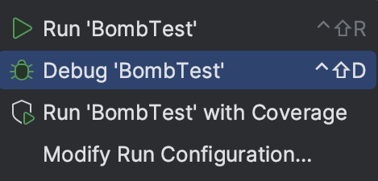
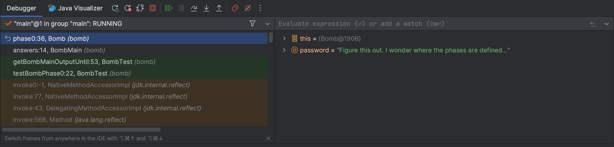

# Lab 02: Debugging (Part 1)

!!! info "MOLI：本次实验你将会学到什么"
    * Java 调试技术
    * 使用 IntelliJ 调试器


## 常见问题解答（FAQ）

每项作业顶部都会有一个常见问题解答的链接。你也可以在网址末尾添加 “/faq” 来访问。实验 2 的常见问题解答可在[此处](https://sp25.datastructur.es/labs/lab02/faq)找到。

## 简介

调试程序时，你首先得知道哪里出了问题。在本次实验中，你将通过使用调试器查看程序状态来积累一些经验。当遇到程序错误时，会伴随出现 “堆栈跟踪” ，它会详细列出最初导致错误的方法调用。在本次实验中我们不会讲解如何查看堆栈跟踪，不过在后续实验中会进一步讨论。

待办事项：添加展示大语言模型（LLM）失效模式（如确认偏差）的 LLM 练习。

### 准备工作

按照[作业工作流程](https://sp25.datastructur.es/resources/guides/assignment-workflow/#opening-in-intellij) 获取作业并在 IntelliJ 中打开。

### 目标与成果

在本次实验中，你将通过排除（程序中的） “定时炸弹” 来提升代码调试能力。我们会指导你完成这个过程，目的是让你获得真实的调试体验。

在本次实验结束时，你将能够：

- 使用调试器和可视化工具检查程序状态。

- 解读测试失败信息。

- 更好地掌握代码调试方法。

!!! TIP

    对于本次实验以及整门课程，我们强烈建议你先自行尝试，包括在不确定某些内容时进行查阅。在本次实验中，可能会遇到诸如某个错误的含义或抛出的异常等问题，去谷歌搜索一下！

## `Bomb`

`BombMain` 类会调用 `Bomb` 类的各个 `phase` 方法。在本次实验中，我们将通过 `BombTest.java` 中的测试来运行实验。如果你运行 `BombTest` （在测试文件夹中），你会注意到有一些错误，这是因为 `BombMain` 中 `phase` 方法当前的输入不是正确的密码！你的任务是使用 IntelliJ 调试器找出每个阶段的密码。

!!! DANGER

    警告：代码经过编写，你无法仅通过阅读来找到密码。在本次实验中，禁止你编辑 `Bomb` 和 `BombTest` 代码，无论是添加打印语句还是进行其他修改都不行。这个练习的目的是让你熟练使用对今后有很大帮助的工具。请认真对待！ **如果你修改这些文件，自动评分器的测试将无法通过！**

如前所述，你将从测试文件夹中的 `BombTest.java` 运行代码，并且可以利用这些测试来辅助调试。和其他作业一样，你最终会自己编写测试来帮助修复错误！你唯一需要修改的文件是 `BombMain.java` 。

**`BombTest.java` 是你运行程序的地方。 `Bomb.java` 和 `BombMain.java` 不会有绿色运行按钮，因为它们不包含 `static void main(String[] args)` ，所以请务必通过 `BombTest.java` 来运行程序！**

### 交互式调试

到目前为止，你可能已经通过使用打印语句来查看程序运行时某些变量的值，以此练习调试。如果将打印语句放在合适的位置，打印输出可能有助于让错误一目了然，或者缩小错误原因的范围。这种方法称为 **打印调试** 。虽然打印调试非常有用，但它也有一些缺点：

- 它要求你修改代码，之后还得清理。

- 决定并准确写出你想要打印的内容很繁琐。

- 打印输出的格式并不总是美观。

在本次实验中，我们将向你展示一种新技术—— **交互式调试** ，即使用交互式工具（也就是调试器）进行调试。我们将重点介绍 IntelliJ 的内置调试器。

### 调试器概述

#### 断点

在启动 IntelliJ 调试器之前，你应该设置几个 **断点** 。断点标记了代码中的位置，在调试时你可以在这些位置暂停程序并检查其状态。断点有以下优点：

- 无需修改代码，也无需在调试后清理代码，因为在正常执行时断点会被忽略。

- 无需编写打印语句就能查看所有变量。

- 能让 IntelliJ 以结构化的方式显示所有内容。

继续操作，打开 `Bomb.java` 并设置一个断点。要设置断点，点击行号右侧的区域。


点击的位置应该会出现一个红色圆圈或菱形标记。如果没有出现任何标记，请确保你点击的是有代码的行旁边。当调试器运行到程序中的这个点时，它会在执行该行代码或方法之前暂停。再次点击断点即可将其移除。

#### 运行调试器

现在，让我们设置几个断点——你可以在 `Bomb.java` 或 `BombMain.java` 中进行设置。设置好断点后，我们就可以开始调试会话了！点击你想要调试的类或测试旁边的绿色三角形（在测试文件中可能会有两个绿色三角形）。不要点击绿色三角形来运行程序，而是点击调试选项：




所选程序应该会一直运行，直到遇到第一个断点。调试器窗口也应该会出现在界面底部原本控制台所在的位置。



在（调试器窗口的）左侧，你将能够看到当前所有的方法调用；在右侧，你可以看到程序在这个时间点已实例化变量的值（这些值在编辑器中也会以灰色文本显示）。对于类的实例，你可以点击下拉箭头展开它们，查看其字段。

在调试器中，你有以下几个操作选项：

- 从显示的值中了解信息，找出问题所在并修复错误！点击 停止调试会话。

- 点击恢复程序运行（直到遇到下一个断点或程序终止）。

- 点击让程序单步执行一行代码。

- 点击执行类似操作，但它会进入当前行调用的任何方法内部，而会直接跳过该方法继续执行。

- 点击使程序继续运行，直到从当前方法返回。

- 如果你不小心单步执行过了头，想重新开始调试会话，点击（至少目前没有很好的直接回退方法）。

### Bomb 介绍(第 0 阶段)

!!! TIP

    在本次实验中，如果你想对正在调试的方法 / 阶段有个总体了解，我们会提供方法详解。

!!! TASK

    在 `phase0` 处设置一个断点，利用调试器找出 `phase0` 的密码，并在 `bomb/BombMain.java` 中相应地替换 `phase0` 的参数。你可以从 `tests/bomb/BombTest.java` 里的 `testBombPhase0` 启动程序。

一旦你找到了正确密码，运行代码（非调试模式）时应输出 `你使用密码‘<password>’通过了阶段0！` ，而不是 `阶段0爆炸了！`

??? phase0方法细分

    `phase0` 方法首先会生成一个秘密字符串 `correctPassword` （你无需了解 `shufflePassword` 的工作原理 ）。然后，将从 `BombMain` 传入的 `password` 与 `correctPassword` 进行比较。此阶段的目标是使用调试器找出 `correctPassword` 的值，并传入与之匹配的 `password` 。

### 可视化工具（第一阶段）

在本次实验的这个部分，我们将使用 `IntList` 。如果你需要快速复习，可以参考本周相关的课程幻灯片。

在我们对 `IntList` 的实现中，有两个可能未提及的方法： `print` 和 `of` 。 `of` 方法让创建 `IntList` 更加便捷。下面简要演示其工作原理。看这段代码：

```java
IntList lst = new IntList(1, new IntList(2, new IntList(3, null)));
```

仅仅为了创建一个包含 1、2、3 的列表，就要输入这么多内容（而且也很容易混淆）！ `IntList.of` 方法解决了这个问题。要创建一个包含 1、2、3 这些元素的 `IntList` ，你只需输入：

```java
IntList lst = IntList.of(1, 2, 3);
```

另一个方法 `print` 会返回 `IntList` 的字符串表示形式。

```java
IntList lst = IntList.of(1, 2, 3);
System.out.println(lst.print());
// 输出: 1 -> 2 -> 3
```

回到调试——虽然能够查看变量值很好，但有时我们的数据不太容易检查。例如，要查看长 `IntList` ，我们得点击很多下拉菜单。Java 可视化工具会显示程序中变量的盒图和指针图，这对 `IntList` 来说更适用。要使用可视化工具，运行调试器，直到在断点处停下，然后点击 “Java Visualizer” 标签页。下面用红色框出了该标签页。


阶段 1 的密码是一个 `IntList` ，而不是字符串 。你可能会发现 `IntList.of` 方法很有用。

!!! TASK

    在 `phase1` 处设置一个断点，使用 Java 可视化工具找出阶段 1 的密码，并在 `bomb/BombMain.java` 中相应地替换 `phase1` 的参数。你可以从 `tests/bomb/BombTest.java` 中的 `testBombPhase1` 启动程序。

??? phase1方法细分

    `phase1` 方法会生成一个名为 `correctIntListPassword` 的秘密 `IntList` （与上一阶段类似，你无需了解 `shufflePasswordIntList` 的工作原理 ）。然后，将从 `BombMain` 传入的 `password` （以 `IntList` 形式 ）与 `correctIntListPassword` 进行相等性比较。此阶段的目标是使用调试器的 Java 可视化工具找出 `correctIntListPassword` 这个 `IntList` 的结构和值，并传入与之匹配的 `password` 。

### 条件断点(第二阶段)

设想一个循环 5000 次的程序，要是每次都单步执行来查找错误，效率可不高。相反，你会希望程序在特定的迭代（比如最后一次）时暂停。换句话说，你希望程序在满足某些条件时暂停。要实现这一点，在感兴趣的代码行处设置一个断点，然后右键单击断点图标，打开 “编辑断点” 菜单。在那里，你可以输入一个布尔条件，这样只有当条件为真时，程序才会在这个断点处暂停。大概是像这样：


你还可以在 Java 中为异常设置断点。如果程序崩溃，调试器可以在抛出异常的位置暂停，并显示程序状态。要做到这一点，在调试器窗口中点击，然后按下加号图标来创建一个 “Java 异常断点” 。在弹出的窗口中，输入程序抛出的异常名称。

!!! TASK

    在 `phase2` 处设置一个断点，使用调试器找出 `phase2` 的密码，并在 `bomb/BombMain.java` 中相应地替换 `phase2` 的参数。记住，不要编辑 `Bomb.java` ！你可以从 `tests/bomb/BombTest.java` 中的 `testBombPhase2` 启动程序。

!!! TIP

    注意：此阶段的密码不像前几个阶段那样会明确给出。相反，你的任务是使用条件断点 “尝试找出” 密码。

??? phase2方法细分

    `phase2` 方法从 `BombMain` 接收 `password` 。

    该方法会向一个名为 `numbers` 的 `Set` 集合中添加 100,000 个随机整数。然后使用增强型 `for` 循环遍历这些整数，同时递增变量 `i` 。在第 1338 次迭代时（因为 Java 是从 0 开始计数，所以在第 1338 次迭代时 `i == 1337` ），会检查你的 `password` 是否与当前值相等。

此时，你应该能够运行 `tests/bomb/BombTest.java` 中的测试，并且所有测试都能通过，显示绿色对勾。

## 成功提交和评分

!!! WARNING

    确保你没有编辑 `Bomb.java` 或 `BombTest.java` 。自动评分器会进行测试，检查你是否编辑过这些文件，一旦文件有改动（包括添加注释 ），你将无法通过。本地测试会阻止你编辑 `Bomb.java` ，但不会阻止编辑 `BombTest.java` （这一点仅在自动评分器中检测 ），所以不要动这些文件！

本次实验满分为 5 分。

- 找出 `BombMain.java` 中所有阶段的密码。

## 致谢

本次作业改编自亚当·布兰克（Adam Blank） 。
