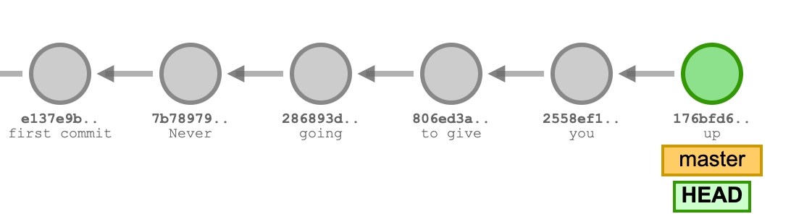
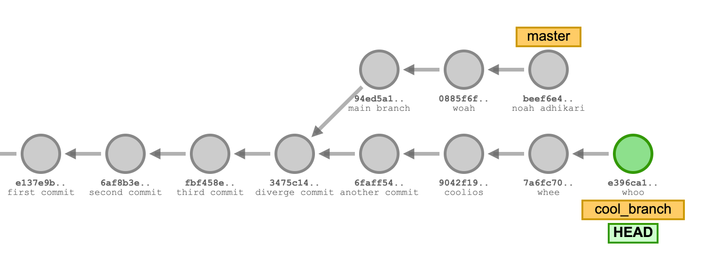

# 实验 04：Git

## FAQ

Lab 04的常见问题解答在[这里](https://sp25.datastructur.es/labs/lab04/faq/)。

## 简介

直到现在，我们一直在使用 Git 和 Github 提交作业，但我们并没有深入讨论这些工具的更多功能。在这个实验作业中，我们将回顾一些之前展示过的 Git 命令，并介绍一些新的命令，让你更加熟悉 Git（和Github）。在整个实验过程中，会有一些练习帮助你加深对 Git 的理解。

!!! WARNING

    请不要跳过实验中的任何部分，也不要在遇到问题时随意运行网上找到的命令（这可能会导致实验中的问题）。在进行这个实验时，仔细阅读命令和说明，确保自己理解每个步骤！

!!! TIP

    请确保从你的 `sp25-s***` 仓库中拉取骨架代码，以获取所需的文件。在这个实验中，我们只有一个文件：`magic_word.txt`。

## Git vs Github

在我们探讨 Git 命令之前，让我们先讨论一下 Git 和 Github 之间的区别。

### Git

Git 是一个版本控制系统，它是免费的开源软件（这意味着其源代码对用户和开发者开放）。作为一个版本控制系统，我们使用 Git 来帮助管理代码的不同版本，并跟踪源代码中所做的更改。如果有多个开发者在一个程序上工作， Git 就显得尤为重要。如果没有版本控制系统，开发者之间的沟通会变得困难，源代码的更改也无法为其他开发者所知。

 Git 的核心数据模型或表示方式主要基于链表结构。稍后我们会深入讨论这个话题，但每当我们想保存代码库的快照时，我们就会提交（就像我们到目前为止在提交作业时所做的那样）。这些提交在某种程度上是相互连接的。以下是这种结构的可视化示意图：



这些提交链表展示了您所做的更改历史。最最近的提交/快照是上方的绿色圆圈。

### Github

Github 是一个在线托管 Git 仓库的服务。Git 仓库是一个集中位置，用于跟踪和管理我们对文件和目录所做的任何更改（这就是您的 `sp25-s***` 仓库）。仓库可以在本地计算机上创建，也可以在 Github 上创建。

Github 使得与其他开发者的协作更加便捷，您可以更轻松地共享代码，并且可以将代码保存到远程服务器上。如果您本地有一些代码，您可以将它保存到 Github 上。这样，当本地的代码丢失时，您可以在 Github 上找到备份。这也是为什么我们建议经常提交（commit），以便保存您的工作进度和作业成果的原因！

## Git 命令

在本节中，我们将介绍一些常用的 Git 命令。请注意，这并不是所有 Git 命令的完整列表。让我们开始吧！

### `init`

您可以在想要将其变为 Git 仓库的目录中运行以下命令：

```bash
git init
```

这将在该目录中初始化一个 Git 仓库。

### `add`, `commit`

当我们想要保存对 Git 仓库所做的更改时，我们首先需要选择哪些更改应当保存：

```bash
git add some_file.txt
```

如果您想选择所有已更改的文件，可以运行以下快捷命令：

```bash
git add .
```

**选择了更改的文件后，这些更改并未被实际保存。** 将某些文件/更改 `add` 后，它们进入了一个暂存区，该区域存储了将包含在下次提交中的内容。要实际保存更改，或者说拍摄当前仓库的快照，我们需要运行 `git commit -m`，如下面所示：

```bash
git commit -m "We put a commit message here to describe what changes we made."
```

每次提交更改时，使用具有描述性的提交信息是个好习惯，这有助于跟踪随着时间推移所做的更改，并让其他开发人员更容易理解您所做的更改。

### `status`

如果您想查看所做的更改，可以在仓库中运行 `git status`。它可能与下面有所不同，但它将显示哪些文件已被修改。如果它们出现在 “Changes not staged for commit” 下，意味着它们还没有被添加到暂存区。添加之后，这些文件将显示在 “Changes to be committed” 下。

```bash
On branch main
Your branch is up to date with 'origin/main'.

Changes not staged for commit:
  (use "git add <file>..." to update what will be committed)
  (use "git restore <file>..." to discard changes in working directory)
	modified:   proj1a/src/LinkedListDeque61B.java
	modified:   proj1b/src/ArrayDeque61B.java
	modified:   proj1b/tests/ArrayDeque61BTest.java
```

在这个例子中，`git status` 显示了我们修改的三个文件还没有被暂存。添加它们后，`git status` 会变化为：

```bash
On branch main
Your branch is up to date with 'origin/main'.

Changes to be committed:
  (use "git restore --staged <file>..." to unstage)
	modified:   proj1a/src/LinkedListDeque61B.java
	modified:   proj1b/src/ArrayDeque61B.java
	modified:   proj1b/tests/ArrayDeque61BTest.java
```

在这两种情况下，“Changes not staged for commit” 和 “Changes to be committed” 都是指已经被 Git **跟踪** 过的文件，或者是之前已经在仓库中保存过的文件。Git 还会显示 **未跟踪** 的文件，它们是没有在之前的版本中保存过的文件。

### `log`

运行 `git log` 会显示我们提交历史的所有记录。例如，您会看到如下内容：

```bash
$ git log

commit 8g955d88159fc8e4504d7220e33fad34f8f2c6bd
Author: Diego Huezo <huezodiego@Huezos-MacBook-Pro.local>
Date:   Tue Feb 7 19:06:48 2016 -0800

    Added common Git problems to lab04.
```

这意味着您能够查看所有提交过的历史记录。记得在提交时添加的提交信息会显示在 `git log` 中。在此示例中，提交信息是“Added common Git problems to lab04”。也就是说，我们在提交时运行了 `git commit -m "Added common Git problems to lab04."`。

在 `git log` 中，您可以使用上箭头和下箭头键进行上下滚动。要退出 `git log`，按下键盘上的 `q`。

另一个 **重要** 的内容是 “commit” 标题旁边的部分。看起来像一长串随机的字符和数字，但它代表了提交的唯一标识符，也就是 **提交 ID**。提交 ID 是 Git 为标识特定提交所做的更改而分配的唯一标识符。**它在下一节中非常重要。**

### `restore`

如果我们想恢复到程序的某个历史版本，可以使用 `git restore`！有几种方法可以做到这一点。

如果我们想恢复文件到最近一次提交的版本，可以运行以下命令：

```bash
git restore [path_to_file]
```

如果我们想恢复到某个 **特定** 提交，可以指定该提交的 ID 并恢复文件：

```bash
git restore --source=[commitID] [path_to_file]
```

## Git 练习（第 1.1 部分）

现在你已经准备好开始使用 Git 了！接下来的任务是通过设置一个仓库并进行几次提交来完成一个小的 Git 工作流。最后，你需要填写 Beacon 上的表格来进行检查。

!!! DANGER
    这项任务是在你的本地计算机上完成的，但 **不在** 你的 `sp25-s***` 仓库中进行。确保你不要在 `sp25-s***` 仓库中初始化新的仓库！

!!! TIP

    如果你需要帮助来创建目录、创建文件、切换目录等，可以参考 [如何使用终端](https://sp25.datastructur.es/labs/lab04/terminal)。

1. 创建一个名为 `lab04-checkoff` 的目录。你可以把这个目录放在你电脑的任何地方（**但不能放在 `sp25-s***` 仓库中**）。
2. 进入 `lab04-checkoff` 目录，并初始化一个 Git 仓库。
3. 创建一个名为 `61b.txt` 的文件，内容为：“Created 61b.txt”。
4. 再创建一个名为 `61boba.txt` 的文件，内容为：“Created 61boba.txt”。
5. 开始 **仅** 跟踪 `61b.txt`，并进行一次提交，提交信息为：`Add 61b.txt`。
6. 修改 `61b.txt`，将文件中的内容改为：“61b.txt changed to version 2”。
7. 进行另一次提交，这次包含 `61b.txt` 和 `61boba.txt`，提交信息为：`Updated 61b.txt and added 61boba.txt`。
8. 再次修改 `61b.txt`，将文件内容改为：“61b.txt changed to final version”。**但不要进行提交。**

此时，如果你运行 `git status` 和 `git log`，你将看到类似以下内容：

9. **只使用 Git** 恢复 `61b.txt` 文件至最新提交的版本。
10. **只使用 Git** 恢复 `61b.txt` 文件至第一次提交的版本。


在完成上述操作后，确保保存该仓库和目录，直到你完成 [Beacon](https://sp25.beacon.datastructur.es/) 上的表格。

!!! TASK

    完成以上步骤，并填写第一个 Google 表格。填写完表格后，还有第二个 Google 表格需要填写，才能获得“魔法词”。

## Git 命令继续学习

让我们继续深入了解 Git 的一些概念，包括远程仓库和分支。

### `remote add`

有时候，我们希望能够从另一个仓库拉取更新，特别是从 Github 上托管的仓库。为此，我们可以将该仓库添加为一个“远程仓库”。例如，在 Lab01 中，我们使用以下命令将骨架仓库添加到个人仓库：

```bash
git remote add skeleton https://github.com/Berkeley-CS61B/skeleton-sp25.git
```

让我们来解析这个命令。当我们想要添加远程仓库时，我们需要指定远程仓库的名称和 URL。在这个例子中，远程仓库的名字是 `skeleton`，而 URL 是 `https://github.com/Berkeley-CS61B/skeleton-sp25.git`。之后，我们可以通过该远程仓库的名称来引用它，从而进行 [pull](https://sp25.datastructur.es/labs/lab04/#pull) 或 [push](https://sp25.datastructur.es/labs/lab04/#push) 操作。

为了添加远程仓库，可以使用以下命令：

```bash
git remote add [remtoe-name] [remote-url]
```

!!! TIP

    你可以运行 `git remote -v` 来查看当前仓库中已添加的远程仓库。

### `switch`

我们还没有详细讨论 Git 的另一个功能——分支（branch）！虽然在这门课程中你不会频繁使用分支（除了这次实验），但它是一个很有用的概念。

大多数版本控制系统都有某种类型的分支系统。当我们提到分支时，意思是我们“偏离”了“主分支”。分支允许我们同时跟踪多个版本的工作（可以把它看作是一个平行空间）。创建分支的一个常见原因是，当我们想开发程序的某个新特性时，但又希望保持当前版本不变。

让我们考虑一个可视化的解释。



在上面的图像中，有两个分支，`master` 和 `cool_branch`。注意，我们已经进行了多个提交。在某个时刻，我们从 `master` 分支上“分叉”出来（在提交信息为“diverge commit”的地方），并从该特定分支上开始了分叉。如果我们想停止当前分支（`cool_branch`）的工作，可以切换回 `master` 分支。我们可以通过运行以下命令来完成这个操作：

```bash
git switch [branch-name]
```


在这个例子中，我们将运行 `git switch master`。注意，HEAD 标签现在指向回 `master` 上的最新提交。

!!! TIP

    我们在这里不会详细讲解如何创建分支，但你可以随时查找如何创建分支的信息。

如果你在尝试切换分支时收到 `.idea` 文件夹未被跟踪的错误，你可以使用 `git add` 和 `git commit` 命令将 `.idea` 文件夹包括在内并创建一个新的提交。你不需要推送这些更改。

### `resore` **命令再访**

现在我们对远程和分支有了基本了解，让我们再次回顾 `restore` 命令。在之前的部分，我们讲过如何使用 `restore` 根据最新提交或提交 ID 来恢复到以前的提交，但我们也可以使用此命令根据远程仓库和指定分支的内容来恢复更改。它的使用方式如下：

```bash
git restore --source=[remote-name]/[branch-name] [file_name]
```

它将根据远程仓库分支的最新提交内容恢复文件。

### `push`

如果我们想要将本地计算机上所做的提交推送到远程仓库，可以使用 `git push`：

```bash
git push [remote-name] [branch]
```

在这门课中，我们使用 `git push origin main` 将我们在本地仓库所做的更改推送到远程仓库。`origin` 是代表我们托管在 Github 上的个人仓库的远程仓库，`main` 是我们工作的分支。

下面是一个可视化的示例，展示了我们尚未推送的几个本地提交。左边是本地仓库，右边是远程仓库。


在推送之后，我们的提交将保存在我们的远程仓库中：


### `pull`

相反，如果我们想要将远程仓库中的更改拉取到本地仓库，可以运行 `git pull`：

```bash
git pull [remote-name] [branch]
```

我们之前在从骨架仓库拉取时已经做过类似的操作：`git pull skeleton main`。下面是一个可视化示例，展示了我们尚未从远程仓库拉取的几个提交：


在拉取之后，我们远程提交现在已经在我们的本地仓库了：


## 常见的 Git 问题

在本节中，我们将介绍一些你可能遇到的常见 Git 问题。这并不是所有可能遇到的问题的全面列表。你可以在我们的[使用 Git 指南](https://sp25.datastructur.es/resources/guides/git/) 以及 [Git WTFs](https://sp25.datastructur.es/troubleshooting/git-wtfs/) 里阅读更多关于 Git 问题的内容。

!!! DANGER

    虽然这篇文章旨在帮助你诊断 Git 问题并介绍一些常见的解决方法，但如果你不确定，记得寻求帮助！

### 致命错误: 拒绝合并无关的历史

当你的本地仓库和远程仓库的历史记录不相关时，会出现这个问题。通常这种情况发生在某人修改了基础代码，在你拉取之后出现冲突。为了解决这个问题，可以运行以下`git pull <remote-repo> main --allow-unrelated-histories --no-rebase`。 这可能会强制出现合并冲突（有关更多信息，请参见下面的“合并冲突”部分）。

### 合并冲突

合并冲突可能会像下面这样显示：

```bash
$ git pull origin main
From github.com:Berkeley-CS61B/course-materials-sp16
 * branch            main     -> FETCH_HEAD
Auto-merging proj/proj0/solution/canonical/Planet.java
CONFLICT (content): Merge conflict in proj/proj0/solution/canonical/Planet.java
Automatic merge failed; fix conflicts and then commit the result.
```

当对同一文件的同一部分代码进行了不同的修改时，就会发生合并冲突，Git 无法将这些修改合并到一起。Git 会标出冲突的文件；**要解决冲突，请打开 IntelliJ 并手动处理。** 冲突在文件中的显示方式如下：

```java
public Planet(Planet p) {
    this.xxPos = p.xxPos;
    this.yyPos = p.yyPos;
```

`<<<<<<< HEAD` 和 `=======` 之间的是你本地版本的内容，`=======` 和 `27ddd0c71515e5cfc7f58a43bcf0e2144c127aed` 之间的是远程仓库的内容。在这两者之间，选择你想要保留的修改。一旦解决了所有冲突，使用 `git add` 和 `git commit` 提交更改。使用 `git status` 查看仓库状态。

更多关于合并冲突的内容可以参考 [这里](https://sp25.datastructur.es/resources/guides/git/#merging) 和 [这里](https://sp25.datastructur.es/troubleshooting/git-wtfs/#error-you-have-not-concluded-your-merge-merge_head-exists)。

### 你的分支领先于 ‘origin/main’ X 次提交。

当本地仓库和远程仓库不同步时，会出现这个问题。如果你想保留本地文件的版本，可以使用 `git push`。如果你想使用远程仓库的版本覆盖本地修改，可以使用 `git reset --hard origin/main`。

## Git 练习 (第 1.2 部分)

像第一部分 1.1 一样，访问 [Beacon](https://sp25.beacon.datastructur.es/) 并完成第二个表单。

完成第 1.1 和 1.2 部分的表单并获得满分后，你将能够获得一个 **魔法词**。将这个魔法词放在 `magic_word.txt` 的 **第一行**。

## Git 练习 (第 2 部分)

在这个练习中，我们将让你克隆一个 Git 仓库，并使用你学到的一些命令来找出隐藏在仓库中的密码。复制并粘贴以下命令以克隆你的仓库，**确保它位于你在 1.1 部分创建的 `sp25-s***` 仓库和 `lab04-checkoff` 仓库之外**。仓库的具体位置无关紧要，只要不在另一个仓库内或者之前提到的仓库中即可。

!!! DANGER

    在运行命令之前，**再次确保你不在个人仓库或 `lab04-checkoff` 仓库内。** 如果你在这些仓库中，系统会阻止你将仓库克隆到 `sp25-s***` 和 `lab04-checkoff` 仓库内。

```bash
curl -sS https://sp25.datastructur.es/labs/lab04/lab04.sh | bash
```

检查是否出现名为 `git-exercise-sp25` 的仓库。如果出现了，使用 `cd` 进入该目录，使用 IntelliJ 打开 `git-exercise-sp25`，然后继续进行练习。

### 第 2.1 部分

当你打开仓库时，你会看到一个 `password.txt` 文件。这个文件里似乎没有密码，但它可能在之前的某个提交中。试着找到该提交，并使用我们学过的命令回到那个提交（你可能需要使用箭头键滚动！）。

!!! TASK

    找到第 1 任务的密码后，将其存储在 `lab04` 目录下的 `magic_word.txt` 文件的 **第二行中**。**你需要将文件恢复到最新的提交再继续**。

### 第 2.2 部分

完成任务 1 后，让我们尝试找出第二个密码。你克隆的仓库有多个分支，但 `erik` 分支可能包含我们想要的内容。试着切换到该分支，看看密码是否在其中。

!!! TASK

    找到任务 2 的密码后，你可以通过检查当前提交的提交消息来验证密码。当你找到密码后，将其存储在 `magic_word.txt` 文件的第三行。找到密码后，切换回 `main` 分支。

### 第 2.3 部分

第三个密码似乎不在这个仓库中，而是在另一个仓库里！密码就在这个仓库中（请注意，这不是命令，而是 SSH URL）：

```bash
git@github.com:Berkeley-CS61B/git-exercise-remote.git
```

我们要尝试从这个仓库中拉取，首先 **将该仓库作为远程仓库添加到 `git-exercise-sp25` 仓库中**。你可以给远程仓库起一个你喜欢的名字。一旦添加了远程仓库，运行以下命令（不要加上方括号）：

```bash
git pull [remote-name] main --allow-unrelated-histories --no-rebase
```

我们添加 `--allow-unrelated-histories` 和 `--no-rebase` 标志是因为我们的两个仓库没有相关历史记录，因此我们将尝试合并这两个分支（本地分支和远程分支）。

!!! DANGER

    如果不确定是否需要添加这些标志，请不要使用它。如果错误地使用了这些标志，可能会让你进入交互式重置并丢失一些工作。在大多数情况下，从个人仓库拉取时，不应该添加这些标志，直接运行 `git pull skeleton main` 就可以了。

!!! TASK

    一旦拉取成功，你将看到 Git 尝试合并分支。去合并它，最后的密码应该会出现在 IntelliJ 中。你可以将密码存储在 `magic_word.txt` 文件的 **第四行**。

## 提交

此时，你应该在 **每一行中拥有四个密码，按照前面练习中指定的顺序排列。** 确保它们按照特定顺序并且没有多余的空格。你的魔法词文本文件应该类似于下面的样子：

```
git_exercise_1_password
git_exercise_2.1_password
git_exercise_2.2_password
git_exercise_2.3_password
```

当你准备好后，请 **仅** 提交 `magic_word.txt` 到 Gradescope。你不需要提交 `lab04-checkoff` 或 `git-exercise-sp25` 仓库。

如果你想尝试我们用来制作本实验中某些图像的可视化工具，你可以在[这里](https://git-school.github.io/visualizing-git/#free-remote)找到它。
