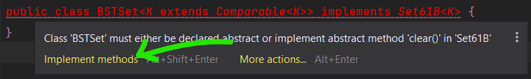

# 实验 06：BSTMap

## FAQ

Lab 06的常见问题解答在[这里](https://sp25.datastructur.es/labs/lab06/faq/)。

## 介绍

在本实验中，您将基于二叉搜索树(BST)实现`Map61B`接口的`BSTMap`类，构建一个基础的树形映射结构。您需要**从零开始**完成这个实现，并以提供的接口规范作为开发指南。

完成实施后，您将比较您的实现转换为基于列表的实现以及内置 Java 类（使用称为红黑树的 BST 变体）从骨架代码库拉取

要获取本次作业，请从您的个人代码仓库中拉取`skeleton`分支：

```
git pull skeleton main
```

此作业是 。`lab06`

## `BSTMap`

在本次实验（及后续实验）中，我们可能不会像以往那样提供完整的框架代码。如果您在开始实现时遇到困难，请参加实验辅导或查阅相关参考资料！

您需要创建一个使用  二叉搜索树（Binary Search Tree, BST） 作为核心数据结构的类，以实现`Map61B`接口。在完成类的定义并实现`BSTMap`中的所有方法前，代码将无法通过编译。您可以采用渐进式实现策略：先定义所有必需方法的签名，对于暂未实现的方法，可暂时抛出`UnsupportedOperationException`异常占位。具体异常抛出方式请参考相关[文档](https://sp25.datastructur.es/labs/lab06/#exercise-bstmap)。

在您的实现中，需要确保泛型键类型 `K` 实现了 `Comparable` 接口。 这称为[有界类型参数](https://docs.oracle.com/javase/tutorial/java/generics/bounded.html)。

这个[语法](https://docs.oracle.com/javase/tutorial/java/generics/bounded.html)有点复杂，但我们已在下方提供了示例。这里我们创建了一个针对可比较对象的BSTSet。出于教学目的，我们特意加入了`compareRoots`和`compareTo`等概念用于教学目的（如需复习，请参阅此[文档](https://docs.oracle.com/en/java/javase/11/docs/api/java.base/java/lang/Comparable.html#compareTo(T))）

```java
public class BSTSet<K extends Comparable<K>> implements Set61B<K> {
    private class BSTNode {
        K item;
        // ...
    }
    private BSTNode root;
  /* 
 * 比较当前 BSTSet 的根节点与另一个 BSTSet 的根节点的大小关系，
 * 返回值遵循 `compareTo` 方法的标准约定：
 * - 负数：当前 BSTSet 的根节点小于另一个 BSTSet 的根节点
 * - 零：两个 BSTSet 的根节点相等
 * - 正数：当前 BSTSet 的根节点大于另一个 BSTSet 的根节点
 */
    public int compareRoots(BSTSet other) {
    /* 
     * 我们可以安全地对 `n1.item` 调用 `compareTo` 方法，
     * 因为泛型类型 `K` 被声明为 `extends Comparable<K>`，
     * 这意味着 `K` 必须实现 `Comparable` 接口，
     * 而所有实现 `Comparable` 的类都必须定义 `compareTo` 方法。
     */
        return this.root.item.compareTo(other.root.item);
    }
    // ...
}
```
!!! INFO
    您可能已经注意到，有界类型参数的语法使用了 `extends` 关键字，尽管 `Comparable` 是一个 接口。在有界类型参数的上下文中，`extends` 可以表示 继承自类 或 实现接口（[官方文档](https://docs.oracle.com/javase/tutorial/java/generics/bounded.html)）。不要问我们为什么 ——Java 设计者也没解释过。

    （这种语法还暗示您可以 “扩展” 像 `Integer` 这样的 `final` 类，但这显然是不可能的。欢迎来到神奇的 Java 世界！）

!!! WARNING
    请记住，上面的代码片段模拟的是一个 集合（Set），而你需要实现的是一个 映射（Map）。我们建议你在实现 `BSTMap` 时采用类似的逻辑，但需要创建一个嵌套的节点类来存储键值对。
    你的 `BSTMap` 应该包含两个泛型参数 `K` 和 `V`，分别代表映射中键和值的类型：

IntelliJ 有一个很好的功能，可以为你生成方法签名。如果你正在实现一个接口，但尚未实现所有方法，IntelliJ 会将类签名标为红色。如果你将鼠标悬停在上面，应该可以选择 “`Implement methods`”（实现方法）。在弹出的窗口中，确保你选中了 “Copy JavaDoc”（复制 Java 文档）和 “Insert @Override”（插入 @Override 注解）选项。点击 “OK”，IntelliJ 就会在类中填充所需的方法签名（不过这些方法还无法正常工作！），并复制相关注释。

生成后的代码大概会是这个样子（**你没有 Set61B，这只是一个示例！**）：



### 练习：实现 BSTMap

如前所述，你需要创建一个名为`BSTMap `的类来实现` Map61B` 接口。请确保将实现代码写在 `BSTMap.java` 文件中，否则自动评分系统可能无法运行你的代码！需要实现的方法包括：

- ​**`void put(K key, V value)`**​:  将指定的键与值关联。若键已存在，更新其对应的值。

- ​**`V get(K key)`**​ : 返回指定键所映射的值；若键不存在，返回 `null`。

- ​**`boolean containsKey(K key)`**​ : 判断此映射是否包含指定键的映射关系。

- ​**`int size()`**​ : 返回此映射中的键值对数量。

- ​**`void clear()`**​: 移除映射中的所有键值对。


请务必阅读` Map61B `接口中每个方法的注释，以充分理解具体实现要求。上述描述未必涵盖所有细节。

为了便于调试，你的` BSTMap `还应包含一个额外的方法` printInOrder()`（该方法无需在` Map61B `接口中声明），该方法按键的升序打印` BSTMap` 中的所有键值对。我们不会测试此方法的输出结果，但它会帮助你验证自己的实现！

!!!TASK
    请实现`BSTMap`类，该类需实现`Map61B`接口及其所有必需方法。通过使用有界类型参数，确保`BSTMap`中的键是可比较的。

    我们强烈建议你创建辅助方法来简化实现（特别是递归辅助方法）。

!!!INFO
    很遗憾，你需要实现的大多数方法在测试时都依赖于其他方法（例如`get`方法依赖于`put`方法）。这意味着在实现`put`方法之前，很难对其他方法进行有效测试。我们建议你按照 Map61B 接口中指定的顺序实现这些方法。

    你可以使用`TestBSTMap.java`来测试你的实现。
### 参考资源

以下资源可能会有所帮助：

-  2024 年秋季学期，第 16 讲 [幻灯片](https://docs.google.com/presentation/d/1e-KW3PROYhxJB-0wk3w3LkXz48I13OYtudsGXsBokpM/edit?usp=sharing).。
- `ULLMap.java`（位于` src` / 目录下），一个基于无序链表的` Map61B `实现。
- 为了帮助你入门， [这里](https://www.youtube.com/watch?v=P3_Luw2M8X4)有一份关于`put` 和` get` 方法的算法指南。

## 那么…… 它的速度有多快呢？
在 `InsertRandomSpeedTest.java `中提供了一个交互式速度测试。在完成 `BSTMap `的实现之前，不要尝试运行这个测试。准备就绪后，你可以在 IntelliJ 中运行这些测试。

`InsertRandomSpeedTest` 类会测试你的 `BSTMap`、`ULLMap`（已提供）、Java 内置的 `TreeMap` 以及 Java 内置的 `HashMap`（你将在后续实验中深入了解）的元素插入速度。测试流程是：询问用户要插入的每个字符串的长度，以及输入规模（要执行的插入操作次数）。然后生成指定数量、指定长度的字符串，并将它们作为 `<String, Integer>` 键值对插入到各个映射中。

试试看，对比你的数据结构与朴素实现、工业级实现，看看随着插入次数的增加，性能表现如何变化。记住，在小样本上，渐进复杂度并不能体现出来，所以如果得到的趋势令人困惑，要确保输入足够大（但要注意，这里有个限制 —— 如果输入的值太大，程序可能会溢出，所以可以尝试用足够大但合适的值进行测试）。将你的测试结果记录在名为 `speedTestResults.txt` 的文件中。

!!!TASK
    运行速度测试并将结果记录在 `speedTestResults.txt`中。结果格式不做强制要求，但至少应包含你执行的操作和观察到的现象。

### 评分标准

本实验满分为 5 分。Gradescope 上没有隐藏测试，即你在 Gradescope 上获得的分数就是最终分数。不过，有一项测试不会在本地提供，该测试会检查你的`speedTestResults.txt`文件。通过本地测试`TestBSTMap.java`意味着你的`BSTMap.java`能获得满分，但这并不保证你在 Gradescope 上的`speedTestResults.txt`也能得分。**因此，对于本次实验，只要你通过了相关的本地测试（`TestBSTMap.java`）并充分填写了`speedTestResults.txt`文件，就能在 Gradescope 上获得满分。**

### `BSTMap` 的更多（不计分）练习

这些练习不会被评分，但你仍可通过本地测试（特别是`TestBSTMapExtra.java`）和自动评分器获得反馈。

在你的`BSTMap`类中实现以下方法：`iterator()`：返回一个按升序遍历键的迭代器。`keySet()`：返回所有键的集合。`remove(K key)`：删除指定键对应的键值对。

实现`remove()`方法颇具挑战性，你需要实现 Hibbard 删除算法。如果指定的键不存在于`BSTMap`中，`remove()`方法应返回`null`；否则，删除该键值对并返回被删除的值。

### 提交说明

与之前的作业一样，将你的 Lab 06 代码添加到 Git 仓库，提交并推送到 GitHub。然后，提交到 Gradescope 进行代码测试。

### 可选：渐进复杂度问题

这部分内容同样为可选内容，我们纳入它是为了让你针对渐进复杂度进行更多练习。可对照 [答案](https://sp25.datastructur.es/labs/lab06/asymptotics-soln/)来检查你的解答！

已知有一个名为 `B` 的 `BSTMap`（二叉搜索树映射），其中包含 `N` 个键值对，还有一个随机的键值对 `(K, V)`，请回答以下问题。

除非另有说明，“big-Oh”（如 `O(N)`）和 “big-Theta”（如 `Θ(N)`）均针对给定方法调用过程中比较操作的次数而言。

对于问题 1-7，判断陈述为 “正确” 还是 “错误”。对于问题 8，给出运行时复杂度界。

1. `B.put(K, V) ∈ O(log N)`
2. `B.put(K, V) ∈ Θ(log N)`
3. `B.put(K, V) ∈ Θ(N)`
4. `B.put(K, V) ∈ O(N)`
5. `B.put(K, V) ∈ O(N²)`
6. 对于一个与 `K` 不相等的固定键 `C`，`B.containsKey(C)` 和 `B.containsKey(K)` 的运行时复杂度均满足 `Ω(log N)`。
7. （本题难度较高）设 `b` 是 `BSTMap` 的一个 `Node`（节点），以 `root` 为根的两棵子树分别记为 `left`（左子树）和 `right`（右子树）。进一步假设，方法 `numberOfNodes(Node p)` 会返回以 `p` 为根的子树的节点数量（记为 `M`），且其运行时复杂度为 `Θ(M)`。若 `1 <= z < numberOfNodes(b.root)`，那么 `mystery(b.root, z)` 在最坏情况和最佳情况下的运行时复杂度分别是多少？

提示：先试着弄清楚 `mystery` 方法的功能，再分析它是如何实现该功能的。

```java
public Key mystery(Node b, int z) {
    int numLeft = numberOfNodes(b.left);
    if (numLeft == z - 1) {
        return b.key;
    } else if (numLeft > z) {
        return mystery(b.left, z);
    } else {
        return mystery(b.right, z - numLeft - 1);
    }
}
```