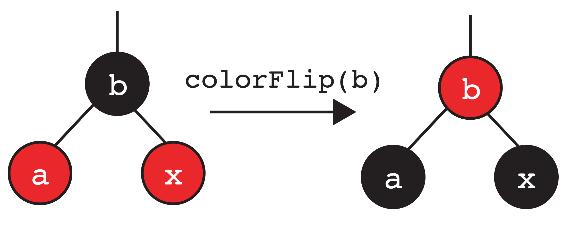
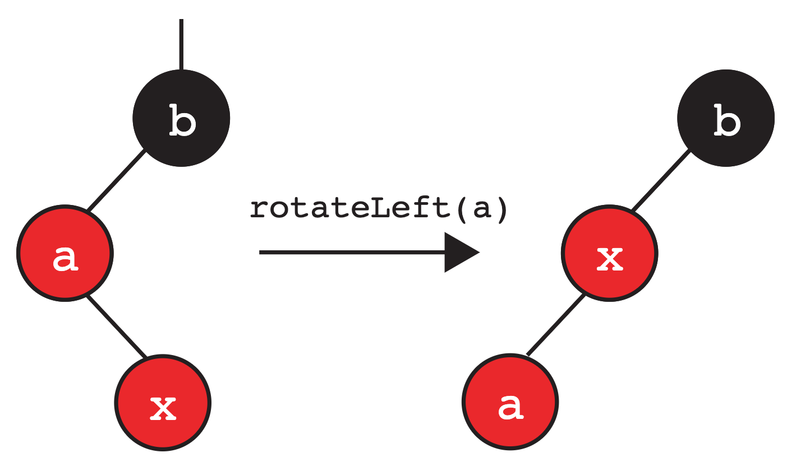

# Lab 08 左倾红黑树

## 常见问题

本实验的FAQ详见[此处](https://sp25.datastructur.es/labs/lab08/faq/)。

## 开始之前

像往常一样，从 `skeleton` 拉取 `Lab 07` 的文件，然后在 `IntelliJ` 中打开。

## 学习目标

在本实验中，我们将实现左倾红黑树。

## 简介

在前面的实验中，我们分析了二叉搜索树中访问和插入操作的算法性能。然而，在某些情况下，我们总是假设树是平衡的——正如我们所看到的，有可能会产生一种“退化树”（spindly tree），这会影响到我们数据结构的性能。

非正式地讲，一棵树是“平衡的”意味着从根节点到每个叶节点的路径长度大致相同。任何在树的每一层只需要访问一次节点（例如在二叉搜索树中搜索一个值）的算法，其性能只取决于树的层数。对于二叉搜索树而言，能够达到的最小层数与节点数量成对数关系（即 logN）。

为了维护这种“平衡”特性，我们希望避免出现导致更差性能表现的最坏情况——即得到一棵“退化树”。这就是平衡搜索树/B树的作用所在——它们本质上能够自我平衡并维持我们所需的“平衡”特性。

然而，在本实验中，我们不会专注于实现平衡搜索树——为什么？虽然它们确实能保证从根节点到任何叶节点的路径复杂度是 O(logN)，但编写它们的代码也臭名昭著地困难和繁琐，在常见操作中存在无数需要处理的边界情况。虽然它们仍被广泛使用并带来诸多好处，但也有其缺点。**请注意，在本实验中我们仍将提及平衡搜索树（从现在起任何提及的“平衡搜索树”都是指 2-3 树）。**

然后，我们将注意力转向一个相关的数据结构：**左倾红黑树（Left-Leaning Red-Black Trees）。** 我们建议你在开始本实验之前复习一下相关课程的幻灯片。

### 链接 vs 节点 

!!! DANGER 

    **请不要跳过此节。在你继续完成本实验的其余部分之前，阅读本节内容非常重要**。如果跳过此节，你会感觉更难入手。

在课程中，我们介绍了使用 **链接** 来表示 LLRB 的概念。然而，在本实验中，我们将不会使用链接来表示我们的 LLRB 。相反，我们将使用 **节点** 。 主要原因在于使用链接的实现方式比使用节点要 **难得多** 。为了阐明这一点，请看下面的图示示例，它展示了我们在讲座中是如何对该概念进行可视化的。

对于本实验，由于我们将处理着色节点——红色链接与其连接节点之间的关系可以像下面这样定义：

最初，`A` 通过红色链接连接到 `B`。但如果我们在表示中使用节点着色代替链接，那么`A` 本身会被着色为红色。上面的可视化是为了展示红链接如何映射到颜色节点，因此在后续实验中请务必牢记这一点！

!!! WARNING

	理解红链接和相应着色节点之间的关系，因为在后续实验中，我们将使用着色节点的示例和描述，以便简化实验的实现。

## 左倾红黑树

本质上，LLRB 就是一种二叉搜索树，但还有几个额外约束，即给每个节点“着色”为红色和黑色。这种“着色”在 2-3 树和 LLRB 之间创建了一一对应的映射关系！**具体来说，每棵 2-3 树都恰好对应一棵 LLRB，反之亦然。**

这个结果相当惊人：通过额外的调整操作，LLRB 保持了 2-3 树的平衡性，同时继承了所有常规二叉搜索树的操作。

### LLRB 树的特性

我们现在详细说明 LLRB 树的一些特性。特别是，我们利用有效 LLRB 树和 2-3 树之间的一一对应关系来推导出其中一些特性。

**使用彩色节点作为我们的表示法时，根节点必须着色为黑色。**  
&emsp;我们将红色节点解释为与其父节点属于同一个 2-3 节点。根节点没有父节点，因此它不能是红色。

**如果一个节点有一个红色的子节点，那么这个子节点必须在左侧。**  
&emsp;这使得树是“左倾”的。

**任何节点都不能有两个红色的子节点。**  
&emsp;如果一个节点有两个红色的子节点，那么这两个子节点都与其父节点属于同一个 2-3 节点。这意味着对应的 2-3 节点包含了 3 个键，这是不允许的。

**红色节点不能有红色父节点（所有红色节点的父节点是黑色的）。**  
&emsp;如果一个红色节点有一个红色父节点，那么该红色节点及其红色父节点都与红色父节点的父节点属于同一个 2-3 节点。这意味着对应的 2-3 节点包含了 3 个键，这是不允许的。

**在一棵平衡的 LLRB 树中，到达每个空引用的路径都经过相同数量的黑色节点。**  
&emsp;在一棵平衡的 2-3 树中，每个空节点到根的距离相同。我们还知道，在等价的 2-3 树中，LLRB 树中的每个黑色节点都恰好对应一个节点。因此，在 LLRB 树中，每个空节点到根节点的路径上经过的黑色节点数量是相同的。

## 插入 LLRB 树

**向 LLRB 树插入节点与常规的二叉搜索树插入算法相同**，即通过搜索以找到合适的叶子位置。

!!! INFO

    **每当我们将一个节点插入到 LLRB 中时，我们都将其作为红色节点插入。**

然而，一旦放置了该节点，就可能破坏 LLRB 那些不能改变的特性，因此我们需要额外的操作来“恢复” LLRB 的这些不变式。我们知道有效 LLRB 与 2-3  树之间存在一一对应的关系。让我们利用这种对应关系来尝试推导出这些修复操作。

我们将介绍在哪些情况下会打破这些特性时，以及修复这些情况的相应操作。

### 不变式：如果一个节点有一个红色子节点，它必须在左侧
如前所述，我们插入的节点总是红色的。假设我们将节点插入到我们的 LLRB 中，并且该节点最终成为节点 `a` 的 **右子节点** （这意味着新节点的值大于 `a` ）。**假设节点 `a` 的左子节点是黑色的或不存在，** 这会破坏“如果一个节点有一个红色子节点，它必须在左侧”的不变式。既然我们不能有任何向右倾斜的红色节点，我们就会想在父节点上执行 **左旋操作** 。示例如下：

### 不变式：任何节点都不能有两个红色的子节点
让我们考虑另一种情况。与上面类似，我们将节点作为红色节点插入 LLRB，并且它最终成为（本示例中）节点 `b` 的 **右子节点** 。当节点 `b` 的左子节点也是红色节点时会发生什么？这破坏了“任何节点都不能有两个红色的子节点”的不变式。因此我们在父节点上执行“颜色翻转”操作。这里，我们对 `b` 进行颜色翻转操作，将其颜色与其子节点的颜色交换。

我们稍后会回到这个配置。

### 不变式：红色节点不能有红色父节点（红色节点的父节点是黑色）
这种情况可以分解为以下两个子情况：

两个连续的左倾红色节点  
如果我们插入的节点成为某个红色节点的左子节点会发生什么？在这种情况下，我们就需要调整我们的操作，执行“右旋”**（换句话说，不可能有两个连续的左倾红节点）。**

右旋是左旋的逆操作！如果右旋应用于新的根，它会使我们恢复原子树。

在这个情况中，我们对 `b` 执行右旋操作：

我们注意到此时它与之前的情况相同，因此我们再对 `a` 用颜色翻转。

有右倾红色子节点的红色节点  
在另一种情况下，我们插入的节点可能会成为某个已经是红色的节点的右子节点。在这种情况下，我们就用左旋操作。

如下图所示，我们在这个例子中对 `a` 执行左旋操作，然后得到：

**请注意，这又与上面提到的情况相关联了**——不能存在右倾的红色节点。此时又遇到了之前的情况，因此我们知道可以对 `b` 做右旋，然后再对根节点 `x` 用颜色翻转。

向上传播  
请注意——我们刚刚讨论的一些案例最终导致了颜色翻转。如果我们修改的子树是一个右子树，而树的其余部分看起来像这样怎么办：

就像在 2-3 树中向上推入一个键可能导致父节点溢出一样，**执行这些转换也可能违反 LLRB 的不变式**，从而导致我们再次遇到上述三种情况之一。我们会持续解决这些情况，直到：

* 不再破坏任何的不变式
* 翻转根节点的颜色

!!! INFO

    这意味着执行这些操作（颜色翻转、右旋或左旋）后可能最终会破坏另一个不变式，从而导致需要执行更多的操作。当我们尝试解决这些情况时，这些转换实际上是沿着 LLRB 树向上传播，直到所有条件都满足为止。

    某些情况下，我们必须记得将根节点的颜色翻转回黑色。

### LLRB 插入操作总结

!!! INFO

    这部分将对实验是最有帮助的，因为你可以参考下面的图来了解如何执行这三种操作。 请思考如何将旋转和颜色翻转操作转化为节点和指针重新赋值的问题。

我们讨论了三种可以在插入节点后“修复” LLRB 不变式的操作。由于存在上述提到的向上传播的可能性，让我们尝试更直观地概括我们的操作（特别是旋转）。

我们有两种旋转操作，可用于将一个右子节点或左子节点上移到其父节点的位置：

以下简要描述执行 rotateRight(b)时发生了什么：

* 子树的根从 `b` 变成了 `a`。
* `a` 和 `b` 向“右”移动（注：指新子树的结构位置相对于原结构改变了）。
* 交换两个节点的颜色，使得新根变为旧根的颜色，旧根变为新根的颜色。
* 重组后的子树仍然满足二叉搜索树的性质。

以下简要描述执行 rotateLeft(a)时发生了什么：

* 子树的根从 `a` 变成了 `b`。
* `a` 和 `b` 向“左”移动。
* 交换两个节点的颜色，使得新根变为旧根的颜色，旧根变为新根的颜色。
* 重组后的子树仍然满足二叉搜索树性质。

我们还有颜色翻转操作：

## LLRB 的实现

您读过[这部分](#section1)了吗？如果还没有，请在开始做本实验前阅读。

在开始之前，请确保完整看一遍 `RedBlackTree.java` 类，特别是提供的嵌套节点类（nested node class）。同时也要阅读每个方法的注释！

### 练习：颜色翻转

我们首先考虑对 LLRB 树实现至关重要的颜色翻转操作。给定一个节点，该操作只需将其颜色与其子节点的颜色交换。

!!! TASK

    在 `RedBlackTree.java` 中实现 `flipColors` 方法。

### 练习：旋转

我们已经看到可以旋转树来平衡它，同时不违反二叉搜索树约束。现在，我们自己来实现它！

!!! INFO

    在实现时，请务必将旧根和新根的颜色互换! 
    
    提示：这两个操作是对称的。代码是否应该有显著差异？如果你卡住了，看看上面展示的例子！

!!! TASK

    在 `RedBlackTree.java` 中，实现 `rotateRight` 和 `rotateLeft`。

### 练习：insert

我们现在将在 `RedBlackTree.java`中实现 `insert`。我们已经为你提供了一些带有注释的逻辑结构。`insert` 方法的第一部分应该实现常规的二叉搜索树插入。然后你需要处理导致执行三种操作之一（`rotateLeft`, `rotateRight`, `colorFlip`）的不同情况。**请务必仔细地遵循每种情况下的步骤！**

确保使用你已经实现的方法（rotateRight, rotateLeft, flipColors） 来简化代码编写。

!!! INFO

    **框架代码中已经提供了辅助方法 `isRed` 来检查节点的颜色，请确保使用它！**

!!! TASK

    在 `RedBlackTree.java` 中实现 `insert` 方法。

