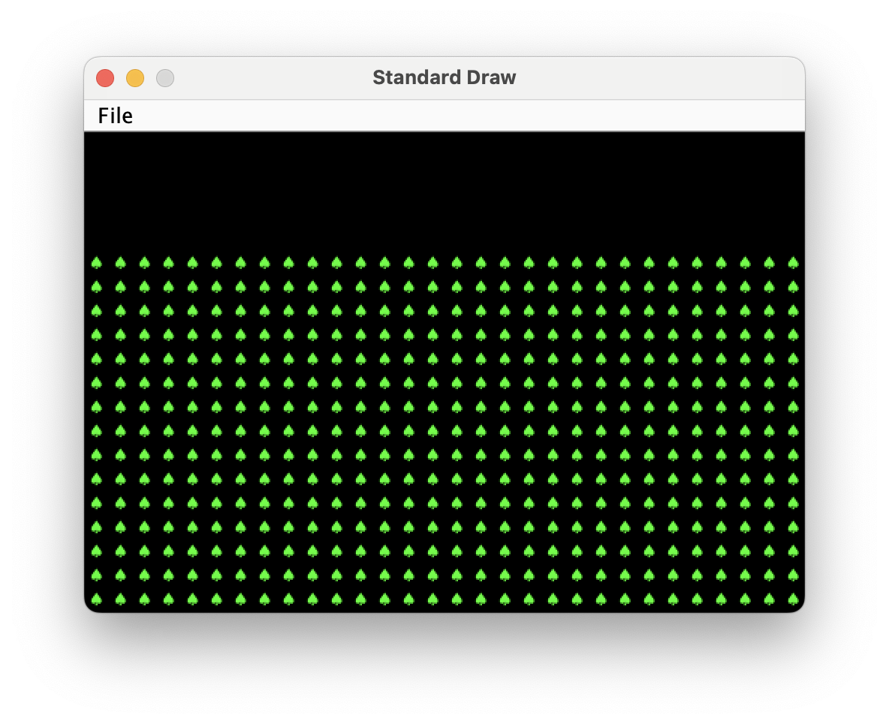

# 实验 9：项目 3 入门（可选）

## 简介

本实验将为你完成项目 3“创建自己的世界（BYOW）” 提供帮助。在本实验中，你将学习如何使用图形用户界面库来渲染世界并收集用户输入。

在实验的第一部分，你将学习如何使用 “瓦片（tiles）” 在屏幕上生成图形。这将适用于在项目 3 中构建房间、走廊和世界的其他元素。在第二部分，你将添加交互功能，通过按键来绘制方块。

## 可选说明

请注意，本实验是可选的，**但强烈建议你完成以帮助你更好地完成项目**！

请注意，以下部分标记为 “可选”，这些是额外的实现内容，你可以尝试以进一步检验自己的理解。

## 实验前准备

开始本实验前，请完成以下步骤：

-  和往常一样，运行`git pull skeleton main`拉取代码框架
-  要明白项目 3 是一场 “马拉松” 而非 “短跑”，不要等到最后一刻才开始。你和你的搭档现在就应该开始思考设计方案。
-  可选：观看上一学期项目 3 的[入门视频](https://youtu.be/zgdNWICEb_M)。视频中的名称和 API 可能略有变化，但整体思路仍然适用。
-  可选：阅读 [项目 3 ](https://sp25.datastructur.es/projects/proj3/) 的第一阶段内容 / 略读项目说明，理解主要思路。开始本实验时，项目说明可能尚未发布。

本实验将让你有机会学习和练习项目 3 中的许多细节和难点，但会以一个更简单的问题为背景。

## 第一部分：认识瓦片渲染引擎

### Boring World

打开代码框架，查看`demo`文件夹中的`BoringWorldDemo`文件。尝试运行它，你应该会看到一个窗口弹出，如下所示：


这个世界由空白区域构成，仅在底部中间位置有一个矩形块。生成这个世界的代码包含三个主要部分：

- 初始化瓦片渲染引擎。
- 生成一个二维的 `TETile[][]` 数组。
- 使用瓦片渲染引擎显示 `TETile[][]` 数组。

通读代码，了解瓦片渲染 API 的使用示例。创建 `TERenderer` 对象后，你需要调用 `initialize` 方法，指定你所构建世界的宽度和高度，这里的宽度和高度以瓦片数量为单位。每个瓦片是 16 像素 ×16 像素，因此，举例来说，如果我们调用 `ter.initialize(10, 20)`，最终得到的世界会是 10 个瓦片宽、20 个瓦片高，换算成像素就是 160 像素宽、320 像素高。

这段代码还演示了如何操作 `TETile` 对象。你既可以使用 `TETile` 构造函数从头创建它们（参见 `TETile.java`），也可以从 `Tileset.java` 文件中预定义好的瓦片集合里进行选择。比如，`BoringWorldDemo.java` 中的如下代码会生成一个瓦片二维数组，并使用 `Tileset.NOTHING` 所代表的预定义瓦片填充该数组。

```java
TETile[][] world = new TETile[WIDTH][HEIGHT];
for (int x = 0; x < WIDTH; x++) {
    for (int y = 0; y < HEIGHT; y++) {
        world[x][y] = Tileset.NOTHING;
    }
}
```

当然，我们可以覆盖已有的瓦片。例如，下面这段来自 `BoringWorld.java` 的代码会创建一个 15×5 瓦片大小的区域，该区域由预定义的 `Tileset.WALL` 瓦片组成，并将其覆盖在上面刚用循环代码创建的部分瓦片上。

```java
for (int x = 20; x < 35; x++) {
    for (int y = 5; y < 10; y++) {
        world[x][y] = Tileset.WALL;
    }
}
```

!!!INFO
    （0, 0）是世界的左下角（而非你可能习惯的左上角）。例如，对于位置（5, 4），我们会向右移动 5 个单位，然后向上移动 4 个单位。本实验中我们将采用这种坐标方向。

渲染的最后一步是调用 `ter.renderFrame(world)`，其中 `ter `是一个 `TERenderer `对象。只有调用 `renderFrame `方法后，对瓦片数组所做的修改才会显示在屏幕上。

试着在 `Tileset` 类中把指定的瓦片改成除 `WALL `之外的其他瓦片（比如 `Tileset.GRASS `或 `Tileset.WATER`），看看会发生什么。另外，也可以尝试修改循环中的常量，观察世界会发生怎样的变化。

!!!WARNING
    瓦片本身是不可变的！你不能执行类似` world[x][y].character = 'X'` 这样的操作。**查看 TETile 类以帮助理解这一点**！

!!!INFO
    我们为什么要将世界初始化为 `Tileset.NOTHING`，而不是直接保持未初始化状态呢？原因是 `renderFrame` 方法无法处理任何值为 `null `的瓦片。如果不将世界初始化为`Tileset.NOTHING`，调用 `renderFrame `时会抛出 `NullPointerException`。

**任务 1：Tree World**

打开 `Lab9` 文件夹中的 `Task1.java`。完成以下操作：

- 填充 `fillWithTrees(TETile[][] world)` 函数，该函数应使用树木瓦片填充整个二维瓦片数组。
- 完善`main `方法，使其实现：
  - 创建并初始化一个宽 30、高 20 的 `TERenderer` 对象。
  - 创建一个宽 30、高 15 的二维 `TETile` 数组，即 `TETile[][] world = new TETile[30][15]`。
  - 调用 `fillWithTrees` 方法。
  - 调用 `ter.renderFrame(world);`。

运行程序，验证是否得到如下所示的图像。注意，由于 `TETile[][]` 数组的高度为 15，而世界的高度为 20，因此会留下 5 行空白区域。我们将在任务 3 中使用这部分空白区域。


请注意，最佳实践是使用常量，而不是在声明中硬编码数字，例如：

```java
private static final int WORLD_HEIGHT = 15;
new TETile[WORLD_WIDTH][WORLD_HEIGHT];
```

这是因为你可能希望在其他地方使用这些常量，而且你不会希望在一个地方意外修改了它，却在另一个地方没修改。因此，如果你之后提交的项目 3 代码中出现类似`TETile[][] world = new TETile[30][15]`这样的写法，风格检查器会提示错误。本次实验无需提交内容，所以如果你不想这么做，也不必担心。

### Random World

现在打开`RandomWorldDemo.java`。尝试运行它，你应该会看到类似下面这样的画面：


这个世界一片混乱 —— 到处都是墙壁和花朵！如果你查看 `RandomWorldDemo.java` 文件，会发现我们做了一些新的尝试：

- 我们创建并使用了一个 `Random` 类型的对象，它是一个 “[伪随机数生成器](https://docs.oracle.com/javase/8/docs/api/java/util/Random.html)”。
- 我们使用了一种新的条件语句，称为 `switch` [语句](https://docs.oracle.com/javase/tutorial/java/nutsandbolts/switch.html).。
- 我们将工作委托给函数，而不是在 `main` 方法中完成所有操作。

随机数生成器正如其名，它会生成看似随机排列的无限数字流。在 Java 中，`Random` 类为我们提供了生成伪随机数的功能。例如，以下代码生成并打印 3 个随机整数：

```java
Random r = new Random(1000);
System.out.println(r.nextInt());
System.out.println(r.nextInt());
System.out.println(r.nextInt());
```

我们称之为伪随机数生成器，因为它并非真正随机。其内部通过精妙的数学运算，根据上一个生成的数字计算出下一个数字。我们不会深入探讨其中的数学细节，不过如果你好奇，可以查阅 [维基百科](https://en.wikipedia.org/wiki/Pseudorandom_number_generator)。**更重要的是，生成的序列是确定性的，而我们获得不同序列的方式是选择所谓的 “种子”。这种伪随机性将是项目 3 的核心部分。**

在上面的代码片段中，种子是传递给 `Random` 构造函数的输入，在这个例子中种子是 1000。控制种子非常有用，因为它能让我们间接控制随机数生成器的输出。**如果我们向构造函数提供相同的种子，会得到相同的序列值**。例如，下面的代码先打印 4 个随机数，**然后再次打印相同的4 个随机数**。由于该种子与上一个代码片段中的不同，这 4 个数字很可能与上面打印的 3 个数字不同。这在项目 3 中会非常有帮助，因为它能为我们提供确定性的随机性：你的世界看起来完全随机，但你可以一致地重现它们，以便调试（和评分）。

```java
Random r = new Random(82731);
System.out.println(r.nextInt());
System.out.println(r.nextInt());
System.out.println(r.nextInt());
System.out.println(r.nextInt());
r = new Random(82731);
System.out.println(r.nextInt());
System.out.println(r.nextInt());
System.out.println(r.nextInt());
System.out.println(r.nextInt());
```

如果用户 / 程序员没有提供种子（即 `Random r = new Random()`），随机数生成器会使用一些频繁变化且能产生大量唯一值的信息作为种子，例如当前的时间和日期。种子还可以通过各种其他更奇特的方式生成，比如[使用一墙的熔岩灯](https://www.popularmechanics.com/technology/security/news/a28921/lava-lamp-security-cloudflare/)。

目前，`RandomWorldDemo` 使用了一个硬编码的种子（即 2873123），因此它总会生成完全相同的随机世界。你可以更改种子以查看其他随机世界，不过鉴于这个世界的混乱程度，可能不会很有趣。

最后也是最重要的一点是，**我们的代码没有在 `main` 方法中完成所有操作**，而是将工作委托给具有明确定义行为的函数。这对你的项目 3 体验至关重要！你需要不断找出可以用明确定义的方法解决的小任务。此外，你的方法应该形成一个抽象层次结构！

!!!DANGER
    此时，请确保你已通读并理解 `BoringWorldDemo` 和 `RandomWorldDemo`（这很重要！），并且大致了解如何使用 `TERenderer`、`TETile` 和 `Tileset`。接下来的部分会默认你对前两个演示类的工作原理以及瓦片渲染类的使用方法有大致了解。

### 任务 2A：A square of flowers.

复制 `Task1.java` 来创建 `Task2.java`。完成以下操作：

- 编写一个函数 `private static void drawSquare(TETile[][] world, int startX, int startY, int size, TETile tile)`。该函数应绘制一个由指定瓦片组成的正方形，正方形的边长为给定的长度，左上角位于坐标 `(startX, startY)`。如果正方形超出边界，跳过所有超出边界的瓦片，即你的函数不应因越界错误而崩溃。
- 修改 `main` 方法，使其在调用 `fillWithTrees` 之后调用 `drawSquare(world, 10, 7, 5, Tileset.FLOWER);`。注意，你可能需要根据自己选择的变量名修改 `world`。

运行程序，你应该会看到如下画面。


### 任务 2B：随机位置的正方形

在 `Task2.java` 中完成以下操作：

1. 编写函数 `private static void addRandomSquare(TETile[][] world, Random rand)`：该函数应使用 `drawSquare` 方法，在随机的 X 和 Y 坐标处绘制一个边长为 3-7 的随机大小的花朵正方形。若正方形不完全在边界内也没关系，但左上角必须在边界内。
2. 修改 `main` 函数：调用 `addRandomSquare` 替代之前的硬编码 `drawSquare`。使用硬编码的随机种子。

提示：若需要 3-7 之间的随机数，可使用 `RandomUtils.uniform(rand, 3, 8)`。该函数返回范围 `[3, 8)` 内的随机整数（即不包含 8）。

尝试使用不同的随机种子运行程序，你会看到不同的正方形；若使用相同的种子，则会生成相同的结果。

### 任务 2C：随机类型的正方形

修改 `Task2.java` 的代码，使绘制的正方形有均等概率为 `FLOWER`（花朵）、`WALL`（墙壁）或 `WATER`（水）。参考示例代码中的 `switch` 语句实现。

### 任务 2D：5 个随机正方形

修改 `Task2.java` 的代码，**使其绘制5个随机正方形**。示例输出如下：
（注：由于随机种子和实现方式不同，你的结果可能与图示不完全一致。）


### 交互性

在项目的后半部分，你需要让程序具备交互功能。接下来我们将学习如何根据按键操作修改世界。

打开并运行 `GameLoopDemo`。注意，当你按下 1、2、3、4 或 5 键时，屏幕上的部分瓦片会发生变化。这是通过 `StdDraw.hasNextKeyTyped` 和 `StdDraw.nextKeyTyped` 方法实现的。

### StdDraw

如前所述，我们将使用 `StdDraw` 库。`StdDraw` 是一个提供基础绘图和用户输入捕获功能的库。开始前请查看其 API 文档 —— 其中的一些方法不仅对本实验有用，对项目 3 也至关重要。

### 任务 3A

复制 `Task2.java` 创建 `Task3.java`。修改代码使其实现：

- 初始状态只有一片树林（即删除之前调用的 5 次 `addRandomSquare`）。
- 当用户按下 `n` 键时，调用 `addRandomSquare` 生成一个新的随机正方形。
- 当用户按下 `q` 键时，程序结束。

你需要仔细参考 `GameLoopDemo`。关键是：代码应处于一个无限循环中，每次循环都检查是否有按键输入。

### 任务 3B

修改代码，在窗口顶部的空白区域显示当前已绘制的正方形数量。

- 可以使用 `StdDraw.textLeft(x, y, text)` 方法，该方法会在指定的 `(x, y)` 位置绘制文本。例如，若选择 `x = 1`、`y = 17`，文本会显示在窗口左上角。

示例如下（按下 `n` 键 5 次后的效果）：（注：由于随机种子和实现方式不同，你的结果可能与图示不完全一致。）

如果文本出现闪烁，是因为每秒重绘次数过多。你可以在每次循环结束时添加 `StdDraw.pause(2)`，让程序在绘制完所有内容后暂停 2 毫秒。

### 任务 4（可选，但推荐）

在项目 3 中，你还需要实现保存和加载功能。作为后续可参考的示例，我们将为本次实验添加保存和加载功能。

复制 `Task3.java` 到 `Task4.java`。

修改程序，使：当用户按下 `s` 键时，保存当前世界状态。当用户按下 `l` 键时，加载已保存的世界状态。这一功能的实现有两个难点：

1. 保存的状态需持久化，即使用户完全退出程序、关闭电脑等，状态也不会丢失。
2. 世界状态不仅包括可见的世界，还包括随机数生成器的状态。

**示例 1**：启动程序后，按 5 次 `n` 键，再按 `s` 键，然后按 `q` 键退出程序。重新打开程序并按 `l` 键，应回到退出前的状态。

**示例 2**：启动程序后，按 4 次 `n` 键，按 `s` 键，再按 1 次 `n` 键，然后按 `l` 键，应回到只有 4 个矩形的状态。重要的是，此时再按 `n` 键，应得到与之前相同的第 5 个伪随机矩形。因此，若交替按 `n` 和 `l` 键（如 `nlnlnlnlnlnlnl`），会反复看到同一个矩形出现和消失。随机数状态会随每次 `l` 键的按下而被追踪和恢复。

保存状态时，建议写入一个文件，记录 `n` 键被按下的次数。关于文件读写的示例，可参考 `ExampleSaveLoad.java`。

加载状态时，应创建一个新的随机数生成器（使用相同的初始种子），完全清空世界，然后调用 `addRandomSquare` 函数 `n` 次。实际上，这是从初始状态重新执行一遍所有按键操作。

还有其他实现方式，例如将随机数生成器对象保存到文件再重新加载，但 “从头模拟” 的方式实现起来更不易出错，尤其是在规模大得多的项目 3 中。

### 任务 5（可选，极具挑战性，与项目类似）

作为更贴近项目的额外挑战，添加使用 `d` 键删除最近放置的正方形的功能。

**注意**：若要让保存功能正常工作，需修改保存 / 加载逻辑 —— 仅记录已创建的正方形数量已不够。例如，保存文件中记录数字 5 时，无法区分这是用户按了 5 次 `n` 键（`nnnnn`），还是按了 `nnnddnnnndn` 等组合。一种解决方法是将按键序列保存到文件中。
