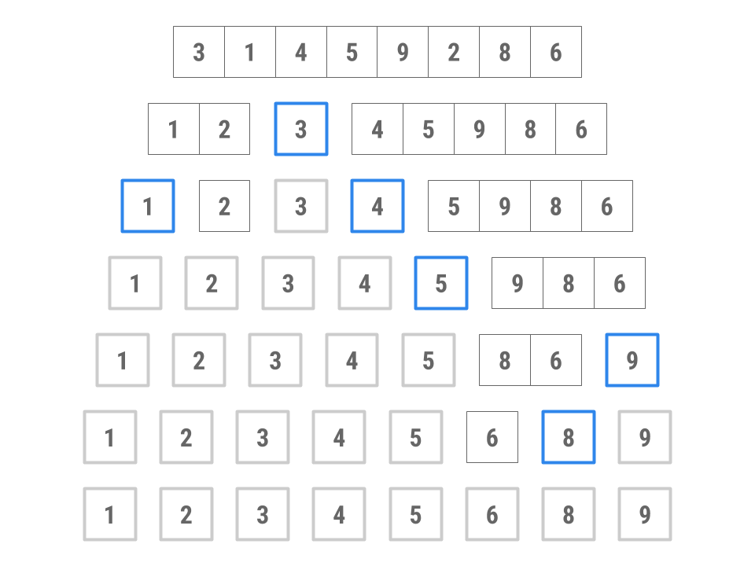

# Lab 11: 基于比较的排序 (可选)


!!! info "MOLI：本次实验你将会学到什么"
    * 排序的基本概念和重要性
    * 排序算法的特性
    * 多种基于比较的排序算法及其工作原理、特性和实现

## 常见问题解答
实验 11 的常见问题解答在[这里](https://sp25.datastructur.es/labs/lab11/faq/)。

## 简介
这是个可选的实验。我们鼓励你在空余时间完成，以加强你对基于比较的排序算法的理解。本实验不设课堂环节，也无需提交。
和之前一样，使用 `pull` 从框架里面拉取文件并新建一个 `Intellij` 项目。
在本实验中，我们讲讨论 **排序** ，一种将集合中的元素重新排列成特定顺序的算法。使用排序后的集合，你可以更轻松的解决许多问题，包括以 *O(logN)* 时间复杂度执行二分查找，高效地识别列表中相邻的元素对，找到第 K 大的元素等等。
排序算法有多种，每种算法适用于不同的情况。从最高层面来看，我们将区分成两种类型的算法：

* **基于比较的排序**，依赖于元素间的两两比较。
* **基于计数的排序**，根据元素的各个数字进行分组，然后对每个组进行排序和组合。计数排序不需要进行元素之间的比较。 

在接下来的实验中，我们将讨论几种基于比较的排序，包括 *插入排序*， *选择排序*， *堆排序*， *合并排序* 和 *快速排序* 。为什么会有那么多种排序算法呢？每种排序算法都有不同的优点和缺点：在某种情况下，一种排序算法可能比另一种排序算法快，或者是一种排序算法可能比另一种排序算法使用更少的内存，等等。当处理大型数据集（甚至中小数据集）时，选择正确的排序算法会产生巨大的影响。在此过程中，我们将通过探索示例和编写自己的实现来培养对每种排序算法工作原理的直观理解。

[这里](https://www.cs.usfca.edu/~galles/visualization/ComparisonSort.html)是一个很好的可视化工具，适用于一些排序算法。

## 顺序和稳定
将元素按顺序排列意味着我们可以在两个元素之间强行排序。给定列表中的任意两个元素，根据 **全序** 关系，我们应该能决定两个元素谁是大的谁是小的。
然而，也有可能两个元素之间分不出大小。例如，如果我们希望确定两个字符串之间的顺序，`["sorting","example]`,使用字符串的长度进行排序的话，则会不清楚哪个应该排前面，因为两个字符串的长度都为 7 。

在这种情况下，我们可以遵循 **稳定性** 的概念：如果排序算法是稳定的，那么它将保留列表元素之间的相对顺序。在上面的例子中，在稳定的排序算法下，结果会是 `["sorting","example"]` ，而在不稳定的排序算法下，结果可能是 `["example","sorting"]` 。请记住，根据我们按字符串长度进行的全序排列，即使等效元素的相对顺序没有保留，第二个列表仍然被认为是正确排序的。

稳定排序的好处是什么？它允许我们根据多个属性值进行排序。例如，我们可以先按字母顺序，然后按流派、作者对图书馆目录进行稳定排序。如果没有稳定排序。我们无法保证之前排序的相对顺序会保留下来，因此目录可能只按我们最后一个排序的结果排列。

请看以下示例，我们对动物列表先按字母顺序排序，然后按字符串长度排序。

原始集合：
```
cow
giraffe
octopus
cheetah
bat
ant
```
首先，按字母顺序排序：
```
ant
bat
cheetah
cow
giraffe
octopus
```
其次，按字符串长度稳定排序：
```
ant
bat
cow
cheetah
giraffe
octopus
```
对同一个列表进行两次排序后，现在的列表按字符串长度排序，而同样长度的元素按字母顺序排序。如果我们的排序算法是不稳定的，那么我们可能会丢失上一次排序中获得的字母顺序信息。

## 空间复杂度
目前位置，在本课程中，我们主要讨论了时间复杂度。与我们如何对运行时进行渐进分析类似，我们对一个给定的算法分析使用了多少空间（既内存）。对于排序算法，我们关注的常见特性之一是算法是否能原地执行。

任何接受大小为N的输入的排序算法都必须使用与N成比例的内存来储存输入本身。原地算法是不使用大量额外内存的算法。在本课程中，这意味着该算法必须仅使用常数级别的额外内存（例如，仅用少数变量来记录当前引索）。另一种理解方式是，我们是否能可以在原始列表中执行整个算法，而无需创建额外的数据结构。我们在本实验讨论的所有算法都是原地的，不需要创建其他数据结构。

请注意，原地的定义可能有所不同-虽然我们的课程中说了常数级别的额外内存，但是一些衡量标准认为使用对数级别的额外内存也是可以的。如果你在网上看到其他文章，请注意！

一些想法：手工排序
想象你一张一张拿到13张扑克牌后该如何整理。首先先按花色排序，再在每个花色内按牌面大小（A到K）排列。

然后，思考一下你将如何对300份 CS61BL 考卷按照学生学号进行排序。如果这与你上一步的卡片排序算法不同，请解释原因。

你能判断两个算法那个更快么？为什么会这样？

## 插入排序
我们将学习的第一个基于比较的排序是*插入排序*。插入排序的基本思想可以用这个伪代码来总结：
```
for each element in the collection:
    while the previous element is smaller than the element:
        swap the two elements
```
当我们询问你如何对卡片进行排序的时候，你可能已经直观的想到了插入排序。就像你通过不断的将下一张排放到你持有的一组已排序的牌中的正确位置，从而进行对牌的排序。

请注意，插入排序是稳定的。如果元素相等，我们不会交换元素，因此相等元素的相对顺序会被保留。

现在您已经阅读了上述说明，我们建议您观看此[视频](https://www.youtube.com/watch?v=JtS5yGftYZ8)来巩固你的理解。

## 思考练习：运行时
对于以下问题，请自行思考，然后验证您的答案。

假设我们有一个 *N* 个整数的数组。在运行插入排序之前，数组应该是什么样子，才能让插入排序运行得最快，即所需的操作步骤数最少？

<details>
  <summary>点击这里揭露答案</summary>
  <p>排序好的数组。</p>
</details>
<br>

在这个数组上面运行插入排序的所需时间是多少？

<details>
  <summary>点击这里揭露答案</summary>
  <p>O(N) 。</p>
</details>
<br>

那种类型的初始列表会最大化比较次数并且导致运行时间最慢？
<details>
  <summary>点击这里揭露答案</summary>
  <p>逆排序数组。</p>
</details>
<br>

对上面的数组进行插入排序的运行时间是多少？
<details>
  <summary>点击这里揭露答案</summary>
  <p>Θ(N^2) 。</p>
</details>
<br>

## 非编码练习：`InsertionSort`
阅读`InsertionSort.java`里的`sort()`并理解提供的辅助方法。

## 选择排序
选择排序在一个包含N个元素的集合上可以通过以下伪代码描述:
```
for each element in the collection:
    find the smallest remaining element, E, in the *unsorted* part of the array
    remove E and add E to the end of the *sorted* part of the array
    repeat unsorted collection's original length number of times (or repeat until unsorted collection has no more elements)
```

在选择排序中，我们将未排序集合中的最小元素与未排序集合开头的元素进行交换。这可能会改变相等元素的相对顺序。因此，选择排序是不稳定的。

在阅读完上述内容后，我们建议观看关于选择排序的[视频](https://www.youtube.com/watch?v=yZtvSYeTQi4&feature=youtu.be)！

## 讨论：运行时间
现在，让我们确定选择排序的渐进运行时间。可以观察到，在循环的第一次迭代中，我们将查看数组中的所有 N 个元素已找到最小元素。在下一次迭代中，我们将查看 N-1 个元素已找到最小值。在下一次迭代中，我们将查看 N-2 个元素，以此类推。因此，无论数组在排序之前的元素顺序如何，总的工作量将会是 N+(N-1)+...+1 。因此，我们得到了一个 Θ(N^2)的算法，这和插入排序的正常情况相同。当请注意，选择排序没有更好的情况，而插入排序是有的。

## 非编码练习: `SelectionSort`

阅读阅读`SelectionSort.java`里的`sort()`并理解提供的辅助方法。

## 堆排序
回顾选择排序的基本结构
```
for each element in the collection:
    find the smallest remaining element, E, in the unsorted collection
    remove E and add E to the end of the sorted collection
```
将元素添加道已排序数组的末尾可以在常数时间完成。影响我们运行时间的是在数组中查找最小元素的过程，这始终需要线性的时间。

有没有一种数据结构可以让我们快速找到并移除最小元素呢？答案是堆(heap)!

我们将修改我们的思路，使其更适合堆，通过移除最大元素并将其放置在数组的末尾。以下是堆排序的伪代码：
```
construct a max heap from the given collection by bubbling down every
element from the end of the collection 
while there are elements remaining in the heap (unsorted part of the collection)
    swap the root of the heap with the last element
    bubble down the new root till the end of the heap

```

堆排序是不稳定的，因为堆操作 (回想一下 `bubbleUp` 和 `bubbleDown`) 可能会改变相等元素的相对顺序。

再次建议通过这个有用的[视频](https://www.youtube.com/watch?v=WuuQqsDftGU)来结束对堆排序的学习。

## 讨论：运行时

现在，让我们确定堆排序的运行时间。从一个包含 N 个元素的堆中移除最大元素可以在与 log N 成正比的时间内完成，这使我们能够在O(N log N) 时间内对元素进行排序。我们还可以通过对每个元素调用 `bubble down` 在O(N log N)时间内构建堆。这个步骤只执行一次，因此不会使我们的整体运行时间超过之前确定的 O(N log N) 。因此，一旦堆创建完成，排序可以在 O(N log N) 时间内完成。

<details>
  <summary>超出范围的说明</summary>
  <p>构建堆的更紧凑的运行时间实际上是 O(N) ，但这并不影响整体运行时间。堆排序的实际运行时间计算是复杂的，超出了本课程的范围。你可以查看这个 Stack Overflow 的回答，以获取更正式的运行时间计算。</p>
</details>
<br>

## 练习：`HeapSort`
完成 `HeapSort.java` 中的 `sort()` 和建议的辅助方法。本实验中的堆是以引索 0 为根，而不是 1 ，因为我们使用它来堆预先存在的数据进行排序。我们意见提供了适当的 `getLeftChild ` 和 `getRightChild` 方法作为框架的一部分，因此你不需要在实现中中担心这些。

## 新思路： “分而治之”

我们之前介绍的前几种排序算法通过逐个迭代集合中的每个项目来工作。插入排序和选择排序都维护一个“已排序部分”和一个“未排序部分”，并通过将元素从未排序部分移动到已排序部分来逐渐对整个集合进行排序。另一种排序方法是通过分治法。分而治之利用了空集合或单元素集合已经排序的事实。这本质上形成了递归过程的基本情况，该过程将集合分解为更小的部分，然后合并相邻部分以形成完全排序的集合。

分治法的思想可以分解为以下三个步骤：
  1. 将要排序的元素分成两个集合。
  2. 递归地对每个集合进行排序。
  3. 合并已排序的集合。

与选择排序相比，后者涉及将每个元素与其他每个元素进行比较，分治法可以通过对全集合的子范围进行排序或强制排序来减少不必要的比较。分治法的运行时间优势主要来自于合并已排序序列的速度非常快。

应用这种方法的两个算法是归并排序和快速排序。

## 归并排序
归并排序的原理是重复执行以下步骤，直到达到空集合或只含一个元素的集合：
  1. 将待排序的集合对半分。
  2. 对每个半部分递归地调用归并排序。
  3. 合并已排序的半列表。

归并排序之所以快速，是因为合并两个已排序的列表所需的时间是线性的，且与这两个列表的长度之和成正比。此外，将集合一分为二只需要对所有元素进行一次遍历。这种处理模式如下图所示。


图中的每一层都包含一系列过程，这些过程共同以线性时间运行。由于有 2 log N 层，并且每一次的的步骤都正比于N，因此总的时间复杂度正比于 N log N 。

具体来说，每一层的工作量正比于 N ，这是因为合并过程以拉链式的方式进行。给定两个已排序的列表，`merge` 应持续比较这两个列表的首个元素，并将这些元素交织成一个单一的有序列表。例如，给定列表 [2, 6, 7] 和 [1, 4, 5, 8]， `merge` 会比较这两个列表的首元素（1 和 2）。因为 1 < 2，所以 1 被移入整体有序列表的下一个可用位置（在这个例子中是第一个位置）。注意 2 并没有立即进入整体列表，因为我们现在必须有效地比较 [2, 6, 7] 和 [4, 5, 8]，并重复此过程，直到没有更多需要比较和合并的元素。

归并排序是稳定的，只要我们确保在合并两个半部分时，对于相等的元素，我们优先选择左半部分的元素。

现在，在尝试下面的练习之前，请观看这段关于`mergeSort`的[视频](https://www.youtube.com/watch?v=JJrAzmJcMh0)！

## 练习：`mergeSort`
为了检查你对归并排序的理解，请在 `MergeSort.java` 中实现 `sort` 方法。 请务必使用辅助的 `merge` 方法！

这个方法应该是无损的，因此原始的 `int[] arr` 不应被修改。

## 快速排序
快速排序算法是分治法的另一个例子，其过程如下：
  1. 通过围绕一个枢轴(或“分隔符”)进行分区，将待排序的集合分成三个集合。一个集合包含小于枢轴的元素，第二个集合包含等于枢轴的元素，第三个集合包含大于或等于枢轴的元素。
  2. 对每个集合递归地调用快速排序。
  3. 通过连接合并已排序的集合。

具体来说，这种快速排序版本被称为“三向切分快速排序”，因为算法在每次调用时都会进行三次分区。

以下是一个示例，对包含 3, 1, 4, 5, 9, 2, 8, 6 的数组进行排序。



  1. 选择 3 作为枢轴。(我们稍后将探讨如何选择枢轴。)
  2. 将 4、5、9、8 和 6 放入“大”集合，将 1 和 2 放入“小”集合。没有元素进入“相等”集合。
  3. 将大集合排序为 4、5、6、8、9 ; 将小集合排序为 1、2; 将这两个集合与枢轴合并，得到 1、2、3、4、5、6、8、9 。

根据实现方式的不同，快速排序可能不稳定，因为当我们将元素移动到枢轴的左侧和右侧时，相等元素的相对顺序可能会改变。

## 练习： `quciksort`
为了检查你对快速排序的理解，请填写 `QuickSort.java` 中的 `sort` 方法。请使用辅助的 `partition` 方法！
此方法具有破坏性，它会修改原始的 `int[] arr` 。

## 深入思考：快速排序
### 思考练习1 ： 运行时间
首先，让我们考虑最佳情况，即每次分区都能将范围最佳地一分为二。利用从归并排序分析中学到的一些策略，我们可以确定快速排序在最佳情况下的渐近运行时行为是 O(N log N) 。思考一下为什么会这样，以及快速排序的最佳情况运行时与归并排序的运行时有何不同。

然而，快速排序在实践中更快，并且往往具有更好的常数因子（这不包含在大O分析中）。为了理解这一点，让我们仔细研究快速排序的工作原理。

我们知道链表的连接可以在常数时间内完成，而数组的连接可以在线性时间内完成。分区操作可以在与元素数量 N 成比例的时间内完成。如果分区是最佳的，并且能将每个范围大致一分为二，我们就会像归并排序一样，拥有类似对数级别的向下划分层级。在每个划分层级，我们仍然需要做相同的线性工作量，因为我们需要判断每个元素是大于还是小于枢轴。

然而，一旦我们达到基本情况，我们就不需要那么多步骤来重新组装排序后的集合。请记住，对于归并排序，虽然每个单元素列表都是有序的，但整个单元素列表集合不一定是有序的，这就是为什么归并排序需要 log N 步向上合并的原因。快速排序则不是这样，因为每个元素都已经在对的顺序的位置。因此，快速排序中的合并仅仅是线性时间连接的一个层次。

与归并排序不同，快速排序的最坏情况运行时与其最佳情况运行时不同。假设我们总是选择范围内的第一个元素作为枢轴。那么，以下哪种情况会导致快速排序的最坏情况运行时？思考一下，然后通过查看下面的答案来验证您的理解。

已排序或逆序数组。 这是因为枢轴将始终是一个极端值（最大或最小的未排序值），因此我们将有 N 次递归调用，而不是 logN 次。

在这种数组上运行快速排序的运行时是多少？

Θ( N^2 )

在这些条件下，快速排序的这种特殊情况是否让您想起我们在本次实验中讨论过的任何其他排序算法？
我们看到快速排序的最坏情况相当糟糕……您可能会想，那我们为什么还要费心使用它呢！然而，尽管证明原因超出了本课程的范围，但我们可以证明，平均而言，快速排序的运行时是 O(Nlog(N))！在实践中，快速排序最终非常快。

### 思考练习2：选择
给定一个随机整数集合，对于快速排序来说，最佳的枢轴值选择是什么，才能将问题分解成 log N 个层级？尝试描述一个算法来找到这个基准元素。它的运行时是多少？即使你认为你的解决方案不是最有效的，也没关系。

## 实践中的快速排序
你提出的枢轴选择算法有多快？找到元素的精确中位数可能耗时过长，以至于它根本无助于快速排序的整体运行时间。如果我们能非常迅速地做到这一点，选择一个近似中位数可能更有价值。选项包括随机选择一个元素，或者选择第一个、中间和最后一个元素的中位数。这些方法至少可以避免我们上面讨论的最坏情况。

在实践中，快速排序被证明是我们迄今为止所涵盖的通用排序算法中最快的。例如，它通常具有比归并排序更好的常数因子。因此，Java 使用这种算法对基本类型数组进行排序，例如整型 (int) 或浮点型 (float)。经过一些调整，最可能出现的最坏情况得以避免，并且平均情况下的性能非常出色。

以下是 Java 标准库中实现的快速排序算法的一些改进：

* 当子集合中只有少量元素时（接近递归基准情况-一个元素），会转而使用插入排序。
* 对于较大的数组，会投入更多时间来寻找一个好的枢轴。
* 各种依赖于机器的方法被用于优化分区算法和 `swap` 操作。
* [双枢轴](https://www.geeksforgeeks.org/dsa/dual-pivot-quicksort/)

然而，对于对象类型，Java使用归并排序和插入排序的混合，称为Timsort，而不是快速排序。你能解释一下为什么吗？ 提示：考虑稳定性。

要了解快速排序和归并排序之间的性能差异，请观看这个视频：[快速排序 vs 归并排序](https://www.youtube.com/watch?v=es2T6KY45cA)。


## 用时

迄今为止，我们通过对算法进行理论上的渐近分析来衡量它们的速度和效率。确定给定程序速度的另一种（非正式的）方法是使用各种输入对其进行测试，并测量每个输入所需的时间。这被称为用时实验，我们将此过程称为经验性地确定程序的效率。在本次实验中，我们将进行一些计时实验，以查看你在本次实验中实现的不同排序类的性能。

打开 `TimingTest.java` 并运行其主方法。这个类将使用你实现的排序算法对不同大小的随机数组进行排序，并绘制结果。

以下是在我们一台计算机上运行该测试的结果：


注意，当数组大小达到1000000时，选择排序和插入排序需要一分多钟才能运行，而堆排序和归并排序只需十分之一秒多一点的时间就能对相同的数组进行排序！

如果你多次运行它，你还会注意到快速排序的运行时间比其他算法变化更大——你正在亲眼目睹不同枢轴对算法性能的影响！

请注意，你看到的结果可能与上图不同。如果测试在你的计算机上运行时间过长，请尝试降低类中提供的边界值。

## 总结

在本次实验中，我们学习了更多用于排序集合的基于比较的算法。在基于比较的算法中，我们研究了两种不同的排序范式：
  1. 简单的排序算法，如插入排序和选择排序，它们演示了如何维护一个已排序部分，并将未排序的元素逐个移入这个已排序部分。通过优化（如堆排序）或在适当的条件下（对于插入排序来说是相对已排序的列表），这些简单的排序算法也可以很快！
  2. 分治排序算法，如归并排序和快速排序。这些算法采取了不同的排序方法：我们利用了只有一个元素的集合本身就是有序的这一事实。通过递归过程，我们可以将较大的排序问题分解成较小的子序列，这些子序列可以单独排序，然后快速重新组合以生成原始集合的排序结果。

以下是一些用于可视化排序算法的在线资源。如果你在理解这些排序算法时遇到困难，请使用这些资源作为工具，帮助你建立关于每种排序算法工作原理的直观理解。

* [VisuAlgo](http://visualgo.net/sorting)
* [Sorting.at](http://sorting.at/)
* [Sorting Algorithms Animations](http://www.sorting-algorithms.com/)
* [USF Comparison of Sorting Algorithms](http://www.cs.usfca.edu/~galles/visualization/ComparisonSort.html)
* [AlgoRhythmics](https://www.youtube.com/user/AlgoRythmics/videos): 通过民间舞蹈演示排序，包括[插入排序](https://www.youtube.com/watch?v=ROalU379l3U)、[选择排序](https://www.youtube.com/watch?v=Ns4TPTC8whw)、[归并排序](https://www.youtube.com/watch?v=XaqR3G*NVoo)和[快速排序](https://www.youtube.com/watch?v=ywWBy6J5gz8)。

为了总结我们所学到的排序算法，请查看下表。

|  | 最佳情况运行时间 | 最坏情况运行时间 | 稳定性 | 就地执行 | 备注 |
|------|------------------|------------------|--------|----------|------|
| [插入排序](https://youtu.be/JtS5yGftYZ8) | Θ(N) | Θ(N²) | 是 | 是 | |
| [选择排序](https://youtu.be/yZtvSYeTQi4) | Θ(N²) | Θ(N²) | 否 | 是 | 在特定条件下可以变为稳定排序。 |
| [堆排序](https://youtu.be/WuuQqsDftGU) | Θ(N log N) | Θ(N log N) | 否 | 是 | 如果所有元素都相等，则运行时间为Θ(N)。难以实现稳定性。 |
| [归并排序](https://youtu.be/JJrAzmJcMh0) | Θ(N log N) | Θ(N log N) | 是 | 通常不是，典型实现不是原地排序，要实现原地排序极其复杂。| Java中用于引用类型数组的优化排序称为"Timsort"。 |
| [快速排序](https://www.youtube.com/watch?v=7cjXkEW1STY&t=1h24m55s) | Θ(N log N) | Θ(N²) | 取决于实现 | 大多数实现使用 log N额外空间用于递归栈帧 | 稳定性和运行时间取决于分区策略；三路分区快速排序是稳定的。如果所有元素都相等，使用三路分区快速排序的运行时间为Θ(N)。Java中用于基本类型数组。实践中最快。 |


>您可能已经注意到，我们的排序算法的速度似乎存在一个下限。对于基于比较的排序算法，我们可以证明其最优时间复杂度是 O(N log N )。您可以在[此处](https://www.youtube.com/watch?v=j4Lmzhs6r-Y&list=PLNF4Mv5EsHj4QLTEw3uz42vJGKblD9usL&index=4)（时间戳 11:42）观看一段非常简短的视频解释。如果您对此类内容感兴趣，也可以阅读一个更深入的[证明](https://www.cs.cmu.edu/~avrim/451f11/lectures/lect0913.pdf)。此外，还有计数排序（counting sorts），在适用条件下，它们的性能甚至可以更好。

## 交付内容
完成下面的类：

* `HeapSort.java`
* `MergeSort.java`
* `QuickSort.java`