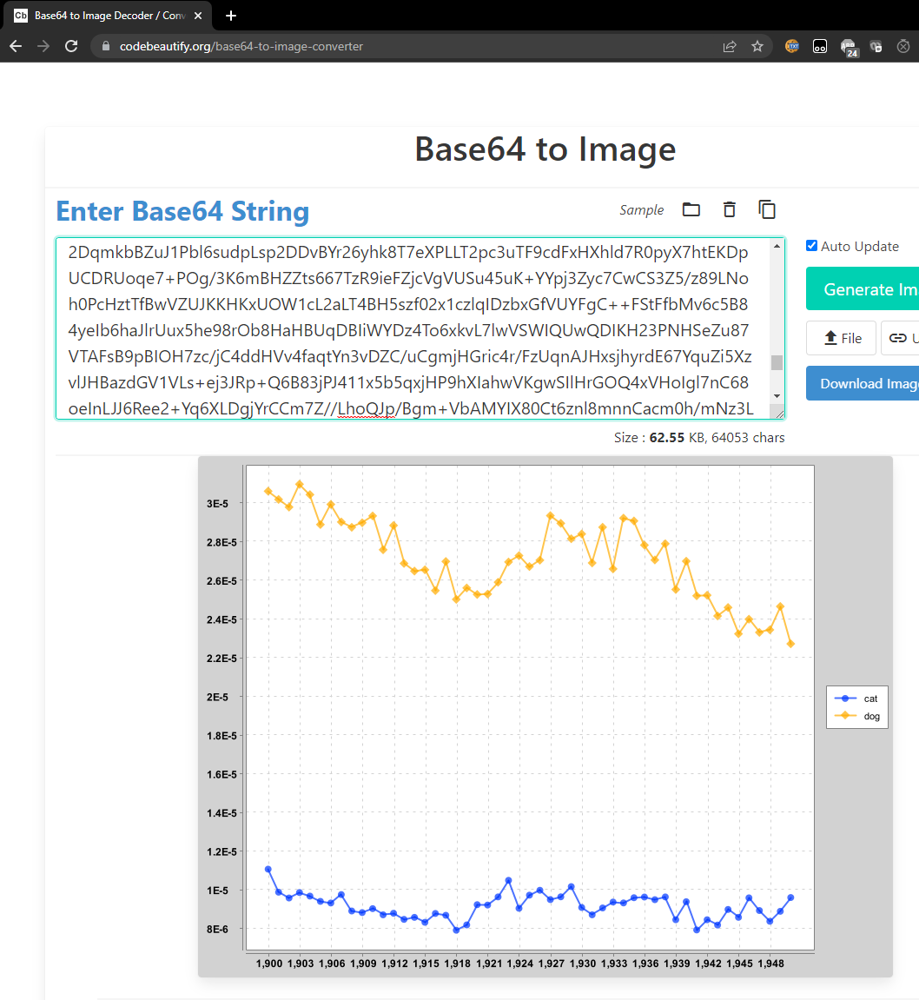
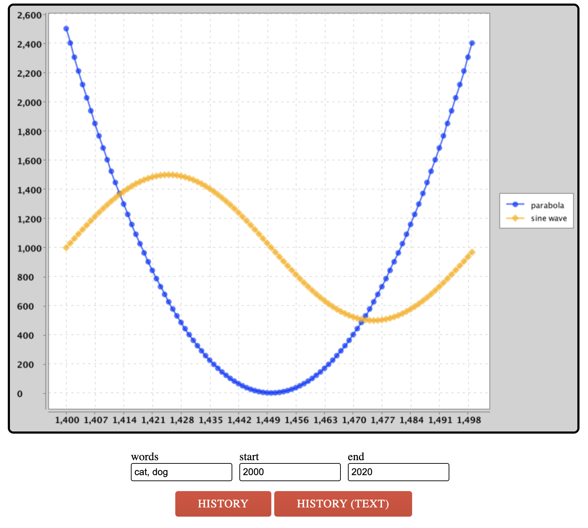

# 项目2A：Ngordnet（N元语法）

## 常见问题解答

每份作业顶部都会附有FAQ链接。您也可以在URL末尾添加“/faq”直接访问。项目2A的FAQ详见[此处](https://sp25.datastructur.es/projects/proj2a/faq/)。

## 项目介绍

本项目将构建一个基于浏览器的工具，用于探索英语词汇使用历史。我们已提供前端代码（JavaScript与HTML）用于收集用户输入并展示结果。您的Java代码将作为该工具的后端，负责处理输入数据并生成相应的输出结果。

项目视频介绍可访问此[链接](https://www.youtube.com/watch?v=ri9BzE723QA&list=PL8FaHk7qbOD7-899l1hKEd5aICB9u1wrm&index=1)。

为支持该工具的运行，您需要编写一系列Java程序包来实现数据分析功能。在此过程中，我们将充分实践各类实用数据结构。项目前期（项目2a部分）会明确指导您编写具体函数和创建类，而后期（项目2b部分）则将开放更多自主设计空间。

您可访问 [ngordnet.datastructur.es](https://ngordnet.datastructur.es/) 查看该项目的官方参考实现。

## 开始

请按照常规操作使用 `git pull skeleton main` 命令获取项目框架。

由于文件体积限制，您还需另行下载项目2的数据文件（未通过GitHub提供）。

!!!TASK
    请通过此[链接](https://drive.google.com/file/d/1ZhMrVODwvW4h-Cl5QoZtCIYwP3aO8uGh/view?usp=sharing)下载数据文件。
    
    您需要将该压缩文件解压至`proj2`目录下，确保解压后的`data`文件夹与`src`、`static`文件夹处于同级目录。

    * [Windows系统解压指南](https://support.microsoft.com/en-us/windows/zip-and-unzip-files-f6dde0a7-0fec-8294-e1d3-703ed85e7ebc#:~:text=To unzip files,folder to a new location.)
    * [Mac系统解压指南](https://support.apple.com/guide/mac-help/zip-and-unzip-files-and-folders-on-mac-mchlp2528/mac#:~:text=Unzip (expand) a compressed item,zip file.)`


完成此步骤后，您的 `proj2a `目录结构应如下所示：

```
proj2a
├── data
│   └── ngrams
├── src
├── static
├── tests
```

请注意，我们已在框架代码中设置了隐藏的`.gitignore`文件，以确保Git不会上传这些数据文件。这是有意为之的设计。

!!!DANGER
    若将数据文件上传至GitHub，将会给所有人带来诸多困扰，因此请勿修改任何名为`.gitignore`的文件。如需在多台设备上工作，请确保在每台设备上单独下载该压缩文件。


若`NgordnetQuery `无法编译，请确保您使用的是 Java 15（预览版）或更高版本（推荐 17+）。

本项目环境配置视频指南可在此[链接](https://youtu.be/8uIt7pXua6Y).查看。请注意部分文件/文件名可能略有差异：视频中的 `hugbrowsermagic `目录在您获取的框架代码中已更名为 `browser`。

## 构建 N 元语法查看器

 [Google Ngram 数据集](http://storage.googleapis.com/books/ngrams/books/datasetsv3.html)提供了数 TB 级的英语词汇历史频率数据（更准确地说，是所有观测到的 [ngrams](http://en.wikipedia.org/wiki/N-gram) 数据）。Google 官方提供的  [Google Ngram Viewer on the web](https://books.google.com/ngrams/graph?content=global+warming%2Cto+the+moon&year_start=1800&year_end=2019&corpus=en-2019&smoothing=0)工具可可视化词汇历史流行度，例如上方链接展示了 "global warming"（二元语法）和 "to the moon"（三元语法）的加权流行度曲线。

在项目 2A 中，您将构建仅处理一元语法的简化版本（即仅支持单个词汇分析）。我们将使用完整一元语法数据集的小型子集（约 300MB），因为处理更大数据集需要本课程范围外的复杂技术。

## TimeSeries

`TimeSeries `是` TreeMap` 类的特化扩展，其键类型固定为` Integer`（年份），值类型固定为 `Double`（数值数据点）。您可在[此处](https://docs.oracle.com/en/java/javase/17/docs/api/java.base/java/util/TreeMap.html)查阅 `TreeMap API `了解可用方法。

示例：以下代码创建` TimeSeries` 并存储 1992 年对应值 3.6，1993 年对应 9.2：

```java
TimeSeries ts = new TimeSeries();
ts.put(1992,3.6);
ts.put(1993,9.2);
```

`TimeSeries` 类在继承 `TreeMap` 类的基础上，额外提供了一些实用工具方法。

!!!TASK
    请按照文件中提供的API规范完善`TimeSeries`类（位于`src/ngrams/TimeSeries.java`文件）。请务必仔细阅读每个方法上方的注释说明。

!!!WARNING
    关于`TimeSeries`对象的使用示例，请查看我们提供的`TimeSeriesTest.java`文件中的`testFromSpec()`测试用例。该测试创建了一个包含猫和狗种群数量的`TimeSeries`，然后计算它们的总和。请注意1993年没有对应数值，因为该年份在任何一个`TimeSeries`中都不存在。

!!!DANGER
    您不得向此类添加任何额外的`public`方法。但欢迎根据需要添加`private`方法。

### TimeSeries 实现要点

* `TimeSeries `对象不应包含任何实例变量。`TimeSeries` 是一个`TreeMap`。这意味着您的` TimeSeries `类也可以访问 `TreeMap` 的所有方法；请参阅  [TreeMap API](https://docs.oracle.com/en/java/javase/17/docs/api/java.base/java/util/TreeMap.html)。
* **多个方法要求您比较两个 `TimeSeries `的数据。您不应包含任何在年份或数值不可用时自动填充零的代码。**
* 提供的 `TimeSeriesTest `类包含对 `TimeSeries `类的基础测试。您可以自由添加自己的测试。
  * 请注意，我们提供的单元测试不评估` dividedBy `方法的正确性。
* 您会注意到在` testFromSpec()` 中，我们没有直接比较 `expectedTotal `和`totalPopulation.data()`。这是因为双精度浮点数容易出现舍入误差（您将在 61C 课程中学习相关原理）。因此，当 `x `和`y `是双精度浮点数时，`ssertThat(x).isEqualTo(y)` 可能会意外返回 false。相反，您应该使用` assertThat(x).isWithin(1E-10).of(y)`，只要` x`和 `y `之间的差值小于 10^-10^就会返回 true。
* 您可以假设` dividedBy `操作永远不会出现除以零的情况。

## NGramMap 类说明

`NGramMap `类将提供多种便捷方法来处理 `Google NGram `数据集。这个任务比创建 `TimeSeries `类更具开放性和挑战性。与` TimeSeries` 类似，您需要完善现有 `NGramMap.java` 文件中的方法。**注意：`NGramMap` 不应继承任何类。**

当调用返回 `TimeSeries `的方法时，如果该方法调用没有可用数据，您应该返回一个空的 `TimeSeries`。例如：`ngm.weightHistory("asdfasdf") `应返回空 `TimeSeries`，因为 "asdfasdf" 不在数据集中`ngm.countHistory("adopt", 1400, 1410)` 同样应返回空 `TimeSeries`，因为` "adopt"`在这些年份没有数据

!!!TASK
    请根据文件中的API规范完善`NGramMap`类（位于`src/ngrams/NGramMap.java`文件）。再次提醒，请务必仔细阅读每个方法上方的注释说明。

!!!WARNING
    关于`NGramMap`的实际应用示例，`NGramMapTest`中的`testOnLargeFile()`测试会基于`top_14377_words.csv`和`total_counts.csv`文件（下文将详细介绍）创建一个`NGramMap`实例，然后对1850年至1933年间"fish"和"dog"这两个词的出现频率进行各种操作。

!!!DANGER
    您不得向此类添加任何额外的`public`方法。但欢迎根据需要添加`private`方法。

### 输入文件格式

NGram 数据集包含两种不同类型的文件。第一种是词汇文件（words file）。词汇文件的每一行都以制表符分隔的形式，提供了某个特定单词在英语中特定年份的历史信息。

```
airport     2007    175702  32788
airport     2008    173294  31271
request     2005    646179  81592
request     2006    677820  86967
request     2007    697645  92342
request     2008    795265  125775
wandered    2005    83769   32682
wandered    2006    87688   34647
wandered    2007    108634  40101
wandered    2008    171015  64395
```

每行的第一个条目是单词。第二个条目是年份。第三个条目是该单词在当年所有书籍中出现的次数。第四个条目是包含该单词的不同来源的数量。**你的程序应忽略这第四列**。例如，从上面的文本文件中，我们可以看到 “wandered” 这个单词在 2008 年出现了 171,015 次，这些出现分布在 64,395 个不同的文本中。在本项目中，我们从不关心第四个条目（总卷数）。

另一种类型的文件是计数文件 （counts file）。计数文件的每一行以逗号分隔的形式，提供了每个日历年可用的总语料库数据信息。

```
1470,984,10,1
1472,117652,902,2
1475,328918,1162,1
1476,20502,186,2
1477,376341,2479,2
```

每行的第一个条目是年份。第二个条目是当年所有文本中记录的总单词数。第三个数字是当年文本的总页数。第四个是当年的不同来源总数。你的程序应忽略第三列和第四列。例如，我们可以看到，谷歌有一份 1470 年的英语文本，其中包含 984 个单词和 10 页内容。就我们的项目而言，10 和 1 这两个数字是无关的。

你可能会疑惑为什么一种文件用制表符分隔，另一种用逗号分隔。这不是我做的，是谷歌这么规定的。幸运的是，这种差异处理起来不会太困难。

### NGramMap 提示

本项目的这部分有很多需要考虑的地方。我们试图模拟现实世界中的情况，即你面临一个庞大且开放性的问题，必须从头开始构思解决方案。这可能会让人望而生畏！你可能需要花费一些时间并进行大量实验，才能找到前进的方向。为了降低难度，我们至少提供了一份需要实现的方法列表。请记住，在现实世界中（以及在 proj2b 和 proj3 中），甚至连方法列表都需要由你自己来决定。

你的代码应该足够高效，能够使用`top_14377_words.csv `文件创建 `NGramMap`。加载时间应少于 60 秒（在较旧的计算机上可能会稍长一些）。如果你的计算机内存充足，还应该能够加载` top_49887_words.csv `文件。

* 这个类的主要工作是实现构造函数。你需要解析提供的数据文件，并将这些数据存储在你选择的数据结构中。
  * 这个选择很重要，因为选择合适的数据结构可以让你在实现其他方法时事半功倍。因此，我们建议先查看一下其他方法，以帮助你决定哪种数据结构可能最合适；然后再开始实现构造函数。
* 避免将 HashMap 或 TreeMap 用作你的映射的[实际类型参数](https://docs.google.com/presentation/d/1j2vivowiaZWepIjUoWj6Cx3CdJiyuYslxkg8GsT8kxM/pub?start=false&loop=false&delayms=3000&slide=id.g631db3c57_38)实际类型参数。这通常表明你实际上需要的是一个自定义类型。换句话说，如果你的实例变量包含一个嵌套映射，看起来像 `HashMap<blah, HashMap<blah, blah>>`，那么可以考虑使用` TimeSeries` 或你自己创建的其他类。
* 我们尚未在 Java 中教授如何读取文件。我们建议使用 `In `类，官方文档可以在[这里](https://introcs.cs.princeton.edu/java/stdlib/javadoc/In.html)找到。不过，你也可以使用从网上学到的任何技术。我们提供了一个示例类 `FileReaderDemo.java`，展示了如何使用` In` 类。
* 如果你使用 `In `类，不要使用`readAllLines `或` readAllStrings` 方法。这些方法速度较慢。相反，应该逐块读取输入。有关示例，请参阅` src/main/FileReaderDemo.java`
  * 此外，要检查文件中是否还有剩余行，应该使用 `hasNextLine`（而不是` isEmpty`）。
* 我们提供的测试仅涵盖了部分方法，而且有些方法只在非常大的文件上进行测试。你需要编写额外的测试。
  * 建议不要使用大型输入文件（例如` top_14377_words.csv`），而是从较小的输入文件开始，例如` very_short.csv `或 `words_that_start_with_q.csv`。
* **与 TimeSeries 一样，如果某个值不可用，你不应编写任何填充零的代码。**
* 如果有助于加快代码速度，你可以假设年份参数在 1400 到 2100 之间。这些变量在 `TimeSeries` 类中作为常量`MIN_YEAR `和 `MAX_YEAR `存储。
* `NGramMap `不应继承任何其他类。
* 你的方法应该简洁明了！如果你选择了合适的数据结构，这些方法应该相对简短。
* 如果单词无效，返回一个空的 `TimeSeries`。


## 历史文本处理器（HistoryTextHandler）

在项目 2A 的最后一部分，我们将进行一些软件工程工作，搭建一个能够处理 Ngordnet 查询的 Web 服务器。虽然这部分内容与数据结构没有直接关系，但能够将项目部署到实际应用中是非常重要的。

**注意**：只有当你相当确信 `TimeSeries `和` NGramMap `能够正常工作时，才应该开始这部分内容。

1. 在你的 Web 浏览器中，打开` static `文件夹中的` ngordnet_2a.html `文件。你可以通过操作系统的文件管理器菜单来打开，也可以在 IntelliJ 中右键点击`ngordnet_2a.html `文件，选择 “Open in”（在... 中打开），然后选择 “Browser”（浏览器）。你可以使用任何浏览器，不过助教们最熟悉 Chrome。你会看到一个基于 Web 浏览器的界面，最终（当你完成项目时）用户可以在这个界面中输入单词列表并查看可视化结果。

2. 尝试在 “words” 框中输入 “cat, dog”，然后点击 `“History (Text)”` 按钮。你会发现没有显示任何有用的内容。（可选）如果你在 Web 浏览器中打开开发者工具（可通过 Google 搜索了解如何操作），会看到一个类似 “CONNECTION_REFUSED” 或 “INVALID_URL” 的错误。问题在于 Javascript 试图访问一个服务器来生成结果，但当前没有运行任何能够处理查看猫和狗历史请求的 Web 服务器。

3. 打开 `main.Main `类。这个类的 `main` 方法首先创建一个 `NgordnetServer `对象。这个类的 API 如下：首先，我们在 `NgordnetServer `对象上调用 `startUp `方法，然后使用 register 命令 “注册” 一个或多个`NgordnetQueryHandler`。
    这里的具体细节超出了我们课程的范围。基本思路是，当你调用 `hns.register ("historytext", new DummyHistoryTextHandler (ngm))` 时，会创建一个 `DummyHistoryTextHandler `类型的对象，该对象将处理任何点击 `“History (Text)”` 按钮的操作。

4. 尝试运行`main.Main` 类。在 IntelliJ 的终端输出中，你应该会看到这样一行：`INFO org.eclipse.jetty.server.Server - Started...`，这意味着服务器已正确启动。现在再次打开 `ngordnet_2a.html` 文件，再次输入 “cat, dog”，然后点击` “History (Text)” `按钮。这次，你应该会看到一条消息，显示：
   ```
   You entered the following info into the browser:
    Words: [cat, dog]
    Start Year: 2000
    End Year: 2020
   ```

5. 现在打开` main.DummyHistoryTextHandler`，你会看到一个 `handle `方法。每当用户点击` “History (Text)” `按钮时，就会调用这个方法。而对于上面的输入，预期的行为应该是：当用户点击 `“History (Text)”` 时，应该显示以下文本：

```
cat: {2000=1.71568475416827E-5, 2001=1.6120939684412677E-5, 2002=1.61742010630623E-5, 2003=1.703155141714967E-5, 2004=1.7418408946715716E-5, 2005=1.8042211615010028E-5, 2006=1.8126126955841936E-5, 2007=1.9411504094739293E-5, 2008=1.9999492186117545E-5, 2009=2.1599428349729816E-5, 2010=2.1712564894218663E-5, 2011=2.4857238078766228E-5, 2012=2.4198586699546612E-5, 2013=2.3131865569578688E-5, 2014=2.5344693375481996E-5, 2015=2.5237182007765998E-5, 2016=2.3157514119191215E-5, 2017=2.482102172595473E-5, 2018=2.3556758130732888E-5, 2019=2.4581322086049953E-5}
dog: {2000=3.127517699525712E-5, 2001=2.99511426723737E-5, 2002=3.0283458650225453E-5, 2003=3.1470761877596034E-5, 2004=3.2890514515432536E-5, 2005=3.753038415155302E-5, 2006=3.74430614362125E-5, 2007=3.987077208249744E-5, 2008=4.267197824115907E-5, 2009=4.81026086549733E-5, 2010=5.30567576173992E-5, 2011=6.048536820577008E-5, 2012=5.179787485962082E-5, 2013=5.0225599367200654E-5, 2014=5.5575537540090384E-5, 2015=5.44261096781696E-5, 2016=4.805214145459557E-5, 2017=5.4171157785607686E-5, 2018=5.206751570646653E-5, 2019=5.5807040409297486E-5}
```

要通过自动评分程序，输出的格式必须完全匹配。

* 所有文本行，包括最后一行，都应以换行符结尾。

* 所有空白和标点（逗号、大括号、冒号）都应与上面的示例一致。

**这些数字代表特定年份中单词 cat 和 dog 的加权流行度历史**。由于舍入误差，你的数字可能与上面显示的不完全相同。你的格式应与上面所示完全一致：具体来说，是单词，后跟一个冒号，再跟一个空格，接着是相应 `TimeSeries` 的字符串表示，其中键值对在大括号内以逗号分隔的列表形式呈现，键和值之间用等号连接。注意，你无需编写任何代码来生成每个 `TimeSeries` 的字符串表示，只需使用 `toString () `方法即可。

现在，该实现 “HistoryText” 按钮的功能了！


!!!TASK
    创建一个名为 `HistoryTextHandler.java `的新文件，该文件接收给定的 `NgordnetQuery` 并返回一个格式与上述示例相同的字符串。

    然后，修改` Main.java`，以便在有人点击 `History (Text)`按钮时使用你的 `HistoryTextHandler`。换句话说，你应该注册自己的 `HistoryTextHandler `类，而不是注册`DummyHistoryTextHandler`。

!!!INFO
    你可能会注意到，当服务器启动时，`Main.java `会打印出一个链接。如果觉得更方便，你可以直接点击这个链接，而无需手动打开` ngordnet_2a.html`文件 。

### HistoryTextHandler 提示

* `HistoryTextHandler `的构造函数应采用以下形式：`public HistoryTextHandler(NGramMap map)` 。
* 以 `DummyHistoryTextHandler.java `为参考，在合适的地方进行模式匹配。能够修改示例代码并让其按你的需求运行，是一项在现实世界中极其重要的技能。大胆尝试吧，别怕把东西搞坏！
* **对于 Project 2A**，你可以忽略 `NgordnetQuery `的 `k` 实例变量。
* 使用从 `TreeMap` 继承而来、内置在 `TimeSeries `类中的`.toString()`方法 。
* 为了让你的 `HistoryTextHandler `能发挥实际作用，它需要能够访问存储在` NGramMap` 中的数据。**切勿将 NGramMap 设为静态变量**！这就是所谓的 “全局变量”，对于任何问题，它都很少是恰当的解决方案。提示：你的 `HistoryTextHandler `类可以有一个构造函数 。
* 如果单词无效，思考一下` NGramMap `是如何处理这种情况的。

## 历史处理器（HistoryHandler）

上一部分中基于文本的历史记录除了用于对你的作业进行自动评分外，并没有太多实际用途。要真正使用我们的工具发现有趣的信息，就需要进行可视化处理。

`main.PlotDemo` 类提供了示例代码，该代码会使用你的`NGramMap` 生成一个可视化图表，展示 1900 年至 1950 年间单词 “cat” 和 “dog” 的加权流行度历史。尝试运行这个类。如果你的`NGramMap`类是正确的，你应该会看到一个非常长的字符串被打印到控制台，看起来可能像这样：

```
iVBORw0KGg...
```

这个字符串是图像文件的 Base64 编码。要将其可视化，请访问[codebeautify.org](https://codebeautify.org/)网站。将整个字符串复制粘贴到该网站中，你应该会看到一个与下方所示类似的图表：





这背后的原理是什么呢？你的代码打印出的字符串**就是图像本身**。要知道，任何数据都可以表示为一串比特（位）。这个网站知道如何按照预定义的标准，将这个字符串解码为对应的图像。

如果你查看绘图库的代码，会发现它依赖于`ngordnet.Plotter.generateTimeSeriesChart`方法，该方法接收两个参数。第一个是字符串列表，第二个是`List<TimeSeries>`（时间序列列表）。每个时间序列会以不同的颜色绘制，并且会被分配字符串列表中对应的标签。两个列表的长度必须相同（因为第 i 个字符串是第 i 个时间序列的标签）。

`ngordnet.Plotter.generateTimeSeriesChart`方法返回一个`XYChart`类型的对象。这个对象既可以通过`ngordnet.Plotter.encodeChartAsString`方法转换为 Base64 编码的字符串，也可以通过`ngordnet.Plotter.displayChart`方法直接显示在屏幕上。

在你的网页浏览器中，再次打开 static 文件夹中的`ngordnet_2a.html`文件。在你的`main.Main`类运行的情况下，在 “words” 输入框中输入 “cat, dog”，然后点击 “history” 按钮。你会看到下面这个奇怪的图像：




你会注意到，代码绘制的并不是 “cat” 和 “dog” 的历史数据，而是一条抛物线和一条正弦曲线。如果你打开` DummyHistoryHandler`，就会明白其中的原因。

!!!TASK
    创建一个名为` HistoryHandler.java `的新文件，该文件接收给定的 `NgordnetQuery`，并返回一个包含相应图表的 base-64 编码图像的字符串。


    然后，修改 `Main.java`，以便在有人点击 “History” 按钮时调用你的 `HistoryHandler`。

### HistoryHandler 提示

`HistoryHandler `的构造函数应采用以下形式：`public HistoryHandler(NGramMap map)`。

和之前一样，以`DummyHistoryHandler.java` 为参考。正如上一部分所提到的，我们非常希望你能掌握修改复杂库代码以实现所需功能的技能。

## 交付成果与评分

你需要负责实现四个类：

- **时间序列（TimeSeries）（12 分）**：正确实现 `TimeSeries.java`。
- **NGramMap 计数（8 分）**：正确实现` NGramMap.java `中的 `countHistory () `和` totalCountHistory () `方法。
- **NGramMap 权重（12 分）**：正确实现` NGramMap.java` 中的 `weightHistory () `和` summedWeightHistory () `方法。
- **历史文本处理器（HistoryTextHandler）（4 分）**：正确实现 `HistoryTextHandler.java`。
- **历史处理器（HistoryHandler）（4 分）**：正确实现 `HistoryHandler.java`。

### 提交方式

提交项目时，先添加并提交你的文件，然后推送到远程仓库。接着，进入 Gradescope 上相应的作业页面进行提交。

本作业的自动评分程序采用以下提交次数限制机制：

* 从项目发布到截止日期期间，你共有 8 次提交机会；每次提交机会每 24 小时刷新一次。

## 鸣谢

本作业中关于 WordNet 的部分大致改编自普林斯顿大学 Alina Ene 和 Kevin Wayne 的 [Wordnet 作业](http://www.cs.princeton.edu/courses/archive/fall14/cos226/assignments/wordnet.html)  。

