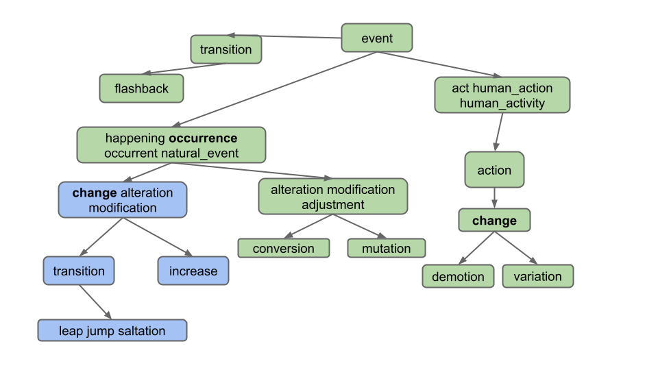

# 项目 2B：Ngordnet (Wordnet)

## [常见问题](https://sp25.datastructur.es/projects/proj2b/faq/)

每个作业顶部都会提供 FAQ 链接。你也可以在网址末尾添加"/faq"访问。项目 2B 的 FAQ 位于[此处](https://sp25.datastructur.es/projects/proj2b/faq/)。

在本项目中，你将完成 NGordnet 工具的实现。

由于这是较新的项目，规范可能存在偶发错误或表述不清之处。如果你发现此类问题，请在Ed论坛反馈。

!!! DANGER
    **重要提示**：阅读完 2B 规范后，切勿立即开始编码！

    在实现任何 2B 代码前，请先完成[项目 2B：检查点](https://www.gradescope.com/courses/961758/assignments/5737910)以及[设计文档](https://www.gradescope.com/courses/961758/assignments/5737948)。

### 设计说明

当你在设计项目时，需提前全面考量所有需求。预先规划将确保您在项目推进至特定阶段时，无需重写全部代码。

若您发现自己频繁复制粘贴或重复编写大量相似代码，这很可能表明存在直接复用机会或者对现有代码进行微调实现复用，从而显著减少重复劳动。

## 项目设置

!!! DANGER
    **本项目设置与其他实验/项目不同。请勿跳过此步骤！**

### 框架设置

1. 与其他课程作业类似，运行 `git pull skeleton main` 获取本项目的框架代码。
2. 通过[此链接](https://drive.google.com/file/d/1Gr6kiSXQK0FUXW_hKbLKQs3Tzb0SRJSL/view?usp=sharing)下载本项目的 `data` 文件，并将其移动到与 `src` 同级的 `proj2b` 文件夹。
3. 将你在 2A 中实现的 `ngrams` 模块（包括 `TimeSeries` 和 `NGramMap`）复制到 `proj2b.src.ngrams` 包。

!!! WARNING
    若未完成 2A ，请跳过框架设置的步骤 3 。我们在框架文件中提供了 2A 的精简版解决方案。它包含支持 `countHistory` 方法的 `NGramMap` 实现，能够满足完成2B的需求。然而，它不包含 `TimeSeries` 的实现。框架文件中许多部分需要定义 `TimeSeries` 类才能编译，因此你必须注释掉这些部分或自行添加 `TimeSeries` 的实现。

!!! INFO
    在过往的学期中，某些低效的 `NGramMap` 和 `TimeSeries` 实现通过了 2A 自动评分器，但在 2B 中失败。**如果你遇到自动评分器超时问题，我们建议恢复为 2A 的官方解决方案**。

!!! INFO
    如果你用自己的实现替换了 `NGramMap`，但后来更愿意使用官方解决方案，应通过 `git restore` 恢复原始框架版本（检查你的 `git log`）。你可以在实验 4 中了解更多相关信息。或者，你也可以从此处[框架仓库](https://github.com/Berkeley-CS61B/skeleton-sp25/blob/main/proj2b/src/ngrams/NGramMap.java)复制内容。

完成设置后，`proj2b` 目录结构应如下：
```
proj2b
├── data
│   ├── ngrams
│   └── wordnet
├── src
│   ├── <2B helper files>
│   ├── browser
│   ├── demo
│   ├── main
│   ├── ngrams
│   │   ├── <来自2A的NGramMap实现>
│   │   └── <来自2A的TimeSeries实现>
│   └── plotting
├── static
└── tests
```

## 开始实现

!!! WARNING
    **重要提示：** 在开始编码甚至设计项目之前，您需要先完成[项目 2B：检查点](https://www.gradescope.com/courses/961758/assignments/5737910)。我们认为这将有助于您理解项目。我们还将要求您向Gradescope提交[设计文档](https://docs.google.com/document/d/15j1vyx8zKwEi29JQ1Sd6Vl6R9AtbmJLWmL2BECFyx-w/edit?usp=sharing)。有关设计文档的更多详细信息可在[提交与评分](#提交与评分)部分找到。

!!! TASK
    完成[项目 2B：检查点](https://www.gradescope.com/courses/961758/assignments/5737910)  
    完成检查点后，完善并提交您的[设计文档](https://www.gradescope.com/courses/961758/assignments/5737948)

项目的这一部分旨在引导您为实施设计高效且正确的方案。您提出的设计对于处理这些案例至关重要。请在开始设计文档前仔细阅读 2B 规范。

课程团队已创建了若干介绍项目和初始代码的引导视频，可在[此处](https://www.youtube.com/playlist?list=PLNpmrGKEeMf727KwSrG8Ez1o3odK--o9i)获取。请注意我们已经更改了项目结构，因此某些信息可能已过时！

我们还创建了两个出色的工具，您（并且应该！）可以使用它们来探索数据集,观察官方解决方案对特定输入的行为,获取单元测试的预期输出（参见[测试您的代码](#测试你的代码)）。这些工具的链接将在此处以及规范其他相关部分提供：

- [WordNet可视化工具](https://www.qxbytes.com/wordnet/)：通过视觉理解同义词集(synsets)和下义词(hyponyms)的工作原理，测试不同单词/单词列表作为潜在测试用例输入。点击"？"气泡了解工具功能！
- [官方方案网页版](https://ngordnet.datastructur.es/)：生成不同测试用例输入的预期输出。使用此工具编写单元测试！

## 使用WordNet数据集

在将 WordNet 集成到项目之前，我们首先需要理解 WordNet 数据集。

[WordNet](http://en.wikipedia.org/wiki/WordNet) 是一个"英语语义词典"，被计算语言学家和认知科学家广泛使用；例如，它是 IBM Watson 的关键组件。WordNet 将单词分组为称为同义词集(synsets)的同义词集合，并描述它们之间的语义关系。其中一种关系是 is-a 关系，它将下义词(hyponym)(更具体的同义词集)连接到上义词(hypernym)(更泛化的同义词集)。例如，"change"是"demotion"的上义词，因为"demotion"是(is-a)"change"的一种类型。"change"反过来又是"action"的下义词，因为"change"是(is-a)"action"的一种类型。下图展示英语中一些下义关系的可视化表示：


上图中的每个节点是一个 **同义词集** 。同义词集由一个或多个具有相同含义的英语单词组成。例如，一个同义词集是["jump, parachuting"](http://wordnetweb.princeton.edu/perl/webwn?o2=&o0=1&o8=1&o1=1&o7=&o5=&o9=&o6=&o3=&o4=&s=jump&i=6&h=000010000000000000000000#c)，它表示使用降落伞降落到地面的行为。"jump, parachuting"是"descent"的下义词，因为"jump, parachuting"是(is-a)"descent"。

英语单词可能属于多个同义词集。这只是表达单词可能有多种含义的另一种方式。例如，单词"jump"还属于同义词集["jump, leap"](http://wordnetweb.princeton.edu/perl/webwn?o2=&o0=1&o8=1&o1=1&o7=&o5=&o9=&o6=&o3=&o4=&s=jump&i=2&h=100000000000000000000000#c)，它表示更比喻性的跳跃概念(例如出席率的跃升)，而不是另一个同义词集中字面意义的跳跃(例如跳过水坑)。同义词集"jump, leap"的上义词是"increase"，因为"jump, leap"是(is-an)"increase"的一种类型。当然，还有其他"增加"事物的方式：例如，我们可以通过"augmentation"来增加事物，因此在上图中从"increase"指向"augmentation"的箭头也就不足为奇。

同义词集不仅包含单词，还包含所谓的[搭配词(collocations)](http://en.wikipedia.org/wiki/Collocation)。你可以将这些视为经常相邻出现以至于被视为一个单词的组合，例如[nasal_decongestant](http://wordnetweb.princeton.edu/perl/webwn?s=nasal+decongestant+&sub=Search+WordNet&o2=&o0=1&o8=1&o1=1&o7=&o5=&o9=&o6=&o3=&o4=&h=)。为避免歧义，我们将用下划线_分隔搭配词的组成单词，而不是英语中通常使用的空格分隔。为简化起见，在本文档中我们将搭配词统称为"单词"。

一个同义词集可能是多个同义词集的下义词。例如，"actifed"既是"antihistamine"也是"nasal_decongestant"的下义词，因为"actifed"同时属于这两种类型。

!!! INFO
    提示：可通过这个[网址](http://wordnetweb.princeton.edu/perl/webwn?o2=&o0=1&o8=1&o1=1&o7=&o5=&o9=&o6=&o3=&o4=&r=1&s=sturgeon&i=3&h=1000#c)浏览WordNet数据库（非必需）

## 基础下义词处理
### 设置HyponymsHandler

1. 在网页浏览器中打开static文件夹内的 `ngordnet.html` 文件。作为提醒，您可在[此处](https://sp25.datastructur.es/projects/proj2a/#historytexthandler)项目符号 1 中找到操作指南。您将看到新增的"Hyponyms"按钮，同时请注意新增的 `k` 输入框。

2. 尝试点击 Hyponyms 按钮。您会看到没有任何反应（若打开浏览器的开发者工具功能，将看到浏览器显示错误信息）。

在项目 2B 中，您的主要任务是实现此按钮功能，这需要读取不同类型的数据集，并与项目 2A 的数据集结果进行合成。与 2A 不同，本任务将完全由您自主决定需要哪些支持类。

1. 编辑名为 `HyponymsHandler` 的文件，使用户点击浏览器中的Hyponyms按钮时返回"Hello!"。需使 `HyponymsHandler` 类继承 `NgordnetQueryHandler` 类（参考其他Handler类示例），注册处理器时确保将字符串"hyponyms"作为 `register` 方法的首个参数（而非"hyponym"）。

2. 首先打开 `ngordnet.main.Main.java` 文件。

3. 修改 `Main` 类注册新处理器处理 hyponyms 请求后，启动 `Main` 并再次点击 Hyponyms 按钮，此时应显示"Hello"文本。

!!! INFO
    若出现"无法加载文件 `some_file_here.txt` "错误，很可能说明你的项目设置不正确。请确认你的目录结构与"项目设置"章节一致。

### 基础版下义词处理器

接下来，您将实现Hyponyms按钮的部分功能。当前该按钮应：

- 假设输入的"words"仅为单个单词
- 忽略startYear、endYear和k参数
- 返回单个单词的下义词列表的字符串表示（包含单词本身），列表按 **字母顺序排列** 且 **无重复单词** 

例如，假设WordNet数据集如下所示（对应输入文件 `synsets11.txt` 和 `hyponyms11.txt`）。用户输入"descent"并点击Hyponyms按钮时：


此时处理器的输出应为包含"descent"、"jump"和"parachuting"的列表字符串，即 `[descent, jump, parachuting]`。注意单词按字母顺序排列。

另一示例：使用更大数据集（文件 `synsets16.txt` 和 `hyponyms16.txt`）：


用户输入"change"并点击 Hyponyms 按钮时，下义词为下图中蓝色节点的所有单词：


输出应为 `[alteration, change, demotion, increase, jump, leap, modification, saltation, transition, variation]`。注意即使"change"属于两个同义词集，输出中仅出现一次。

注意：避免过度复杂化。特别注意输出 **不包含**：

- 同义词的同义词（如不包含`"adjustment"`）

- 同义词的下义词（如不包含`"conversion"`）

- 其他下义词定义的下义词（如不包含`"flashback"`，它是`"transition"`另一释义的下义词）

!!! TASK
    实现 `HyponymsHandler.java` 及辅助类。  
    **注意**：请阅读下方提示，不应将所有代码写入此类。

!!! WARNING
    完成此任务需确定支持 `HyponymsHandler` 的辅助类。​​**切勿将所有实现集中在HyponymsHandler中​**​。应创建辅助类，例如 2A 中为"History"按钮实现 `NGramMap` 类，2B 中需构建自有类实现类似功能。  

    同时需理解WordNet数据集的输入格式（详见下节说明）。

!!! DANGER
    严禁导入现有图库​​（如普林斯顿算法教材的可选图实现），需自主构建一个或多个图类。

**TIPS**

- 类似2A的NGramMap，辅助类应在构造函数中单次解析输入文件。​**​禁止创建每次调用都重读整个文件的方法​​**（效率过低）！

- 我们强烈建议至少创建两个类：一个实现有向图概念的类，一个读取WordNet数据集并构建有向图实例的类（该类需能接收单词返回其下义词）。可额外创建遍历辅助类但非必需，遍历也可在图类中实现。

- 暂无需编写Truth测试（后续说明），使用网页前端验证"descent"和"change"示例（`synsets16.txt` 和 `hyponyms16.txt`）。

- 应为辅助类编写单元测试，但另一有效测试方式是：运行 `Main.java`、打开`ngordnet.html`、输入参数并点击Hyponyms按钮，可视化调试可能会给你带来意外发现。

### WordNet文件格式

现在描述存储WordNet数据集的两种数据文件类型。这些文件采用逗号分隔格式，即每行包含由逗号分隔的字段序列。

文件类型1：名词同义词集列表。文件 `synsets.txt`（及其他名称含 `synset` 的小文件）列出WordNet所有同义词集。每行格式包含三个逗号分隔字段：字段1是同义词集ID（整数），字段2是同义词集（synset），字段3是词典定义。例如行

> "6829,Goofy,a cartoon character created by Walt Disney"

表示同义词集`{Goofy}`的ID为6829，定义为"华特·迪士尼创作的卡通人物"。同义词集内单词用空格分隔（单词本身不能含空格）。S个同义词集ID从0到S-1连续编号，文件内ID连续排列。这些ID在下义词文件（类型2）中会使用。

文件类型2：下义词列表。文件`hyponyms.txt`（及其他名称含"hyponym"的小文件）包含下义关系：字段1是同义词集ID，后续字段是该同义词集的直接下义词ID。例如行 

> 79537,38611,9007  

表示同义词集79537（"viceroy vicereine"）有两个下义词：38611（"exarch"）和9007（"Khedive"），表明exarch和Khedive都是总督类型（或总督夫人）。同义词集信息来自 `synsets.txt` 文件的对应行：

> 79537,viceroy vicereine,governor of a country or province who rules...  
> 38611,exarch,a viceroy who governed a large province in the Roman Empire  
> 9007,Khedive,one of the Turkish viceroys who ruled Egypt between...

同义词集ID可能对应多行。例如在 `hyponyms16.txt` 中：

> 11,12  
> 11,13

这表明同义词集12和13都是11的直接下义词。这两行也可合并为单行，即下方行具有完全相同的含义（表明12和13都是11的直接下义词）：

> 11,12,13

您可能疑惑为何存在两种等效表述方式。现实数据常存在此类冗余，需妥善处理。

> 注意：现实数据常存在此类冗余表述，需妥善处理。


### 建议步骤

实现"Hyponyms"按钮需：

- 开发 **图类**（不熟悉可参考第22/23讲）。编写独立于数据文件的测试（如验证 `createNode`/`addEdge` 通过 `getNodes`/`neighbors` 测试）
- 编写将 **WordNet文件转换为图的代码**（可作为图类的一部分或独立类）
- 编写通过 **图遍历** 获取单词下义词的代码

**强烈建议**：

- 基于前述示例编写测试（如验证 `synsets11/hyponyms11` 中"descent"的下义词）
- 测试应匹配抽象层次（如 `TestGraph` 测试图类，`TestWordNet` 测试WordNet类）

作为另一个示例，我们的代码有一个`TestWordNet`类包含代码如下：
```java
@Test
public void testHyponymsSimple(){
    WordNet wn = new WordNet("./data/wordnet/synsets11.txt", "./data/wordnet/hyponyms11.txt");
    assertThat(wn.hyponyms("antihistamine")).isEqualTo(Set.of("antihistamine", "actifed"));
}
```

注意您的 WordNet 类可能与我们的函数不同，因此所示测试无法直接适用于您的代码；注意该测试完全不使用 `NGramMap`、`HyponymsHandler`或直接调用 `Graph` 对象，而是专为测试 `WordNet` 类设计；**仅依赖浏览器测试将极其低效且令人沮丧，请运用JUnit技能验证基础抽象类（如Graph、WordNet等）的可靠性。**

### 设计提示

本项目涉及多种查询操作、图操作和数据处理操作，不存在唯一正确实现方式。

需执行的查询操作示例：

- 给定单词（如"change"），哪些节点包含该单词？  
    - 示例（synsets16.txt）："change"位于同义词集2和8中
- 给定整数索引，对应哪个节点？  
    - 处理hyponyms.txt必需。例如在hyponyms16.txt中，已知同义词集8指向9和10，因此需能定位节点8获取其相邻节点
- 给定节点，该节点包含哪些单词？  
    - 示例（synsets16.txt）：同义词集11包含"alteration"、"modification"和"adjustment"

需执行的图操作示例：

- 创建节点（如synsets16.txt每行包含一个节点信息）
- 为节点添加边（如hyponyms16.txt每行包含应添加到对应节点的一条或多条边）
- 查找可达顶点（如hyponyms16.txt中从顶点7可达的顶点为7、8、9、10）

为类选择能自然解决上述六个问题的实例变量和/或数据结构，将大幅简化实现。

数据处理操作示例：

- 给定对象集合，如何找出所有非重复项？（提示：特定数据结构可高效实现）。请大胆查阅所选数据结构的文档（如选用TreeMap，可搜索"TreeMap方法 Java"、"Map方法 Java"或"Collection方法 Java"等）
- 给定对象集合，如何进行排序？（提示：搜索对应集合的排序方法）

!!! WARNING
    项目2A提醒：深层嵌套泛型是设计过度复杂的警示。应寻找更简方案或创建辅助类管理复杂度。例如若使用类似`Map<Set<Set<...`的结构，表明已陷入不必要的复杂路径  

!!! WARNING
    常规建议：若设计导致进展困难，请果断删除现有实例变量重新设计。本项目的难点在于设计而非编程，您随时可通过git恢复旧设计

## 处理单词列表

### 严格按原文格式的翻译：

您的下一任务是处理单词列表输入。例如用户输入"change, occurrence"时（对应下图），应仅返回所有单词的共同下义词，即 `[alteration, change, increase, jump, leap, modification, saltation, transition]`。"Demotion"和"variation"未包含在内，因为它们不是所有输入单词的下义词（特别不是"occurrence"的下义词）。



可见仅需返回属于列表中所有单词共同下义词的单词。注意用户输入的单词列表可包含两个以上单词（尽管本文档示例仅展示两个单词）。

注意两个单词可能共享下义词但不同属同节点。参考此例：用户输入"car, bug"时（对应下图），应返回`[beetle]`而非空列表`[]`！此例表明我们获取的是 **单词** 交集而非 **节点** 交集。


更多完整数据集示例（使用`synsets.txt`/`hyponyms.txt`）：

- 输入"video, recording"应返回`[video, video_recording, videocassette, videotape]`（均为video和recording的共同下义词）
- 输入"pastry, tart"应返回`[apple_tart, lobster_tart, quiche, quiche_Lorraine, tart, tartlet]`

!!! TASK
    请修改 `HyponymsHandler` 及其他相关实现以支持多词输入场景。

!!! WARNING
    测试建议：使用 `synsets16.txt` 以及 `hyponyms16.txt` 手动构建测试用例，通过网页前端验证正确性。

## 处理 `k != 0` 参数

此前我们处理了 `k = 0` 的情况（用户未输入 k 时的默认值）。

您的任务是处理用户输入 `k` 值的情况。`k` 表示输出中下义词的最大数量。例如输入"dog"且 `k = 5` 时，代码最多返回 5 个单词。

应选择请求时间段内出现次数最多的 `k` 个下义词。例如输入`words = ["food", "cake"]`，`startYear = 1950`，`endYear = 1990`，`k = 5`时，需找出 1950-1990 年间既是food又是cake下义词的5个最高频单词。频率定义为该时间段内单词总出现次数，结果按字母序排列。使用 `top_14377_words.csv`, `total_counts.csv`, `synsets.txt` 以及 `hyponyms.txt` 时输出应为`[cake, cookie, kiss, snap, wafer]`。（自动评分器未使用这些文件，因此该查询返回空列表）

!!! DANGER
    确保获取最高出现次数的单词（而非最高权重），否则将引发难以调试的问题。

注意：若前端未提供年份，`NGordnetQueryHandler.readQueryMap` 会使用默认值startYear=1900，endYear=2020。

大文件测试 `k != 0`较困难，我们提供可视化课程数据集（基于[HKN](https://hkn.eecs.berkeley.edu/courseguides)启发的EECS课程要求）：文件`frequency-EECS.csv`，`hyponyms-EECS.txt`，`synsets-EECS.txt`。输入`words = ["CS61A"]`, `startYear = 2010`, `endYear = 2020`, `k = 4`应返回`[CS170, CS61A, CS61B, CS61C]`。该 `frequency-EECS.csv` 包含相同频率值，建议仔细研究（设计时需考虑频率相同的情况）。

时间段内出现次数为0的单词不应返回（即 `k > 0` 时不显示 `ngrams` 数据集未包含的单词）。

无非零计数单词时返回空列表`[]`。

有效单词少于 `k` 时返回全部（如输入`"potato"`且`k = 15`，但仅有 7 个有效下义词时只返回7个单词）。

本任务较复杂，因需传递信息使 `HyponymsHandler` 能访问有效 `NGramMap`。

!!! TASK
    修改 `HyponymsHandler` 及其他实现以支持`k != 0` 场景。

!!! WARNING
    EECS数据集在网页版官方方案不可用（输入 `CS61A` 无返回），**但自动评分器会提供EECS数据集的测试数据和预期响应**。建议据此在本地复现调试。

!!! DANGER
    **严禁创建静态NGramMap！** 避免创建全局变量（如`public static NGramMap`），应通过构造函数或方法传递NGramMap。软件工程课程将详述此问题。

建议：

- 使用前文示例：`words = ["food", "cake"]`, `startYear = 1950`, `endYear = 1990`, `k = 5`。
- 当你创建你的测试集时，建议创建自定义输入文件（大文件测试繁琐）。

## 提交与评分

项目 2B 的唯一必需提交物是 `HyponymsHandler.java` 文件及其辅助类。但我们不会直接对这些辅助类评分，因为其实现会因学生而异。

- Project 2B 检查点: 2.5 分 - 截止日期 3 月 21 日
- Project 2B 设计文档: 2.5 分 - 截止日期 3 月 21 日
- Project 2B 代码实现: 80 分 - 截止日期 4 月 4 日
   - HyponymsHandler k = 0，单个单词，每次测试单次查询
   - HyponymsHandler k = 0，单个单词，每次测试多次查询
   - HyponymsHandler k = 0，多个单词，每次测试单次查询
   - HyponymsHandler k = 0，多个单词，每次测试多次查询
   - HyponymsHandler k ≠ 0，单个单词，每次测试单次查询
   - HyponymsHandler k ≠ 0，单个单词，每次测试多次查询
   - HyponymsHandler k ≠ 0，多个单词，每次测试单次查询
   - HyponymsHandler k ≠ 0，多个单词，每次测试多次查询
   - HyponymsHandler 无效输入处理

如前所述，您必须提交设计文档。该文档价值 2.5 分，截止日期为 3 月 21 日。设计文档的主要目的是为您的项目奠定基础。在编码前进行思考和构思非常重要。我们在设计文档中关注的是：

- 识别课程中学到的、您将在实现中使用的数据结构。
- 您实现算法的伪代码/总体概述。

您的设计文档应约 1 - 2 页长。设计文档的评分主要基于努力程度、思考深度和完成度。

请复制此[模板](https://docs.google.com/document/d/15j1vyx8zKwEi29JQ1Sd6Vl6R9AtbmJLWmL2BECFyx-w/edit?usp=sharing)并提交到[Gradescope](https://www.gradescope.com/courses/961758/assignments/5737948)。

如果您之后决定修改设计文档，请不用担心。您可以自由修改！我们希望您在编码前思考实现方案，因此要求您将设计作为项目的一部分提交。

本项目的令牌限制政策如下：您将从 8 个令牌开始，每个令牌有 24 小时的刷新时间。

## 测试你的代码

我们在 `proj2b/tests` 目录提供两个单元测试文件：
- `TestOneWordK0Hyponyms.java`
- `TestMultiWordK0Hyponyms.java`

提供的两个测试文件对应本项目已实现的前两种核心场景：

- ​​k = 0 的单字下义词查询​​：检索单个单词的所有下义词
- ​​k = 0 的多字下义词查询​​：检索多个单词的共同下义词（如`gallery, bowl`）

你需要完善 `AutograderBuddy.java` 以支持代码测试，具体提交要求详见[代码提交](#代码提交)章节。

**当前测试文件仅包含基础检查用例**，实际覆盖率不足。每文件仅有一个完整性验证测试，您应当：为每类场景补充更多单元测试，以此为模板创建两套新测试文件（分别对应k≠0的单字/多字查询）

测试用例的预期输出可参考[开始实现](#开始实现)章节链接的两种工具：[WordNet可视化工具](https://www.qxbytes.com/wordnet/)，[官方方案网页版](https://ngordnet.datastructur.es/)。


## 调试技巧
- 测试时使用小文件！​​ 这能减少运行 `Main.java` 的启动时间，并降低代码理解难度。运行 `Main.java` 时，小文件配置在 `main` 方法的前几行；进行单元测试时，文件名通过 `getHyponymsHandler` 方法参数传递。
- 通过调试器运行 `Main.java` 快速测试不同输入。​​ 点击 "Hyponyms" 按钮后，代码会在调试器中执行,此时断点会被触发，你可以查看变量窗口等进行调试。
- 本项目包含多个协同模块，不要从逐行调试开始。​​ 应先缩小范围定位故障函数/代码区域，再深入检查相关代码行。
- 查阅 [FAQ](https://sp25.datastructur.es/projects/proj2b/faq/) 解决常见问题和疑问。​

## 代码提交

在本作业中，我们一直让您使用前端测试代码。我们的自动评分器不够复杂，无法模拟网页浏览器调用您的代码。因此，我们需要您在 `proj2b.src.main.AutograderBuddy` 类中提供一个方法，该方法能提供处理下义词请求的处理器。

当您在本规范开始时运行 `git pull skeleton main` 命令，您应该已收到名为 `AutograderBuddy.java` 的文件。

打开 `AutograderBuddy.java` 并填充 `getHyponymsHandler` 方法，使其返回使用四个指定文件的   `HyponymsHandler` 。您在此处的代码应与 `Main.java` 中的代码非常相似。

现在您已创建 `proj2b.src.main.AutograderBuddy`，可以提交到自动评分器。如果任何测试失败，您应该能够基于上述测试文件构建JUnit测试在本地复现它们。如需额外数据文件，它们会以链接形式添加到本节。

## 致谢

本项目的WordNet部分参考了普林斯顿大学Alina Ene和Kevin Wayne的[Wordnet 作业](http://www.cs.princeton.edu/courses/archive/fall14/cos226/assignments/wordnet.html)。