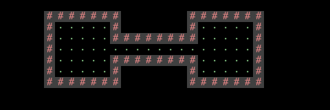
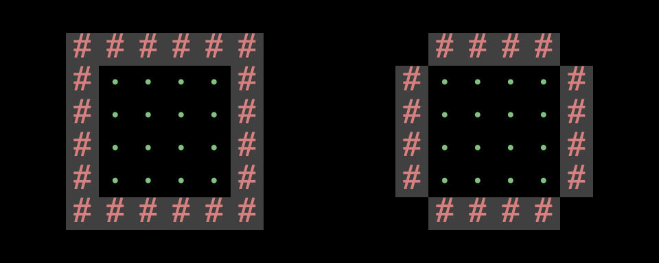
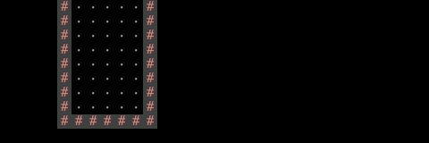
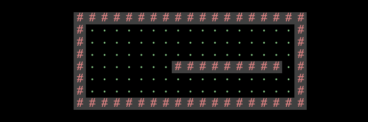

# 项目3A：世界生成

!!! info "MOLI：本次实验你将会学到什么"
    * 构建一个复杂的软件项目
    * 根据一个种子生成一个伪随机的二维世界

## 代码概况
### Lab 9
在开始本项目之前，我们强烈建议你至少完成实验9的前3个任务。这些任务将向你介绍：

* 项目3的瓦片引擎。
* StdDraw库。
* 创建一个简单的用户界面和实时“游戏循环”。
* 保存和加载模拟状态（任务4）。

### 框架代码
!!! info INFO
    * [新架代码的演示在这里](https://www.youtube.com/watch?v=A8NlkICBWL8)
    * 来自过去的学期，因此某些术语可能已过时（例如，“Phase 1”现在是“Project 3A”，“AutograderBuddy”现已弃用）。

在 `TileEngine` 包中，你会找到以下有用的文件：

`TERenderer.java` 包含与渲染相关的方法。
`TETile.java` 代表一个瓦片（游戏中的基本图形单元）。
`Tileset.java` 包含一些你可以使用的预制瓦片设计。
在 `Utils` 包中，你会找到以下有用的文件：

`RandomUtils.java` 包含用于为你的世界生成随机性的方法。
在 `Core` 包中，你将编写游戏代码。我们建议将所有代码都放在此包中（尽管这不是强制性的）。

`Main.java` 是用户启动整个系统的方式。
`World.java` 代表你的世界！
你也可以添加自己的其他类！
本项目大量使用了 `StdDraw`，这是一个具有基本图形渲染功能的包。此外，它还支持通过键盘和鼠标点击进行用户交互。在项目的某些时候，你可能需要查阅StdDraw的API规范。[API规范请参见此处](https://introcs.cs.princeton.edu/java/stdlib/javadoc/StdDraw.html)。

## 导入
你的项目只能使用标准 Java 库，或我们随你的仓库和 `library-sp25` 一起提供的任何库。

以下是允许导入的非详尽的列表

* `java.util.List`, `java.util.ArrayList`, `java.util.Collections`, `java.awt.*`, `java.io.*`，或任何以 `java.` 开头的都可以。
* `javax.sound`, javax.imageio, javax.swing.JOptionPane，或任何以 javax. 开头的都可以。
* `edu.princeton.cs.algs4.StdDraw`, `edu.princeton.cs.algs4.StdAudio`，或任何以 `edu.princeton.cs.algs4.` 开头的都可以，因为它们包含在 `library-sp25` 中。
* `tileengine.TETile`, `utils.RandomUtils`，或任何以 `tileengine.` 或 `utils.` 开头的都可以，因为它们是启动代码。

## 概念概况
### 创建瓦片数组
总的来说，你的目标是创建一个 `TETile` 对象的二维数组，并用不同的瓦片填充该数组，以创建一个美观的世界。接着，你可以调用我们提供的库函数之一，将这个世界显示给用户。

关于方向的重要说明：

* `world[0][0]` 对应着世界的左下角瓦片。
* 第一个坐标是 x 坐标。例如，`world[8][0]` 位于左下角瓦片右侧 8 个单位。
* 第二个坐标是 y 坐标。例如，`world[0][3]` 位于左下角瓦片上方 3 个单位。


如果你不确定瓦片的布局，你应该完成实验9。在实验9中，你将编写一些简短的示例程序来绘制示例网格，以加深你的理解。如果你混淆了 x/y 坐标或上/下方向，那么在调试时你会感到极其困惑。

二维数组的每个元素都可以用我们默认的 `Tileset.java` 瓦片库中的瓦片来填充。

下面是一段代码片段，它创建了一个宽为5、高为3的世界，并填充了几个方块：
```java
private static final int WIDTH = 5;
private static final int HEIGHT = 3;

// 创建瓦片网格（初始时全部为 null）。
TETile[][] world = new TETile[WIDTH][HEIGHT];

// 用 NOTHING 瓦片填充网格。
for (int x = 0; x < WIDTH; x++) {
    for (int y = 0; y < HEIGHT; y++) {
        world[x][y] = Tileset.NOTHING;
    }
}

// 在网格中添加一些瓦片。
world[0][1] = Tileset.WALL;     // 井号（#）。
world[3][0] = Tileset.FLOWER;   // 粉色花朵。
world[2][2] = Tileset.MOUNTAIN; // 灰色三角形。
```

渲染后的世界将如下图所示：


请注意，我们必须将未使用的方块明确赋值为 `Tileset.NOTHING`，即纯黑色的瓦片。如果你不初始化未使用的方块，当你尝试绘制世界时，将会得到一个 `NullPointerException`。

## 渲染瓦片
有了二维世界数组后，就该将其展示给用户了！

下面是一段代码片段，它接收一个二维世界数组，并将其显示给用户：
```java
// 初始化瓦片渲染引擎，设置窗口大小为 WIDTH x HEIGHT。此方法只应调用一次。
TERenderer ter = new TERenderer();
ter.initialize(WIDTH, HEIGHT);

// 创建并填充瓦片网格（初始时所有瓦片都为 null）。
// 省略：此处应是填充瓦片网格的代码。
TETile[][] world = new TETile[WIDTH][HEIGHT];
...

// 将二维网格绘制到屏幕上。每次重新绘制世界时都应调用此方法。
ter.renderFrame(world);
```

注意：在项目的后期，你将需要为游戏添加动画效果（即用户移动时显示不同的世界）。务必只调用一次 `initialize` 来设置窗口。之后，你可以根据需要多次调用 `render`。

渲染引擎会为你调用所有必要的 `StdDraw` 方法。我们不建议使用 `StdDraw` 命令，例如 `setXScale` 或 `setYScale`，除非你非常清楚自己在做什么，否则你可能会极大地改变或破坏系统的美感。

## 伪随机数
在 Java 中生成随机数，我们可以创建一个 `Random` 对象，它代表一个随机数生成器：
```java
Random r = new Random(); // 完全随机。不要在项目3中这样做。
System.out.println(r.nextInt());
System.out.println(r.nextInt());
System.out.println(r.nextInt());
```
每次运行这个程序，你都会得到3个完全随机的整数。

如果我们想控制随机数生成器的输出（例如，为了调试目的）怎么办？在这种情况下，我们可以向构造函数提供一个种子(seed):
```java
Random r = new Random(1000); // 伪随机。在项目3中这样做。
System.out.println(r.nextInt());
System.out.println(r.nextInt());
System.out.println(r.nextInt());
```

`r` 现在是一个伪随机数生成器，因为它会根据你提供的种子生成一个确定性的、看起来随机的数字序列。

如果你提供相同的种子，你将得到相同的数值序列。例如，每次运行这个程序，你都会得到相同的 3 个整数。

这是另一个例子：
```java
Random r = new Random(82731);
System.out.println(r.nextInt());
r = new Random(82731);
System.out.println(r.nextInt());
```

这段代码片段总是会打印出两次相同的数字。如果你多次运行这个程序，你仍然会得到两次相同的数字。

在项目 3 中，你应该始终为你的 `Random` 对象设置种子，这样你的世界看起来是随机的，但你可以为了调试和评分目的而一致地重新创建它们。`RandomUtils` 类提供了一些有用的方法，可以从 `Random` 对象中获取其他类型的随机性，例如：

* `int uniform(Random random, int a, int b)`: 返回范围 `[a, b)` 内的一个整数。
* `T randomChoice(Random random, List<T> items)`: 从 items 中返回一个随机项。
* `void shuffle(Random random, Object[] a)`: 打乱给定数组。
* `double gaussian(Random random, double mu, double sigma)`: 从高斯分布中获取一个样本。
注意：大多数学生不会使用 `RandomUtils` 中的任何高级功能。

## 世界要求
你在项目 3A 中的目标是编写一个世界生成器，它能够创建包含走廊和地板的伪随机世界。

以下是一些有效世界的示例，其中 `#` 代表墙壁，. 或 ' 代表地板，空白方块代表空白空间（世界外部）。


## 有效世界的要求
1. 世界必须包含明确区分的房间和走廊。对于任何一个地板方块，都应该显而易见地判断出它属于房间还是走廊。

    偶尔生成一些少数方块模糊不清的世界是可以接受的，但绝大多数（>90%）的地板方块应该能够清晰地识别出是房间还是走廊。

    房间重叠是允许的，只要明确这些方块属于房间而非走廊即可。

    ??? "（点击展开）无效世界的示例，因为无法区分房间和走廊。"

        
        

2. 至少有一些房间应该是矩形的。你也可以选择支持其他形状的房间。
3. 走廊的宽度应为1格或2格。然而，走廊必须在视觉上与房间区分开来。绝大多数学生使用1格宽的走廊。

    ??? "（点击展开）走廊宽度的示例。"

        下面是宽度为1的走廊(大多数走廊应该是这样的)<br>
        <br>
        下面是宽度为2的走廊<br>
        

4. 你的世界生成器必须能够生成包含转弯的走廊（或者等效地，相互交叉的直线走廊）。随机生成的世界应高频率地包含转弯走廊，即大多数世界都应有转弯走廊。

5. 世界不应有任何死胡同走廊。走廊应始终通向房间。

    ??? "无效世界的示例，因为它有一个死胡同走廊。"

        
  
6. 墙壁、地板和空地都应在视觉上清晰可辨。

    最简单的方法是使用三种不同的图块类型：一种用于墙壁，一种用于地板，一种用于空地。

    ??? "无效世界的示例，因为我们无法区分墙壁和地板。"

        

7. 房间和走廊角落的墙壁是可选的。

    ??? "例如，所有这些房间和走廊都是有效的。"

        例如，左边的房间在角落处有墙体，但右边的房间没有。这两种情况都是允许的。（注意：这个世界本身是无效的，因为这两个房间是不连通的。）
        
        例如，这个走廊的左上角有一个墙壁图块，但右上角没有。这两种情况都是允许的。（注意：这个世界本身是无效的，因为它没有房间。）
        
  
8. 所有地面方块（房间和走廊）都应彼此连通。注意：作为进阶功能的一部分，你最终可能会创建出仅在特定条件下可达的世界，例如通过使用传送器、上锁的门、可破坏的墙壁等。
    换句话说，任意两个地面方块之间都应该能够找到一条由地面方块组成的路径。
9. 所有墙壁“内部”的空间都应该是地面方块，而所有墙壁“外部”的空间都应该是空白空间方块。
    换句话说，一个地面方块只能与地面方块或墙壁方块相邻。
10. 房间不能超出世界边缘。换句话说，世界边缘不应该有任何地面方块。

    ??? "(点击展开) 这是一个无效世界的例子，因为它超出了世界边缘。"

        

11. 世界不应有过多的未使用的空间。没有严格要求，但请尽量确保世界至少50%的空间被房间和走廊填充。

    ??? "(点击展开) 这是一个无效世界的例子，因为房间太少。"

        

## 伪随机世界的要求：
1. 世界必须是伪随机的。
    如果用户两次选择相同的种子，生成的世界必须完全一致。
    如果用户选择两个不同的种子，生成的世界应该有所不同。
2. 不同的世界应该有不同数量的房间和走廊。
    即使你的数量总是在一个固定范围内，也是可以接受的。例如，所有世界都包含8到12个房间是可以的，只要不同世界中的房间数量不同即可。8到12只是一个例子；你可以自由地设置更多或更少的房间。
3. 不同的世界中，房间和走廊的位置应有所差异。
    例如，如果你生成的每个世界都在同一个精确位置有一个房间，那就不够随机。
4. 不同的房间应该有不同的宽度和高度。
5. 不同的走廊应该有不同的长度。
6. 世界每次生成都应有显著差异，即不应出现相同的基本布局和容易预测的特征。
7. 你可以选择任何你想要的窗口大小，只要窗口大小合理（例如，不是3×3这样微小的尺寸），并且整个窗口在你的电脑上是可见的。例如，固定且非随机的窗口大小是可以的。


## 杂项边缘情况常见问题解答：
1. 两个相邻的房间可以由一堵墙或两堵墙隔开。两种情况都可以。
    同样地，如果一个房间和一条走廊相邻，或者两条走廊相邻，它们可以由一堵墙或两堵墙隔开。两种情况都可以。

    ??? "(点击展开) 这是一个无效世界的例子，因为房间太少。"

        请注意，无论你选择哪种选项（一堵墙或两堵墙），这两个房间都必须是连通的，即必须有通路连接两个房间。以下世界是无效的，因为房间之间没有连通。
        由一堵墙隔开的两个房间：<br>
        <br>
        由两堵墙隔开的两个房间：<br>
        

2. 墙壁不应出现在房间内部，因为这会使人难以分辨哪些方块属于房间，哪些方块属于走廊。
    偶尔发生这种情况是可以的，但不应该经常发生。

    ??? "(点击展开) 这是一个无效世界的例子，因为房间太少。"

        如果这种情况经常发生，则视为无效。
        

## 任务 2：设计文档
在开始编写任何代码之前，您需要先撰写一份设计文档！这能让您规划代码库的整体设计，从而将代码组织成更小的部分，并逐一解决问题。

!!! tip TASK
    请为项目 3 撰写一份设计文档。您的设计文档应至少有 1 到 2 页长。

在您的设计文档中，您可以明确您将在实现中使用的数据结构。您还可以编写伪代码或对您计划使用的算法进行概要性的描述。
您可以按照自己喜欢的方式格式化文档。这里提供一个项目 3 的[模板](https://docs.google.com/document/d/1L6-O0oJYu_mD8Z5NFyYAEonhf4mGkwHCJYcgJnix2Wc/edit?usp=sharing)，您可以直接使用或从中获取灵感。
以下是您文档中可以包含的一些示例部分：
1.类和数据结构：列出您将使用的所有类。对于每个类，列出其实例变量（如果有）。简要描述每个变量及其在该类中的作用。
2.算法：这部分用于描述您的代码如何工作。对于每个类，提供该类中方法的高层描述。也就是说，不要包含代码的逐行细分，而是类似于你在方法上方编写 Javadoc 注释的内容，包括你考虑到的所有边界情况。
    请尽量保持您的解释清晰简洁。包含您的程序将与之交互的所有组件——类、特定方法以及您可能创建的文件。

您还可以为不同的任务设置单独的部分：世界生成（任务 3）、主菜单（任务 4）、交互性（任务 5）、HUD（任务 6）、保存与加载（任务 7）以及进阶功能（任务 8）。

## 任务 3：世界生成
您的设计文档完成后，现在是时候生成一些世界了！

!!! tip TASK
    实现代码，使其能够接收一个种子，生成一个伪随机的二维世界数组，并将该世界显示给用户。

对于项目 3A，当用户运行 `Main.java` 中的 `main` 方法时，应该会弹出一个世界。目前，您可以将种子硬编码在 `main` 方法中（并更改代码以查看不同种子的输出）。

除了 `Main.main` 的要求外，您的世界生成代码可以放在仓库的任何位置（我们建议在 `Core` 包中创建自己的文件）。

