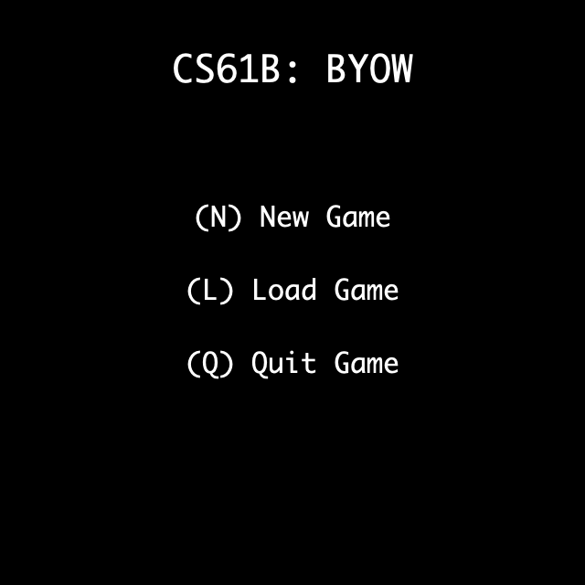
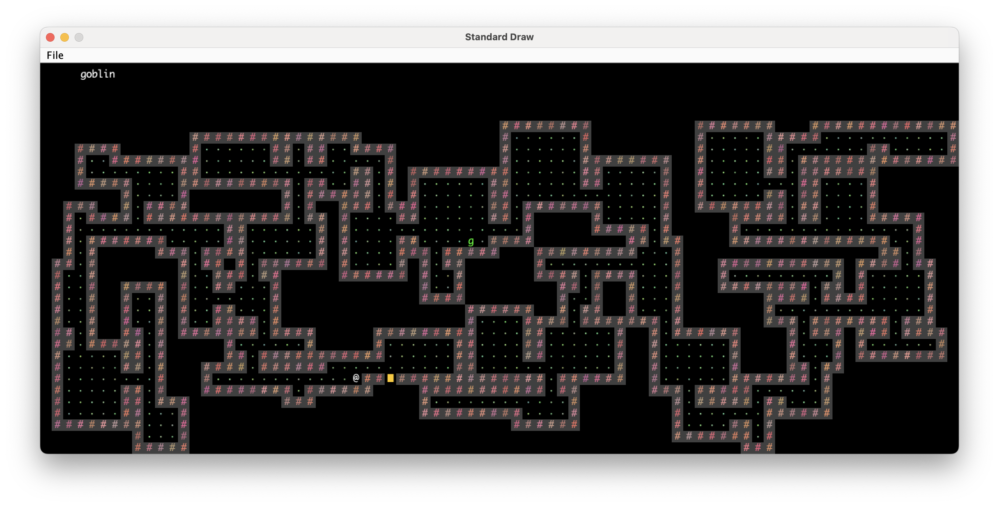

# 项目3B：交互功能


!!! info "MOLI：本次实验你将会学到什么"
    * 如何构建一个交互式游戏。
    * 深入理解游戏循环、确定性行为的重要性，并有机会发挥创意添加自定义功能。

## 任务4：主菜单
在 Project 3A 中，当用户运行 `Main.java` 中的 `main` 方法时，会弹出一个世界界面。现在我们将对此进行修改，为用户提供一个友好的菜单。

!!! tip TASK
    实现一个遵循以下详细要求的主菜单。

现在，当用户运行 `Main.main` 时，应该会看到一些主菜单文本显示出来，如下所示：


菜单应向用户提供以下选项：

* 在主菜单上按下 `N` 或 `n` 键，将创建一个新游戏。
* 在主菜单上按下 `L` 或 `l` 键，将从存档文件中加载一个已保存的游戏。
* 在主菜单上按下 `Q` 或 `q` 键，将关闭窗口。要关闭窗口，请运行 `System.exit(0)`。

用户应该能够通过键盘按下相应的键来选择一个选项。

请注意，按键不区分大小写。用户可以按下 `N` 或 `n`，其行为应相同（创建新游戏）。

除了上述要求之外，你可以根据自己的喜好自定义此菜单的外观。

如果用户按下 `N` 或 `n` 键，他们应该会看到一个新屏幕，允许他们输入一个种子，如下所示：


屏幕应显示用户当前已输入的值。换句话说，每当用户输入一个数字时，该数字应立即显示在屏幕上（紧随已输入的其他数字之后）。

用户完成种子输入后，应能按下 `S` 或 `s` 键来开始游戏。您应该显示一个由用户提供的种子生成的世界。

同样，除了上述要求之外，你可以根据自己的喜好自定义此菜单的外观。

以下是一些您无需支持的功能（除非您希望支持）。这些情况下的行为是未定义的，这意味着您的代码在这些情况下可以执行任何操作（例如崩溃、显示错误或任何其他行为）。
* 用户输入的种子超出 [0, 9223372036854775807] 范围时，行为是未定义的。这些是 Java 中 `long` 基本数据类型可表示的值。
* 用户在种子输入屏幕上输入不允许的字符（即 `0123456789sS` 之外的任何字符）时，行为是未定义的。例如，用户在种子输入屏幕上按下 `Backspace` 键，或输入逗号，或输入 `Q`，或输入其他字母字符时，行为是未定义的。

## 任务五：交互性
接下来，让我们赋予用户在世界中移动角色的能力。

!!! tip TASK
    实现一个遵循以下详细要求的角色。

当用户开始游戏时，您生成的世界还应该包含一个代表用户的单一角色方块。在下面的示例中，`@` 符号方块就是角色。您的角色可以看起来不同，只要有一个清晰的单一角色即可。


角色可以从任意一个地板方块开始。起始方块不需要随机选择，例如，它总是可以是最左下角的地板方块。然而，起始方块必须是确定性的，例如，两次输入相同的种子（seed）应该使角色出现在相同的方块上。有关确定性的更多细节，请参阅下面的章节。

用户应该能够按照以下方式在世界中移动角色：

* `W` 或 `w` 键应使角色向上移动一格。
* `A` 或 `a` 键应使角色向左移动一格。
* `S` 或 `s` 键应使角色向下移动一格。
* `D` 或 `d` 键应使角色向右移动一格。

如果用户尝试移动到墙壁上，角色应该停留在原地，并且程序不应崩溃。例如，在上面的示例世界中，按一次 W 或 w 键应该使角色向上移动，然后再次按 W 或 w 键则不应移动角色。

您不需要支持按住按键。如果按住按键导致未定义的行为，那也是可以接受的。

在项目的后期，您可以根据需要添加额外的游戏功能。例如，一个道具可以允许用户穿过墙壁或一次移动多格。或者，用户可以使用额外的 P 键来推动物品。只要您遵循此处概述的基本交互精神——即用户可以移动，但受限于墙壁——额外的功能都是可以接受的。

## 概述：游戏动画

要为您的游戏添加动画效果，您需要持续地重新渲染游戏状态的更新。这些更新将根据您所处的特定场景而有所不同。您可以将此过程概念化为“游戏循环”。您的世界移动场景可能具有以下游戏循环特征：
1. 初始化游戏窗口和世界状态。
2. 根据玩家的输入更新角色的移动。
3. 在游戏窗口中渲染更新后的游戏状态。
4. 重复步骤2和3，直到玩家退出。

请查看位于您的 Project 3 仓库 `demo` 文件夹中的 `GameLoopDemo.java`，以了解这可能是什么样子。注意：Lab 9 的任务 3A 涉及实现一个游戏循环，强烈建议在为您的 Project 3 解决游戏循环问题之前完成此任务。

通常，良好的编码实践是首先构建具有明确目的的小过程，然后使用这些基本过程来组合更复杂的方法。这将为您在开发中提供清晰的路径，并且更容易分解逻辑进行单元测试。

## 概述：确定性

您的游戏应该是**确定性的**。这意味着如果两个用户以完全相同的顺序按下完全相同的按键，他们的游戏结果状态应该完全相同。例如，2D 瓦片网格应该完全相同，您添加的任何其他功能（例如分数、生命条等）也应该完全相同。

回想一下，我们已经使用伪随机性来使新游戏过程具有确定性。如果两个用户输入相同的种子（seed），他们将得到完全相同的世界。

从现在开始，当您开始添加更多功能时，请确保您的游戏仍然是确定性的。您仍然可以使用伪随机性来帮助确保确定性。

## 关于实时游戏玩法的注意事项：
产生确定性行为最简单的方法是让您的游戏不依赖于实时。一些非实时行为的例子：
* 如果用户非常快或非常慢地按下相同的按键序列，结果行为应该完全相同。
* 如果您有倒计时器等功能，计时器应该通过移动次数来衡量（例如，用户每次移动时递减），而不是像秒数那样的实时。
* 如果您有敌人角色生成等功能，您可以每移动 5 次生成一个敌人，而不是像每 5 秒那样的实时。

如果您确实打算实现实时行为，那也没关系，只要任何人都可以通过以相同的顺序按下相同的按键轻松地产生确定性行为即可。例如，要求用户在 10 秒计时器内按下一个键是可以的并且可重现的，但是要求用户在 0.1 秒计时器内按 20 个键则太难可靠地重现。

## 任务6：HUD
添加一个平视显示器(Heads up Display,HUD)，提供可能对用户有用的额外信息。

!!! tip TASK
    实现符合以下详细要求的 HUD 功能。

最低限度，这应该包括描述鼠标指针当前所在瓦片的文本。理想情况下，当鼠标移动时，您的 HUD 不应闪烁。HUD 必须随着鼠标光标的移动而更新，即使用户只是移动鼠标而没有按下任何按键，也必须更新。

注意：Lab 9 的任务 3B 涉及添加 HUD，强烈建议在为您的 Project 3 添加 HUD 之前完成此任务。

作为最低限度的示例，下面的简单界面显示了一个瓦片网格和一个 HUD，该 HUD 显示了鼠标指针下方瓦片的描述（点击图片可查看更高分辨率）。在这里，鼠标光标（未显示）位于字母 g 上方，文本旨在告诉用户绿色的 g 代表一个哥布林。



如果您选择，您可以在您的 HUD 中包含更多功能。在下面由 2022 年秋季学生 [Shannon Jay 和 Angelique](https://www.youtube.com/watch?v=VZR-yU3t-_o) 提供的示例中，我们看到了一个更复杂的 HUD。与之前的示例一样，鼠标光标当前位于一个地板瓦片上方，因此 HUD 在右上角显示文本“floor”。然而，这个 HUD 还为用户提供了 5 颗心，代表角色生命，以及关于一个特殊按键的描述，该按键可以用来打开或关闭一盏灯。点击下方图片查看高分辨率。


## 任务7：保存和加载
设想用户正在玩你的游戏，但需要暂时离开一下。（也许他们需要去听一堂 CS61B 讲座？）让我们为用户提供一种保存游戏进度并在稍后加载游戏的方式。

!!! tip TASK
    实现保存和加载功能，该功能需遵循以下详细要求。

这里是保存和加载过程的[视频演示](https://youtu.be/Q8-FKMLYVwk)。

当用户处于“世界模式”（即查看2D世界，而不是主菜单）时，他们应该能够按下 `:q` 或 `:Q` 来立即保存游戏并退出程序。要退出程序，请运行 `System.exit(0)`。

当用户退出你的程序时，所有 Java 变量都将丢失。因此，你需要将用户的进度保存到一个文件中，例如 `save.txt`,而 `save.txt` 中包含什么内容由你决定，但它应该包含足够的信息，以便稍后能够完美地重建用户的游戏。

关于按键的一些注意事项：

* `:Q` 是两个独立按下的字符。用户首先只按下冒号，然后只按下 Q。
* 在“世界模式”下，`:Q` 或 `:q` 应该立即保存并退出，无需进一步的按键来完成。例如，退出前不要询问用户是否确定。
* 在“菜单模式”（即查看主菜单）下，单独按下 Q 应该退出程序，不保存任何内容。
* 在“世界模式”下，单独按下 Q 应该什么都不做，而按下 `:Q` 应该保存游戏并退出程序。
* 在“世界模式”下，按下冒号后跟任何其他字母，应该什么都不做。
如果用户在主菜单上按下 `L` 或 `l`，你应该从 `save.txt` 文件中加载最近保存的世界。我们不会测试在世界未曾保存过的情况下你的世界是否能加载。
加载的世界应该与用户退出游戏前的状态完全相同。例如，以下两种情况应该导致相同的世界：

* 用户输入 `N999SDDDWWW`（新游戏，种子 999，开始，向右移动 3 次，向上移动 3 次）。
* 用户输入 `N999SDDD:Q`（新游戏，种子 999，开始，向右移动 3 次，保存）。然后，用户重新启动程序并输入 `LWWW`（加载，向上移动 3 次）。
加载的世界应该完全相同，包括随机数生成器的状态！

以下是一些未定义行为的情况。请记住，未定义行为意味着你的代码可能会崩溃、显示错误或执行任何你想要的操作。我们不会测试这些情况。

* 如果没有之前的保存，并且用户在主菜单上按下 `L` 或 `l`，则行为未定义。
* 如果用户以其他方式退出程序（例如退出 IntelliJ 或拔掉电脑电源），则行为未定义。在这种情况下，你不需要保存任何内容。

## 任务8： 有野心的功能
现在你已经有了一个基本的游戏，在项目的最后一部分，你将有机会添加自己选择的创意功能！
```java
//这个方法是由gemini 2.5 写
public void someMethod() {
    // ...
}
```

!!! tip TASK
    请从下面的列表或你自己的选择中，至少实现一个主要功能和一个次要功能。你非常欢迎实现超出最低要求的功能，例如两个主要功能等。

预批准的功能列表，请参阅我们的[功能列表](https://sp25.datastructur.es/projects/proj3/ambition)。

!!! WARNING
    请注意，你的游戏应保留之前任务中的相同功能（例如主菜单、交互性、保存和加载）。

    换句话说，你应该在现有代码的基础上实现你的额外功能。

  