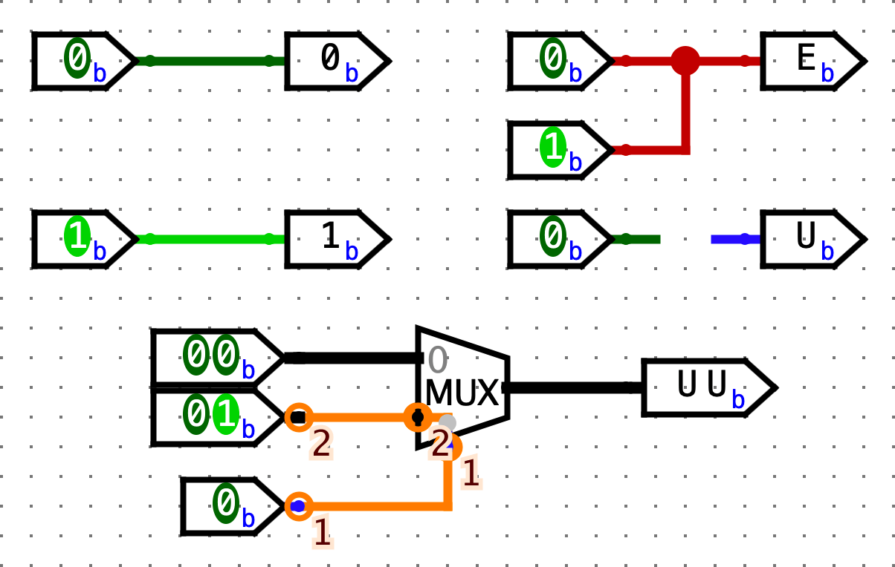
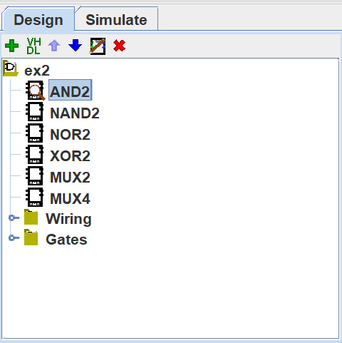
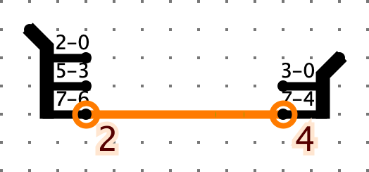
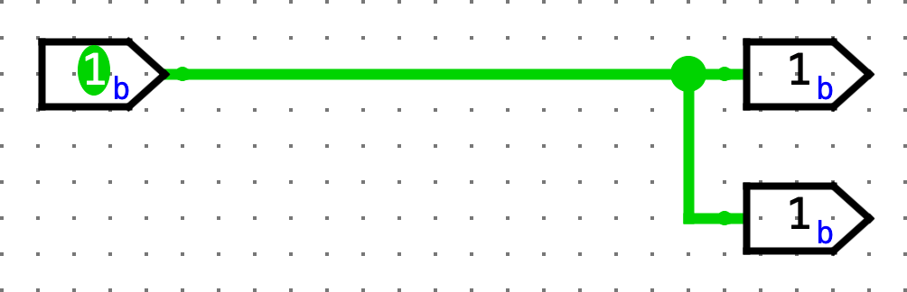
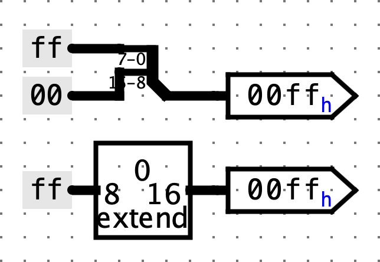

# Lab 5: Logisim 实验

本实验介绍了 Logisim —— 一种用于设计和仿真数字逻辑电路的教育工具。它是 Project 3 的重要准备内容。

[实验幻灯片](https://web.archive.org/web/20241212225902/https://docs.google.com/presentation/d/1n4RenK_rbQOq09pylq9cGq53FeKyaIEZdmQrG5EqJmo/view)

## 配置

??? note "你必须在本地机器上完成本实验。如果需要重新设置你的本地机器，请查看 [Lab 0](Lab_0.md)。"

在本地机器的 `labs` 目录中，拉取你可能在之前实验中所做的更改：

```bash
git pull origin main
```

仍然在 `labs` 目录下，拉取本实验的文件：

```bash
git pull starter main
```

如果你遇到任何 `git` 错误，请查看[常见错误页面](https://cs61c.org/fa24/resources/common-errors/)。

在 `labs` 目录中，运行以下命令来下载最新版本的 Logisim：

```bash
bash tools/download_tools.sh
```

本实验中的所有操作都将在 **Logisim Evolution** 中完成。

开始之前的一些重要提醒：

- Logisim 是一个 GUI 程序，因此无法在无界面环境中（如 WSL、SSH 等）轻松使用。请在具有 GUI 的本地环境中运行（需 Java 9+ 和 Python 3.6+）。macOS 或 Linux 系统通常已准备就绪。如果你使用的是 Windows，请使用支持 GUI 的 `Git Bash`。
- 请使用我们分发的 Logisim 版本，它与网上其他版本不同（包含修复和课程专用内容）。
- 不要移动由助教提供的输入/输出引脚；如果引脚位置发生改变，你的电路将无法正确测试。如果你的电路未通过测试但你认为它是正确的，请检查你的电路是否适配 `tests/ex#_test.circ` 中的测试框架。
- Logisim 不会自动保存工作内容。在操作过程中请记得经常保存（并提交）你的工作！

## 可能的安装错误
    
在 Windows 10 上运行 Python 时遇到 “Permission Denied” 错误：

- 在 Windows 搜索栏中搜索“app execution alias”，点击“管理应用执行别名”
- 禁用 Python 的商店版本。
??? note "截图"
    
- `java.lang.UnsupportedClassVersionError`：

```
Exception in thread "main" java.lang.UnsupportedClassVersionError: com/cburch/logisim/Main has been compiled by a more recent version of the Java Runtime (class file version 60.0), this version of the Java Runtime only recognizes class file versions up to 52.0
```

你需要将 Java 更新至 16+。请按照 [Lab 0 的设置说明](Lab_0.md) 进行设置。

## Exercise 1: 简介

和 Venus 类似，你可以在 `lab05` 文件夹中运行如下命令来打开 Logisim：

```bash
java -jar ../tools/logisim-evolution.jar  # 若处于其他目录，请使用对应的相对路径
```

稍等片刻后，应出现一个略显古老的窗口。如果没有，请检查终端中是否有报错信息。

我们将从创建一个非常简单的电路开始，以熟悉如何放置门电路和连线。在开始之前，注意一个 **非常有用的功能：缩放功能！** 它位于左下角，在接下来的几周中将极大提高你的效率。缩放 缩放 缩放~

 


### 创建电路

1.  先点击 `AND` 门按钮。这样会让一个 `AND` 门的阴影跟随你的光标。然后在主图窗口内点击一次，放置一个 `AND` 门。

2.  点击 `Input Pin` 按钮。现在，在你的 `AND` 门左侧放置两个输入引脚。

3.  点击 `Output Pin` 按钮。然后在 `AND` 门右侧放置一个输出引脚。此时你的电路图应类似于下图：
 


4.  点击 `Select tool` 按钮。点击并拖动连接两个输入引脚到 `AND` 门左边的两个输入端。你只能画垂直或水平线。先画水平线，松开鼠标，再从该线末端点击并拖动画垂直线。重复此方法连接 `AND` 门右侧输出到输出引脚。完成后电路应类似于：
 

5.  最后，`Poke` 工具可以点击引脚切换其值。如果点击连线，会显示该线的值。选中 `Poke` 工具，点击输入引脚，观察输出是否符合 `AND` 门逻辑。试着点击线，看当前线上的值。这在后续构建复杂电路时非常有用。

6. 现在删除连线，尝试将每个输入引脚接到 `AND` 门的 **另一个** 引脚上，让连线交叉。示例如下：

  

   如果你画线时，拖动 **经过** 另一条线但不停，线不会连接。如果拖动停止在另一条线上，会创建一个节点（大圆），两线连接。设计电路时注意这些节点。

### 导线颜色与数值对照表

请查看下面列表，尝试自己画出各种颜色的线。

  

| 颜色         | 含义                                                  |
| ------------ | ----------------------------------------------------- |
| 深绿色       | 1 位线的值是 0                                        |
| 亮绿色       | 1 位线的值是 1                                        |
| 黑色         | 多位线（许多组件的位宽可以在左下角属性中配置）       |
| 红色（值显示 `EEEE`） | 线上有多个值（比如输入的 0 和 1），注意节点处有大圆圈 |
| 蓝色（值显示 `UUUU`） | 线处于悬空状态（无确定值）                           |
| 橙色         | 线连接了位宽不同的组件，例如 1 位输入接 2 位输出       |


---

## 练习2： 子电路

就像 C 语言中可以有辅助函数，电路图也可以包含子电路。本部分将创建几个子电路来演示它们的用法。

> 注意：Logisim Evolution 通常不允许带空格或符号的名字，或以数字开头，或与关键词冲突（如 `NAND`）。

1. 打开练习 2 电路图（`File -> Open -> lab05/ex2.circ`）。

2. 双击左侧电路选择器中的 `AND2`，打开示例子电路。
   
   注意名字结尾的 `2`，因为已有组件名为 `AND`，所以不能直接命名为 `AND`。示例电路有两个 1 位   输入引脚 `A` 和 `B`，结果 `A & B` 输出到 `RESULT` 引脚。看起来和你之前做的电路很像。


3. 打开 `NAND2` 子电路，开始制作自己的电路！请 **不要** 使用 Gates 库中的内置 `NAND` 门（只用 `AND`、`OR` 和 `NOT` 门，位于工具栏上方或左侧库里）。完成后，同理完成 `NOR2`、`XOR2`、`MUX2`（2:1 多路选择器）和 `MUX4`（4:1 多路选择器）。注意 `NAND`、`NOR`、`XOR` 和 `MUX` 已内置于 Logisim，本练习目的是帮助你理解子电路的使用。  
   
    1. 请不要更改子电路名字或新建子电路，否则可能无法正常工作。  
    2. 除了 `AND`、`OR`、`NOT` 外，不要使用其他内置门。完成一个子电路后，你可以用它构建其它子电路。方法是单击电路选择器中的子电路，像使用门一样放置。  
    3. 编写真值表会帮助你完成电路，也可以复习相关课程幻灯片。  
    4. 你可以参考这份[组合逻辑块讲义](https://inst.eecs.berkeley.edu/~cs61c/sp21/resources-pdfs/blocks.pdf)实现 MUX。  
    5. 对于 `4-to-1 MUX`，`SEL0` 和 `SEL1` 分别对应 2 位选择器的第 0 和第 1 位，不要弄反！


## 测试

打开终端并进入 `lab05` 文件夹。我们为每个练习提供了测试，你可以使用 `python3 test.py` 来运行这些测试。对于每个测试，你的电路会在一个测试框架电路中运行（例如：`tests/ex2-test.circ`），并将其输出与该测试的参考输出（`tests/out/ex2-test.ref`）进行比较。在输出文件中，每一列对应主电路的一个输入或输出引脚，每一行表示一组输入以及电路产生的相应输出。如果你的电路输出（`tests/out/ex2-test.out`）不同，你可以将其与参考输出文件进行比对；`diff` 命令可能会有所帮助。

-  请注意，输出文件是通过在每个数值之间添加制表符（`\t`）进行“格式化”的，显示为每个制表符宽度为 8 个空格时效果最佳。数值或列标题如果超过 8 个字符，可能会导致对齐错位，所以要注意这些情况！

- 不要修改参考输出文件，否则本地测试可能会产生错误的结果。

- 本次实验你不需要修改测试框架电路（test harness circuits）。不过，查看一下这些电路可能会有帮助；我们在下一个实验和项目 3 中会做类似的事情！

##检查点

此时，请确保你已经熟悉 Logisim 环境，能够创建子电路，并能在其他电路中复用这些子电路。

---

##练习3：存储状态

练习3：存储状态

让我们实现一个电路，用来重复递增一个数值。这个电路和你之前为实验构建的电路不同之处在于，它会将该数值作为状态存储在寄存器中。

1. 打开练习3的电路图（`File -> Open -> lab05/ex3.circ`），进入空的 `AddMachine` 电路。

    1. 记得经常保存，避免移动或修改提供的输入/输出引脚。
    
2. 从算术库中选择 `Adder` 子电路（左侧的电路选择器），并将加法器放入你的 `AddMachine` 子电路中。
 

3. 从存储库中选择 `Register` 寄存器，并放入一个寄存器到你的子电路中。
下面的图片展示了寄存器的组成部分。
 
 
4. 将 `clk` 输入引脚接到寄存器的时钟引脚上。通常，让电路中的所有组件使用相同的时钟比较好，这样可以保证同步。在这里，测试夹具为其寄存器使用了一个时钟，因此它通过 `clk` 引脚为你电路中的寄存器传入了该时钟信号。将来如果你设计的电路没有现成的时钟信号，可以用`Wiring`库中的新`Clocking`组件自己创建。

5. 将加法器的输出连接到寄存器的输入，将寄存器的输出连接到加法器的输入。

    1. 连接组件时你可能会遇到 `Incompatible widths`（宽度不兼容）错误。这意味着你的线尝试连接两个不同位宽的引脚。如果用选择工具（工具栏上的鼠标指针图标）点击组件，会在窗口左下角看到 `Data Bits` 属性，这个值决定了组件输入和输出的位宽。确保加法器和寄存器的位宽都设置为8，这样 `Incompatible widths` 错误就会消失。

6. 用一个值为`1`的8位常量连接到加法器的第二个输入。你可以在`Wiring`库中找到 `Constant` 电路元件。将它的值改为`1`，只需在 `Value` 属性中输入`1`并按回车。你应该会看到值变成了 `0x1`（Logisim 会自动将你输入的十进制数转换为十六进制）。

7. 连接两个输出引脚到你的电路，这样你可以监视加法器和寄存器的输出。加法器的输出应该连接到 `ADD_OUT`，寄存器的输出连接到 `REG_OUT`。最终你的电路应类似于下图：
 

8. 现在打开本练习的测试电路（`lab05/tests/ex3-test.circ`）。在左上角，有一个小电路（类似你的 `AddMachine`），用于跟踪当前周期。下面你会看到你的 `AddMachine` 电路已连接到时钟和一些输出引脚。

9. 通过 `Simulate -> Tick Half Cycle`（命令/控制 + T）执行一次时钟周期。你会看到 `AddMachine` 的输出增加了！同时，时钟指示灯变成亮绿色。
这对于项目3非常重要，请确保你知道如何点击时钟周期和操控线网。
 
如果再执行一次 `Tick Half Cycle`，你会看到时钟变回暗绿色，但数字不变。这是因为寄存器默认是上升沿触发（即从低电平变为高电平时触发）。
如果你不想看半个周期的变化，也可以用 `Simulate -> Tick Full Cycle`（F2）。
 
 
10. 手动点击时钟周期会很累，好消息是：Logisim 可以帮你自动点击！开启 `Simulate -> Ticks Enabled/Enable Clock Ticks`（`Command`/`Control` + `K`）。你的电路就会自动计数了！  
如果想让电路跑得更快，可以在 `Simulate -> Tick Frequency` 调整频率。要停止，重新点击 `Ticks Enabled/Enable Clock Ticks`（`Command`/`Control` + `K`）。想重置电路，点击 `Simulate -> Reset Simulation`（`Command`/`Control` + `R`）。

11. 完成后，尝试运行提供的测试（用 [`python3 test.py`](https://web.archive.org/web/20241212225902/https://cs61c.org/fa24/labs/lab05/#testing)）。


##检查点

此时，请确保你能够熟练设计和仿真使用组合逻辑与状态元件（寄存器）混合的简单数字逻辑电路，且能在 `Logisim` 环境中操作。

---

## 高级 Logisim 功能  
这里介绍三个 Logisim 功能，它们不仅能帮你节省大量时间，还能让你的电路看起来更整洁。

## 分割器（Splitters）  
分割器允许你将一个多位值拆分成更小的部分，或者（虽然名字是分割器）将一个或多个位的多个值合并成一个单一的值。  
例如，这里我们将4位二进制数 `1100` 分成 `11` 和 `00`，交换它们的位置，再加上一个 `0`，组合成最终的5位数 `00110`：
 

点击分割器（用`Select`工具）可在侧边栏（左下角）看到其属性。你可以配置分割器的臂数以及每个臂上的位数。上图中左右分割器的属性如下：

 

注意有一个属性叫 `Facing`，可以用它旋转分割器。在上面的例子中，右边的分割器朝西（`West`），左边的朝东（`East`）。

如果你看到橙色的错误线，这说明输入和输出的位宽不匹配。确保连接两组件的线时，正确设置了该组件的位宽。
 

## 隧道（Tunnels）  
隧道允许你画一条“隐形线”将两个点连接起来。隧道通过区分大小写的标签分组，用于连接线，如下图：
 

它的实际效果是：
 
 
连接线时要注意哪些线通过隧道连到其他线，例如这个情况：
 
 
它的实际效果是：
 
 
强烈推荐你用隧道，因为它们让你的电路看起来更清爽（线更少更整洁），调试起来也更方便。

## 扩展器（Extenders）  
改变线的位宽时，使用位扩展器能让电路更清晰。  
例如，下面是将一个8位线零扩展到16位的实现：

 

和分割器相比，扩展器一眼看上去更直观，尤其在复杂电路中更有帮助。
另外，扩展器也能执行丢弃位的操作，虽然名字叫扩展器：
 

虽然分割器更简洁，但读起来稍微难一点。

## 练习4：右旋（Rotate Right）  
利用你对分割器和多路复用器的知识，你准备实现一个不简单的组合逻辑模块：`RotRight`，即“右旋”。`RotRight` 将输入 `INPUT0` 的位模式向右旋转 `AMOUNT` 位。  
举例来说，如果 `INPUT0` 是 `0b1000000000000101`，`AMOUNT` 是 `0b0011`（十进制3），输出应为 `0b1011000000000000`。注意最右边的3位从右端旋出后回到左端。这个操作用位运算表示是 `R = A >> B | A << (16 - B)`。

实现一个名为 `RotRight` 的子电路，输入如下：  
- `INPUT0`（16位），需要旋转的16位输入  
- `AMOUNT`（4位），旋转位数（为什么是4位？）

你可以在 `ex4.circ` 找到起始子电路。记得常保存，避免移动或修改提供的输入/输出引脚。

输出应是 `INPUT0` 按 `AMOUNT` 指定的位数右旋后的结果。禁止使用 Logisim 自带的移位器，但可以使用所有其他组合逻辑（多路复用器、常量、门等）。Logisim 内置的多路复用器（Plexers 菜单下）可能特别有用。你的实现不应包含时钟或时钟元件（如寄存器）。

- 我们给出了 `rot1`、`rot2`、`rot4`、`rot8` 的骨架，这些分别实现右旋1、2、4、8位。你应实现这些子电路，并在 `RotRight` 实现中使用它们。

??? hint "提示"
    您可以使用提供的子电路对 0-15 之间的任意数字进行循环移位。例如，要循环移位 9，您可以先循环移位 8，然后再循环移位 1。
    
完成后，尝试运行提供的测试。

