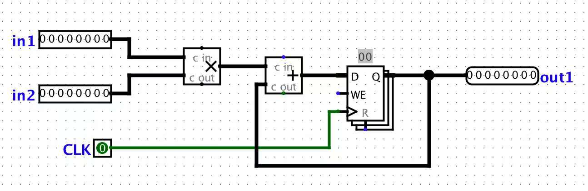
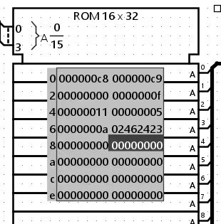
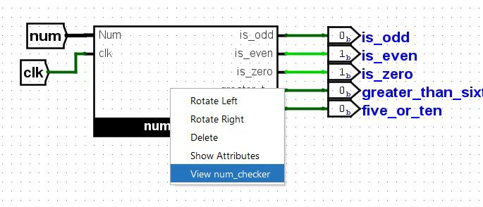
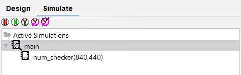
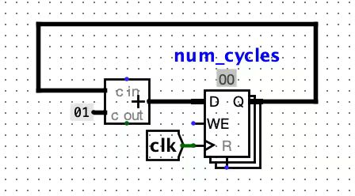
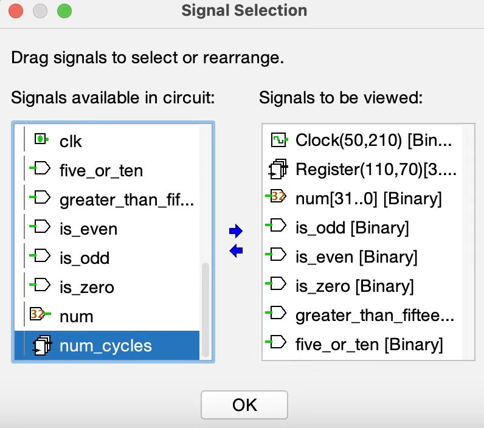
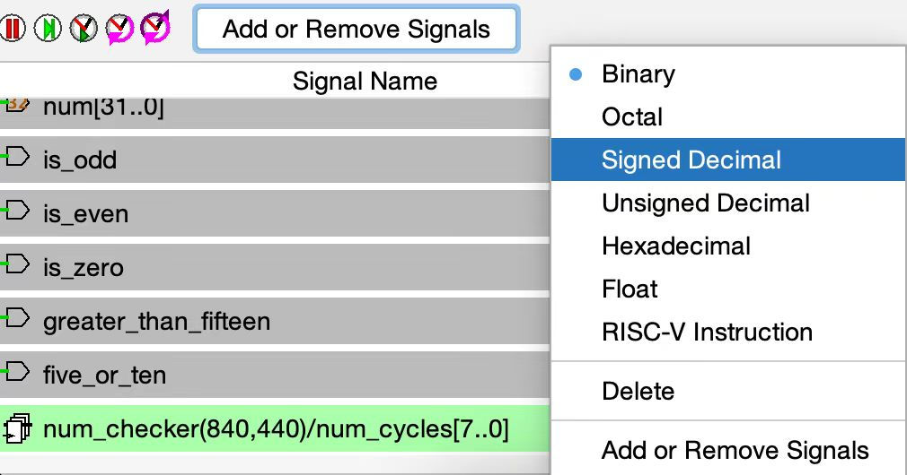

# 实验 6：CPU 和流水线

## 环境设置

与实验 5 类似，本实验的所有内容将使用数字逻辑仿真程序 Logisim Evolution 完成。

开始前的一些重要警告：

* Logisim 是一个 GUI 程序，因此不容易在没有图形界面的环境（如 WSL、SSH 等）中使用。我们建议在有 GUI、安装 Java 9+ 和 Python 3.6+ 的本地环境中运行它。如果你的本地系统是 macOS 或 Linux，可能已经具备这些条件。如果你在 Windows 上，请使用在 Windows 上运行的带有 GUI 的 Git Bash。
* 请使用和我们版本的 Logisim ，因为它与网上的其他版本不同（错误修复和课程特定的内容）。
* 不要移动实验组提供的输入/输出引脚；如果引脚移动，你的电路无法被正确测试。如果你的电路未通过测试而你确信它是正确的，请检查你的电路是否适配到相应的测试框架电路 `tests/ex#-test.circ` 中。
* Logisim不会自动保存你的工作。做实验时请记得经常保存（并提交）！

## 练习 1：构建立即数

正如我们在课堂中所见，RISC-V 中有五种类型的立即数：I-type、S-type、B-type、U-type 和 J-type。在本练习中，你将实现 S-type 立即数生成器。`ex1.circ` 将接收一个 32 位 RISC-V 存储指令作为输入。它的输出是一个经过符号扩展的 32 位立即数。构造立即数需要使用分线器。你可以在实验 5 的“高级 Logisim 功能（Advanced Logisim Features）”部分找到关于分线器如何工作的摘要。

这个练习对项目 3 会有帮助！

1. 打开 `ex1.circ`。此电路接收一个 32 位 RISC-V 存储指令。
2. 修改该电路，使其输出一个经过符号扩展的 32 位立即数。你可以假设输入的指令始终是一个存储指令。

### 测试

1. 打开一个本地终端会话并切换到你的 lab06 文件夹。
2. 使用 python3 test.py 运行提供的测试。
    * 你的练习 1 电路在测试框架（`tests/ex1-test.circ`）中运行。
    * 你的输出位于 `tests/out/ex1-test.out` 
    * 参考输出位于 `tests/out/ex1-test.ref` 
    * 在输出文件中，每列对应于主电路上的一个输入/输出引脚，每行显示一组输入以及电路产生的相应输出。
    * 如果你电路的输出不同，你可以对照参考输出文件进行检查；diff 命令可能会帮到你。

## 练习 2：构建 BrUn 控制信号

BrUn 控制信号用于告诉分支比较器分支比较是在有符号数还是无符号数上进行的。下表总结了 BrUn 的预期值。

|  指令类型     |  BrUn  |  备注  |
| ---------     | -----  | ------ |
|无符号分支比较 |1       |-       |
|有符号分支比较 |0       |-       |
|beq 或 bne     |不关心  |当确定数字是否相等时不需要数字的符号。|
|非分支指令     |不关心  |对于非分支指令，我们不使用分支比较器的输出。|

如果值列为“不关心（don't care）”，这意味着你可以将 BrUn 设置为 0 或 1。

请记住，两个输入要么都是有符号的，要么都是无符号的。你不能出现一个数字是有符号的而另一个是无符号的情况。我们的硬件不支持无符号数与有符号数之间的比较。

我们提供以下提示来帮助你实现：

* 指令的哪个字段标识了分支的类型？
* 操作码字段（opcode field）重要吗？

根据你的实现，常量和比较器对这个练习很有帮助。常量可在“线（Wiring）”库中找到。你可以在左下窗口的“属性（Properties）”部分选择常量的值。你也可以在“属性”部分更改用于表示常量的位数。
比较器有两个输入，用于确定第一个输入是否小于、等于或大于第二个输入。它们可在“算术（Arithmetic）”库中找到。你可以在左下窗口的“属性”部分选择输入的大小以及比较是无符号的还是二进制补码的。

这个练习会项目 3 会有帮助！

1. 打开 ex2.circ。这个电路接收一个 32 位 的RISC-V 指令作为输入，并输出 BrUn 控制信号。
2. 修改该电路，使其正确地生成 BrUn 的值。注意：输入的指令可能是一条分支指令，也可能不是。

### 测试
参考练习 1 的测试部分，除了当前输出文件的前缀是 ex2-test 而不是 ex1-test。

## 练习 3：低效无处不在

在本练习中，我们可以假设寄存器初值值为零。我们将使用实验文件 `ex3.circ`，它应该包含一个名为 `non_pipelined` 的子电路，它的结构大概像下面这样：

该电路接收两个输入，将它们相乘，然后将结果与当前状态值相加。对于此电路，设加法器的传播延迟为 45 ns，乘法器的传播延迟为 60 ns。寄存器具有 10 ns 的 CLK-to-Q 延迟（时钟触发时Q响应变化所需的时间）、10ns 的建立时间和 5ns 的保持时间。假设两个输入均从寄存器接收数据（因此输入在时钟上升沿之后 CLK-to-Q 时间到达）。

本练习要求你将答案写在 `ex3_answers.txt` 中。

* 问题 1：这个电路的关键路径长度是多少**纳秒**？答案应为一个不带单位的整数。

## 练习 4：流水线化

我们希望提高此电路的性能并让它能以更高的时钟频率运行。为此，我们希望在我们的流水线中有两个阶段：乘法阶段和加法阶段，并将此作为流水线的顺序。

为了对电路流水线化，我们需要一个寄存器来保存计算过程中的中间值以在流水线的阶段之间传递。这是流水线化普遍要做的事。

为了检查你的流水线化是否仍然能产生正确输出，我们认为只有当电路的输出序列与非流水线版本的输出序列一致时，我们才认为电路输出“正确”，但现在的电路将具有一个前导零（leading zero）。出现这个前导零是因为流水线的第二阶段（乘法阶段）在第一个时钟周期是“空”的。

要查看电路的输入和每个周期对应的输出，请查看 `tests/out/ex4-test.ref`。周期 0 的输出是 `00000000`，因为流水线中还没有任何内容流过。周期 0 实际上只是打印电路启动时的状态。周期 1 的输出是 `00000000` ，因为在第一个周期流水线的第二个阶段是“空”的。

我们讨论过，如果一条指令依赖于前一条指令的输出，我们需要给流水线插入一个或几个“气泡”，或者包含转发逻辑（forwarding logic）来确保第一条指令的输出准备好作为第二条指令的输入。提醒一下，气泡是我们故意延迟流水线中的指令以等待上一条指令的输出。

* 对于这个特定的电路，为什么不需要这种“气泡”？

本练习要求你将答案写在 `ex4_answers.txt` 中。题号可能与步骤编号不同，请仔细看清题目！

1. 打开 ex4.circ，对在 ex3.circ 中找到的电路进行流水线化。
    * 问题 1：此流水线电路的关键路径长度是多少纳秒？答案应为不带单位的整数。
    * 问题 2：此流水线电路的最大时钟频率是多少兆赫（MHz）？答案应为不带单位的小数。

### 测试
参考练习 1 的测试部分，除了当前输出文件的前缀是 `ex4-test` 而不是 `ex1-test`。

## 练习 5：调试电路（Debugging Circuits）

让我们看一个有问题的电路的实现：`num_checker`。给定一个 32 位数，该电路会告诉我们它是否是奇数、偶数、零、大于十五，等于五或十。这个电路可能没什么意思，但其测试电路的结构将和项目中的测试电路非常相似。

本练习要求你将答案写在 `ex5_answers.txt` 中。该文本文件仅前两个问题有编号，因此在回答问题时请添加编号（例如 3., 4., 等等）。题号可能与步骤编号不同，请仔细看清题目！

1. 首先熟悉一下项目的测试框架。打开练习 5 的测试电路（`File` -> `Open` -> `lab06/tests/ex5-test.circ`）。
    * 项目的测试框架使用 ROM 来存储将被输入到 CPU 的 RISC-V 指令。对于此电路，带有十六进制数字的电路模块就是我们的 ROM，它存储了将依次输入到 `ex5` 电路中的数。
    * 指定一个索引地址，ROM 会输出该索引下的 32 位整数。在这种情况下，我们会依次读取 ROM 中存储的每个数字。

2. 右键单击 `num_checker` 并点击“View num_checker”，这会从测试框架导航到我们的 `num_checker` 电路。

    * 或者，“Simulate”标签页可以很容易地在电路之间切换。  

3. 在我们开始调试之前，我们应该做两件事：
    1. 在 `num_checker` 中构建一个小器件。记得将此器件的寄存器标记为 `num_cycles`。该器件像一个计数器，允许我们通过探测寄存器的输出来检查当前的时间。该器件可以放置在 `num_checker` 电路中的任何独立位置。推荐在项目调试时构建此器件以便于调试。
        * 为了编辑 `num_checker`，你必须打开其对应的电路文件 `ex5.circ`。你不能通过测试电路来编辑它。编辑后，重新打开 `ex5_test.circ` 以使更改生效。  

    2. 在 Logisim 中打开波形查看器 Waveform Viewer：（`Simulate` -> `Timing Diagram`）。窗口弹出后，点击 `Timing Diagram` 查看波形。如果你的窗口太小，请将其拖放到屏幕一侧，这样它起来会像下面的窗口。

        * 点击 `Add or Remove Signals` 按钮，使用中间的箭头移除视图中的 halt 和 CYCLE 信号。同时添加 `num_cycles` 信号到视图中。你可以向下滚动 `signals available in the circuit` 并点击 `num_checker` 的下拉菜单找到 `num_cycles` 信号。

        * 点击 `Ok` 后，就可以在波形查看器中看到添加的 `num_cycles` 信号。确保展开 `Signal Name`列以便所有文本可见。然后，右键单击 `num_cycles` 将其类型更改为 `Signed Decimal` （有符号十进制）。对 `num` 信号也执行相同操作。

        * 波形查看器允许我们同时看一组信号以及这些信号在每周期中的所对应的值。推荐在项目调试时使用波形查看器。
4. 让我们观察一些输出并使用波形查看器来定位错误！
    * 问题 1：在时钟开始之前，`bit_zero` 的值是多少？答案应该是一个十进制数。（提示：你可以在 num_checker 电路内部找到 bit_zero。）
    * 问题 2: 在时钟开始之前，`is_odd` 的值是多少？答案应该是一个十进制数。
5. 触发一个完整的时钟周期。电路现在时间步数上应该为 1（你在第 3.1 构建的器件也应反映这一点）。
    * 问题 3：`bit_zero` 的值是多少？答案应该是一个十进制数
    * 问题 4： `is_odd` 的输出是多少？答案应该是一个十进制数。
6. 再触发两个完整的时钟周期。
    * 问题 5：使用波形查看器，`num` 的值是多少？答案应该是一个整数。
    * 问题 6：使用波形查看器，输出引脚 `greater_than_fifteen` 的值是多少？答案应该是一个十进制数。
7. 再触发一个完整的时钟周期。
    * 问题 7：使用波形查看器，`num` 的值（以十进制）是多少？答案应为整数。
    * 问题 8：使用波形查看器，输出引脚 `greater_than_fifteen` 的值是多少？答案应为一个十进制数字。
8. 再触发一个完整的时钟周期。
    * 问题 9：电路现在处于哪个时间步数？答案应为整数。
    * 问题 10：`bits_five` 的值（以二进制）是多少？答案应为带有 0b 前缀的 3 位二进制数。
    * 问题 11：输出引脚 `five_or_ten` 的值是多少？答案应为一个十进制数字。
9. 现在我们已经熟悉了电路的行为，我们来运行测试吧。（使用 python3 test.py）。
10. 查看输出，打开 `ex5-test.out`（电路输出）和 ex5-test.ref（预期输出）。两个文件都位于 `tests/out` 文件夹中。应该有几个不同的值。
11. 利用你从仿真的电路中获得的信息，修复 `num_checker` 电路使其通过测试。你可以多次运行仿真器！
    * 注意： 所有的仿真应在你的 `ex5_test.circ` Logisim 窗口中进行。记得导航回 `num_checker` 电路块内部以观察你的输出。不要在你的 `num_checker` 窗口中仿真（时钟和输入在文件之间不会同步）。

