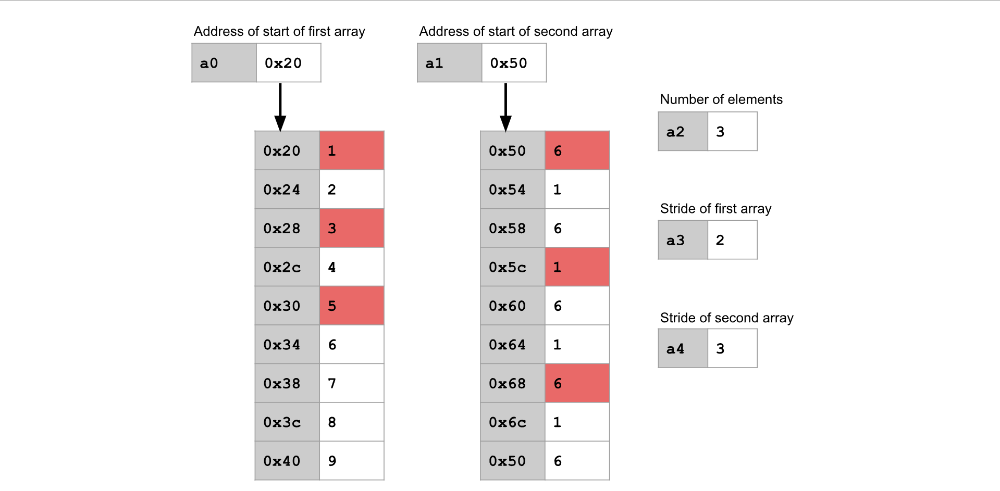

# 项目 2: CS61Classify

在这个项目中，你将编写 RISC-V 汇编代码，使用一个简单的机器学习算法对手写数字进行分类。

本项目的目标是帮助你熟悉 RISC-V 架构，特别调用约定（Calling Convention）、函数调用、使用堆内存、文件交互、编写测试代码。

## 调试视频

这个[视频集](https://www.youtube.com/playlist?list=PLnvUoC1Ghb7xbUcAM923j41yjTNxRbMOA)展示了如何调试内存还有调用约定的问题！请确认你已观看了这些视频。

## 设置

>你必须在你的本地机器上完成本项目。如果你忘了如何在你的本地机器上设置，请看 [Lab 0](../Labs/Lab_0.md) 。

>**项目 2 的相关问题在[常见问题](https://cs61c.org/fa24/resources/common-errors/)页面的下方列出**。<br>

### 设置： Git

1. 在你的 **本地机器** 上 **克隆** 该代码仓库（本项目完全不需要使用 Hive 服务器）。Windows 用户应使用 Git Bash 来进行克隆操作。
```bash
git clone git@github.com:61c-student/fa24-proj2-USERNAME.git 61c-proj2
```
（使用你 GitHub 仓库的名字替换掉 <code>fa24-proj2-USERNAME</code> ）
2. ​ **进入**​ 你的仓库：
```bash
cd 61c-proj2
```
3. 把初始仓库​ **添加**​ 成远程：
```bash
git remote add starter https://github.com/61c-teach/fa24-proj2-starter.git
```
4. 从初始仓库中​ **拉取**​ ：
```bash
git pull starter main
```

如果你遇到 git 相关问题，看[这里](https://cs61c.org/fa24/resources/common-errors/)

### 设置： Java 和 Python
确认你已经遵循了 [Lab 0 练习 2 ](../Labs/Lab_0.md)。

### 设置：Venus
我们使用 Venus web interface 来调试。步骤和[Lab 3](../Labs/Lab_3.md) Venus 设置相似。

1. 在 <code>61c-proj2</code> 目录下输入 <code> bash test.sh download_tools </code>下载 Venus 。（你只用运行一次。）
2. 在你的​ **本地机器**​ （不是 hive ），​ **进入**​  <code>61c-proj2</code> 目录并​ **输入**​ 以下命令。 Windows 用户需要在 WSL 外输入（推荐 Git Bash ）。
```bash
java -jar tools/venus.jar . -dm
```
3. 在​ **浏览器**​ 中打开 [Venus web](https://venus.cs61c.org) （推荐 Chrome 或 Firefox ）。在 ​ **Venus web 终端**​ ，​ **输入**​  <code>mount local vmfs</code> 。在你的浏览器你会看到这个提示： <code>Key has been shown in the Venus mount server! Please copy and paste it into here</code> 。你应该能在你的本地终端输出的最近一行看到一个 key （由英文字母和数字组成的字符串 ）；将这个 key **复制粘贴** 到对话中。
4. 现在你本地机器的项目文件已上传到了 Venus web interface 。在 ​ **Venus**​  中，你可以​ **打开**​  Files 选项卡或者在 Venus 终端​ **输入**​  <code>ls vmfs</code> 来浏览你浏览器中的所有文件。

如果你能在 Venus 中看到你的文件，你可以跳过以下部分。如果以上步骤运行失败，你可以遵循以下步骤来手动上传文件。
<details>
    <summary>点击展开</summary>

    1. 在你的本地机器或 hive ，将 src ， tests ，还有 test-src 目录 zip 压缩。<br><br>

    2. 点击这个<a href="https://venus.cs61c.org/">链接</a>，在 Venus 终端输入 <code>upload</code> 。<br><br>

    3. 你会看到一个 file upload 提示。将你在第一步中创建的压缩 zip 文件上传。<br><br>
    
    现在你可以在 Venus 中编写和调试你的文件了。<br><br>
    
    你可以在 Venus 终端输入 <code>zip zipname file1 file2 file3</code> 来下载你编写的文件。将 <code>zipname</code> 替换成你想要为下载的 zip 文件命名的名字。将 <code>file1 file2 file3</code> 替换成一组你想要下载的文件或者目录（可以是任意个文件或目录）。
</details>

## 还原初始文件
如果需要还原初始文件，请查看[常见错误](https://cs61c.org/fa24/resources/common-errors/)。

## Part A
!!! info "注意"
    实验 3 是项目 2 的必修课。建议观看第 7-10 讲，参加讨论 3 ，完成作业 3 。

开始之前，请从 starter 拉取并更新 Venus 。
```bash
git pull starter main
bash test.sh download_tools
```

### 任务 1 ：绝对值（教程）
为了让你熟悉这个项目的流程，我们会为这个任务提供教程。

#### 运行测试用例
这个项目中的测试用例都是用 Python 编写并且编译为 RISC-V 汇编。

提供的测试用例的 python 源码在 <code>unittests.py</code> 。请​ **浏览**​ ​  <code>unittests.py</code> 的内容。虽然任务 1-4 的测试用例已经给你了，但是熟悉单元测试框架并理解测试用例是如何运行的会对你有很大帮助。

如果要运行这些测试用例，先在你的​ **本地机器**​ 上，在 <code>61c-proj2</code> 目录中​ **输入**​  <code>bash test.sh</code> 。这会给你列出你能用来运行测试的命令。具体来说， <code>bash test.sh part_a</code> 编译并运行任务 1-5 中所有的测试用例。你也可以提供一个具体的函数名称来编译并运行所有和这个函数相关的测试用例。

在这个任务中，因为我们要实现 <code>abs</code> 函数，所以你需要在你的​ **本地机器**​ **输入**​ <code>bash test.sh test_abs</code> 。这会创建一个包含了被编译成 RISC-V 的 Python 测试用例的 <code>test-src</code> 文件夹。

因为我们还没有实现 <code>abs</code> 函数，所以有些测试没有通过。让我们来实现 <code>abs</code> 吧。

你可以在文本编辑器或 Venus 中编写文件。要在 Venus 中编写文件，打开 Files 选项卡。在这里你可以打开并编写汇编文件。记得用 <code>control+S</code> （ Windows ）或 <code>command+S</code> （ Mac ）及时保存你的文件。 Venus 不会自动保存你的进度。

打开 <code>src/abs.s</code> （在文本编辑器或 Venus ），然后复制粘贴以下代码。
```assembly
abs:
  # Load number from memory
  lw t0 0(a0)
  blt t0, zero, done

  # Negate a0
  sub t0, x0, t0

  # Store number back to memory
  sw t0 4(a0)

done:
  jr ra
```
再在你的​ **本地机器**​ **输入**​  <code>bash test.sh test_abs</code> 。测试依旧没有通过，所以我们的代码应该还有问题。

#### 在 Venus 中使用 VDB 调试测试用例
首先，在你的浏览器中​ **打开**​  Venus 并​ **挂载**​ 你的文件。（如果有问题请查看设置： Venus 部分）。

让我们先设置一个断点。在 <code>abs</code> 的开始​ **输入**​  <code>ebreak</code> 。这会在 <code>blt t0, zero, done</code> 指令前设置一个断点。

要想启动调试器，先在 ​ **Venus 终端**​ 中​ **输入**​  <code>cd /vmfs/test-src</code> 再​ **输入**​  <code>ls</code> 。你会看到所有你能运行的测试文件。​ **输入**​  <code>vdb test_abs_one.s</code> 来为绝对值测试启动调试器。

打开 ​ **Venus simulator 选项卡**​ ，​ **点击 Run**​  开始运行程序。调试器会在我们设置的断点暂停。这时你就可以检查寄存器和内存了。需要注意的是，寄存器 <code>a0</code> 在这里保存了一个很大的数，因为这个测试用例调用函数时把 <code>a0</code> 当成了参数。你可以在 Venus 的 Memory 选项卡看到储存在这个地址的数据。我们推荐把 display setting 改成 Hex 。

你也可以在调试器中一行一行运行代码。​ **点击 Step**​  来运行下一个指令 <code>blt t0, zero, done</code> 。挨个运行每条指令并 观察寄存器。看看你能查出代码是哪里出问题了吗。
<details>
    <summary>点击展开</summary>
    在第一行，如果 <code>t0</code> 小于 0 的话我们就跳过 <code>sub</code> 指令并跳转到了 <code>done</code> 。但是我们实际上想要跳过 <code>sub</code> 如果 <code>t0</code> 大于等于 0 ，并执行 <code>sub</code> 如果 <code>t0</code> 小于 0 。<br><br>
    一个有效的修改方式是跳转到 <code>done</code> 如果参数大于等于 0 。其他的方式也可以！
</details>

**修改** <code>src/abs.s</code> 中的 bug 。 再次 **输入** <code>bash test.sh test_abs</code> ，你会看到 2/3 的测试通过了。

#### 通过 test.sh 使用 memcheck 来调试测试用例
在这个项目中，你将经常会遇到代码逻辑看起来正确但是测试还是不通过的情况。这些错误大概是由于无效的内存访问导致的。本期课程我们添加了一个新的功能， memcheck 。它可以让你轻松的调试这些错误。

Memcheck 添加了两个 flags 用来添加到 <code>test.sh</code> 的指令: <code>-mc</code> 是正常的 memcheck （ normal memcheck ），<code>-mcv</code> 是更详细的版本（ more verbose version ）。让我们使用 memcheck 来看看我们的代码是哪里除了问题。

**输入** <code>bash test.sh test_abs -mc</code> 后，你就会看到和以下错误相似的错误信息外加你在上一个部分看到的错误信息：
```text
[memcheck] Invalid memory access of size 4. Address 0x10000004 is 0 bytes after a block of size 4 in static.
        Program Counter: 0x00000044
        File: ../src/abs.s:23
        Instruction: sw t0 4(a0)
        Registers:
                              x1(ra)=0x0000000C   x2(sp)=0x7FFFFFF0   x3(gp)=0x10000000
          x4(tp)=0x00000000   x5(t0)=0x00000001   x6(t1)=0x00000000   x7(t2)=0x00000000
          x8(s0)=0x00000000   x9(s1)=0x00000000  x10(a0)=0x10000000  x11(a1)=0x00000000
         x12(a2)=0x00000000  x13(a3)=0x00000000  x14(a4)=0x00000000  x15(a5)=0x00000000
         x16(a6)=0x00000000  x17(a7)=0x00000000  x18(s2)=0x00000000  x19(s3)=0x00000000
         x20(s4)=0x00000000  x21(s5)=0x00000000  x22(s6)=0x00000000  x23(s7)=0x00000000
         x24(s8)=0x00000000  x25(s9)=0x00000000 x26(s10)=0x00000000 x27(s11)=0x00000000
         x28(t3)=0x00000000  x29(t4)=0x00000000  x30(t5)=0x00000000  x31(t6)=0x00000000
```
这些错误信息是尽量照着 <code>valgrind</code> 设计的。试着用这条错误信息查明非法内存访问在哪里。
<details>
    <summary>点击展开</summary>
    在输出的第四行显示了错误是在 <code>sw t0 4(a0)</code> 这条指令。我们应该要写入偏移量 0 ,而不是偏移量 4 。
</details>

### 任务 2 ： ReLU
这个项目中我们会使用整数数组。请注意整数数组中的整数都存在连续的内存块中。

要将整数数组作为参数，我们需要将一个指向整数数组开头的指针和数组长度传入。

在这个图中，寄存器 <code>a0</code> 储存了第一个参数（数组开头的地址）。寄存器 <code>a1</code> 储存了第二个参数（数组长度）。

#### 概念总览：ReLU
ReLU 函数接收一个整数数组并将每个负数置零。数组中的正数则不变。也可以这样说，对于数组中的每个元素 <code>x</code> ， ReLU 计算 <code>max(x, 0)</code> 。

ReLU 会在原地修改数组。比如说，如果上述的整数数组传入了 ReLU 中，结果也会储存在内存中的相同位置：

注意数组中的负数变成 0 了。
#### 你的任务
完成 <code>src/relu.s</code> 中的 <code>relu</code> 函数。

<table>
<colgroup>
<col span="1" style="width: 15%;">
<col span="1" style="width: 9%;">
<col span="1" style="width: 12%;">
<col span="1" style="width: 64%;">
</colgroup>
<tbody>
  <tr>
    <td colspan="4"><code>relu</code> ：任务 2。</td>
  </tr>
  <tr>
  	<td rowspan="2" style="vertical-align: middle;"><b>参数</b></td>
    <td><code>a0</code></td>
    <td><code>int *</code></td>
    <td>一个指向整数数组开头的指针。</td>
  </tr>
  <tr>
    <td><code>a1</code></td>
    <td><code>int</code></td>
    <td>数组中整数的个数。你可以假设这个数和整数数组的真实长度一样。</td>
  </tr>
  <tr>
    <td style="vertical-align: middle;"><b>返回值</b></td>
    <td colspan="3">无</td>
  </tr>
</tbody>
</table>
如果输入存在以下异常，请将相应的返回码写入 <code>a0</code>，并运行 <code>j exit</code> 以退出程序。（例如，如果数组长度小于1，输入 <code>li a0 36</code> 以及 <code>j exit</code> ）。

| 返回码       |异常                       |
|-------------|--------------------------|
|36           |数组的长度小于 1 。|


#### 测试与调试
要想测试你的函数，在你的本地机器输入 <code>bash test.sh test_relu</code> 。

要想调试你的函数，在你的 Venus 终端输入 <code>cd /vmfs/test-src</code> ，然后输入其中一个 VDB 指令启动调试器：
```text
vdb test_relu_standard.s
vdb test_relu_length_1.s
vdb test_relu_invalid_n.s
```
以下这些调试调试建议可以在整个项目中使用：
* 如果你遇到这个错误 "You are attempting to edit the text of the program though the program is set to immutable at address 0x00000000!" ，这就说明你正在试图在内存地址 0x00000000 中写入（或是其他内存地址）。这很可能是因为你将这个地址传递给了一个存储（ store ）指令，而该指令随后尝试向这个地址写入数据。
* 如果你在启动调试器的时候遇到这个错误 "label exit used but not defined" ，请确保你使用了上面的 <code>vdb</code> 指令启动调试器。点击 "assemble and simulate from editor" 是错误的。
* 不幸的是，本地测试并不会检查越界的内存访问。如果你在自动评分器上遇到测试失败，建议检查你的代码是否存在向数组之外的内存写入操作。

* 本地测试不会往 ReLU 传入很大的数字。
* 请查看[调试视频](https://www.youtube.com/playlist?list=PLnvUoC1Ghb7xbUcAM923j41yjTNxRbMOA) 。

### 任务 3 ： Argmax

#### 概念总览： Argmax
argmax 函数接受一个整数数组作为输入，并返回数组中最大元素的索引。如果有多个元素并列为最大值，则返回索引最小的那个。

例如，如果将整数数组 <code>[-6, -1, 6, 1]</code> 传入 argmax 函数，输出应为 2，因为最大整数 6 位于数组的索引 2 处。如果传入的数组是 <code>[6, 1, 6, 1]</code>，则输出应为 0，因为最大整数 6 首次出现在索引 0 处。

#### 你的任务
完成在 <code>src/argmax.s</code> 的 <code>argmax</code> 函数。
<table>
<colgroup>
<col span="1" style="width: 15%;">
<col span="1" style="width: 9%;">
<col span="1" style="width: 12%;">
<col span="1" style="width: 64%;">
</colgroup>
<tbody>
  <tr>
    <td colspan="4"><code>argmax</code>: 任务 3 。</td> 
  </tr>
  <tr>
  	<td rowspan="2" style="vertical-align: middle;"><b>参数</b></td>
    <td><code>a0</code></td>
    <td><code>int *</code></td>
    <td>一个指向整数数组开头的指针。</td>
  </tr>
  <tr>
    <td><code>a1</code></td>
    <td><code>int</code></td>
    <td>数组中的整数个数。你可以假设这个参数和整数数组的真实长度一致。</td>
  </tr>
  <tr>
    <td style="vertical-align: middle;"><b>Return values</b></td>
    <td><code>a0</code></td>
    <td><code>int</code></td>
    <td>最大元素的索引。如果最大元素出现多次，返回最小的索引值。</td>
  </tr>
</tbody>
</table>
如果输入存在以下异常，请将相应的返回码写入 <code>a0</code>，并运行 <code>j exit</code> 以退出程序。

| 返回码       |异常                       |
|-------------|--------------------------|
|36           |数组的长度小于 1 。|
 

#### 测试与调试
要想测试你的函数，在你的本地机器输入 <code>bash test.sh test_argmax</code> 。

要想调试你的函数，在你的 Venus 终端输入 <code>cd /vmfs/test-src</code> ，然后输入其中一个 VDB 指令启动调试器：
```text
vdb test_argmax_invalid_n.s
vdb test_argmax_length_1.s
vdb test_argmax_standard.s
```

* 本地测试不会检查当数组中的最大元素位于最后一个位置时，你的代码是否仍然正确运行。

* 本地测试不会检查当最大元素出现多次时，你的代码是否能返回最小的索引值。

* 请查看[调试视频](https://www.youtube.com/playlist?list=PLnvUoC1Ghb7xbUcAM923j41yjTNxRbMOA) 。

### 任务 4 ：点积（ Dot Product ）

#### 概念总览：点积
点积函数接受两个整数数组作为输入，将两个数组中对应位置的元素相乘，然后返回所有乘积的总和。

例如，如果将以下两个整数数组传入 dot product 函数，函数将返回： <code>(1*6) + (2*1) + (3*6) + (4*1) + (5*6) + (6*1) + (7*6) + (8*1) + (9*6) = 170</code> 。


#### 概念总览：数组步幅（ Array Strides ）
与其遍历数组中的每一个元素，我们可以选择每隔一个元素或每隔两个元素进行遍历。为了实现这一点，我们可以定义数组的步幅（ stride ）。

要以步幅为 n 来遍历数组，就从数组的开头开始，每次只考虑第 n 个元素，跳过中间的元素。

注意：步幅是以元素数量来指定的，而不是以字节数来指定的。这意味着，步幅为 1 的遍历方式等同于遍历数组中的每一个元素。

例如，在上面的图示中，两个数组都使用了步幅为 2 的方式进行遍历，因此我们会跳过每隔一个元素。需要处理 5 个元素，所以在将 5 对元素相乘后就停止。函数的返回值为：<code>(1*6) + (3*6) + (5*6) + (7*6) + (9*6) = 150</code> 。

在上面的图示中，第一个数组使用了步幅为 2，因此我们在该数组中每隔一个元素进行取值。第二个数组使用了步幅为 3，因此我们在该数组中每隔两个元素取一个（即每三个元素取一个）。一共需要处理3 个元素对，因此在将 3 对元素相乘后停止。函数的返回值为： <code>(1*6) + (3*1) + (5*6) = 39</code> 。

#### 你的任务
完成在 <code>src/dot.s</code> 的 <code>dot</code> 函数。

<code>dot</code> 函数可以假设传入的参数 <code>a2</code>（用于计算的元素个数）不会导致数组越界访问。然而，在这个项目中，当你从其他函数调用 <code>dot</code> 时，需要确保这一点。
<table>
<colgroup>
<col span="1" style="width: 15%;">
<col span="1" style="width: 12%;">
<col span="1" style="width: 14%;">
<col span="1" style="width: 59%;">
</colgroup>
<tbody>
  <tr>
    <td colspan="4"><code>dot</code>: 任务 4 。</td>
  </tr>
  <tr>
  	<td rowspan="5" style="vertical-align: middle;"><b>参数</b></td>
    <td><code>a0</code></td>
    <td><code>int *</code></td>
    <td>一个指向第一个整数数组开头的指针。</td>
  </tr>
  <tr>
    <td><code>a1</code></td>
    <td><code>int *</code></td>
    <td>一个指向第二个整数数组开头的指针。</td>
  </tr>
  <tr>
    <td><code>a2</code></td>
    <td><code>int</code></td>
    <td>用于计算的元素个数。</td>
  </tr>
  <tr>
    <td><code>a3</code></td>
    <td><code>int</code></td>
    <td>第一个数组的步幅。</td>
  </tr>
  <tr>
    <td><code>a4</code></td>
    <td><code>int</code></td>
    <td>第二个数组的步幅。</td>
  </tr>
  <tr>
    <td style="vertical-align: middle;"><b>返回值</b></td>
    <td><code>a0</code></td>
    <td><code>int</code></td>
    <td>在给定的元素数量和步幅的基础上计算的两个数组的点积。</td>
  </tr>
</tbody>
</table>
如果输入存在以下异常，请将相应的返回码写入 <code>a0</code>，并运行 <code>j exit</code> 以退出程序。
<table>
<colgroup>
<col span="1" style="width: 35%;">
<col span="1" style="width: 65%;">
</colgroup>
<tbody>
  <tr>
  	<td><b>返回码</b></td>
  	<td><b>异常</b></td>
  </tr>
  <tr>
  	<td>36</td>
  	<td>数组的长度小于 1 。</td>
  </tr>
  <tr>
  	<td>37</td>
  	<td>任一数组的步幅小于 1 。</td>
  </tr>
</tbody>
</table>

#### 测试与调试
要想测试你的函数，在你的本地机器输入 <code>bash test.sh test_dot</code> 。

要想调试你的函数，在你的 Venus 终端输入 <code>cd /vmfs/test-src</code> ，然后输入其中一个 VDB 指令启动调试器：
```text
vdb test_dot_length_1.s
vdb test_dot_length_error.s
vdb test_dot_length_error2.s
vdb test_dot_standard.s
vdb test_dot_stride.s
vdb test_dot_stride_error1.s
vdb test_dot_stride_error2.s
```

请查看[调试视频](https://www.youtube.com/playlist?list=PLnvUoC1Ghb7xbUcAM923j41yjTNxRbMOA) 。

### 任务 5 ：测试
在这个任务中，你将为一些已经实现好的数学函数编写测试用例。

#### 概念总览：损失函数（ Loss Functions ）
损失函数接收两个整数数组作为输入，并输出一个整数数组，其中包含对每一对对应元素之间差异程度的某种度量。某些损失函数还会输出所有差异度量的总和。本项目中使用了三种不同的损失函数。

绝对损失函数计算并输出每一对对应元素之间的绝对差值，然后再输出所有绝对差值的总和。

平方损失函数计算并输出每一对对应元素之间差值的平方，然后再输出所有平方差值的总和。

零一损失函数计算每一对对应元素是否相等，但不输出任何总和。

这些损失函数使用了一个辅助函数 <code>initialize-zero</code> 。该函数接收数组长度作为输入，返回一个新分配的、长度为给定值且所有元素均为零的数组。

#### 你的任务
完成在 <code>studenttests.py</code> 的对这三种损失函数以及辅助函数 <code>initialize-zero</code> 的测试用例。

建议你查看 <code>unittests.py</code>，以了解 Python 测试框架的使用方法。

为了确保你的测试能被单元测试框架执行，测试函数的名字必须以 <code>test_</code> 开头！例如，函数 <code>def test_length_0(self)</code> 会被执行，而 <code>def length_0(self)</code> 则不会被执行。
<table>
<colgroup>
<col span="1" style="width: 15%;">
<col span="1" style="width: 12%;">
<col span="1" style="width: 14%;">
<col span="1" style="width: 59%;">
</colgroup>
<tbody>
  <tr>
    <td colspan="4"><code>Loss functions</code>: 任务 4 。</td>
  </tr>
  <tr>
  	<td rowspan="4" style="vertical-align: middle;"><b>参数</b></td>
    <td><code>a0</code></td>
    <td><code>int *</code></td>
    <td>一个指向第一个整数数组开头的指针。</td>
  </tr>
  <tr>
    <td><code>a1</code></td>
    <td><code>int *</code></td>
    <td>一个指向第二个整数数组开头的指针。</td>
  </tr>
  <tr>
    <td><code>a2</code></td>
    <td><code>int</code></td>
    <td>用于计算的元素个数。</td>
  </tr>
  <tr>
    <td><code>a3</code></td>
    <td><code>int</code></td>
    <td>一个指向包含结果的输出数组开头的指针。</td>
  </tr>
  <tr>
    <td style="vertical-align: middle;"><b>返回值</b></td>
    <td><code>a0</code></td>
    <td><code>int</code></td>
    <td>输出数组中元素的总和。（零一损失函数没有返回值。）</td>
  </tr>
</tbody>
</table>
<table>
<colgroup>
<col span="1" style="width: 18%;">
<col span="1" style="width: 14%;">
<col span="1" style="width: 19%;">
<col span="1" style="width: 49%;">
</colgroup>
<tbody>
  <tr>
    <td colspan="4"><code>initialize_zero</code>: 任务 5。</td>
  </tr>
  <tr>
    <td style="vertical-align: middle;"><b>参数</b></td>
    <td><code>a0</code></td>
    <td><code>int</code></td>
    <td>要创建的数组大小。</td>
  </tr>
  <tr>
    <td style="vertical-align: middle;"><b>返回值</b></td>
    <td><code>a0</code></td>
    <td><code>int *</code></td>
    <td>指向新分配的全零数组的指针。</td>
  </tr>
</tbody>
</table>
如果输入格式不正确，函数将返回以下错误代码：

| 返回码       |异常                       |
|-------------|--------------------------|
|36           |数组的长度小于 1 。|
|26           |<code>malloc</code> 返回错误|

要测试你的代码覆盖率，请输入 <code>bash test.sh coverage</code> 。确保你的测试用例达到 100% 的覆盖率。（换句话说，你的测试必须触发实现代码中的每一行被执行。）

## 调用约定（ Calling Convention ）

### 什么是调用约定？
根据调用约定，当我们调用一个函数时，该函数承诺保留一部分（但不是全部）寄存器的值不变。

（提示： **调用者（caller）** 是发起函数调用的函数， **被调用者（callee）** 是被调用的那个函数。 **所有函数都可能既是调用者也是被调用者；作为程序员，我们不应假设一个函数只会扮演某种角色，因为我们无法预知它会不会被其他地方调用。凡是调用了其他函数的函数，都会成为调用者，即使它默认是一个被调用者。** ）

函数承诺不修改的寄存器叫做被调用者 **保存寄存器（ callee-saved registers ）** ，也称为 保留寄存器（ non-preserved registers ）。包括：

<code>s0</code> 到 <code>s11</code>（保存寄存器 saved registers ）

<code>sp</code>（保留寄存器 preserved registers ）

函数不承诺保留的寄存器叫做 **调用者保存寄存器（caller-saved registers）** ，也称为非保留寄存器（ non-preserved registers ）。包括：

<code>a0</code> 到 <code>a7<</code>（参数寄存器 argument registers ）

<code>t0</code> 到 <code>t6</code>（临时寄存器 temporary registers ）

<code>ra</code>（非保留寄存器 non-preserved registers ）保存返回地址

### 调用者视角
当我们调用一个函数时，从调用者的视角来看，该函数承诺不会修改任何保留寄存器的值。这意味着，在函数返回之后，我们可以确信保留寄存器中的值没有发生改变。不过，这并 **不意味着** 被调用函数在执行过程中不会修改这些保留寄存器；它只是保证——从调用者的角度来看，这些寄存器的值在函数调用 **看起来** 前后保持不变。（换句话说，被调用者可以暂时使用这些寄存器，但必须在返回前恢复原值。）
```text
addi s0, x0, 5     # s0 contains 5
jal ra, func       # call a function
addi s0, s0, 0     # s0 still contains 5 here!
```
然而，被调用函数可以自由修改所有非保留寄存器。这意味着，一旦你调用了一个函数并且它返回后，所有非保留寄存器中的内容都可能是垃圾值。你无法再确定这些非保留寄存器中存储的是什么值。

**注意：“垃圾值”指的是未知的值；即使在函数调用过程中，非保留寄存器中的值实际上没有改变，我们也必须将其视为已被破坏。** 这是因为调用约定中并没有保证非保留寄存器在函数调用过程中不会被修改,所以即使它们看起来没有变，我们也必须假设它们已经不可信。
```text
addi t0, x0, 5     # t0 contains 5
jal ra, func       # call a function
addi t0, t0, 0     # t0 contains garbage!
```
这是一个常见的调用约定错误： **当函数返回时，你不能依赖任何非保留寄存器中的值** 。

避免此类错误的一种方法是：在调用函数之前，将非保留寄存器的值保存在栈上，函数返回后，再从栈中恢复非保留寄存器的值。例如：
```text
addi t0, x0, 5     # t0 contains 5
addi a0, t0, 10    # a0 (argument to func) contains 15

# Prologue
addi sp, sp, -8    # decrement stack
sw t0, 0(sp)       # store t0 value on the stack
sw a0, 4(sp)       # store a0 value on the stack

# Function call
jal ra, func       # call a function
mv s0, a0          # save return value 1, before restoring a0's old value to avoid overwriting the return value
mv s1, a1          # save return value 2, before moving on, in case a1 is used in the future, to avoid potentially overwriting the return value

# Epilogue
lw t0, 0(sp)       # restore t0 value from the stack
lw a0, 4(sp)       # restore a0 value from stack
addi sp, sp, 8     # increment stack

addi t0, t0, 0     # t0 contains 5 here because you saved it before the function call!
xori t1, a0, t0    # t0^a0 safely here
```
这就是为什么非保留寄存器通常被称为调用者保存寄存器，因为调用者必须在调用函数时保存它们的值。

### 被调用者视角
当我们编写一个函数时，可以自由修改所有非保留寄存器的值。但我们必须承诺，从调用者的角度来看，不会修改任何保留寄存器的值。

这是另一个常见的调用约定错误： **函数不能明显改变任何保留寄存器** 。换句话说，函数（被调用者）可以修改任何寄存器，但必须在返回调用者之前，恢复所有保留寄存器的值，对非保留寄存器则无需担心。

如果我们想在函数中使用某个保留寄存器，就需要在函数开始时将该寄存器的值保存在栈上，然后在函数结束时恢复该寄存器的值。例如：
```text
# Prologue
addi sp, sp, -12    # decrement stack
sw ra, 0(sp)       # store ra value on the stack
sw s0, 4(sp)       # store s0 value on the stack
sw s1, 8(sp)       # store s1 value on the stack

# do stuff in the function

# Epilogue
lw ra, 0(sp)       # restore ra value from the stack
lw s0, 4(sp)       # restore s0 value from the stack
lw s1, 8(sp)       # restore s1 value from the stack
addi sp, sp, 12    # increment stack

# finish up any loose ends

ret                # return from function
```
注意，我们还将 <code>ra</code> 寄存器的值保存到了栈上。请记住，<code>ra</code> 寄存器存储着函数执行完毕后要跳转回去的地址。如果我们决定在这个函数内部调用另一个函数，保存 ra 的值到栈上是必要的。因为如果在“ do stuff ”注释处进行函数调用，那个函数调用会覆盖 <code>ra</code> 寄存器的内容，这样我们就会丢失本应该跳转回去的地址。

### 编程建议
在遵循调用约定时，宁可错存一千，也不能漏存一个！多保存一个你其实不需要保存的寄存器问题不大，但忘记保存一个本该保存的寄存器会导致严重错误。话虽如此，也不要把所有寄存器都保存，因为这样不仅浪费栈空间，还会让你的代码变得混乱——最终你可能都分不清哪些寄存器是实际正在使用的，哪些是闲着的。

* 始终在函数开始时保存 <code>ra</code> 的值，并在函数结束时恢复它。虽然从外观看起来，<code>ra</code> 是作为调用者保存的寄存器，在被调用者的开头被保存并在被调用者结尾被恢复，但实际上，这样做是预先保存 <code>ra</code>，以防函数内部会调用其他函数，从而确保我们最终要返回的地址在执行任何操作之前就已经被保留。
* 在函数开始时保存所有保留寄存器的值，并在函数结束时将它们恢复。如果你选择不保存某个保留寄存器的值，一定要完全确保在函数中没有使用该寄存器。
* 仅保存那些在函数调用后仍需使用的非保留寄存器的值；换句话说，只有在函数调用前后仍然依赖其值的非保留寄存器，才需要保存。否则，它们的值可以被丢弃。为实现这一点，应在调用函数之前保存这些寄存器的值，并在函数调用完成后将其恢复。你可以通过以下方式保存这些临时值：如果有空闲的保留寄存器，可以将其移动到保留寄存器中；或者，将它们保存在栈上。如果你选择不保存某个非保留寄存器的值，你必须完全确保在函数返回之后不会再依赖该寄存器的值。

### 调试建议
调用约定的问题非常难调试！如果你不遵循调用约定，程序的行为将是未定义的：有时候看起来能正常运行，有时候却完全错误。

要检查自己是否正确遵循了保留寄存器的调用约定：

* **找出你在函数中使用的每一个保留寄存器** 。对于每一个你修改过的保留寄存器，确保你在函数开头保存了它的值，并在函数结尾恢复了它的值。
* 仔细检查你的函数开头和结尾的代码有没有拼写错误。很容易写错寄存器名或数值！

要检查自己是否正确遵循了非保留寄存器的调用约定：

* 找出你代码中所有的函数调用。对于每一个函数调用， **找出你在函数调用返回后仍会使用的所有非保留寄存器** 。确保你在调用之前保存了这些寄存器的值，并在调用之后恢复了它们的值。

### 对非保留寄存器进行随机化
请记住，函数调用结束后，你必须假设所有非保留寄存器中都包含垃圾值。（因为被调用的函数可能修改了任意非保留寄存器。）

有时你的代码违反了调用约定，因为错误地使用了这些垃圾值中的内容，但因为运气好，程序仍然能正常运行。

一种全面检查代码是否遵守调用约定的方法是在所有非保留寄存器中放入随机垃圾值，然后检测你的代码是否还能正确运行（即不依赖这些垃圾值）。

在 <code>utils.s</code> 文件中，我们提供了辅助函数 <code>randomizeCallerSavedRegs</code> 和 <code>randomizeCallerSavedRegsBesidesA0</code>，它们可以帮你向所有非保留寄存器写入随机垃圾值。

以下是一个示例，展示如何在函数返回后向所有非保留寄存器写入垃圾值：
```text
addi t0, x0, 5                       # t0 contains 5
jal ra, func                         # call a function
jal ra, randomizeCallerSavedRegs     # put garbage in non-preserved registers
# t0 will not equal 5 at this point anymore, even if 'func' didn't modify it.

# everything after this should still work!
```
如果函数将返回值存储在 <code>a0</code> 中，而你不希望在 a0 中填入垃圾值，
那么你可以改用 <code>randomizeCallerSavedRegsBesidesA0</code> 这个函数。

另一个使用示例是在调用某个函数并设置参数之前，先向所有非保留寄存器中填入垃圾值，以验证你的代码是否正确保存和恢复了必要的值:
```text
addi t0, x0, 5                       # t0 contains 5
jal ra, randomizeCallerSavedRegs     # put garbage in non-preserved registers
# t0 will not equal 5 at this point anymore. 'func' shouldn't rely on t0 being equal to 5.

# set arguments to the function using the a* registers here if needed

jal ra, func                         # this function call should still work!
```
函数不应依赖非保留寄存器中的任何值，除了与该函数本身相关的参数寄存器。因此，即使非保留寄存器中存放的是垃圾值，你的代码也仍应能正确运行。

### 对保留寄存器进行随机化
我们还可以向寄存器中写入随机值，以检查保留寄存器是否保持不变。在函数开始时，你可以向所有保留寄存器写入一组固定、已知的值。在函数结束时，再检查这些值是否没有被改变。

在 <code>utils.s</code> 中，我们提供了两个辅助函数： <code>randomizeCalleeSavedRegs</code> 会将随机值写入所有保留寄存器。<code>checkCalleeSavedRegs</code> 会检查这些保留寄存器中的值是否仍然保持不变，如果有任何一个被修改，将返回错误码 100。

下面是一个在函数开始和结束时使用这些函数的示例：
```text
jal ra, randomizeCalleeSavedRegs     # put values in saved registers

# your function call

jal ra, checkCalleeSavedRegs         # check the saved registers values didn't change
```

## Part B

!!! info "注意"
    实验 4 是项目 2 的必修课。建议观看第 8-11 讲，参加讨论 3-4，完成作业 4 。

在这一部分，你将实现一个矩阵乘法函数以及用于读取手写数字图片的文件操作函数。接着，你将使用前一部分中实现的数学函数来判断图片中是哪个数字。

如果你对这个机器学习算法的工作原理感兴趣，可以展开下方的“神经网络（Neural Networks）”部分进行了解。这部分是可选内容，不是完成项目所必需的。<br>
[选做：神经网络](#_30)

### 任务 6：矩阵乘法

#### 概念总览：矩阵的存储方式
矩阵是一个二维的整数数组。在本项目中，矩阵将以行优先顺序（ row-major order ）存储为一维整数数组。所谓行优先顺序，意思是我们将矩阵的每一行按顺序连续地存储在内存中，形成一个一维的整数数组。

#### 概念总览：矩阵乘法
矩阵乘法函数接收两个整数矩阵作为输入：
矩阵 A 的维度为 n x m
矩阵 B 的维度为 m x k
函数输出一个整数矩阵 C，维度为 n x k 。

要计算矩阵 C 中第 i 行第 j 列的元素，需要将 A 的第 i 行与 B 的第 j 列进行点积。注意，这可以通过调用 <code>dot</code> 函数，并传入合适的步幅来实现。

例如，在上面的图中，我们正在计算矩阵 C 中第 1 行第 1 列的元素，方法是对矩阵 A 的第 1 行和矩阵 B 的第 1 行进行点积运算。

在上面的图中，我们正在计算矩阵 C 中第 2 行第 2 列的元素。请注意，为了访问矩阵中较后的行和列，我们需要调整数组起始位置的指针。

#### 你的任务
完成在 <code>src/matmul.s</code> 的 <code>matmul</code> 函数。
<table>
<colgroup>
<col span="1" style="width: 15%;">
<col span="1" style="width: 9%;">
<col span="1" style="width: 9%;">
<col span="1" style="width: 67%;">
</colgroup>
<tbody>
  <tr>
    <td colspan="4"><code>matmul</code>: 任务 6 。</td>
  </tr>
  <tr>
  	<td rowspan="7" style="vertical-align: middle;"><b>参数</b></td>
    <td><code>a0</code></td>
    <td><code>int *</code></td>
    <td>一个指向矩阵 A 开头的指针。（被存成一个行优先的整数数组）</td>
  </tr>
  <tr>
    <td><code>a1</code></td>
    <td><code>int</code></td>
    <td>矩阵 A 的行数（高度）。</td>
  </tr>
  <tr>
    <td><code>a2</code></td>
    <td><code>int</code></td>
    <td>矩阵 A 的列数（宽度）。</td>
  </tr>
  <tr>
    <td><code>a3</code></td>
    <td><code>int *</code></td>
    <td>一个指向矩阵 B 开头的指针。（被存成一个行优先的整数数组）</td>
  </tr>
  <tr>
    <td><code>a4</code></td>
    <td><code>int</code></td>
    <td>矩阵 B 的行数（高度）。</td>
  </tr>
  <tr>
    <td><code>a5</code></td>
    <td><code>int</code></td>
    <td>矩阵 B 的列数（宽度）。</td>
  </tr>
  <tr>
    <td><code>a6</code></td>
    <td><code>int *</code></td>
    <td>一个指向存放结果 C 的整数数组的开头。你可以假设这块内存已经分配好（但尚未初始化），并且有足够的空间来存储矩阵 C 的所有元素。</td>
  </tr>
  <tr>
    <td style="vertical-align: middle;"><b>返回值</b></td>
    <td colspan="3">无</td>
  </tr>
</tbody>
</table>
如果输入存在以下异常，请将相应的返回码写入 <code>a0</code>，并运行 <code>j exit</code> 以退出程序。
<table>
<colgroup>
<col span="1" style="width: 15%;">
<col span="1" style="width: 85%;">
</colgroup>
<tbody>
  <tr>
  	<td><b>返回码</b></td>
  	<td><b>异常</b></td>
  </tr>
  <tr>
  	<td>38</td>
  	<td>矩阵的长度或宽度小于 1 。</td>
  </tr>
  <tr>
  	<td>38</td>
  	<td>第一个矩阵 A 的列数（宽度）不等于第二个矩阵 B 的行数（高度）。</td>
  </tr>
</tbody>
</table>

#### 测试与调试
要想测试你的函数，在你的本地机器输入 <code>bash test.sh test_matmul</code> 。

要想调试你的函数，在你的 Venus 终端输入 <code>cd /vmfs/test-src</code> ，然后输入其中一个 VDB 指令启动调试器：
```text
vdb test_matmul_length_1.s
vdb test_matmul_negative_dim_m0_x.s
vdb test_matmul_negative_dim_m0_y.s
vdb test_matmul_negative_dim_m1_x.s
vdb test_matmul_negative_dim_m1_y.s
vdb test_matmul_nonsquare_1.s
vdb test_matmul_nonsquare_2.s
vdb test_matmul_square.s
vdb test_matmul_unmatched_dims.s
vdb test_matmul_zero_dim_m0.s
vdb test_matmul_zero_dim_m1.s
```
**注意** ：这些错误情况在 Venus 模拟器中不会报错，只有在通过 bash test.sh 运行测试时才会报错。
调试建议：

* 因为你需要在 <code>matmul</code> 函数中调用 <code>dot</code> 函数，务必遵守调用约定！详情请参阅调用约定附录。特别注意，一旦调用 <code>dot</code> 函数，<code>dot</code> 函数有权修改所有的 <code>t0–t6</code> 和 <code>a1–a7</code> 寄存器，所以当 <code>dot</code> 函数返回时，你必须假设这些寄存器中的值都是垃圾（不可依赖的）。

* 你可以使用[调用约定附录](#_31)中介绍的函数来调试调用约定相关的错误。

* 请查看[调试视频](https://www.youtube.com/playlist?list=PLnvUoC1Ghb7xbUcAM923j41yjTNxRbMOA) 。

### 任务 7：读取矩阵

#### 概念总览：矩阵文件
记得任务6中提到，矩阵在内存中是以按行优先的整数数组形式存储的。

矩阵文件中以连续的4字节整数序列存储内容。文件中的第一个和第二个整数分别表示矩阵的行数和列数，其余的整数按照按行优先的顺序存储矩阵的各个元素。

所有矩阵文件的扩展名都是 <code>.bin</code> ，并存放在 <code>tests</code> 文件夹中。要查看矩阵文件，可以运行命令 <code>xxd -e matrix_file.bin</code> ，其中 <code>matrix_file.bin</code> 替换为你想查看的矩阵文件名。

#### 读取矩阵文件
在你的本地终端（不是 Venus 的终端）中，使用 <code>cd tests</code> 进入 <code>tests</code> 文件夹，然后进入包含你想要读取文件的子文件夹。在这个例子中，我们使用 <ccode>cd read-matrix-1</code> 来查看第一个测试。

使用 <code>ls</code> 命令查看当前目录中的文件，应该会看到一个名为 </code>input.bin</code> 的文件。然后运行 <code>xxd -e input.bin</code> 查看该二进制文件的内容。输出应该是这样的：
```text
00000000: 00000003 00000003 00000001 00000002  ................
00000010: 00000003 00000004 00000005 00000006  ................
00000020: 00000007 00000008 00000009           ............
```
最左侧的列表示文件中每一行的起始字节偏移量（例如，第3行从文件的第0x20字节开始）。右侧的点显示的是文件中的字节按 ASCII 格式的表示，但由于这些字节大多不是可打印的 ASCII 字符，因此只显示为点（.）占位。

文件的实际内容以每4字节为一个块、每行显示4个块的方式列出。第一行中的数值依次是：3（表示行数）、3（表示列数）、1（第一个矩阵元素）、2（第二个矩阵元素）。也就是说，这是一个 3×3 的矩阵，元素为：[1, 2, 3, 4, 5, 6, 7, 8, 9] 。

#### 你的任务
请完成 <code>src/read_matrix.s</code> 文件中的 <code>read_matrix</code> 函数。该函数应完成以下操作：

1. 以读取权限打开文件。文件路径通过参数 <code>a0</code> 传入。

2. 读取文件中的行数和列数，文件开头的前两个整数分别表示矩阵的行数和列数。将读取到的行数存入 <code>a1</code> 指向的内存地址，将列数存入 <code>a2</code> 指向的内存地址。

3. 在堆上为矩阵分配空间（提示：根据前一步得到的行数和列数，计算总共需要分配多少字节。）

4. 从文件中读取矩阵内容把矩阵元素读入到上一步分配的内存中。

5. 关闭文件

6. 返回指向矩阵数据的指针
<table>
<colgroup>
<col span="1" style="width: 15%;">
<col span="1" style="width: 14%;">
<col span="1" style="width: 19%;">
<col span="1" style="width: 52%;">
</colgroup>
<tbody>
  <tr>
    <td colspan="4"><code>read_matrix</code>：任务 7 。</td>
  </tr>
  <tr>
    <td rowspan="3" style="vertical-align: middle;"><b>参数</b></td>
    <td><code>a0</code></td>
    <td><code>char *</code></td>
    <td>一个指向文件名字符串的指针。</td>
  </tr>
  <tr>
    <td><code>a1</code></td>
    <td><code>int *</code></td>
    <td>一个指向行数整数的指针。你可以假设这个指针指向了分配的内存。</td>
  </tr>
  <tr>
    <td><code>a2</code></td>
    <td><code>int *</code></td>
    <td>一个指向列数整数的指针。你可以假设这个指针指向了分配的内存。</td>
  </tr>
  <tr>
    <td style="vertical-align: middle;"><b>返回值</b></td>
    <td><code>a0</code></td>
    <td><code>int *</code></td>
    <td>一个指向内存中的矩阵的指针。</td>
  </tr>
</tbody>
</table>
如果输入存在以下异常，请将相应的返回码写入 <code>a0</code>，并运行 <code>j exit</code> 以退出程序。
<table>
<colgroup>
<col span="1" style="width: 35%;">
<col span="1" style="width: 65%;">
</colgroup>
<tbody>
  <tr>
  	<td><b>返回码</b></td>
  	<td><b>异常</b></td>
  </tr>
  <tr>
  	<td>26</td>
  	<td><code>malloc</code> 返回错误。</td>
  </tr>
  <tr>
  	<td>27</td>
  	<td><code>fopen</code> 返回错误。</td>
  </tr>
  <tr>
  	<td>28</td>
  	<td><code>fclose</code> 返回错误。</td>
  </tr>
  <tr>
  	<td>29</td>
  	<td><code>fread</code> 没有读取正确的字节数。</td>
  </tr>
</tbody>
</table>
要实现此函数，你需要调用一些工具函数。完整的函数定义集合可以在附录中找到。与本任务相关的函数定义如下所示（点击展开该部分以查看它们）。
<details>
  <summary>任务 7 ：相关函数定义</summary>
  <ol>
<li>以读取权限打开文件。文件路径通过参数 <code>a0</code> 提供</li>
</ol>
<table>
<colgroup>
<col span="1" style="width: 15%;">
<col span="1" style="width: 9%;">
<col span="1" style="width: 12%;">
<col span="1" style="width: 64%;">
</colgroup>
<tbody>
  <tr>
    <td colspan="4"><code>fopen</code>：以读取或写入方式打开一个文件。</td>
  </tr>
  <tr>
    <td rowspan="2" style="vertical-align: middle;"><b>参数</b></td>
    <td><code>a0</code></td>
    <td><code>char *</code></td>
    <td>一个指向文件名字符串的指针。</td>
  </tr>
  <tr>
    <td><code>a1</code></td>
    <td><code>int</code></td>
    <td>权限位：0 表示只读，1 表示只写。</td>
  </tr>
  <tr>
    <td style="vertical-align: middle;"><b>返回值</b></td>
    <td><code>a0</code></td>
    <td><code>int</code></td>
    <td>文件描述符：这是一个整数，可在其他文件操作函数中用来引用已打开的文件。如果文件打开失败，该值为 -1。</td>
  </tr>
</tbody>
</table>
<ol start="2">
<li>从文件中读取行数和列数（注意：这是文件中的前两个整数）。将读取到的行数存入 <code>a1</code> 指向的内存地址，列数存入 <code>a2</code> 指向的内存地址。</li>
</ol>
<table>
<colgroup>
<col span="1" style="width: 15%;">
<col span="1" style="width: 9%;">
<col span="1" style="width: 9%;">
<col span="1" style="width: 67%;">
</colgroup>
<tbody>
  <tr>
    <td colspan="4"><code>fread</code>：将文件中的字节读取到内存中的缓冲区。多次读取操作将从文件的后续部分继续读取。</td>
  </tr>
  <tr>
    <td rowspan="3" style="vertical-align: middle;"><b>参数</b></td>
    <td><code>a0</code></td>
    <td><code>int</code></td>
    <td>我们想要读取的文件的文件描述符，由之前的 <code>fopen</code> 返回。</td>
  </tr>
  <tr>
    <td><code>a1</code></td>
    <td><code>int*</code></td>
    <td>指向存放读取字节的缓冲区的指针。</td>
  </tr>
  <tr>
    <td><code>a2</code></td>
    <td><code>int</code></td>
    <td>要从文件中读取的字节数。</td>
  </tr>
  <tr>
    <td style="vertical-align: middle;"><b>返回值</b></td>
    <td><code>a0</code></td>
    <td><code>int</code></td>
    <td>实际从文件中读取的字节数。如果该值与参数 <code>a2</code> 中提供的字节数不符，则说明要么已到达文件末尾，要么发生了错误。</td>
  </tr>
</tbody>
</table>
<ol start="3">
<li>在堆上分配空间以存储矩阵。（提示：使用前一步读取的行数和列数来计算需要分配的空间大小。）</li>
</ol>
<table>
<colgroup>
<col span="1" style="width: 15%;">
<col span="1" style="width: 12%;">
<col span="1" style="width: 18%;">
<col span="1" style="width: 55%;">
</colgroup>
<tbody>
  <tr>
  	<td colspan="4"><code>malloc</code>：分配堆内存。</td>
  </tr>
  <tr>
  	<td style="vertical-align: middle;"><b>参数</b></td>
    <td><code>a0</code></td>
    <td><code>int</code></td>
    <td>要分配的内存大小（以字节为单位）。</td>
  </tr>
  <tr>
    <td style="vertical-align: middle;"><b>返回值</b></td>
    <td><code>a0</code></td>
    <td><code>void *</code></td>
    <td>指向已分配内存的指针。如果分配失败，该值为 0。</td>
  </tr>
</tbody>
</table>
<ol start="4">
<li>
<p>将矩阵数据从文件读取到上一步分配的内存中。（使用前面提到的 <code>fread</code> 。）</p>
</li>
<li>
<p>关闭文件。</p>
</li>
</ol>
<table>
<colgroup>
<col span="1" style="width: 15%;">
<col span="1" style="width: 12%;">
<col span="1" style="width: 12%;">
<col span="1" style="width: 61%;">
</colgroup>
<tbody>
  <tr>
  	<td colspan="4"><code>fclose</code>：关闭文件，并保存我们对文件所做的任何写入操作。</td>
  </tr>
  <tr>
  	<td style="vertical-align: middle;"><b>参数</b></td>
    <td><code>a0</code></td>
    <td><code>int</code></td>
    <td>我们要关闭的文件的文件描述符，由之前的 <code>fopen</code> 返回。</td>
  </tr>
  <tr>
    <td style="vertical-align: middle;"><b>返回值</b></td>
    <td><code>a0</code></td>
    <td><code>int</code></td>
    <td>成功时返回 0，失败时返回 -1。</td>
  </tr>
</tbody>
</table>
<ol start="6">
<li>返回指向内存中矩阵的指针。</li>
</ol>

</details>

#### 测试与调试
要想测试你的函数，在你的本地机器输入 <code>bash test.sh test_read_matrix</code> 。

要想调试你的函数，在你的 Venus 终端输入 <code>cd /vmfs/test-src</code> ，然后输入其中一个 VDB 指令启动调试器：
```text
vdb test_read_1.s
vdb test_read_2.s
vdb test_read_3.s
vdb test_read_fail_fclose.s
vdb test_read_fail_fopen.s
vdb test_read_fail_fread.s
vdb test_read_fail_malloc.s
```
**注意** ：这些错误情况在 Venus 模拟器中不会报错，只有在通过 bash test.sh 运行测试时才会报错。

提醒一下，你可以使用调用[约定附录](#_31)中描述的函数来调试调用约定错误。我们还有一些[调试视频](https://cs61c.org/fa24/projects/proj2/#debugging-videos)，可能会帮助你解决这些错误。

### 任务 8：写入矩阵

请完成 <code>src/write_matrix.s</code> 文件中的 <code>rwrite_matrix</code> 函数。该函数应完成以下操作：

1. 以读取权限打开文件。文件路径通过参数传入。

2. 将行数和列数写入文件。（提示： <code>fwrite</code> 函数需要传入内存中数据的指针，因此你应先将数据存储到内存中，然后将该内存指针传给 <code>fwrite</code> 。）

3. 将数据写入文件。

4. 关闭文件
<table>
<colgroup>
<col span="1" style="width: 15%;">
<col span="1" style="width: 14%;">
<col span="1" style="width: 19%;">
<col span="1" style="width: 52%;">
</colgroup>
<tbody>
  <tr>
    <td colspan="4"><code>write_matrix</code>：任务 8 。</td>
  </tr>
  <tr>
    <td rowspan="4" style="vertical-align: middle;"><b>参数</b></td>
    <td><code>a0</code></td>
    <td><code>char *</code></td>
    <td>一个指向文件名字符串的指针。</td>
  </tr>
  <tr>
    <td><code>a1</code></td>
    <td><code>int *</code></td>
    <td>指向内存中矩阵的指针（以整数数组形式存储）。</td>
  </tr>
  <tr>
    <td><code>a2</code></td>
    <td><code>int</code></td>
    <td>矩阵的行数</td>
  </tr>
  <tr>
    <td><code>a3</code></td>
    <td><code>int</code></td>
    <td>矩阵的列数</td>
  </tr>
  <tr>
    <td style="vertical-align: middle;"><b>返回值</b></td>
    <td>无</td>
  </tr>
</tbody>
</table>
如果输入存在以下异常，请将相应的返回码写入 <code>a0</code>，并运行 <code>j exit</code> 以退出程序。
<table>
<colgroup>
<col span="1" style="width: 35%;">
<col span="1" style="width: 65%;">
</colgroup>
<tbody>
  <tr>
  	<td><b>返回码</b></td>
  	<td><b>异常</b></td>
  </tr>
  <tr>
  	<td>27</td>
  	<td><code>fopen</code> 返回错误。</td>
  </tr> 
  <tr>
  	<td>30</td>
  	<td><code>fwrite</code> 没有写入正确的字节数。</td>
  </tr>
  <tr>
  	<td>28</td>
  	<td><code>fclose</code> 返回错误。</td>
  </tr>

</tbody>
</table>
要实现此函数，你需要调用一些工具函数。完整的函数定义集合可以在附录中找到。与本任务相关的函数定义如下所示（点击展开该部分以查看它们）。
<details>
  <summary>任务 8 ：相关函数定义</summary>
  <ol>
<li>以写入权限打开文件。文件路径通过参数提供</li>
</ol>
<table>
<colgroup>
<col span="1" style="width: 15%;">
<col span="1" style="width: 9%;">
<col span="1" style="width: 12%;">
<col span="1" style="width: 64%;">
</colgroup>
<tbody>
  <tr>
    <td colspan="4"><code>fopen</code>：以读取或写入方式打开一个文件。</td>
  </tr>
  <tr>
    <td rowspan="2" style="vertical-align: middle;"><b>参数</b></td>
    <td><code>a0</code></td>
    <td><code>char *</code></td>
    <td>一个指向文件名字符串的指针。</td>
  </tr>
  <tr>
    <td><code>a1</code></td>
    <td><code>int</code></td>
    <td>权限位：0 表示只读，1 表示只写。</td>
  </tr>
  <tr>
    <td style="vertical-align: middle;"><b>返回值</b></td>
    <td><code>a0</code></td>
    <td><code>int</code></td>
    <td>文件描述符：这是一个整数，可在其他文件操作函数中用来引用已打开的文件。如果文件打开失败，该值为 -1。</td>
  </tr>
</tbody>
</table>
<ol start="2">
<li>将行数和列数写入文件。（提示： <code>fwrite</code> 函数需要一个指向内存中数据的指针，因此你应该先将数据存储到内存中，然后将指向该数据的指针传递给 <code>fwrite</code> 。）</li>
<li>
<p>将数据写入文件。</p>
</li>
</ol>
<table>
<colgroup>
<col span="1" style="width: 15%;">
<col span="1" style="width: 9%;">
<col span="1" style="width: 9%;">
<col span="1" style="width: 67%;">
</colgroup>
<tbody>
  <tr>
    <td colspan="4"><code>fread</code>：将文件中的字节读取到内存中的缓冲区。多次读取操作将从文件的后续部分继续读取。</td>
  </tr>
  <tr>
    <td rowspan="3" style="vertical-align: middle;"><b>参数</b></td>
    <td><code>a0</code></td>
    <td><code>int</code></td>
    <td>我们想要读取的文件的文件描述符，由之前的 <code>fopen</code> 返回。</td>
  </tr>
  <tr>
    <td><code>a1</code></td>
    <td><code>int*</code></td>
    <td>指向存放读取字节的缓冲区的指针。</td>
  </tr>
  <tr>
    <td><code>a2</code></td>
    <td><code>int</code></td>
    <td>要从文件中读取的字节数。</td>
  </tr>
  <tr>
    <td style="vertical-align: middle;"><b>返回值</b></td>
    <td><code>a0</code></td>
    <td><code>int</code></td>
    <td>实际从文件中读取的字节数。如果该值与参数 <code>a2</code> 中提供的字节数不符，则说明要么已到达文件末尾，要么发生了错误。</td>
  </tr>
</tbody>
</table>

<ol start="4">
<li>
<p>关闭文件。</p>
</li>
</ol>
<table>
<colgroup>
<col span="1" style="width: 15%;">
<col span="1" style="width: 12%;">
<col span="1" style="width: 12%;">
<col span="1" style="width: 61%;">
</colgroup>
<tbody>
  <tr>
  	<td colspan="4"><code>fclose</code>：关闭文件，并保存我们对文件所做的任何写入操作。</td>
  </tr>
  <tr>
  	<td style="vertical-align: middle;"><b>参数</b></td>
    <td><code>a0</code></td>
    <td><code>int</code></td>
    <td>我们要关闭的文件的文件描述符，由之前的 <code>fopen</code> 返回。</td>
  </tr>
  <tr>
    <td style="vertical-align: middle;"><b>返回值</b></td>
    <td><code>a0</code></td>
    <td><code>int</code></td>
    <td>成功时返回 0，失败时返回 -1。</td>
  </tr>
</tbody>
</table>

</details>

#### 测试与调试
要想测试你的函数，在你的本地机器输入 <code>bash test.sh test_write_matrix</code> 。

要想调试你的函数，在你的 Venus 终端输入 <code>cd /vmfs/test-src</code> ，然后输入其中一个 VDB 指令启动调试器：
```text
vdb test_write_1.s
vdb test_write_fail_fclose.s
vdb test_write_fail_fopen.s
vdb test_write_fail_fwrite.s
```
**注意** ：这些错误情况在 Venus 模拟器中不会报错，只有在通过 bash test.sh 运行测试时才会报错。

提醒一下，你可以使用调用[约定附录](#_31)中描述的函数来调试调用约定错误。我们还有一些[调试视频](https://cs61c.org/fa24/projects/proj2/#debugging-videos)，可能会帮助你解决这些错误。

### 任务 9：分类

回顾一下我们正在构建的神经网络。在本任务中，你将使用前面任务中实现的函数来完成位于 <ccode>src/classify.s</code> 中的 <code>classify</code> 函数。

请完成 <code>src/classify.s</code> 文件中的 <code>classify</code> 函数。该函数应完成以下操作：

1. 从文件中读取三个矩阵： <code>m0</code> ， <code>m1</code> 和 <code>input</code>。它们的文件路径由函数参数提供。你需要为传入 <code>read_matrix</code> 的行数和列数指针分配空间，因为该函数需要传入分配好的指针。

2. 执行 <code>h = matmul(m0, input)</code> 。你可能需要用 <code>malloc</code> 为 <code>h</code> 分配空间来存储结果。

3. 执行 <code>h = relu(h)</code> 。注意：<code>relu</code> 是原地操作，即它会直接修改 <code>h</code> 的内容。

4. 执行 <code>o = matmul(m1, h)</code> ，然后将结果矩阵写入输出文件。输出文件路径由函数参数提供。

5. 计算并返回 <code>argmax(o)</code> 。如果 print 参数设为 0，则还需打印出 <code>argmax(o)</code> 和一个换行符。

6. 释放所有通过 <code>malloc</code> 分配的内存。包括所有通过调用 <code>read_matrix</code> 所间接分配的堆内存。

7. 在返回前，确保将 <code>argmax(o)</code> 放入适当的寄存器中（通常是 a0）。
<table>
<colgroup>
<col span="1" style="width: 12%;">
<col span="1" style="width: 27%;">
<col span="1" style="width: 15%;">
<col span="1" style="width: 46%;">
</colgroup>
<tbody>
  <tr>
    <td colspan="4"><code>classify</code>：任务 9 。</td>
  </tr>
  <tr>
  	<td rowspan="7" style="vertical-align: middle;"><b>参数</b></td>
    <td><code>a0</code></td>
    <td><code>int</code></td>
    <td><code>argc</code> （提供的参数数量）</td>
  </tr>
  <tr>
    <td><code>a1</code></td>
    <td><code>char **</code></td>
    <td><code>argv</code> ，指向参数字符串的指针（ <code>char *</code> ）</td>
  </tr>
  <tr>
    <td><code>a1[1]</code> = <code>*(a1 + 4)</code></td>
    <td><code>char *</code></td>
    <td>指向第一个矩阵文件 <code>m0</code> 的文件路径字符串的指针。</td>
  </tr>
  <tr>
    <td><code>a1[2]</code> = <code>*(a1 + 8)</code></td>
    <td><code>char *</code></td>
    <td>指向第二个矩阵文件 <code>m1</code> 的文件路径字符串的指针。</td>
  </tr>
  <tr>
    <td><code>a1[3]</code> = <code>*(a1 + 12)</code></td>
    <td><code>char *</code></td>
    <td>指向输入矩阵文件 <code>input</code> 的文件路径字符串的指针。</td>
  </tr>
  <tr>
    <td><code>a1[4]</code> = <code>*(a1 + 16)</code></td>
    <td><code>char *</code></td>
    <td>指向输出文件路径字符串的指针。</td>
  </tr>
  <tr>
    <td><code>a2</code></td>
    <td><code>int</code></td>
    <td>如果该值为 0，则打印分类结果；否则不打印任何内容。</td>
  </tr>
  <tr>
    <td style="vertical-align: middle;"><b>返回值</b></td>
    <td><code>a0</code></td>
    <td><code>int</code></td>
    <td>分类结果（见上文）。</td>
  </tr>
</tbody>
</table>
<p>如果输入存在以下几种格式错误，请将对应的返回码放入 <code>a0</code> ，然后执行 <code>j exit</code> 来退出程序。</p>
<table>
<colgroup>
<col span="1" style="width: 15%;">
<col span="1" style="width: 85%;">
</colgroup>
<tbody>
  <tr>
  	<td><b>返回码</b></td>
  	<td><b>异常</b></td>
  </tr>
  <tr>
  	<td>26</td>
  	<td><code>malloc</code> 返回错误。</td>
  </tr>
  <tr>
  	<td>31</td>
  	<td>命令行参数数量不正确。请注意，程序应接收 5 个参数，因为 <code>a1[0]</code> 保留用于程序名称。</td>
  </tr>
</tbody>
</table>
要实现此函数，你需要调用一些工具函数。完整的函数定义集合可以在附录中找到。与本任务相关的函数定义如下所示（点击展开该部分以查看它们）。
<details>
  <summary>任务 9 ：相关函数定义</summary>
  <ol>
<li>从文件中读取三个矩阵 <code>m0</code> ， <code>m1</code> 和 <code>input</code> ，它们的文件路径由参数提供。你需要为传入 <code>read_matrix</code> 的指针参数分配内存空间，因为该函数期望接收指向已分配内存的指针。</li>
</ol>
<table>
<colgroup>
<col span="1" style="width: 15%;">
<col span="1" style="width: 14%;">
<col span="1" style="width: 19%;">
<col span="1" style="width: 52%;">
</colgroup>
<tbody>
  <tr>
    <td colspan="4"><code>read_matrix</code>：任务 7 。</td>
  </tr>
  <tr>
    <td rowspan="3" style="vertical-align: middle;"><b>参数</b></td>
    <td><code>a0</code></td>
    <td><code>char *</code></td>
    <td>一个指向文件名字符串的指针。</td>
  </tr>
  <tr>
    <td><code>a1</code></td>
    <td><code>int *</code></td>
    <td>一个指向行数整数的指针。你可以假设这个指针指向了分配的内存。</td>
  </tr>
  <tr>
    <td><code>a2</code></td>
    <td><code>int *</code></td>
    <td>一个指向列数整数的指针。你可以假设这个指针指向了分配的内存。</td>
  </tr>
  <tr>
    <td style="vertical-align: middle;"><b>返回值</b></td>
    <td><code>a0</code></td>
    <td><code>int *</code></td>
    <td>一个指向内存中的矩阵的指针。</td>
  </tr>
</tbody>
</table>
<ol start="2">
<li>计算 <code>h = matmul(m0, input)</code>。你可能需要使用 <code>malloc</code> 为矩阵 <code>h</code> 分配足够的空间来存储结果。</li>
</ol>
<table>
<colgroup>
<col span="1" style="width: 15%;">
<col span="1" style="width: 12%;">
<col span="1" style="width: 18%;">
<col span="1" style="width: 55%;">
</colgroup>
<tbody>
  <tr>
  	<td colspan="4"><code>malloc</code>：分配堆内存。</td>
  </tr>
  <tr>
  	<td style="vertical-align: middle;"><b>参数</b></td>
    <td><code>a0</code></td>
    <td><code>int</code></td>
    <td>要分配的内存大小（以字节为单位）。</td>
  </tr>
  <tr>
    <td style="vertical-align: middle;"><b>返回值</b></td>
    <td><code>a0</code></td>
    <td><code>void *</code></td>
    <td>指向已分配内存的指针。如果分配失败，该值为 0。</td>
  </tr>
</tbody>
</table>
<table>
<colgroup>
<col span="1" style="width: 15%;">
<col span="1" style="width: 9%;">
<col span="1" style="width: 9%;">
<col span="1" style="width: 67%;">
</colgroup>
<tbody>
  <tr>
    <td colspan="4"><code>matmul</code>: 任务 6 。</td>
  </tr>
  <tr>
  	<td rowspan="7" style="vertical-align: middle;"><b>参数</b></td>
    <td><code>a0</code></td>
    <td><code>int *</code></td>
    <td>一个指向矩阵 A 开头的指针。（被存成一个行优先的整数数组）</td>
  </tr>
  <tr>
    <td><code>a1</code></td>
    <td><code>int</code></td>
    <td>矩阵 A 的行数（高度）。</td>
  </tr>
  <tr>
    <td><code>a2</code></td>
    <td><code>int</code></td>
    <td>矩阵 A 的列数（宽度）。</td>
  </tr>
  <tr>
    <td><code>a3</code></td>
    <td><code>int *</code></td>
    <td>一个指向矩阵 B 开头的指针。（被存成一个行优先的整数数组）</td>
  </tr>
  <tr>
    <td><code>a4</code></td>
    <td><code>int</code></td>
    <td>矩阵 B 的行数（高度）。</td>
  </tr>
  <tr>
    <td><code>a5</code></td>
    <td><code>int</code></td>
    <td>矩阵 B 的列数（宽度）。</td>
  </tr>
  <tr>
    <td><code>a6</code></td>
    <td><code>int *</code></td>
    <td>一个指向存放结果 C 的整数数组的开头。你可以假设这块内存已经分配好（但尚未初始化），并且有足够的空间来存储矩阵 C 的所有元素。</td>
  </tr>
  <tr>
    <td style="vertical-align: middle;"><b>返回值</b></td>
    <td colspan="3">无</td>
  </tr>
</tbody>
</table>
<ol start="3">
<li>计算 <code>h = relu(h)</code> 。请记住， <code>relu</code> 是原地操作，会直接修改矩阵 <code>h</code> 的内容。</li>
</ol>
<table>
<colgroup>
<col span="1" style="width: 15%;">
<col span="1" style="width: 9%;">
<col span="1" style="width: 12%;">
<col span="1" style="width: 64%;">
</colgroup>
<tbody>
  <tr>
    <td colspan="4"><code>relu</code> ：任务 2。</td>
  </tr>
  <tr>
  	<td rowspan="2" style="vertical-align: middle;"><b>参数</b></td>
    <td><code>a0</code></td>
    <td><code>int *</code></td>
    <td>一个指向整数数组开头的指针。</td>
  </tr>
  <tr>
    <td><code>a1</code></td>
    <td><code>int</code></td>
    <td>数组中整数的个数。你可以假设这个数和整数数组的真实长度一样。</td>
  </tr>
  <tr>
    <td style="vertical-align: middle;"><b>返回值</b></td>
    <td colspan="3">无</td>
  </tr>
</tbody>
</table>
<ol start="4">
<li>计算 <code>o = matmul(m1, h)</code>，然后将结果矩阵写入 <code>output</code> 文件。 <code>output</code> 文件的路径由参数提供。</li>
</ol>
<table>
<colgroup>
<col span="1" style="width: 15%;">
<col span="1" style="width: 14%;">
<col span="1" style="width: 19%;">
<col span="1" style="width: 52%;">
</colgroup>
<tbody>
  <tr>
    <td colspan="4"><code>write_matrix</code>：任务 8 。</td>
  </tr>
  <tr>
    <td rowspan="4" style="vertical-align: middle;"><b>参数</b></td>
    <td><code>a0</code></td>
    <td><code>char *</code></td>
    <td>一个指向文件名字符串的指针。</td>
  </tr>
  <tr>
    <td><code>a1</code></td>
    <td><code>int *</code></td>
    <td>指向内存中矩阵的指针（以整数数组形式存储）。</td>
  </tr>
  <tr>
    <td><code>a2</code></td>
    <td><code>int</code></td>
    <td>矩阵的行数</td>
  </tr>
  <tr>
    <td><code>a3</code></td>
    <td><code>int</code></td>
    <td>矩阵的列数</td>
  </tr>
  <tr>
    <td style="vertical-align: middle;"><b>返回值</b></td>
    <td>无</td>
  </tr>
</tbody>
</table>
<ol start="5">
<li>计算并返回 <code>argmax(o)</code> 。如果 print 参数为 0，还需打印出 <code>argmax(o)</code> 和一个换行符。</li>
</ol>
<table>
<colgroup>
<col span="1" style="width: 15%;">
<col span="1" style="width: 9%;">
<col span="1" style="width: 12%;">
<col span="1" style="width: 64%;">
</colgroup>
<tbody>
  <tr>
    <td colspan="4"><code>argmax</code>: 任务 3 。</td> 
  </tr>
  <tr>
  	<td rowspan="2" style="vertical-align: middle;"><b>参数</b></td>
    <td><code>a0</code></td>
    <td><code>int *</code></td>
    <td>一个指向整数数组开头的指针。</td>
  </tr>
  <tr>
    <td><code>a1</code></td>
    <td><code>int</code></td>
    <td>数组中的整数个数。你可以假设这个参数和整数数组的真实长度一致。</td>
  </tr>
  <tr>
    <td style="vertical-align: middle;"><b>Return values</b></td>
    <td><code>a0</code></td>
    <td><code>int</code></td>
    <td>最大元素的索引。如果最大元素出现多次，返回最小的索引值。</td>
  </tr>
</tbody>
</table>
<table>
<colgroup>
<col span="1" style="width: 29%;">
<col span="1" style="width: 20%;">
<col span="1" style="width: 24%;">
<col span="1" style="width: 27%;">
</colgroup>
<tbody>
  <tr>
    <td colspan="4"><code>print_int</code>：打印一个整数。</td>
  </tr>
  <tr>
    <td style="vertical-align: middle;"><b>参数</b></td>
    <td><code>a0</code></td>
    <td><code>int</code></td>
    <td>要打印的整数</td>
  </tr>
  <tr>
    <td style="vertical-align: middle;"><b>返回值</b></td>
    <td colspan="3">无</td>
  </tr>
</tbody>
</table>
<table>
<colgroup>
<col span="1" style="width: 15%;">
<col span="1" style="width: 9%;">
<col span="1" style="width: 12%;">
<col span="1" style="width: 64%;">
</colgroup>
<tbody>
  <tr>
    <td colspan="4"><code>print_char</code>：打印一个字符。</td>
  </tr>
  <tr>
    <td style="vertical-align: middle;"><b>参数</b></td>
    <td><code>a0</code></td>
    <td><code>char</code></td>
    <td>要打印的字符。你可以提供其 ASCII 码，或者直接将字符放入寄存器，例如： <code>li t0 '\n'</code> 。</td>
  </tr>
  <tr>
    <td style="vertical-align: middle;"><b>返回值</b></td>
    <td colspan="3">无</td>
  </tr>
</tbody>
</table>
<ol start="6">
<li>释放所有通过 <code>malloc</code> 分配的内存。这包括调用 <code>read_matrix</code> 时分配的所有堆内存块。</li>
</ol>
<table>
<colgroup>
<col span="1" style="width: 18%;">
<col span="1" style="width: 14%;">
<col span="1" style="width: 20%;">
<col span="1" style="width: 48%;">
</colgroup>
<tbody>
  <tr>
    <td colspan="4"><code>free</code>释放堆内存。</td>
  </tr>
  <tr>
    <td style="vertical-align: middle;"><b>参数</b></td>
    <td><code>a0</code></td>
    <td><code>void *</code></td>
    <td>指向要释放的已分配内存的指针。</td>
  </tr>
  <tr>
    <td style="vertical-align: middle;"><b>返回值</b></td>
    <td colspan="3">无</td>
  </tr>
</tbody>
</table>
<ol start="7">
<li>请记得在返回前将返回值 <code>argmax(o)</code> 放入正确的寄存器中。</li>
</ol>

</details>

#### 测试与调试
要想测试你的函数，在你的本地机器输入 <code>bash test.sh test_classify</code> 。

要想调试你的函数，在你的 Venus 终端输入 <code>cd /vmfs/test-src</code> ，然后输入其中一个 VDB 指令启动调试器：
```text
vdb test_classify_1_silent.s ../tests/classify-1/m0.bin ../tests/classify-1/m1.bin ../tests/classify-1/input.bin ../tests/classify-1/output.bin
vdb test_classify_2_print.s ../tests/classify-2/m0.bin ../tests/classify-2/m1.bin ../tests/classify-2/input.bin ../tests/classify-2/output.bin
vdb test_classify_3_print.s ../tests/classify-3/m0.bin ../tests/classify-3/m1.bin ../tests/classify-3/input.bin ../tests/classify-3/output.bin
vdb test_classify_fail_malloc.s ../tests/classify-1/m0.bin ../tests/classify-1/m1.bin ../tests/classify-1/input.bin ../tests/classify-1/output.bin
vdb test_classify_not_enough_args.s
```
注意：错误情况在 Venus 上不会触发错误，只有在通过 bash test.sh 运行测试时才会报错。

当你的 classify 函数能正常运行后，可以执行以 <code>bash test.sh test_chain</code> 命令测试你的分类函数是否符合调用约定。该测试会运行你的分类函数两次，以验证你是否正确遵循了调用约定。

提醒：你可以参考调用约定附录中描述的函数来调试调用约定错误。我们还提供了调试视频，可能会对你排查这些错误有所帮助。

要调试 chain 测试，请先 <code>cd /vmfs/test-src</code> 进入测试源目录，然后运行 VDB 命令启动调试器：
```text
vdb ../tests/chain-1/chain.s
```


### 选做：神经网络
从基本层面来看，神经网络试图模拟一个将输入映射到期望输出的（非线性）函数。一个基础的神经元通常由对输入进行加权线性组合，然后通过一个非线性函数（例如一个阈值函数）这两部分组成。思考下面这个神经元的例子，它实现了逻辑与（ <code>AND</code> ）运算： 

<br>可以很容易看出，当 <code>A=0</code> ， <code>B=0</code> 时，线性组合为 <code>0*0.6 + 0*0.6 = 0</code> ，这小于阈值 1，因此输出为 0。当输入为 <code>A=0</code> ， <code>B=1</code> 或 <coode>A=1</code> ， <code>B=0</code> 时，线性组合为 <code>1*0.6 + 0*0.6 = 0.6</code> ，同样小于 1，因此输出仍为 0 。而当 <code>A=1</code> ， <code>B=1</code> 时，线性组合为 <code>1*0.6 + 1*0.6 = 1.2</code> ，这大于阈值，因此输出为 1！有趣的是，这个简单的神经元运算其实也可以看作是输入向量<code>[A, B]^T</code> 与权重向量 <code>[0.6, 0.6]^T</code> 的内积（点积），然后再经过一个阈值函数这样的非线性操作。

更复杂的函数无法仅通过一个简单神经元来描述。我们可以将系统扩展为一个由多个神经元组成的网络，以逼近这些复杂函数。例如，下面这个两层神经网络就可以逼近逻辑异或（ <code>XOR</code> ）函数：

上面的是一个两层神经网络。该网络接收两个输入，计算出两个中间值，最后计算出一个最终输出。它可以表示为使用矩阵 <code>m_0</code> 和 <code>m_1</code> 进行的矩阵乘法，中间穿插阈值操作，如下所示：

你可以自己验证一下，在合适的输入下，上述网络确实实现了 XOR（异或）运算！

你可能会好奇，这个网络中的权重是怎么确定的？这部分内容超出了本项目的范围。我们鼓励你在将来学习更高级的课程，比如数值线性代数、信号处理、机器学习和优化等。这里只简要说明：我们可以通过向网络提供一组正确的输入和对应的输出，来调整网络中的权重，使得网络输出与正确输出之间的误差最小化。这个过程叫做 训练（ Training ）。而使用训练好的权重来处理新的输入、得到输出的过程，称为 推理（ Inference ）。在本项目中，我们只进行推理，不进行训练。你将会使用预先训练好的权重。

在这个项目中，我们将实现一个类似的、但稍微复杂一点的神经网络，它能够对手写数字进行分类。输入数据使用的是 [MNIST](https://yann.lecun.com/exdb/mnist/) 数据集，这是一个包含了 60,000 张 28×28 大小的手写数字图像的数据集，数字范围为 0 到 9。我们会将这些图像视为大小为 784（ <code>= 28 × 28</code> ）的“展平”向量（即一维向量）。与前面的例子类似，我们会对输入向量与预训练的权重矩阵 <code>m_0</code> 和 <code>m_1</code> 进行矩阵乘法。不同的是，这里不会使用阈值函数，而是使用两个不同的非线性函数： <code>ReLU</code>（线性整流函数）和 <code>ArgMax</code>（取最大值的索引）具体细节将在后续各个任务的描述中提供。


## 附录：函数定义
本附录包含所有提供的工具函数以及需要实现的函数的定义（参数、返回值、错误码）。

### 实用工具函数：内存分配

##### <code>malloc</code>
<table>
<colgroup>
<col span="1" style="width: 15%;">
<col span="1" style="width: 12%;">
<col span="1" style="width: 18%;">
<col span="1" style="width: 55%;">
</colgroup>
<tbody>
  <tr>
  	<td colspan="4"><code>malloc</code>：分配堆内存。</td>
  </tr>
  <tr>
  	<td style="vertical-align: middle;"><b>参数</b></td>
    <td><code>a0</code></td>
    <td><code>int</code></td>
    <td>要分配的内存大小（以字节为单位）。</td>
  </tr>
  <tr>
    <td style="vertical-align: middle;"><b>返回值</b></td>
    <td><code>a0</code></td>
    <td><code>void *</code></td>
    <td>指向已分配内存的指针。如果分配失败，该值为 0。</td>
  </tr>
</tbody>
</table>

####  <code>free</code>
<table>
<colgroup>
<col span="1" style="width: 17%;">
<col span="1" style="width: 15%;">
<col span="1" style="width: 20%;">
<col span="1" style="width: 48%;">
</colgroup>
<tbody>
  <tr>
    <td colspan="4"><code>free</code>释放堆内存。</td>
  </tr>
  <tr>
    <td style="vertical-align: middle;"><b>参数</b></td>
    <td><code>a0</code></td>
    <td><code>void *</code></td>
    <td>指向要释放的已分配内存的指针。</td>
  </tr>
  <tr>
    <td style="vertical-align: middle;"><b>返回值</b></td>
    <td colspan="3">无</td>
  </tr>
</tbody>
</table>

### 实用工具函数：文件操作

#### <code>fopen</code>
<table>
<colgroup>
<col span="1" style="width: 15%;">
<col span="1" style="width: 9%;">
<col span="1" style="width: 12%;">
<col span="1" style="width: 64%;">
</colgroup>
<tbody>
  <tr>
    <td colspan="4"><code>fopen</code>：以读取或写入方式打开一个文件。</td>
  </tr>
  <tr>
    <td rowspan="2" style="vertical-align: middle;"><b>参数</b></td>
    <td><code>a0</code></td>
    <td><code>char *</code></td>
    <td>一个指向文件名字符串的指针。</td>
  </tr>
  <tr>
    <td><code>a1</code></td>
    <td><code>int</code></td>
    <td>权限位：0 表示只读，1 表示只写。</td>
  </tr>
  <tr>
    <td style="vertical-align: middle;"><b>返回值</b></td>
    <td><code>a0</code></td>
    <td><code>int</code></td>
    <td>文件描述符：这是一个整数，可在其他文件操作函数中用来引用已打开的文件。如果文件打开失败，该值为 -1。</td>
  </tr>
</tbody>
</table>

#### <code>fread</code>
<table>
<colgroup>
<col span="1" style="width: 15%;">
<col span="1" style="width: 9%;">
<col span="1" style="width: 9%;">
<col span="1" style="width: 67%;">
</colgroup>
<tbody>
  <tr>
    <td colspan="4"><code>fread</code>：将文件中的字节读取到内存中的缓冲区。多次读取操作将从文件的后续部分继续读取。</td>
  </tr>
  <tr>
    <td rowspan="3" style="vertical-align: middle;"><b>参数</b></td>
    <td><code>a0</code></td>
    <td><code>int</code></td>
    <td>我们想要读取的文件的文件描述符，由之前的 <code>fopen</code> 返回。</td>
  </tr>
  <tr>
    <td><code>a1</code></td>
    <td><code>int*</code></td>
    <td>指向存放读取字节的缓冲区的指针。</td>
  </tr>
  <tr>
    <td><code>a2</code></td>
    <td><code>int</code></td>
    <td>要从文件中读取的字节数。</td>
  </tr>
  <tr>
    <td style="vertical-align: middle;"><b>返回值</b></td>
    <td><code>a0</code></td>
    <td><code>int</code></td>
    <td>实际从文件中读取的字节数。如果该值与参数 <code>a2</code> 中提供的字节数不符，则说明要么已到达文件末尾，要么发生了错误。</td>
  </tr>
</tbody>
</table>

#### <code>fwrite</code>
<table>
<colgroup>
<col span="1" style="width: 15%;">
<col span="1" style="width: 9%;">
<col span="1" style="width: 12%;">
<col span="1" style="width: 64%;">
</colgroup>
<tbody>
  <tr>
    <td colspan="4"><code>fwrite</code>：将内存缓冲区中的字节写入文件。后续写入会追加到现有文件的末尾。</td>
  </tr>
  <tr>
    <td rowspan="4" style="vertical-align: middle;"><b>参数</b></td>
    <td><code>a0</code></td>
    <td><code>int</code></td>
    <td>要写入的文件的文件描述符（此前由 <code>fopen</code> 函数返回）。</td>
  </tr>
  <tr>
    <td><code>a1</code></td>
    <td><code>void *</code></td>
    <td>指向待写入文件数据缓冲区的指针。</td>
  </tr>
  <tr>
    <td><code>a2</code></td>
    <td><code>int</code></td>
    <td>待写入文件的元素数量。</td>
  </tr>
  <tr>
    <td><code>a3</code></td>
    <td><code>int</code></td>
    <td>每个元素的大小（单位：字节）。总共将写入 <code>a2</code> × <code>a3</code> 个字节。</td>
  </tr>
  <tr>
    <td style="vertical-align: middle;"><b>返回值</b></td>
    <td><code>a0</code></td>
    <td><code>int</code></td>
    <td>实际写入文件的项数。若该值与指定项数（ <code>a2</code> ）不符，则可能已到达文件末尾或出现错误。</td>
  </tr>
</tbody>
</table>

#### <code>fclose</code>
<table>
<colgroup>
<col span="1" style="width: 15%;">
<col span="1" style="width: 9%;">
<col span="1" style="width: 12%;">
<col span="1" style="width: 64%;">
</colgroup>
<tbody>
  <tr>
    <td colspan="4"><code>fclose</code>：关闭文件，并保存所有已写入的内容。</td>
  </tr>
  <tr>
    <td style="vertical-align: middle;"><b>参数</b></td>
    <td><code>a0</code></td>
    <td><code>int</code></td>
    <td>要关闭的文件的文件描述符（需为由 <code>fopen</code> 函数先前返回的有效描述符）。</td>
  </tr>
  <tr>
    <td style="vertical-align: middle;"><b>返回值</b></td>
    <td><code>a0</code></td>
    <td><code>int</code></td>
    <td>成功时返回 0，失败时返回 -1。</td>
  </tr>
</tbody>
</table>

### 实用工具函数：打印

#### <code>print_int</code>
<table>
<colgroup>
<col span="1" style="width: 29%;">
<col span="1" style="width: 20%;">
<col span="1" style="width: 24%;">
<col span="1" style="width: 27%;">
</colgroup>
<tbody>
  <tr>
    <td colspan="4"><code>print_int</code>：打印一个整数。</td>
  </tr>
  <tr>
    <td style="vertical-align: middle;"><b>参数</b></td>
    <td><code>a0</code></td>
    <td><code>int</code></td>
    <td>要打印的整数</td>
  </tr>
  <tr>
    <td style="vertical-align: middle;"><b>返回值</b></td>
    <td colspan="3">无</td>
  </tr>
</tbody>
</table>

#### <code>print_char</code>
<table>
<colgroup>
<col span="1" style="width: 15%;">
<col span="1" style="width: 9%;">
<col span="1" style="width: 12%;">
<col span="1" style="width: 64%;">
</colgroup>
<tbody>
  <tr>
    <td colspan="4"><code>print_char</code>：打印一个字符。</td>
  </tr>
  <tr>
    <td style="vertical-align: middle;"><b>参数</b></td>
    <td><code>a0</code></td>
    <td><code>char</code></td>
    <td>要打印的字符。你可以提供其 ASCII 码，或者直接将字符放入寄存器，例如： <code>li t0 '\n'</code> 。</td>
  </tr>
  <tr>
    <td style="vertical-align: middle;"><b>返回值</b></td>
    <td colspan="3">无</td>
  </tr>
</tbody>
</table>

### Part A

#### <code>relu</code>
<table>
<colgroup>
<col span="1" style="width: 15%;">
<col span="1" style="width: 9%;">
<col span="1" style="width: 12%;">
<col span="1" style="width: 64%;">
</colgroup>
<tbody>
  <tr>
    <td colspan="4"><code>relu</code> ：任务 2。</td>
  </tr>
  <tr>
  	<td rowspan="2" style="vertical-align: middle;"><b>参数</b></td>
    <td><code>a0</code></td>
    <td><code>int *</code></td>
    <td>一个指向整数数组开头的指针。</td>
  </tr>
  <tr>
    <td><code>a1</code></td>
    <td><code>int</code></td>
    <td>数组中整数的个数。你可以假设这个数和整数数组的真实长度一样。</td>
  </tr>
  <tr>
    <td style="vertical-align: middle;"><b>返回值</b></td>
    <td colspan="3">无</td>
  </tr>
</tbody>
</table>

#### <code>argmax</code>
<table>
<colgroup>
<col span="1" style="width: 15%;">
<col span="1" style="width: 9%;">
<col span="1" style="width: 12%;">
<col span="1" style="width: 64%;">
</colgroup>
<tbody>
  <tr>
    <td colspan="4"><code>argmax</code>: 任务 3 。</td> 
  </tr>
  <tr>
  	<td rowspan="2" style="vertical-align: middle;"><b>参数</b></td>
    <td><code>a0</code></td>
    <td><code>int *</code></td>
    <td>一个指向整数数组开头的指针。</td>
  </tr>
  <tr>
    <td><code>a1</code></td>
    <td><code>int</code></td>
    <td>数组中的整数个数。你可以假设这个参数和整数数组的真实长度一致。</td>
  </tr>
  <tr>
    <td style="vertical-align: middle;"><b>返回值</b></td>
    <td><code>a0</code></td>
    <td><code>int</code></td>
    <td>最大元素的索引。如果最大元素出现多次，返回最小的索引值。</td>
  </tr>
</tbody>
</table>

#### <code>dot</code>
<table>
<colgroup>
<col span="1" style="width: 15%;">
<col span="1" style="width: 12%;">
<col span="1" style="width: 14%;">
<col span="1" style="width: 59%;">
</colgroup>
<tbody>
  <tr>
    <td colspan="4"><code>dot</code>: 任务 4 。</td>
  </tr>
  <tr>
  	<td rowspan="5" style="vertical-align: middle;"><b>参数</b></td>
    <td><code>a0</code></td>
    <td><code>int *</code></td>
    <td>一个指向第一个整数数组开头的指针。</td>
  </tr>
  <tr>
    <td><code>a1</code></td>
    <td><code>int *</code></td>
    <td>一个指向第二个整数数组开头的指针。</td>
  </tr>
  <tr>
    <td><code>a2</code></td>
    <td><code>int</code></td>
    <td>用于计算的元素个数。</td>
  </tr>
  <tr>
    <td><code>a3</code></td>
    <td><code>int</code></td>
    <td>第一个数组的步幅。</td>
  </tr>
  <tr>
    <td><code>a4</code></td>
    <td><code>int</code></td>
    <td>第二个数组的步幅。</td>
  </tr>
  <tr>
    <td style="vertical-align: middle;"><b>返回值</b></td>
    <td><code>a0</code></td>
    <td><code>int</code></td>
    <td>在给定的元素数量和步幅的基础上计算的两个数组的点积。</td>
  </tr>
</tbody>
</table>

### 测试函数
<table>
<colgroup>
<col span="1" style="width: 15%;">
<col span="1" style="width: 12%;">
<col span="1" style="width: 14%;">
<col span="1" style="width: 59%;">
</colgroup>
<tbody>
  <tr>
    <td colspan="4"><code>Loss functions</code>: 任务 4 。</td>
  </tr>
  <tr>
  	<td rowspan="4" style="vertical-align: middle;"><b>参数</b></td>
    <td><code>a0</code></td>
    <td><code>int *</code></td>
    <td>一个指向第一个整数数组开头的指针。</td>
  </tr>
  <tr>
    <td><code>a1</code></td>
    <td><code>int *</code></td>
    <td>一个指向第二个整数数组开头的指针。</td>
  </tr>
  <tr>
    <td><code>a2</code></td>
    <td><code>int</code></td>
    <td>用于计算的元素个数。</td>
  </tr>
  <tr>
    <td><code>a3</code></td>
    <td><code>int</code></td>
    <td>一个指向包含结果的输出数组开头的指针。</td>
  </tr>
  <tr>
    <td style="vertical-align: middle;"><b>返回值</b></td>
    <td><code>a0</code></td>
    <td><code>int</code></td>
    <td>输出数组中元素的总和。（零一损失函数没有返回值。）</td>
  </tr>
</tbody>
</table>
<table>
<colgroup>
<col span="1" style="width: 18%;">
<col span="1" style="width: 14%;">
<col span="1" style="width: 19%;">
<col span="1" style="width: 49%;">
</colgroup>
<tbody>
  <tr>
    <td colspan="4"><code>initialize_zero</code>: 任务 5。</td>
  </tr>
  <tr>
    <td style="vertical-align: middle;"><b>参数</b></td>
    <td><code>a0</code></td>
    <td><code>int</code></td>
    <td>要创建的数组大小。</td>
  </tr>
  <tr>
    <td style="vertical-align: middle;"><b>返回值</b></td>
    <td><code>a0</code></td>
    <td><code>int *</code></td>
    <td>指向新分配的全零数组的指针。</td>
  </tr>
</tbody>
</table>

### Part B
#### <code>matmul</code>
<table>
<colgroup>
<col span="1" style="width: 15%;">
<col span="1" style="width: 9%;">
<col span="1" style="width: 9%;">
<col span="1" style="width: 67%;">
</colgroup>
<tbody>
  <tr>
    <td colspan="4"><code>matmul</code>: 任务 6 。</td>
  </tr>
  <tr>
  	<td rowspan="7" style="vertical-align: middle;"><b>参数</b></td>
    <td><code>a0</code></td>
    <td><code>int *</code></td>
    <td>一个指向矩阵 A 开头的指针。（被存成一个行优先的整数数组）</td>
  </tr>
  <tr>
    <td><code>a1</code></td>
    <td><code>int</code></td>
    <td>矩阵 A 的行数（高度）。</td>
  </tr>
  <tr>
    <td><code>a2</code></td>
    <td><code>int</code></td>
    <td>矩阵 A 的列数（宽度）。</td>
  </tr>
  <tr>
    <td><code>a3</code></td>
    <td><code>int *</code></td>
    <td>一个指向矩阵 B 开头的指针。（被存成一个行优先的整数数组）</td>
  </tr>
  <tr>
    <td><code>a4</code></td>
    <td><code>int</code></td>
    <td>矩阵 B 的行数（高度）。</td>
  </tr>
  <tr>
    <td><code>a5</code></td>
    <td><code>int</code></td>
    <td>矩阵 B 的列数（宽度）。</td>
  </tr>
  <tr>
    <td><code>a6</code></td>
    <td><code>int *</code></td>
    <td>一个指向存放结果 C 的整数数组的开头。你可以假设这块内存已经分配好（但尚未初始化），并且有足够的空间来存储矩阵 C 的所有元素。</td>
  </tr>
  <tr>
    <td style="vertical-align: middle;"><b>返回值</b></td>
    <td colspan="3">无</td>
  </tr>
</tbody>
</table>

#### <code>read_matrix</code>
<table>
<colgroup>
<col span="1" style="width: 15%;">
<col span="1" style="width: 14%;">
<col span="1" style="width: 19%;">
<col span="1" style="width: 52%;">
</colgroup>
<tbody>
  <tr>
    <td colspan="4"><code>read_matrix</code>：任务 7 。</td>
  </tr>
  <tr>
    <td rowspan="3" style="vertical-align: middle;"><b>参数</b></td>
    <td><code>a0</code></td>
    <td><code>char *</code></td>
    <td>一个指向文件名字符串的指针。</td>
  </tr>
  <tr>
    <td><code>a1</code></td>
    <td><code>int *</code></td>
    <td>一个指向行数整数的指针。你可以假设这个指针指向了分配的内存。</td>
  </tr>
  <tr>
    <td><code>a2</code></td>
    <td><code>int *</code></td>
    <td>一个指向列数整数的指针。你可以假设这个指针指向了分配的内存。</td>
  </tr>
  <tr>
    <td style="vertical-align: middle;"><b>返回值</b></td>
    <td><code>a0</code></td>
    <td><code>int *</code></td>
    <td>一个指向内存中的矩阵的指针。</td>
  </tr>
</tbody>
</table>

#### <code>write_matrix</code>
<table>
<colgroup>
<col span="1" style="width: 15%;">
<col span="1" style="width: 14%;">
<col span="1" style="width: 19%;">
<col span="1" style="width: 52%;">
</colgroup>
<tbody>
  <tr>
    <td colspan="4"><code>write_matrix</code>：任务 8 。</td>
  </tr>
  <tr>
    <td rowspan="4" style="vertical-align: middle;"><b>参数</b></td>
    <td><code>a0</code></td>
    <td><code>char *</code></td>
    <td>一个指向文件名字符串的指针。</td>
  </tr>
  <tr>
    <td><code>a1</code></td>
    <td><code>int *</code></td>
    <td>指向内存中矩阵的指针（以整数数组形式存储）。</td>
  </tr>
  <tr>
    <td><code>a2</code></td>
    <td><code>int</code></td>
    <td>矩阵的行数</td>
  </tr>
  <tr>
    <td><code>a3</code></td>
    <td><code>int</code></td>
    <td>矩阵的列数</td>
  </tr>
  <tr>
    <td style="vertical-align: middle;"><b>返回值</b></td>
    <td>无</td>
  </tr>
</tbody>
</table>

#### <code>classify</code>
<table>
<colgroup>
<col span="1" style="width: 12%;">
<col span="1" style="width: 27%;">
<col span="1" style="width: 15%;">
<col span="1" style="width: 46%;">
</colgroup>
<tbody>
  <tr>
    <td colspan="4"><code>classify</code>：任务 9 。</td>
  </tr>
  <tr>
  	<td rowspan="7" style="vertical-align: middle;"><b>参数</b></td>
    <td><code>a0</code></td>
    <td><code>int</code></td>
    <td><code>argc</code> （提供的参数数量）</td>
  </tr>
  <tr>
    <td><code>a1</code></td>
    <td><code>char **</code></td>
    <td><code>argv</code> ，指向参数字符串的指针（ <code>char *</code> ）</td>
  </tr>
  <tr>
    <td><code>a1[1]</code> = <code>*(a1 + 4)</code></td>
    <td><code>char *</code></td>
    <td>指向第一个矩阵文件 <code>m0</code> 的文件路径字符串的指针。</td>
  </tr>
  <tr>
    <td><code>a1[2]</code> = <code>*(a1 + 8)</code></td>
    <td><code>char *</code></td>
    <td>指向第二个矩阵文件 <code>m1</code> 的文件路径字符串的指针。</td>
  </tr>
  <tr>
    <td><code>a1[3]</code> = <code>*(a1 + 12)</code></td>
    <td><code>char *</code></td>
    <td>指向输入矩阵文件 <code>input</code> 的文件路径字符串的指针。</td>
  </tr>
  <tr>
    <td><code>a1[4]</code> = <code>*(a1 + 16)</code></td>
    <td><code>char *</code></td>
    <td>指向输出文件路径字符串的指针。</td>
  </tr>
  <tr>
    <td><code>a2</code></td>
    <td><code>int</code></td>
    <td>如果该值为 0，则打印分类结果；否则不打印任何内容。</td>
  </tr>
  <tr>
    <td style="vertical-align: middle;"><b>返回值</b></td>
    <td><code>a0</code></td>
    <td><code>int</code></td>
    <td>分类结果（见上文）。</td>
  </tr>
</tbody>
</table>

### 错误码

#### Part A
<table>
<colgroup>
<col span="1" style="width: 13%;">
<col span="1" style="width: 51%;">
<col span="1" style="width: 36%;">
</colgroup>
<tbody>
  <tr>
    <td><b>返回码</b></td>
    <td><b>异常</b></td>
    <td><b>函数</b></td>
  </tr>
  <tr>
    <td>26</td>
    <td><code>malloc</code> 返回错误。</td>
    <td><code>initialize_zero</code> (5)</td>
  </tr>
  <tr>
    <td>36</td>
    <td>数组长度小于 1 。</td>
    <td><code>relu</code> (2), <code>argmax</code> (3), <code>dot</code> (4), loss functions (5), <code>initialize_zero</code> (5)</td>
  </tr>
  <tr>
    <td>37</td>
    <td>任意一个数组步幅小于 1 。</td>
    <td><code>dot</code> (4)</td>
  </tr>
</tbody>
</table>

#### Part B
<table>
<colgroup>
<col span="1" style="width: 13%;">
<col span="1" style="width: 51%;">
<col span="1" style="width: 36%;">
</colgroup>
<tbody>
  <tr>
    <td><b>返回码</b></td>
    <td><b>异常</b></td>
    <td><b>函数</b></td>
  </tr>
  <tr>
    <td>26</td>
    <td><code>malloc</code> 返回错误。</td>
    <td><code>read_matrix</code> (7), <code>classify</code> (9)</td>
  </tr>
  <tr>
    <td>27</td>
    <td><code>fopen</code> 返回错误。</td>
    <td><code>read_matrix</code> (7), <code>write_matrix</code> (8)</td>
  </tr>
  <tr>
    <td>28</td>
    <td><code>fclose</code> 返回错误。</td>
    <td><code>read_matrix</code> (7), <code>write_matrix</code> (8)</td>
  </tr>
  <tr>
    <td>29</td>
    <td><code>fread</code> 没有读取正确的字节数。</td>
    <td><code>read_matrix</code> (7)</td>
  </tr>
  <tr>
    <td>30</td>
    <td><code>fwrite</code> 没有写入正确的字节数。</td>
    <td><code>write_matrix</code> (8)</td>
  </tr>
  <tr>
    <td>31</td>
    <td>命令行参数数量不正确。</td>
    <td><code>classify</code> (9)</td>
  </tr>
  <tr>
    <td>38</td>
    <td>任意一个矩阵的高度或宽度小于1。</td>
    <td><code>matmul</code> (6)</td>
  </tr>
  <tr>
    <td>38</td>
    <td>第一个矩阵 A 的列数（宽度）与第二个矩阵 B 的行数（高度）不匹配。</td>
    <td><code>matmul</code> (6)</td>
  </tr>
</tbody>
</table>