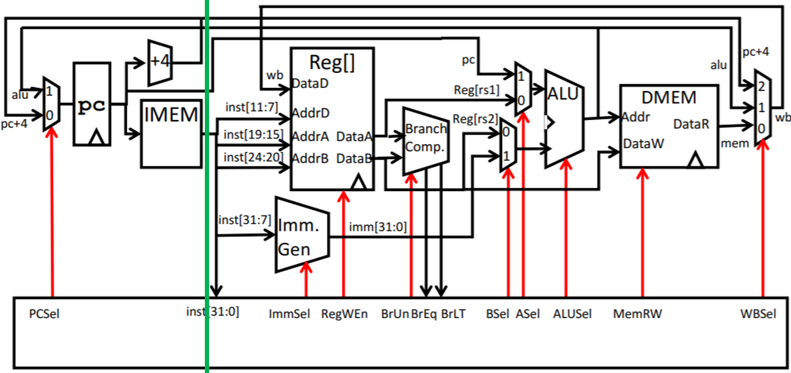
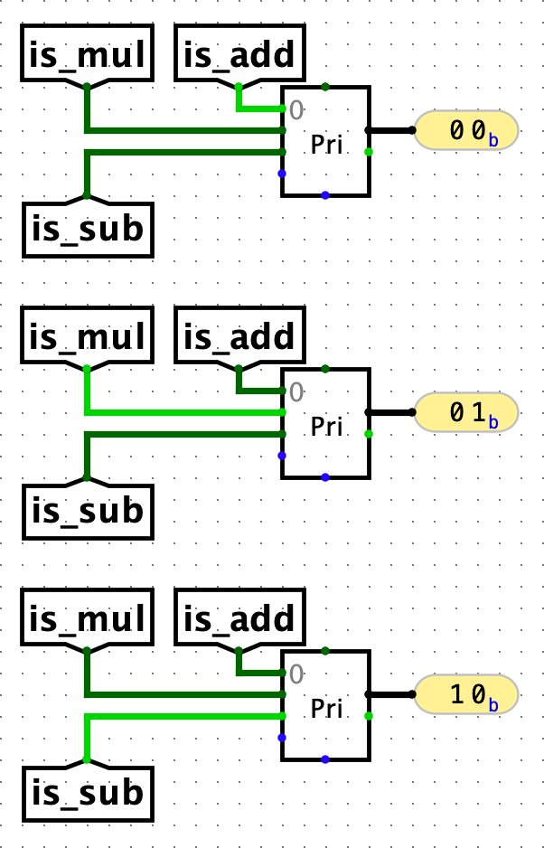
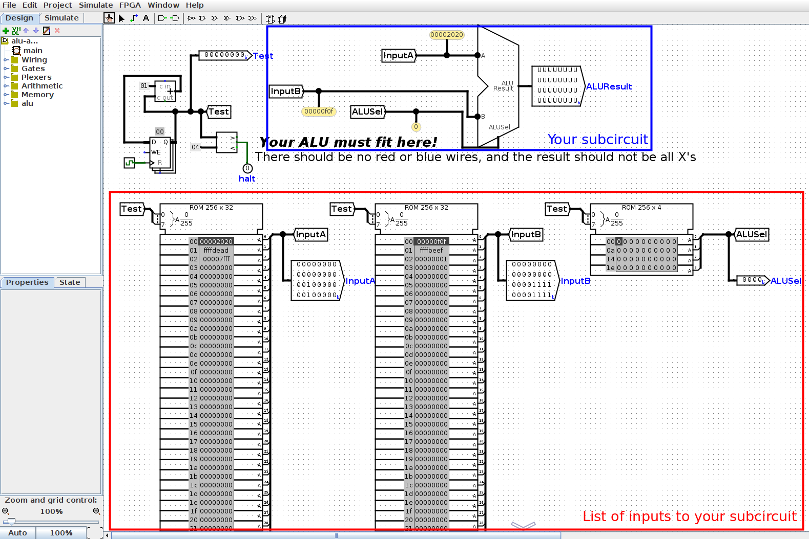
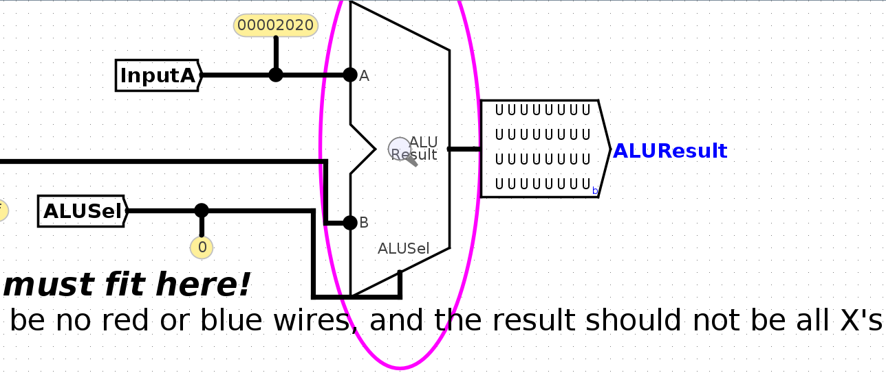
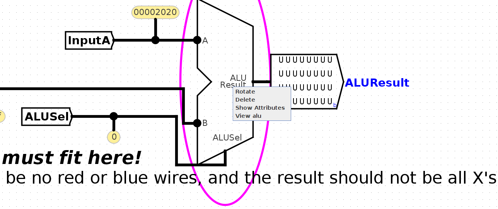
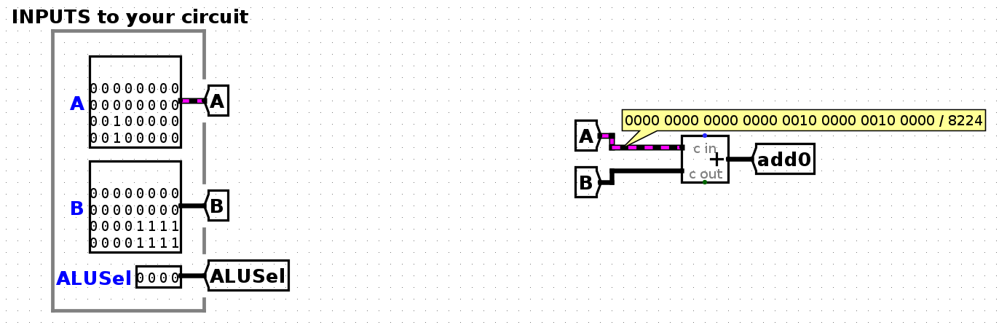
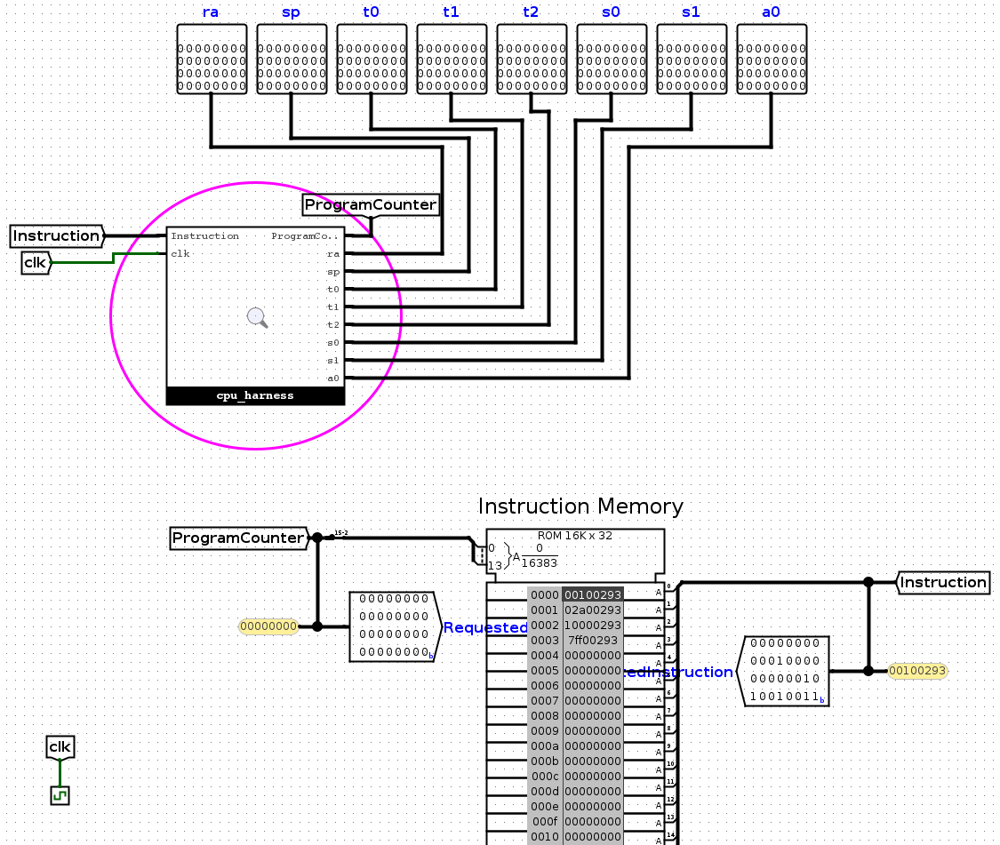
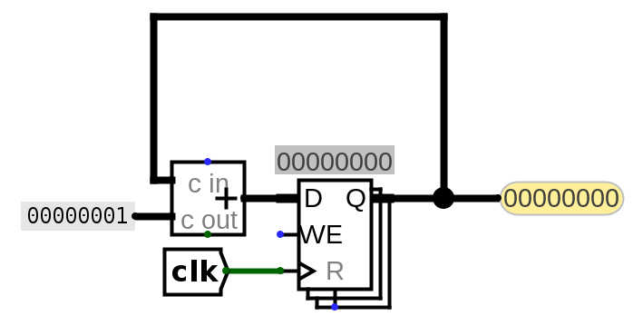
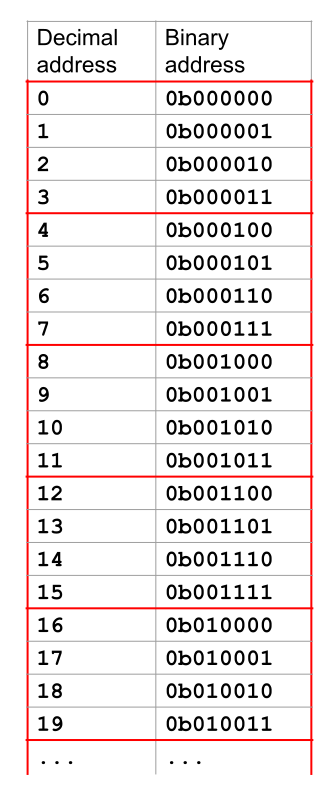

# 项目 3: CS61CPU

在这个项目中，你将搭建一个能运行真实 RISC-V 指令的 CPU 。

## 设置

>你必须在你的本地机器上完成本项目。如果你忘了如何在你的本地机器上设置，请看 [Lab 0](../Labs/Lab_0.md) 。

>**Logisim 的常见问题或项目 3 的相关问题在[常见问题](https://cs61c.org/fa24/resources/common-errors/)页面的下方列出**。<br>

### 设置： Git

1. 在你的 **本地机器** 上 **克隆** 该代码仓库（本项目完全不需要使用 Hive 服务器）。Windows 用户应该在 WSL 外进行克隆操作（推荐 Git Bash ）。
```bash
git clone git@github.com:61c-student/fa24-proj3-USERNAME.git 61c-proj3
```
（使用你 GitHub 仓库的名字替换掉 <code>fa24-proj2-USERNAME</code> ）
2. ​ **进入**​ 你的仓库：
```bash
cd 61c-proj3
```
3. 把初始仓库​ **添加**​ 成远程：
```bash
git remote add starter https://github.com/61c-teach/fa24-proj3-starter.git
```

如果你遇到 git 相关问题，看[这里](https://cs61c.org/fa24/resources/common-errors/)

### 设置： Logisim
这个项目是在 Logisim 中完成的。在 <code>61c-proj3</code> 目录下，运行 <code>bash test.sh download_tools</code> 来下载 Venus 和 Logisim 所需工具（你只需要运行一次这个命令。）

在项目的其余部分中，如需打开 Logisim，请运行 <code>java -jar tools/logisim-evolution.jar</code> 。

## 还原初始文件
如果需要还原初始文件，请查看[常见错误](https://cs61c.org/fa24/resources/common-errors/)。

## Part A
!!! info "注意"
    实验 5 是项目 2A 的必修课。建议观看第 14-19 讲，参加讨论 6-7 ，完成作业 6-7 。

在这一部分中，你将设计一个能够执行 addi 指令的简易 CPU 框架。

### 任务 1 ：算术逻辑单元（ALU）
完成 <code>alu.circ</code> 中的 ALU，使其能够执行所需的算术运算。
<table><thead><tr><th>输入名称</th><th>位宽</th><th align="left">描述</th></tr></thead><tbody>
<tr><td><code>A</code></td><td>32</td><td align="left">作为算术逻辑单元操作输入 A 的数据</td></tr>
<tr><td><code>B</code></td><td>32</td><td align="left">作为算术逻辑单元操作输入 B 的数据</td></tr>
<tr><td><code>ALUSel</code></td><td>4</td><td align="left">选择算术逻辑单元应执行的操作（见下方对应开关值的操作列表）</td></tr>
</tbody></table>
<table><thead><tr><th>输出名称</th><th>位宽</th><th align="left">描述</th></tr></thead><tbody>
<tr><td><code>ALUResult</code></td><td>32</td><td align="left">算术逻辑单元操作的结果</td></tr>
</tbody></table>
以下是需要你实现的算术逻辑单元操作列表及其对应的 ALUSel 值。加法（ <code>add</code>）已为你实现。
允许并鼓励你使用 Logisim 内置组件来实现这些算术运算。
<table><thead><tr><th>ALUSel 值</th><th align="left">指令</th></tr></thead><tbody>
<tr><td>0</td><td align="left">add: <code>Result = A + B</code></td></tr>
<tr><td>1</td><td align="left">sll: <code>Result = A &lt;&lt; B[4:0]</code></td></tr>
<tr><td>2</td><td align="left">slt: <code>Result = (A &lt; B (signed)) ? 1 : 0</code></td></tr>
<tr><td>3</td><td align="left">不使用</td></tr>
<tr><td>4</td><td align="left">xor: <code>Result = A ^ B</code></td></tr>
<tr><td>5</td><td align="left">srl: <code>Result = (unsigned) A &gt;&gt; B[4:0]</code></td></tr>
<tr><td>6</td><td align="left">or:  <code>Result = A | B </code></td></tr>
<tr><td>7</td><td align="left">and: <code>Result = A &amp; B</code></td></tr>
<tr><td>8</td><td align="left">mul: <code>Result = (signed) (A * B)[31:0]</code></td></tr>
<tr><td>9</td><td align="left">mulh: <code>Result = (signed) (A * B)[63:32]</code></td></tr>
<tr><td>10</td><td align="left">不使用</td></tr>
<tr><td>11</td><td align="left">mulhu: <code>Result = (A * B)[63:32]</code></td></tr>
<tr><td>12</td><td align="left">sub: <code>Result = A - B</code></td></tr>
<tr><td>13</td><td align="left">sra: <code>Result = (signed) A &gt;&gt; B[4:0]</code></td></tr>
<tr><td>14</td><td align="left">不使用</td></tr>
<tr><td>15</td><td align="left">bsel: <code>Result = B</code></td></tr>
</tbody></table>
一些额外提示：

* 进行移位操作时，只需使用输入 <code>B</code> 的低 5 位，因为仅支持最多 32 位的移位。

* 两个 32 位数相乘的结果最多可达 64 位，但数据线限制为 32 位，因此使用 <code>mulh</code> 和 <code>mulhu</code> 获取乘积的高 32 位。<code>Multiplier</code> 组件带有一个进位输出（ <code>Carry Out</code> ），描述为“乘积的高位”，这对于某些乘法操作特别有用。

* 比较器组件可能对实现涉及输入比较的指令有所帮助。

* 多路选择器（MUX）在决定操作输出时可能很有用。换句话说，可以考虑对所有操作输入进行处理，然后选择输出其中一个结果。

* Part A 的 ALU 测试仅使用已定义指令对应的 ALUSel 值，因此你的设计无需考虑未使用的值。

#### 运行测试用例
在本地机器上，首先进入 <code>61c-proj3</code> 目录，运行命令 <code>bash test.sh</code> 。该命令会展示你可以用来测试的所有命令概览。具体运行 <code>bash test.sh part_a</code> 会执行 Part A 的所有测试。你也可以提供具体任务的名称，以运行该任务的全部测试。

要测试本任务，请在本地机器上运行 <code>bash test.sh test_alu</code> 。

如果测试未通过，测试程序会显示预期输出与实际输出的差异。要查看完整的参考输出（ <code>.ref</code> 文件）和你的输出（ <code>.out</code> 文件），可以使用命令 <code>bash test.sh format</code> <输出文件名>
对于本任务
```assembly
bash test.sh format tests/unit-alu/out/alu-add.ref
bash test.sh format tests/unit-alu/out/alu-add.out

bash test.sh format tests/unit-alu/out/alu-all.ref
bash test.sh format tests/unit-alu/out/alu-all.out

bash test.sh format tests/unit-alu/out/alu-logic.ref
bash test.sh format tests/unit-alu/out/alu-logic.out

bash test.sh format tests/unit-alu/out/alu-mult.ref
bash test.sh format tests/unit-alu/out/alu-mult.out

bash test.sh format tests/unit-alu/out/alu-shift.ref
bash test.sh format tests/unit-alu/out/alu-shift.out

bash test.sh format tests/unit-alu/out/alu-slt-sub-bsel.ref
bash test.sh format tests/unit-alu/out/alu-slt-sub-bsel.out
```

#### 调试
详尽的调试指南请参见[测试与调试](#_18)部分。

所有测试用的 <code>.circ</code> 电路文件均位于 <code>tests</code> 文件夹中。这些电路会向你的 ALU 电路依次输入一系列信号（每个时钟周期一个），并记录电路的输出。

在 Logisim 中，打开本任务对应的测试电路文件之一：
```text
tests/unit-alu/alu-add.circ
tests/unit-alu/alu-all.circ
tests/unit-alu/alu-logic.circ
tests/unit-alu/alu-mult.circ
tests/unit-alu/alu-shift.circ
tests/unit-alu/alu-slt-sub-bsel.circ
```
要查看你的电路， **请右键点击你的 ALU** ， **选择** <code>View alu</code> 。
要逐步查看每个时间步的输入， **点击** <code>File -> Manual Tick Full Cycle</code> 。
在逐步执行输入时， **可以使用 Poke Tool** 检查每根导线上的信号值。

注意：请避免在测试电路中直接编辑，以免所做更改丢失！

### 任务 2 ： 寄存器文件（RegFile）
请完善 <code>regfile.circ</code> ，使其包含 32 个可读写的寄存器。
<table><thead><tr><th>输入名称</th><th>位宽</th><th align="left">描述</th></tr></thead><tbody>
<tr><td><code>ReadIndex1</code></td><td>5</td><td align="left">确定将哪个寄存器的值发送到 <code>ReadData1</code> 输出</td></tr>
<tr><td><code>ReadIndex2</code></td><td>5</td><td align="left">确定将哪个寄存器的值发送到 <code>ReadData2</code> 输出</td></tr>
<tr><td><code>WriteIndex</code></td><td>5</td><td align="left">在下一次时钟上升沿要写入的寄存器（当 <code>RegWEn</code> 为 1 时）</td></tr>
<tr><td><code>WriteData</code></td><td>32</td><td align="left">在下一个时钟上升沿要写入 <code>rd</code> 的数据（当 <code>RegWEn</code> 为 1 时）</td></tr>
<tr><td><code>RegWEn</code></td><td>1</td><td align="left">确定是否在下一个时钟上升沿将数据写入寄存器文件</td></tr>
<tr><td><code>clk</code></td><td>1</td><td align="left">时钟输入</td></tr>
</tbody></table>
<table><thead><tr><th>输出名称</th><th>位宽</th><th align="left">描述</th></tr></thead><tbody>
<tr><td><code>ReadData1</code></td><td>32</td><td align="left">由 <code>ReadIndex1</code> 指定的寄存器值</code></td></tr>
<tr><td><code>ReadData2</code></td><td>32</td><td align="left">由 <code>ReadIndex2</code> 指定的寄存器值</code></td></tr>
<tr><td><code>ra</code></td><td>32</td><td align="left"><code>ra</code> (<code>x1</code>) 的值</td></tr>
<tr><td><code>sp</code></td><td>32</td><td align="left"><code>sp</code> (<code>x2</code>) 的值</td></tr>
<tr><td><code>t0</code></td><td>32</td><td align="left"><code>t0</code> (<code>x5</code>) 的值</td></tr>
<tr><td><code>t1</code></td><td>32</td><td align="left"><code>t1</code> (<code>x6</code>) 的值</td></tr>
<tr><td><code>t2</code></td><td>32</td><td align="left"><code>t2</code> (<code>x7</code>) 的值</td></tr>
<tr><td><code>s0</code></td><td>32</td><td align="left"><code>s0</code> (<code>x8</code>) 的值</td></tr>
<tr><td><code>s1</code></td><td>32</td><td align="left"><code>s1</code> (<code>x9</code>) 的值</td></tr>
<tr><td><code>a0</code></td><td>32</td><td align="left"><code>a0</code> (<code>x10</code>) 的值</td></tr>
</tbody></table>

* 为便于测试和调试，寄存器文件电路输出中包含8个恒定输出寄存器。请确保将这8个输出引脚连接至对应的寄存器。

* 其中，x0寄存器应始终保持零值，即使有指令尝试对其写入。

一些额外建议：

* 善用复制粘贴！建议先完整实现一个寄存器，然后将其作为模板复用于其他寄存器，避免重复劳动。在Logisim中，你可以使用 <code>Ctrl/Cmd + D</code> 快捷键来复制选中的元件或元件组。

* 内置寄存器的 <code>Enable</code> 引脚可能会派上用场（可用于控制写入时机）。

#### 测试与调试
要想测试你的函数，在你的本地机器输入 <code>bash test.sh test_regfile</code> 。

要查看参考输出和你的输出结果，可以运行以下格式化命令：
```text
bash test.sh format tests/unit-regfile/out/regfile-more-regs.ref
bash test.sh format tests/unit-regfile/out/regfile-more-regs.out

bash test.sh format tests/unit-regfile/out/regfile-read-only.ref
bash test.sh format tests/unit-regfile/out/regfile-read-only.out

bash test.sh format tests/unit-regfile/out/regfile-read-write.ref
bash test.sh format tests/unit-regfile/out/regfile-read-write.out

bash test.sh format tests/unit-regfile/out/regfile-x0.ref
bash test.sh format tests/unit-regfile/out/regfile-x0.out
```
调试电路时，请打开对应的测试电路文件，点击进入您设计的寄存器文件(regfile)电路，勾选"完整周期(full cycles)"选项，逐步执行输入信号测试：
```text
tests/unit-regfile/regfile-more-regs.circ
tests/unit-regfile/regfile-read-only.circ
tests/unit-regfile/regfile-read-write.circ
tests/unit-regfile/regfile-x0.circ
```

### 任务 3 ：立即数生成器（Immediate Generator）

在 Part A 的后续工作中，我们将构建一个最小化的 CPU ，使其能够执行 <code>addi</code> 指令。B部分中，您将重新完善这些电路以支持更多指令。

请在 <code>imm-gen.circ</code> 文件中完成立即数生成器的设计（注意：不是 <code>cpu.circ</code> 中的<code>imm_gen</code> 子电路），现阶段只需支持 <code>addi</code> 指令的立即数生成，其他类型的立即数可暂时忽略。
<table><thead><tr><th>输入名称</th><th>位宽</th><th align="left">描述</th></tr></thead><tbody>
<tr><td><code>Instruction</code></td><td>32</td><td align="left">执行的指令</td></tr>
<tr><td><code>ImmSel</code></td><td>3</td><td align="left">用于控制立即数的重组方式的值（当前阶段可暂时忽略）</td></tr>
</tbody></table>
<table><thead><tr><th>输出名称</th><th>位宽</th><th align="left">描述</th></tr></thead><tbody>
<tr><td><code>Immediate</code></td><td>32</td><td align="left">指令中的立即数值（当前可假定为 <code>addi</code> 指令）</td></tr>
</tbody></table>

#### 测试与调试
在继续调试当前任务前，您需要先完成下一个环节的设计


### 任务 4 ：数据通路（ Datapath ）
填写 <code>cpu.circ</code> ，使其包含一个单周期（非流水线）处理器的数据路径，该处理器能够执行 <code>addi</code> 指令。

以下是处理器的输入和输出。在此任务中，您可以保持大部分输入和输出不变，因为它们对于addi指令来说不是必需的。

<table><thead><tr><th>输入名称</th><th>位宽</th><th align="left">描述</th></tr></thead><tbody>
<tr><td><code>MemReadData</code></td><td>32</td><td align="left">内存中 <code>MemAddress</code> 的数据</td></tr>
<tr><td><code>Instruction</code></td><td>32</td><td align="left">内存地址 <code>ProgramCounter</code> 处的指令</td></tr>
<tr><td><code>clk</code></td><td>1</td><td align="left">时钟输入</td></tr>
</tbody></table>
<table><thead><tr><th>输出名称</th><th>位宽</th><th align="left">描述</th></tr></thead><tbody>
<tr><td><code>ra</code></td><td>32</td><td align="left"><code>ra</code> (<code>x1</code>) 的值</td></tr>
<tr><td><code>sp</code></td><td>32</td><td align="left"><code>sp</code> (<code>x2</code>) 的值</td></tr>
<tr><td><code>t0</code></td><td>32</td><td align="left"><code>t0</code> (<code>x5</code>) 的值</td></tr>
<tr><td><code>t1</code></td><td>32</td><td align="left"><code>t1</code> (<code>x6</code>) 的值</td></tr>
<tr><td><code>t2</code></td><td>32</td><td align="left"><code>t2</code> (<code>x7</code>) 的值</td></tr>
<tr><td><code>s0</code></td><td>32</td><td align="left"><code>s0</code> (<code>x8</code>) 的值</td></tr>
<tr><td><code>s1</code></td><td>32</td><td align="left"><code>s1</code> (<code>x9</code>) 的值</td></tr>
<tr><td><code>a0</code></td><td>32</td><td align="left"><code>a0</code> (<code>x10</code>) 的值</td></tr>
<tr><td><code>MemAddress</code></td><td>32</td><td align="left">要读取或写入的内存地址</td></tr>
<tr><td><code>MemWriteData</code></td><td>32</td><td align="left">要写入内存的数据</td></tr>
<tr><td><code>MemWriteMask</code></td><td>4</td><td align="left">写入数据到内存的写使能掩码</td></tr>
<tr><td><code>ProgramCounter</code></td><td>32</td><td align="left">指令输入（ <code>Instruction</code> input）的地址</td></tr>
</tbody></table>
我们知道，从零开始构建数据路径可能令人望而生畏，因此本节将提供更详细的指导来帮助你完成处理器的设计。

请回顾指令执行的五个阶段：

1. 取指（IF, Instruction Fetch）

2. 译码（ID, Instruction Decode）

3. 执行（EX, Execute）

4. 访存（MEM, Memory）

5. 写回（WB, Write Back）

#### 任务 4.1 ：取指
我们已为程序计数器提供了一个简单的实现。它是一个32位寄存器，每个时钟周期递增4。程序计数器（ <code>ProgramCounter</code> ）与指令存储器（IMEM）相连，并从IMEM返回 <code>instruction</code> 。

本子任务无需您实现任何内容！

#### 任务 4.2 ：译码
在此步骤中，我们需要对输入的 <code>instruction</code> 进行解码，并将相应的位分配到正确的子电路中。
<details>
  <summary><code>addi</code> 是什么类型的指令？该指令中有哪些不同的字段，以及哪些位对应每个字段？</summary>
  <p><code>addi</code> 是一种 I 型指令。其包含的字段如下：</p>
<ul>
<li><code>imm [31-20]</code></li>
<li><code>rs1 [19-15]</code></li>
<li><code>funct3 [14-12]</code></li>
<li><code>rd [11-7]</code></li>
<li><code>opcode [6-0]</code></li>
</ul>

</details>
<details>
  <summary>在 Logisim 中，应使用何种工具来拆分不同的位组？</summary>
  <p>使用分线器（Splitter）从指令中分离出5个字段。</p>

</details>
<details>
  <summary>哪些字段应当连接到寄存器文件？它们应分别接入寄存器文件的哪些输入端口？</summary>
  <p>从指令中分离出的 <code>rs1</code> 位应连接到寄存器文件的 <code>ReadIndex1</code> 端口。从指令中分离出的 <code>rd</code> 位应连接到寄存器文件的 <code>WriteIndex</code> 端口。由于 I 型指令不包含 <code>rs2</code> 字段，当前可暂时忽略 <code>rs2</code> 相关连接</p>

</details>
<details>
  <summary>需要将哪些信号连接到立即数生成器？</summary>
  <p>将 <code>Instruction</code> 指令信号连接至立即数生成器。您在前一任务中完成的立即数生成器应当接收完整指令，并输出正确的立即数值。</p>

</details>

#### 任务 4.3 ：执行
在此步骤中，我们将利用已解码的指令字段来计算实际执行的指令。
<details>
  <summary><code>addi</code> 应该向算术逻辑单元输入哪两个数值（ <code>AA</code> 和 <code>B</code>）？</summary>
  <p>输入A应来自寄存器文件的ReadData1。输入B应来自立即数生成器的立即数。</p>
</details>
<details>
  <summary>这条指令应该向算术逻辑单元输入什么 <code>ALUSel</code> 值？</summary>
  <p><code>ALUSel</code> 用于选择算术逻辑单元执行的计算操作。由于目前只需实现 <code>addi </code>指令，我们可以将算术逻辑单元固定设置为始终执行加法运算（ <code>ALUSel = 0b0000</code> ）。</p>

</details>

#### 任务 4.4：内存
<code>addi</code> 指令不涉及内存操作，因此在此子任务中无需实现任何相关功能！

内存阶段（Memory Stage）通常用于处理存储指令（store）的写入和加载指令（load）的读取。但由于 <code>addi</code> 指令不访问内存，在 Part A 中我们无需考虑这部分逻辑。请直接忽略数据存储器（DMEM），并保持其输入/输出引脚悬空即可。

#### 任务 4.5：写回
在这一步中，我们将把 <code>addi</code> 指令的计算结果写回寄存器。
<details>
  <summary><code>addi</code> 指令写入的数据是什么？数据被写入哪里？</summary>
  <p><code>addi</code> 指令将加法运算的结果（来自算术逻辑单元的输出）写入寄存器 <code>rd</code> 中。</p>

  <p>将 <code>ALUResult</code> 连接到寄存器文件的 <code>WriteData</code> 端口。</p>

  <p>由于 <code>addi</code> 指令总是需要写入寄存器，因此可以暂时将 <code>RegWEn</code> 信号固定设置为<code>1</code> ，以确保寄存器写使能始终有效。</p>

</details>

#### 测试与调试
请参阅[测试与调试](#_18)部分以获取更详细的调试指南。

如需测试当前功能，可在本地终端执行 <code>bash test.sh test_addi</code> 。

要查看标准输出和你的输出，运行以下指令：
```text
bash test.sh format tests/integration-addi/out/addi-basic.ref
bash test.sh format tests/integration-addi/out/addi-basic.out

bash test.sh format tests/integration-addi/out/addi-negative.ref
bash test.sh format tests/integration-addi/out/addi-negative.out

bash test.sh format tests/integration-addi/out/addi-positive.ref
bash test.sh format tests/integration-addi/out/addi-positive.out
```
调试电路时，请打开以下测试电路文件，进入CPU电路模块，勾选"完整周期"选项以逐步执行输入信号：
```text
tests/integration-addi/addi-basic.circ
tests/integration-addi/addi-positive.circ
tests/integration-addi/addi-negative.circ
```

## Part B：其他指令

### 任务 5 ：测试
!!! info "注意"
    实验 6 是项目 3B 的必修课。建议观看第 18-23 讲，参加讨论 7-8 ，完成作业 7-8 。

在本阶段，您将扩展 CPU 功能以支持更多指令并实现流水线架构。

开始前，请先 **执行** <code>git pull starter main</code> 命令获取我们可能推送的更新内容。若出现“ unrelated histories ”错误提示，请改用 <code>git fetch starter main-fix && git merge starter/main-fix</code> 命令进行同步。

各指令集的实现顺序可自由安排。本规范采用渐进式设计思路，将指导您通过分批添加小型指令组的方式逐步完善CPU功能。

#### 任务 5 ： I 类型指令
你需要实现的指令已经列在下面：
<table>
  <tr>
    <td><b>指令</b></td>
    <td><b>类型</b></td>
    <td><b>Opcode</b></td>
    <td><b>Funct3</b></td>
    <td><b>Funct7</b></td>
    <td><b>运算</b></td>
  </tr>
  <tr>
    <td><code>addi rd, rs1, imm</code></td>
    <td rowspan="4">I</td>
    <td rowspan="8"><code>0x13</code></td>
    <td><code>0x0</code></td>
    <td></td>
    <td><code>rd = rs1 + imm</code></td>
  </tr>
  <tr>
    <td><code>andi rd, rs1, imm</code></td>
    <td><code>0x7</code></td>
    <td></td>
    <td><code>rd = rs1 &amp; imm</code></td>
  </tr>
  <tr>
    <td><code>ori rd, rs1, imm</code></td>
    <td><code>0x6</code></td>
    <td></td>
    <td><code>rd = rs1 | imm</code></td>
  </tr>
  <tr>
    <td><code>xori rd, rs1, imm</code></td>
    <td><code>0x4</code></td>
    <td></td>
    <td><code>rd = rs1 ^ imm</code></td>
  </tr>
  <tr>
    <td><code>slli rd, rs1, imm</code></td>
    <td rowspan="3">I*</td>
    <td><code>0x1</code></td>
    <td><code>0x00</code></td>
    <td><code>rd = rs1 &lt;&lt; imm</code></td>
  </tr>
  <tr>
    <td><code>srli rd, rs1, imm</code></td>
    <td><code>0x5</code></td>
    <td><code>0x00</code></td>
    <td><code>rd = rs1 &gt;&gt; imm</code> (零扩展)</td>
  </tr>
  <tr>
     <td><code>srai rd, rs1, imm</code></td>
    <td><code>0x5</code></td>
    <td><code>0x20</code></td>
    <td><code>rd = rs1 &gt;&gt; imm</code> (符号扩展)</td>
  </tr>
  <tr>
    <td><code>slti rd, rs1, imm</code></td>
    <td>I</td>
    <td><code>0x2</code></td>
    <td></td>
    <td><code>rd = (rs1 &lt; imm) ? 1 : 0</code></td>
  </tr>
</table>

#### 任务 5.1 ：数据通路
回想一下，在 Part A 中你已经实现了 <code>addi</code> 指令。其他 I 型指令与 <code>addi</code> 使用相同的数据通路，区别在于每种 I 型指令需要算术逻辑单元执行不同的运算操作。在 Part A 中，我们将算术逻辑单元子电路的 <code>ALUSel</code> 输入硬编码为 <code>0b0000</code> ，使得算术逻辑单元始终执行加法运算。但现在你需要 **修改算术逻辑单元子电路的ALUSel输入** ，改为使用控制逻辑子电路输出的值（这将在下一个任务中实现）。

请注意同时需要将 **寄存器文件子电路的 <code>RegWEn</code> 输入** 改为使用控制逻辑子电路输出的值。

#### 任务 5.2 ：控制逻辑
在接下来的几个任务中，随着你添加更多指令的支持逻辑，你需要增加控制逻辑，以便根据当前执行的指令启用相关的数据通路组件。

请修改 <code>control-logic.circ</code> ，使其能够为 I 类型指令输出正确的控制信号。具体细节请参考[控制逻辑部分](#_15)的说明。

#### 测试和调试
我们没有为 I 型指令提供任何测试用例，因此你需要自己编写测试来查找实现中的错误。在请求助教帮助之前，请确保你已经编写了一些测试，否则我们会要求你先写一些测试再来寻求帮助。

1. 进入 <code>tests/integration-custom/in</code> 目录。
2. 编写一个 RISC-V 测试程序，并将其保存在以 <code>.s</code> 结尾的文件中。
3. 运行命令 <code>bash test.sh test_custom</code> 来测试。

<code>test_custom</code> 会将你的 RISC-V 测试代码编译成一个 Logisim 电路并运行它。
如果你只想编译测试代码，可以运行 <code>bash test.sh create_custom</code> 。
如果你只想运行测试，可以运行 <code>bash test.sh run_custom</code> 。

为了调试你的电路，你可以逐步查看调试电路（类似于你在 Project 3A 中做过的）。

1. 进入 <code>tests</code> 文件夹，然后进入相关测试的子文件夹，例如 <code>tests/integration-custom</code> 。
2. 用 Logisim 打开生成的 <code>.circ</code> 文件。点击你创建的电路，勾选 "full cycles" 选项以逐步查看输入。

### 任务 6 ： R 型指令

这个任务中你需要实现的指令是这些：

<table>
  <tr>
    <td><b>指令</b></td>
    <td><b>类型</b></td>
    <td><b>Opcode</b></td>
    <td><b>Funct3</b></td>
    <td><b>Funct7</b></td>
    <td><b>运算</b></td>
  </tr>
  <tr>
    <td><code>add rd, rs1, rs2</code></td>
    <td rowspan="12">R</td>
    <td rowspan="12"><code>0x33</code></td>
    <td><code>0x0</code></td>
    <td><code>0x00</code></td>
    <td><code>rd = rs1 + rs2</code></td>
  </tr>
  <tr>
    <td><code>sub rd, rs1, rs2</code></td>
    <td><code>0x0</code></td>
    <td><code>0x20</code></td>
    <td><code>rd = rs1 - rs2</code></td>
  </tr>
  <tr>
    <td><code>and rd, rs1, rs2</code></td>
    <td><code>0x7</code></td>
    <td><code>0x00</code></td>
    <td><code>rd = rs1 &amp; rs2</code></td>
  </tr>
  <tr>
    <td><code>or rd, rs1, rs2</code></td>
    <td><code>0x6</code></td>
    <td><code>0x00</code></td>
    <td><code>rd = rs1 | rs2</code></td>
  </tr>
  <tr>
    <td><code>xor rd, rs1, rs2</code></td>
    <td><code>0x4</code></td>
    <td><code>0x00</code></td>
    <td><code>rd = rs1 ^ rs2</code></td>
  </tr>
  <tr>
    <td><code>sll rd, rs1, rs2</code></td>
    <td><code>0x1</code></td>
    <td><code>0x00</code></td>
    <td><code>rd = rs1 &lt;&lt; rs2</code></td>
  </tr>
  <tr>
    <td><code>srl rd, rs1, rs2</code></td>
    <td><code>0x5</code></td>
    <td><code>0x00</code></td>
    <td><code>rd = rs1 &gt;&gt; rs2</code> (零扩展)</td>
  </tr>
 <tr>
    <td><code>sra rd, rs1, rs2</code></td>
    <td><code>0x5</code></td>
    <td><code>0x20</code></td>
    <td><code>rd = rs1 &gt;&gt; rs2</code> (符号扩展)</td>
  </tr>
  <tr>
    <td><code>slt rd, rs1, rs2</code></td>
    <td><code>0x2</code></td>
    <td><code>0x00</code></td>
    <td><code>rd = (rs1 &lt; rs2) ? 1 : 0</code></td>
  </tr>
  <tr>
    <td><code>mul rd, rs1, rs2</code></td>
    <td><code>0x0</code></td>
    <td><code>0x01</code></td>
    <td><code>rd = (rs1 * rs2)[31:0]</code></td>
  </tr>
  <tr>
    <td><code>mulh rd, rs1, rs2</code></td>
    <td><code>0x1</code></td>
    <td><code>0x01</code></td>
    <td><code>rd = (rs1 * rs2)[63:32]</code> (有符号)</td>
  </tr>
  <tr>
    <td><code>mulhu rd, rs1, rs2</code></td>
    <td><code>0x3</code></td>
    <td><code>0x01</code></td>
    <td><code>rd = (rs1 * rs2)[63:32]</code> (无符号)</td>
  </tr>
</table>

#### 任务 6.1 ：数据通路
修改你的 <code>cpu.circ</code> 中的数据通路，使其能够支持 R 型指令。

如果你卡住了，可以继续往下阅读一些引导性问题。就像 Task 4 一样，思考执行一条指令的五个阶段可能会对你有所帮助。
<details> <summary>取指阶段：R 型指令如何影响程序计数器（PC）？</summary> <p>R 型指令总是将程序计数器增加 4，以取出下一条指令，就像 Part A 中的 <code>addi</code> 指令一样。这意味着在这个任务中，我们不需要修改程序计数器的实现。</p> </details>
<details> <summary>指令译码阶段：我们需要从寄存器文件中读取什么？</summary> <p>R 型指令需要从寄存器文件中读取两个源寄存器的值（<code>rs1</code> 和 <code>rs2</code>）。在 Part A 中，你已经从指令中提取了 <code>rs1</code> 的位，并将其传递给了寄存器文件。现在，你还需要从指令中提取 <code>rs2</code> 的位，并同样传递给寄存器文件。</p> </details>
<details> <summary>执行阶段：R 型指令应将哪两个数据值（<code>A</code> 和 <code>B</code>）输入到算术逻辑单元？</summary> <p>R 型指令会将来自寄存器文件（regfile）的寄存器值传递给算术逻辑单元。在 Part A 中，你已经将第一个寄存器值 <code>RegReadData1</code> 传递给了算术逻辑单元的第一个输入。而在 <code>addi</code> 指令中，算术逻辑单元的第二个输入是一个立即数（immediate）。</p> <p>由于你需要同时支持 R 型指令和 <code>addi</code> 指令，因此你应该使用一个多路选择器（multiplexer）来选择算术逻辑单元的第二个输入到底是立即数还是第二个寄存器的值。</p> <p>这个多路选择器的选择信号是 <code>BSel</code>。你将在本任务稍后通过控制逻辑，从指令位中生成 <code>BSel</code> 的值。</p> </details>
<details> <summary>访存阶段：R 型指令会写入内存吗？</summary> <p>R 型指令不会写入内存（它们将结果写入的是 CPU 内部的寄存器，而不是内存）。这意味着我们在这个任务中不需要修改数据内存（DMEM）。</p> </details>
<details> <summary>回写阶段：R 型指令写入了什么数据？它将数据写入了哪里？</summary> <p>R 型指令会将运算的结果（来自算术逻辑单元的输出）写入到目标寄存器 <code>rd</code> 中。在 Part A 中，你已经实现了将算术逻辑单元输出写入目标寄存器的逻辑。</p> </details>

#### 6.2 ：控制逻辑
修改 <code>control-logic.circ</code> ，使其能够输出正确的控制信号以支持 R 型指令。有关更多细节，请参见[控制逻辑](#_15)部分。

#### 测试和调试
我们没有为 R 类型指令提供任何测试用例，因此你需要自己编写测试来查找你实现中的错误。

1. 进入目录 <code>tests/integration-custom/in</code> 。
2. 编写一个 RISC-V 测试，并将其保存在以 <code>.s</code> 结尾的文件名中。
3. 运行命令 <code>bash test.sh test_custom</code> 。

### 任务 7 ： B 型指令

这个任务中你需要实现的指令是这些：

<table>
  <tr>
    <td><b>指令</b></td>
    <td><b>类型</b></td>
    <td><b>Opcode</b></td>
    <td><b>Funct3</b></td>
    <td><b>Funct7</b></td>
    <td><b>运算</b></td>
  </tr>
  <tr>
    <td><code>beq rs1, rs2, offset</code></td>
    <td rowspan="6">B</td>
    <td rowspan="6"><code>0x63</code></td>
    <td><code>0x0</code></td>
    <td class="c8"><code>
      if(rs1 == rs2)
      <br>
      &nbsp;PC = PC + offset
    </code></td>
  </tr>
  <tr>
    <td><code>bge rs1, rs2, offset</code></td>
    <td><code>0x5</code></td>
    <td class="c8"><code>
      if(rs1 &gt;=  rs2 (signed))
      <br>
      &nbsp;PC = PC + offset
    </code></td>
  </tr>
  <tr>
    <td><code>bgeu rs1, rs2, offset</code></td>
    <td><code>0x7</code></td>
    <td class="c8"><code>
      if(rs1 &gt;=  rs2 (unsigned))
      <br>
      &nbsp;PC = PC + offset
    </code></td>
  </tr>
  <tr>
    <td><code>blt rs1, rs2, offset</code></td>
    <td><code>0x4</code></td>
    <td class="c8"><code>
      if(rs1 &lt;  rs2 (signed))
      <br>
      &nbsp;PC = PC + offset
    </code></td>
  </tr>
  <tr>
    <td><code>bltu rs1, rs2, offset</code></td>
    <td><code>0x6</code></td>
    <td class="c8"><code>
      if(rs1 &lt;  rs2 (unsigned))
      <br>
      &nbsp;PC = PC + offset
    </code></td>
  </tr>
  <tr>
    <td><code>bne rs1, rs2, offset</code></td>
    <td><code>0x1</code></td>
    <td class="c8"><code>
      if(rs1 != rs2)
      <br>
      &nbsp;PC =  PC + offset
    </code></td>
  </tr>
</table>

#### 任务 7.1 ：分支比较器
在 <code>branch-comp.circ</code> 文件中填入分支比较器子电路。该子电路接收两个输入，并输出两个输入的比较结果。后续我们将利用该输出来实现分支功能。
<table><thead><tr><th>信号名称</th><th>方向</th><th>位宽</th><th align="left">描述</th></tr></thead><tbody>
<tr><td><code>BrData1</code></td><td>输入</td><td>32</td><td align="left">第一个比较的数</td></tr>
<tr><td><code>BrData2</code></td><td>输入</td><td>32</td><td align="left">第二个比较的数</td></tr>
<tr><td><code>BrUn</code></td><td>输入</td><td>1</td><td align="left">当需要无符号比较时输出 <code>1</code>，当需要有符号比较时输出 <code>0</code>。</td></tr>
<tr><td><code>BrEq</code></td><td>输出</td><td>1</td><td align="left">两个数相等时置 <code>1</code></td></tr>
<tr><td><code>BrLt</code></td><td>输出</td><td>1</td><td align="left">当寄存器 rs1 中的值小于 rs2 中的值时，输出 <code>1</code></td></tr>
</tbody></table>
我们已为分支比较器子电路提供了一些单元测试，但这些测试并不全面。你可以通过运行 <code>bash test.sh test_branch_comp</code> 来执行这些测试。

#### 任务 7.2 ：立即数生成器
修改 <code>imm-gen.circ</code> 中的立即数生成器，使其除了支持 I 型指令的立即数生成（已在 Part A 中实现）外，还能支持 B 型指令的立即数生成。

请注意，根据指令类型的不同，立即数的各个位分散存储在指令的不同字段中。你将在控制逻辑中实现 <code>ImmSel</code> 信号，用于决定该子电路应生成哪种类型的立即数。

立即数的存储格式如下：
<table>
<thead>
  <tr>
    <th>类型<br></th>
    <th>ImmSel (默认)<br></th>
    <th style="text-align:center">Bits 31-20</th>
    <th style="text-align:center">Bits 19-12</th>
    <th style="text-align:center">Bit 11</th>
    <th style="text-align:center">Bits 10-5</th>
    <th style="text-align:center">Bits 4-1</th>
    <th style="text-align:center">Bit 0</th>
  </tr>
</thead>
<tbody>
  <tr>
    <td>I</td>
    <td><code>0b000</code></td>
    <td style="text-align:center" colspan="3"><code>inst[31]</code></td>
    <td style="text-align:center" colspan="3"><code>inst[30:20]</code></td>
  </tr>
  <tr>
    <td>S</td>
    <td><code>0b001<br></code></td>
    <td style="text-align:center" colspan="3"><code>inst[31]</code></td>
    <td style="text-align:center"><code>inst[30:25]</code></td>
    <td style="text-align:center" colspan="2"><code>inst[11:7]</code></td>
  </tr>
  <tr>
    <td>B</td>
    <td><code>0b010</code></td>
    <td style="text-align:center" colspan="2"><code>inst[31]</code></td>
    <td style="text-align:center"><code>inst[7]</code></td>
    <td style="text-align:center"><code>inst[30:25]</code></td>
    <td style="text-align:center"><code>inst[11:8]</code></td>
    <td style="text-align:center"><code>0</code></td>
  </tr>
  <tr>
    <td>U</td>
    <td><code>0b011</code></td>
    <td style="text-align:center" colspan="2"><code>inst[31:12]</code></td>
    <td style="text-align:center" colspan="4"><code>0</code></td>
  </tr>
  <tr>
    <td>J<br></td>
    <td><code>0b100</code></td>
    <td style="text-align:center"><code>inst[31]</code></td>
    <td style="text-align:center"><code>inst[19:12]</code></td>
    <td style="text-align:center"><code>inst[20]</code></td>
    <td style="text-align:center" colspan="2"><code>inst[30:21]</code></td>
    <td style="text-align:center"><code>0</code></td>
  </tr>
</tbody>
</table>
在本项目中，你可以将 I* 型（如移位指令）立即数视为 I 型 立即数处理，因为算术逻辑单元在执行移位操作时，仅会使用 <code>B</code> 输入 的最低 5 位。

请注意，所有立即数均为 32 位并经过符号扩展（符号扩展在表格中体现为 <code>inst[31]</code> 在高位重复填充）。

我们已为立即数生成器子电路提供了一些单元测试，但这些测试并不全面。你可以通过运行 <code>bash test.sh test_imm_gen</code> 来执行测试。

注意如果当前仅实现 B 型 立即数生成，其他类型的测试可能会失败，但请确保 <code>imm-gen-b-type</code> 测试通过。

表格中的 <code>ImmSel</code> 值 代表默认编码（即 <code>ImmSel</code> 值与立即数类型的映射关系）。如果需自定义编码：

1. 进入目录 <code>tests/unit-imm-gen</code> 。

2. 打开文件 <code>imm-gen-encoding.csv</code> 。

3. 替换其中的数字为你的编码方案（十进制）。例如，若使用 <code>ImmSel = 0b110</code> 表示 I 型指令，第二行应改为 <code>I,6</code> 。

4. 运行测试命令 <code>bash test.sh test_imm_gen</code> 验证修改。

#### 任务 7.3 ：数据通路
修改 <code>cpu.circ</code> 的数据路径以支持 B 型指令。

如果遇到困难，可以参考以下分阶段指导思路（类似于任务 4 的方法）：
<details>
  <summary>指令获取：B 类型指令如何影响程序计数器？</summary>
  <p>需要记住的是，分支指令（B-type）会将一个立即数偏移量加到当前 PC 的值上。如果分支条件成立（branch is taken），则 PC 会被更新为这个加法运算的结果（即跳转到目标地址）。如果分支条件不成立（branch is not taken），或者当前指令不是 B 类型指令，那么 PC 仍然会像之前一样正常递增（PC = PC + 4）。我们将在写回阶段（Write-Back Stage）实现这一逻辑。</p>

</details>
<details>
  <summary>指令译码：我们需要从寄存器文件中读取什么？</summary>
  <p>B 型指令有两个源寄存器 <code>rs1</code> 和 <code>rs2</code>，我们需要从寄存器文件中读取它们的值。在之前的任务中，你已经为 R 型指令实现了从 <code>rs1</code> 和 <code>rs2</code> 读取数据的功能。</p>

</details>
<details>
  <summary>执行：B类指令应向算术逻辑单元输入哪两个数据值（<code>A</code>和<code>B</code>）？</summary>
  <p>B类指令使用算术逻辑单元将立即数与PC（程序计数器）相加。你需要添加一个多路选择器，使算术逻辑单元能够根据当前执行的指令接收PC或<code>rs1</code>的值。该多路选择器的选择位是<code>ASel</code> 。在之前的任务中，你已经实现了向算术逻辑单元发送立即数的功能。</p>

</details>
<details>
  <summary>内存：B类指令会写入内存吗？</summary>
  <p>B 类指令不会写入内存，因此我们无需为此任务修改 DMEM 。</p>

</details>
<details>
  <summary>写回：B型指令正在写入什么数据，以及该指令将此数据写入何处？</summary>
  <p>B 型指令获取加法结果（ PC + 立即数，来自算术逻辑单元输出），并可能将该结果写入PC（取决于分支是否跳转）。你需要使用一个多路选择器（ MUX ）来决定哪个值将被写入 PC。
  
  该多路选择器的选择信号是 <code>PCSel</code> 。你需要在控制逻辑中根据指令位（instruction bits）实现 <code>PCSel</code> 的判定逻辑。</p>

</details>

#### 任务 7.4 ：控制逻辑
修改 <code>control-logic.circ</code> 文件，使其能够正确输出 B 类型指令的控制逻辑信号。更多细节请参阅[控制逻辑部分](#_15)。

#### 测试与调试
我们为 B 类型指令提供了一些测试用例，您可以通过以下命令运行：
```text
bash test.sh test_integration_branch
```
这些测试并不全面，因此您需要编写自己的测试用例来发现实现中的问题。

1. 进入目录 <code>tests/integration-custom/in</code> 。
2. 编写一个 RISC-V 测试程序，并保存为以 <code>.s</code> 结尾的文件。
3. 运行命令 <code>bash test.sh test_custom</code> 。

### 任务 8：加载与存储指令（Load/Store）

<table>
<colgroup>
<col span="1" style="width: 20%;">
<col span="1" style="width: 5%;">
<col span="1" style="width: 5%;">
<col span="1" style="width: 5%;">
<col span="1" style="width: 65%;">
</colgroup>
  <tr>
    <td><b>指令</b></td>
    <td><b>类型</b></td>
    <td><b>Opcode</b></td>
    <td><b>Funct3</b></td>
    <td><b>运算</b></td>
  </tr>
  <tr>
    <td><code>lb rd, offset(rs1)</code></td>
    <td rowspan="3">I</td>
    <td rowspan="3"><code>0x03</code></td>
    <td><code>0x0</code></td>
    <td><code>rd = </code>从地址 <code>rs1 + imm</code> 处读取的 1 字节内存数据，并进行符号扩展。</td>
  </tr>
  <tr>
    <td><code>lh rd, offset(rs1)</code></td>
    <td><code>0x1</code></td>
    <td><code>rd = </code>从地址 <code>rs1 + imm</code> 处读取的 2 字节内存数据，并进行符号扩展。</td>
  </tr>
  <tr>
    <td><code>lw rd, offset(rs1)</code></td>
    <td><code>0x2</code></td>
    <td><code>rd = </code>从地址 <code>rs1 + imm</code> 处读取的 4 字节内存数据，并进行符号扩展。</td>
  </tr>
  <tr>
    <td><code>sb rs2, offset(rs1)</code></td>
    <td rowspan="3">S</td>
    <td rowspan="3"><code>0x23</code></td>
    <td><code>0x0</code></td>
    <td>将 <code>rs2</code> 的最低有效字节存储到内存中地址为 <code>rs1 + imm</code>` 的位置</td>
  </tr>
    <tr>
    <td><code>sh rs2, offset(rs1)</code></td>
    <td><code>0x1</code></td>
    <td>将 <code>rs2</code> 的最低有效 2 个字节存储到内存中，起始地址为 <code>rs1 + imm</code>。</td>
  </tr>
  <tr>
    <td><code>sw rs2, offset(rs1)</code></td>
    <td><code>0x2</code></td>
    <td>将 <code>rs2</code> 的值存储到内存中，起始地址为 <code>rs1 + imm</code>。</td>
  </tr>
</table>

#### 任务 8.1 ：立即数生成器

修改 <code>imm-gen.circ</code> 中的立即数生成器，使其除了能处理之前任务中的所有指令类型外，还能生成 S 型指令的立即数。详情请参考[之前的立即数生成器任务](#72)。

我们为立即数生成器子电路提供了一些单元测试（但测试并不全面）。你可以通过运行 <code>bash test.sh test_imm_gen</code> 来执行这些测试。

请注意，如果当前你只实现了 S 型立即数的生成功能，那么其他立即数类型的测试可能会失败，但请确保 <code>imm-gen-s-type</code> 测试能够通过。

#### 任务 8.2 ：部分加载与存储

查看[部分加载与储存](#partial-loads-and-stores)实现本任务。

#### 任务 8.3 ：数据通路

借助你刚刚完成的部分加载（partial load）和部分存储（partial store）电路，修改你的 <code>cpu.circ</code> 文件中的数据通路，使其能够支持加载和存储指令。

你需要为数据存储器（ DMEM ）提供一个地址输入 <code>MemAddress</code> 。请注意，该地址由算术逻辑单元通过将 <code>rs1</code>寄存器中的地址与偏移立即数相加计算得出。

同时，你还需要为 DMEM 提供 <code>MemWriteMask</code> 和 <code>MemWriteData</code> 信号。这些信号由你的部分加载和部分存储子电路计算得出。

对于加载指令，你还需要在写回阶段添加功能，使得经过部分加载子电路处理后的DMEM输出数据能够写回到目标寄存器 <code>rd</code> 中。

#### 任务 8.4 ：控制逻辑
修改 <code>control-logic.circ</code> 文件，使其能够正确输出加载与储存指令的控制逻辑信号。更多细节请参阅[控制逻辑部分](#_15)。

#### 测试与调试
您需要编写自己的测试用例来发现实现中的问题。

1. 进入目录 <code>tests/integration-custom/in</code> 。
2. 编写一个 RISC-V 测试程序，并保存为以 <code>.s</code> 结尾的文件。
3. 运行命令 <code>bash test.sh test_custom</code> 。

我们为加载与储存指令提供了一些测试用例，但是这些测试需要能运行的 <code>lui</code> 指令。您可以通过以下命令运行：
```text
bash test.sh test_integration_mem
```

### 任务 9 ：跳转与 U 型指令

这个任务中你需要实现的指令是这些：

<table>
  <tr>
    <td><b>指令</b></td>
    <td><b>类型</b></td>
    <td><b>Opcode</b></td>
    <td><b>Funct3</b></td>
    <td><b>运算</b></td>
  </tr>
  <tr>
    <td><code>jal rd, imm</code></td>
    <td>J</td>
    <td><code>0x6f</code></td>
    <td></td>
    <td class="c8"><code>
      rd = PC + 4
      <br>
      &nbsp;PC = PC + offset
    </code></td>
  </tr>
  <tr>
    <td><code>jalr rd, rs1, imm</code></td>
    <td>I</td>
    <td><code>0x67</code></td>
    <td><code>0x0</code></td>
    <td class="c8"><code>
      rd = PC + 4
      <br>
      &nbsp;PC = rs1 + imm
    </code></td>
  </tr>
  <tr>
    <td><code>auipc rd, imm</code></td>
    <td rowspan="2">U</td>
    <td><code>0x17</code></td>
    <td></td>
    <td><code>rd = PC + imm</code></td>
  </tr>
  <tr>
    <td><code>lui rd, imm</code></td>
    <td><code>0x37</code></td>
    <td></td>
    <td><code>rd = imm</code></td>
  </tr>
</table>

#### 任务 9.1 ：立即数生成器
修改 <code>imm-gen.circ</code> 中的立即数生成器，使其能支持 U 型指令和 J 型指令的立即数生成。详情请参考[之前的立即数生成器任务](#72)。

我们为立即数生成器子电路提供了一些单元测试。不过这些测试并不全面。你可以通过运行 <code>bash test.sh test_imm_gen</code> 来执行这些测试。

#### 任务 9.2 ：数据通路
修改 <code>cpu.circ</code> 的数据路径以支持这些指令。大部分的指令你已经通过数据通路实现了。

请注意，U 类型指令（如 <code>lui</code> 描述为 <code>rd = imm << 12</code> ）需要将立即数左移 12 位，但这一操作应该已经由你的立即数生成器完成，因此你的数据路径无需再进行额外的移位操作。

为了支持 <code>jalr</code> 指令，你应该在写回阶段的多路选择器中接入 PC+4，这样 PC+4 就可以被写回目标寄存器 <code>rd</code> 。

#### 任务 9.3 ：控制逻辑
修改 <code>control-logic.circ</code> 文件，使其能够正确输出跳转与 U 类型指令的控制逻辑信号。更多细节请参阅[控制逻辑部分](#_15)。

提示： 在执行 <code>lui</code> 指令时，请特别注意算术逻辑单元执行的操作类型。在 Part A 中，你曾实现过某个算术逻辑单元操作（但尚未在其他地方使用），它在这里会派上用场。

#### 测试与调试
我们为跳转指令和 <code>lui</code> （不包括 <code>auipc</code> ）提供了一些测试用例，您可以通过以下命令运行：
```text
bash test.sh test_integration_jump
bash test.sh test_integration_lui
```
这些测试并不全面，因此您需要编写自己的测试用例来发现实现中的问题。

1. 进入目录 <code>tests/integration-custom/in</code> 。
2. 编写一个 RISC-V 测试程序，并保存为以 <code>.s</code> 结尾的文件。
3. 运行命令 <code>bash test.sh test_custom</code> 。

### 任务 10 ：流水线

在该任务中，你需要在CPU中实现一个2级流水线：

1. **取指**：从指令存储器中取出一条指令。

2. **执行**：对指令进行解码、执行和提交（写回）。这一阶段整合了经典五级 RISC-V 流水线中剩余的四阶段（ID指令解码、EX执行、MEM内存访问和WB写回）。

两级流水线的分界（由数据路径上的绿色分界线标出）如下图所示。



#### 开始之前

开始之前，首先思考哪些路径会包含流水线中间寄存器。观察上方提供的示意图，注意所有跨越分界线的路径。将数据传输到后续流水线（从左向右的数据流）的路径会包含对应的流水线寄存器，而反馈路径（从右向左的数据流）则不会。

接下来考虑流水线两个阶段之间哪些值会变得不同。例如，第一阶段和第二阶段的 PC 值会相同还是不同？如果不同阶段需要不同的 PC 值，那么电路在每个时钟周期就需要同时维护两个不同的 PC 值。

列出各阶段之间存在差异的值后（提示：数量不多），你需要将这些值存储在流水线级之间的寄存器中。

最后检查整个电路，对于所有在阶段间存在差异的值，必须明确指定使用哪个阶段的值。例如，若不同阶段需要不同 PC 值，那么每次使用 PC 时都应标明是使用第一阶段的 PC 还是第二阶段的 PC 。

注意：在第一个时钟周期，流水线级间的指令寄存器尚未加载有效指令。此时第二阶段应如何处理？幸运的是， Logisim 在复位时会自动将寄存器清零，因此指令流水线寄存器初始时会自动包含空操作指令（ no-op ）！如果需要，你可以依赖 Logisim 的这一特性。

#### 任务 10.2 ：冲突

由于您的 CPU 将支持分支和跳转指令，因此需要处理分支时产生的控制冲突。

当分支发生时，紧随分支/跳转指令后的下一条指令不应被执行。当您将分支/跳转指令送入阶段 2 时，阶段 1 可能已经预取了错误的下一条指令。因此，您需要通过将其替换为空操作（ no-op ）来清空阶段 1 预取的指令。注意：仅当阶段 2 的分支指令实际跳转时才需清空阶段1的指令（若未跳转则不清空）；但对于跳转指令，必须始终清空阶段 1 的指令。

提示：某个控制逻辑信号将指示分支/跳转是否发生。您可以在阶段1的逻辑中使用这个来自阶段2的控制信号，来决定何时需要清空流水线。

要清空指令，您的阶段 1 逻辑应向阶段 2 发送空操作指令（而非预取的指令）。建议使用 <code>addi x0, x0, 0 (0x00000013)</code> 作为空操作指令。

其他注意事项：

* 将空操作指令选择输入阶段2时，应将其放置在指令寄存器之前还是之后？
* 当执行阶段处理空操作时，下一个请求的地址应如何确定？这与正常情况有何不同？

#### 测试与调试

添加 <code>--pipelined</code> 或 <code>-p</code> 参数到测试命令中，以便在您的流水线 CPU 上运行之前任务的测试。例如：
```text
bash test.sh run_custom -p
bash test.sh test_integration_branch -p
bash test.sh test_integration_immediates -p
```
请注意，您的流水线 CPU 将无法再通过 **非流水线测试**（即如果运行测试时不加 <code>-p</code> 参数，测试会失败）。

## 控制逻辑
控制逻辑子电路接收指令位作为输入，并输出执行该指令所需的所有控制信号。以下是您需要实现的控制信号摘要：

| **信号**   | **位宽** | **用途**                                                                                                                     |
| -------- | ------ | -------------------------------------------------------------------------------------------------------------------------- |
| `PCSel`  | 1      | 在分支条件满足的所有 B 类指令和跳转指令中，选择算术逻辑单元的输入。其他指令选择 PC+4 作为输入。                                                                        |
| `ImmSel` | 3      | 选择指令的格式，以便立即数生成器能够正确提取立即数。默认编码为：`[0b000 = I]`、`[0b001 = S]`、`[0b010 = B]`、`[0b011 = U]`、`[0b100 = J]`（也可以自定义编码，详见下文）。      |
| `RegWEn` | 1      | 若该指令需要写入寄存器，则为 1，否则为 0。                                                                                                    |
| `BrUn`   | 1      | 若为无符号分支指令，则为 1；若为有符号分支指令，则为 0。对其他指令无关紧要（Don't care）。                                                                       |
| `ASel`   | 1      | 选择将 `RegReadData1` 或 PC 发送到算术逻辑单元。                                                                                           |
| `BSel`   | 1      | 选择将 `RegReadData2` 或立即数发送到算术逻辑单元。                                                                                            |
| `ALUSel` | 4      | 选择算术逻辑单元执行的运算类型。运算与 `ALUSel` 的对应关系请见 [任务1](#1-alu)。 |
| `MemRW`  | 1      | 若该指令需要写入内存，则为 1，否则为 0。                                                                                                     |
| `WBSel`  | 2      | 选择将从数据内存（DMEM）中读取的值、算术逻辑单元输出或 PC+4 写入寄存器 `rd`。                                                                               |

实现该控制逻辑有两种主要方法：

1. **只读存储器（ROM）** 方式：将所有控制信号逐行写在一个表格中。使用逻辑门来根据指令确定应输出表格中的哪一行控制信号。这种方式更侧重于在表格中填写值，Logisim 中的布线工作相对较少。

2. **硬连线控制（Hard-wired control）** ：使用逻辑门（如 AND/OR/NOT 门、多路选择器 MUX 等）根据指令计算出各控制位。这种方式更侧重于在 Logisim 中进行逻辑电路连接和实现。

无论你选择哪种方法，你都需要在每个任务中修改 <code>control_logic.circ</code> 文件，以实现你的控制逻辑。

### ROM 方式

#### 设置
1. **复制该表格** ：[点击下载](../images/proj3.xlsx)
2. 对于每条指令，在表格中 "Control Signals" 标题下的 **单元格** 中填写相应内容。不要修改其他标题下的任何单元格。
3. 将 "ROM Output" 一列中的 **数据复制** 下来（不包括表头）。
4. **打开** Logisim 工程中的 <code>control-logic.circ</code> 文件，并点击电路图中的 **ROM 模块** 。
5. 在左侧边栏的 **“属性（Properties）”** 中，点击 **“Contents” 标签右侧的 “(click to edit)”** 。
6. 在弹出窗口中， **点击左上角的第一个数据单元格** （一般是由 4 个十六进制数字组成，不带 <code>0x</code> 前缀），然后将刚才 **复制的数据粘贴进 ROM** 。此时你应当能看到 ROM 中的控制位被替换为你从表格中粘贴的值。
7. **点击 “Close Window”** 来退出 ROM 编程界面。

#### 填写表格

填写电子表格时的注意事项：

* 输入二进制数字时不要加前缀 <code>0b</code>（例如输入 <code>01</code>，而不是 <code>0b01</code> ）。

* 如果控制信号单元格的右上角变红，或者将鼠标悬停时看到警告信息，说明你的输入无效。常见错误包括：输入的控制信号位数太多或太少，或者在控制逻辑单元格中输入了不是 <code>0</code> 或 <code>1</code> 的字符。

* 如果某条指令的某个控制信号是“无关（don’t care）”的，可以在对应的单元格中填入任意合法值。

* 务必填写该行中的每一个单元格。如果某一行中有空单元格，ROM 输出将不可靠（可能是乱码）。

* 你可以为控制逻辑使用任何编码方案（即哪些二进制值对应哪些控制行为），只要该编码与你的电路保持一致即可。例如，假设你决定当 <code>ASel = 0</code> 时，算术逻辑单元接收的是 RegReadData1；当 <code>ASel = 1</code> 时，算术逻辑单元接收的是 PC。那么你在设计多路选择器（MUX）时，应将 <code>RegReadData1</code> 连接到输入 0，PC 连接到输入 1。你也可以采用相反的编码方式（即 <code>ASel = 0</code> 表示 PC， <code>ASel = 1</code> 表示 <code>RegReadData1</code> ），只要你在电路中也相应地交换 MUX 的两个输入，电路的功能依然是正确的。

#### 使用优先编码器连接 ROM 输入

当你准备好电子表格后，你需要添加电路连线，以选择 ROM 表中应使用哪一行来对应当前指令。

电子表格中的 “ROM Input” 列指出了每条指令应传入 ROM 的输入值。例如当指令是 <code>addi</code> 时，你的控制逻辑需要将 <code>15（0b1111）</code>传入 ROM，以选择正确的控制信号条目。

为了判断当前输入到控制逻辑子电路中的是哪一条指令，你可以使用 比较器（Comparator） 和 常量（Constant），将指令的某些位与固定值进行比较。

映射指令到 ROM 输入值时，可以使用“优先编码器（Priority Encoder）”。为了说明优先编码器的用法，我们来看一个简化示例：一个算术逻辑单元仅支持 3 个操作：加法（ALUSel = 0）、乘法（ALUSel = 1）、减法（ALUSel = 2）。假设你已经有了表示当前指令类型的信号通道（tunnel）， <code>is_add</code> ：该指令是否需要执行加法、<code>is_mul</code> ：该指令是否需要执行乘法、 <code>is_sub</code> ：该指令是否需要执行减法。那么为了生成 ALUSel 控制信号，你可以将这些信号分别连接到优先编码器中相应的位置（例如将 <code>is_sub</code> 连接到位置 2）。

这样，当某个通道为激活状态（为1）时，优先编码器就会输出对应的位置编号，这正是你需要的 ALUSel 值。

总结来说，优先编码器可以简化你从“当前是哪个指令”到“ROM 输入值”或“控制信号值”的转换逻辑，非常适用于这种“多选一”的控制结构。



注意：如果同时有多个激活信号，优先编码器会返回最高位置的那个信号。不过，在这个用例中你应尽量避免同时存在多个激活信号。毕竟，一条指令不可能同时要求算术逻辑单元同时执行加法和乘法操作。

#### 连接 <code>PCSel</code>
由于 <code>PCSel</code> 控制信号依赖于 <code>BrEq</code> 和 <code>BrLt</code> ，而这两个信号没有传递进 ROM 单元，因此 PCSel 无法在 ROM 中编码。为了解决这个问题，你需要补充一段硬连接（硬布线）的逻辑来生成 PCSel 信号。

## 测试与调试

### 单元测试

提供的单元测试会检查你子电路的功能（例如立即数生成器、分支比较器）。它们不会检查你的整个 CPU 实现。你不需要自己编写单元测试。

举个例子，让我们调试 <code>alu-add</code> 单元测试。首先，运行算术逻辑单元单元测试 <code>bash test.sh test_alu</code> 。如果测试未通过，它会打印出你的子电路输出和参考输出之间的差异。

### 查看输出文件

下一步是对比期望的参考输出和你的子电路输出。所有输出文件都保存在 <code>out</code> 目录中。使用 <code>bash test.sh format filename</code> 命令查看输出文件内容（替换 <code>filename</code> ）

运行 <code>bash test.sh format tests/unit-alu/out/alu-add.ref</code> **查看参考输出** 。你会看到类似以下输出：
```text
Time ALUSel A        B        ALUResult
00   0      00002020 00000f0f 00002f2f 
01   0      ffffdead ffffbeef ffff9d9c 
02   0      00007fff 00000001 00008000 
03   0      00000000 00000000 00000000 
```
这显示了在每个时间步骤发送到你的子电路的输入（ <code>A</code> ， <code>B</code> 和 <code>ALUSel</code> ），以及期望的输出（ <code>ALUResult</code> ）。

接下来， **运行** <code>bash test.sh format tests/unit-alu/out/alu-add.out</code> 来 **查看你的子电路的输出** 。以下是该测试在未修改的起始代码上运行时的输出：
```text
Time ALUSel A        B        ALUResult
00   0      00002020 00000f0f UUUUUUUU 
01   0      ffffdead ffffbeef UUUUUUUU 
02   0      00007fff 00000001 UUUUUUUU 
03   0      00000000 00000000 UUUUUUUU 
```
请注意，在该示例中，输入到你的子电路的值是相同的，但你的子电路的输出（ <code>ALUResult</code> ）却不同（未定义）。

### 使用调试电路

每个单元测试都有一个 <code>.circ</code> 测试电路文件，可用于调试。举例来说，打开 <code>tests/unit-alu/alu-add.circ</code> ，它对应上一节中未通过的测试。你在这个电路中首先看到的是测试框架：



这会将一系列输入（ <code>InputA</code>， <code>InputB</code> 和 <code>ALUSel</code> ）送入你的算术逻辑单元。

红色框中的 ROM 包含了输入到你的电路的列表。第一个输入（ <code>InputA = 0x00002020</code> ，<code>InputB = 0x00000f0f</code> ， <code>ALUSel = 0b0000</code> ）以深灰色高亮显示。你还可以通过探针看到这些数值传递到你的算术逻辑单元（蓝色框中）。

在这张图中，你的算术逻辑单元输出的 <code>ALUResult</code> 是未定义的（全是 <code>U</code> ）。要查看原因，我们可以打开算术逻辑单元子电路，看看它的逻辑是怎样的。要进入你的算术逻辑单元子电路，你可以 **右键点击算术逻辑单元** ， **选择“View alu”** ，或者 **点击算术逻辑单元后点击放大镜图标** ，如下所示：





在您的算术逻辑单元子电路中，可以看到测试线束提供给子电路的输入信号（ <code>A</code> ， <code>B</code> 和 <code>ALUSel</code> ）。 **点击导线即可查看各线路中的实时数值** 。



若子电路输出与预期不符，可通过探测导线定位错误源头。初始电路中 <code>ALUResult</code> 输出处于未定义状态。请注意，此时 <code>ALUResult</code> 通道未传递有效值，因此需要向该通道发送指定数值。

返回测试线束界面，可点击左上角 Simulate → Active Simulations（模拟→活动模拟） 选项卡中的 <code>main</code> 选项。

**查看后续输入时，点击 Simulate → Manual Tick Full Cycle（模拟→手动全周期触发）** ，ROM模块将高亮显示下一行数据并将新输入传入子电路。在观察算术逻辑单元子电路时持续触发周期，即可跟踪后续输入变化。

**重置模拟可点击 Simulate → Reset Simulator（模拟→重置模拟器）** ，或直接关闭并重新打开调试电路。

### 集成测试

集成测试会在你的整个 CPU 上执行 RISC-V 指令，并将输出结果与在 Venus 模拟器上运行相同指令的结果进行对比。你需要通过编写 RISC-V 指令来自行创建集成测试（测试框架随后会为你生成测试和调试电路）。

除了下面的示例，请观看这个关于编写集成测试的[教学视频](https://www.youtube.com/watch?v=EgnrLisk9J0)。

以调试 <code>addi-basic</code> 单元测试为例：首先使用 <code>bash test.sh test_addi</code> 命令 **运行addi集成测试** 。若测试未通过，系统会显示你的 CPU 输出与参考输出之间的差异。

#### 查看测试代码

在排查测试失败原因之前，我们首先需要了解该测试在你的 CPU 上运行了哪些代码。

你的 CPU 所执行的 RISC-V 指令存储在 <code>in</code> 目录下。以这个例子来说，你可以 **查看** <code>tests/integration-addi/in/addi-basic.s</code> 文件，了解该测试运行了哪些 RISC-V 指令。你应该会看到类似如下的指令：
```text
addi t0, x0, 1
addi t0, x0, 42
addi t0, x0, 256
addi t0, x0, 2047
```
#### 读取测试输出

如果集成测试失败了，你会看到终端输出如下：
```text
$ bash test.sh test_addi
FAIL: tests/integration-addi/addi-basic.circ (Did not match expected output)
             Time PC       Instruc. ra (x1)  sp (x2)  t0 (x5)  t1 (x6)  t2 (x7)  s0 (x8)  s1 (x9)  a0 (x10)
  Reference: 0001 00000004 02a00293 00000000 00000000 00000001 00000000 00000000 00000000 00000000 00000000
  Student:   0001 00000004 02a00293 00000000 00000000 00000000 00000000 00000000 00000000 00000000 00000000
  ---
  Reference: 0002 00000008 10000293 00000000 00000000 0000002a 00000000 00000000 00000000 00000000 00000000
  Student:   0002 00000008 10000293 00000000 00000000 00000000 00000000 00000000 00000000 00000000 00000000
  ---
  Reference: 0003 0000000c 7ff00293 00000000 00000000 00000100 00000000 00000000 00000000 00000000 00000000
  Student:   0003 0000000c 7ff00293 00000000 00000000 00000000 00000000 00000000 00000000 00000000 00000000
  ---
```
每一行输出显示了程序计数器（PC）、当前指令，以及在运行输入程序时每个时间步下8个调试寄存器的值。

你可能会看到大量输出行，但我们需要 **重点关注前两行** ，即你的 CPU 输出与参考输出首次出现差异的时间步。在本例中，这个时间步是时间步 1 。

在参考输出与你的输出的对比中，**找到数值不匹配的寄存器** 。在上面的输出中， **t0** 寄存器的值本应为 1 ，但在你的 CPU 中， t0 的值却是 0 。

结合终端输出和 RISC-V 代码，尝试分析在首次出错的时间步之前（即上一个时间步）发生了什么问题。在本例中，由于错误出现在时间步 1 ，说明问题可能出在时间步 0 。在时间步 0 ， RISC-V 代码执行了指令 <code>addi t0, x0, 1</code> ——现在可以理解为什么参考输出中 t0 的值是 1 。然而，我们的实现并未将 1 存入 t0 ，这表明第一条 <code>addi</code>指令并未正确执行。

#### 读取跳转/分支测试输出

在类似 <code>addi-basic</code> 这样的测试中， RISC-V 指令是按顺序执行的，因此很容易定位哪条指令执行失败。例如，如果终端输出的第一行显示时间步 <code>0003</code> ，你就知道是时间步 2 的指令执行失败了（根据零基索引，这是测试代码中的第二条指令），这条指令应该是 <code>addi t0, x0, 256</code> 。

然而，当运行包含跳转（jumps）和分支（branches）的代码时， RISC-V 指令不再是顺序执行，因此我们需要更仔细地分析是哪条指令出了问题。请看以下示例输出：

```text
$ bash test.sh test_integration_branch
FAIL: tests/integration-branch/branch-basic.circ (Did not match expected output)
             Time PC       Instruc. ra (x1)  sp (x2)  t0 (x5)  t1 (x6)  t2 (x7)  s0 (x8)  s1 (x9)  a0 (x10)
  Reference: 0005 00000018 fe948ce3 00000000 00000000 00000000 00000000 00000000 ffffffff 00000001 00000000
  Student:   0005 00000024 fe944ce3 00000000 00000000 00000000 00000000 00000000 ffffffff 00000001 00000000
  ---
  Reference: 0006 00000010 fe04cce3 00000000 00000000 00000000 00000000 00000000 ffffffff 00000001 00000000
  Student:   0006 00000028 fe000ce3 00000000 00000000 00000000 00000000 00000000 ffffffff 00000001 00000000
  ---
  Reference: 0007 00000014 fe000ce3 00000000 00000000 00000000 00000000 00000000 ffffffff 00000001 00000000
  Student:   0007 00000020 fe904ce3 00000000 00000000 00000000 00000000 00000000 ffffffff 00000001 00000000
  ---
```
我们知道时间步 4 的指令执行失败了，但具体是哪条指令呢？让我们查看测试文件 <code>tests/integration-branch/in/branch-basic.s</code> 中的 RISC-V 代码：
```text
         addi s1, x0, 1
         addi s0, x0, -1
label5:  beq  x0, x0, label1
label6:  bltu x0, s0, label8
label4:  blt  s1, x0, label5
         beq  x0, x0, label6
label3:  beq  s1, s1, label4
label10: beq  s0, s0, end
label2:  blt  x0, s1, label3
label9:  blt  s0, s1, label10
label1:  beq  x0, x0, label2
label8:  bltu s1, s1, label9
         beq  s1, s1, label9
end:     addi s0, x0, 2
```

* 在时间步0，执行了指令 <code>addi s1 x0 1</code> 。
* 在时间步1，执行了指令 <code>addi s0 x0 -1</code> 。
* 在时间步2，执行了指令 <code>beq x0 x0 label1</code> ，导致分支跳转发生。
* 在时间步3，执行了位于 <code>label1</code> 的指令 <code>beq x0 x0 label2</code> ，再次导致分支跳转。
* 在时间步4，执行了位于 <code>label2</code> 的指令 <code>blt x0 s1 label3</code> 。

此时寄存器 s1 的值为 1，因此在时间步 4 应触发分支跳转。这意味着在时间步 5 ，程序应执行位于 <code>label3</code> 的指令。该指令是第 6 条指令（从0开始计数），对应的 PC 值为 24 （每条指令占 4 字节），即十六进制 0x18（参考输出中 PC 的值）。

然而，在我们的输出中， PC 值为 0x24（十进制 36 ），对应第 9 条指令，即 <code>label2</code> 之后的 <code>label9</code> 行。这表明在时间步 4 ，分支指令本应通过跳转更新 PC 值，但在我们的实现中， PC 的更新出现了错误。

#### 打开调试电路

每个集成测试都附带一个可用于调试的 <code>.circ</code> 测试电路文件。例如，要调试上一节的示例测试，可以 **打开 <code>tests/integration-addi/addi-basic.circ</code>** 文件。



每个集成测试的顶层框架包含一个 ROM 块（截图下半部分），其中存储了该测试对应的 RISC-V 指令集，即 IMEM （指令存储器）。这些指令会输入到您的 CPU （顶部被圆圈标注的 <code>cpu_harness</code> 模块）。您还可以看到8个调试寄存器输出端——测试框架在运行测试时会将这些寄存器的值记录到 <code>.out</code> 文件中。

要查看 CPU 电路，您可以 **右键点击 <code>cpu_harness</code> 模块** **选择"View cpu_harness"** ，或 **点击该模块后选择放大镜图标** 。这将进入 CPU 框架层，此处是 CPU 与内存交互的界面。 **再次点击 <code>cpu</code> 模块** 即可看到您正在连接的 <code>CPU</code> 核心。

**如需单步执行 RISC-V 指令，请点击Simulate → Manual Tick Full Cycle** 。每个时钟周期内，您的 CPU 会向框架层输出新的 <code>ProgramCounter</code> ，框架将根据该 PC 值为 CPU 选取下一条待执行指令。在当前的 <code>addi</code> 测试中，指令是按顺序执行的；但在后续测试分支跳转指令时， CPU 可能会输出不同的 <code>ProgramCounter</code> （不总是简单加 4 ），从而改变指令执行顺序。

**重置模拟器请点击Simulate → Reset Simulator** ，您也可以直接关闭并重新打开调试电路界面。

当指令非顺序执行时，可能难以确定需要单步运行多少个周期才能到达第一个出错的指令。为简化此过程，我们建议在您的 <code>cpu.circ</code> 电路中添加一个简单的计数器电路：



这与起始代码中的 PC 电路逻辑相同，只是该计数器电路在每个时间步长加 1 而非加 4 。同时， <code>ProgramCounter</code> 隧道已替换为探测点(Probe)，便于调试时查看导线数值。

此计数器电路仅用于调试，而非最终 CPU 实现。当你修改 PC 电路以实现跳转和分支功能时，该计数器仍会保持每个时间步长加 1 的计数方式，这样你就能追踪到首个执行失败的指令出现的时间点。

现在，你可以利用这个计数器在首个失败指令处暂停。例如，若终端输出显示如下情况时：
```text
$ bash test.sh test_integration_branch
FAIL: tests/integration-branch/branch-basic.circ (Did not match expected output)
             Time PC       Instruc. ra (x1)  sp (x2)  t0 (x5)  t1 (x6)  t2 (x7)  s0 (x8)  s1 (x9)  a0 (x10)
  Reference: 0006 00000010 fe04cce3 00000000 00000000 00000000 00000000 00000000 ffffffff 00000001 00000000
  Student:   0006 00000028 fe000ce3 00000000 00000000 00000000 00000000 00000000 ffffffff 00000001 00000000
  ---
  Reference: 0007 00000014 fe000ce3 00000000 00000000 00000000 00000000 00000000 ffffffff 00000001 00000000
  Student:   0007 00000020 fe904ce3 00000000 00000000 00000000 00000000 00000000 ffffffff 00000001 00000000
  ---
```

此时，若你发现时间步长 5 对应的指令执行失败，即可进入调试电路，逐步触发时钟信号，直到计数器显示 5 。此时，你便能检查当前正在执行的指令内容，并分析其失败原因。

#### 使用调试电路

此时，您应该已经确定电路中哪条 RISC-V 指令执行失败、该指令执行后预期的寄存器值，以及实际得到的寄存器值。您应该也已经打开调试电路，并逐步执行时钟周期直到故障指令出现。现在，是时候通过探测电路中的所有线路来查明指令失败的原因了。

以下是一些值得探测的关键线路：

* 若指令需要写回寄存器：寄存器文件中哪个输入端口对应本周期要写入的数据？

* 若指令使用ALU进行计算：算术逻辑单元的三个输入端口（ A ， B 和 ALUSel ）信号是否符合预期？算术逻辑单元的输出结果是否符合预期？

* 若指令是分支/跳转指令：下一个时钟周期将写入 PC 寄存器的值是什么？是否符合预期？由哪个控制逻辑信号决定PC寄存器的写入值？该控制信号的值是否正确？

* 若指令是存储/加载指令： DMEM 的三个输入信号是否符合预期？ DMEM 的输出结果是否符合预期？

重要提示：如果故障指令是加载指令，可能是之前的存储指令未能正确写入 DMEM ，导致加载指令读取不到本应存在的数值。这种情况下，您也需要在存储指令执行时暂停检查，确认其执行效果是否符合预期。

#### 写入继承测试

要编写集成测试，你只需要编写一些供你的 CPU 运行的 RISC-V 指令，其余的工作将由测试框架自动处理。

1. 进入目录 <code>tests/integration-custom/in</code> 。
2. 编写一个 RISC-V 测试程序，并将其保存在以 <code>.s</code> 结尾的文件中。
3. 运行命令 <code>bash test.sh test_custom</code> 。

在编写 RISC-V 指令时，请注意以下几点：

测试框架在比较你的 CPU 输出和参考输出时，只检查 8 个调试寄存器（debug registers） 的值。因此，在编写测试时，只能使用这 8 个调试寄存器。

这也意味着测试框架在对比你的 CPU 与参考结果时，不会检查内存（DMEM）。如果你想检查内存中的值，或者非调试寄存器中的值，就必须把这些值转存到调试寄存器中。例如，如果你想测试一次存储操作是否成功，通常需要从内存中把这个值重新加载到一个调试寄存器里，以验证它是否确实被存储了。

在 Logisim 中，IMEM（指令存储）和 DMEM（数据存储）是分开的，但在 Venus 中它们是合并的。这意味着如果你在汇编代码中访问的内存地址和指令地址有重叠，Venus 会报错。由于计算汇编代码中有多少条指令，并将其乘以 4 来避免重叠非常麻烦，我们建议你使用地址大于 0x3E8（为 1000 字节 / 250 条指令留出空间）进行 load/store 操作。如果你的指令更多，可以适当增加这个偏移值。

一定要编写在正常 CPU 和有 bug 的 CPU 上行为不同的 RISC-V 指令，这样测试才有意义。例如，考虑以下这个测试：
```text
addi t0, x0, 0
addi t1, x0, 0
```
这对检查一个正常工作的 CPU 并不会很有用，因为即使你的 CPU 不工作，调试寄存器中的输出也可能全是零。再举一个例子：
```text
beq t0, t0, 4
addi t1, x0, 10
```
在一个正常工作的 CPU 上，这段代码会跳转到 <code>addi</code> 指令。而在一个存在 bug、分支判断错误未跳转的 CPU 上，它仍然会执行 <code>addi</code> 指令。因此，这个测试并不能很好地区分正常电路和有问题的电路。

### Logisim 提示

这部分包括一些实用的建议和需要注意避免的情况。

#### 布线

* 如果你想了解每个元件的更多细节，请前往菜单栏的 <code>Help -> Library Reference</code> ，查看该元件及其输入输出的详细信息。

* 使用 Tunnels（隧道）！它们可以让你的布线更整洁、逻辑更清晰，也能减少交叉布线或意外错误的发生。

* 确保你正确命名你的 Tunnels。这些标签是区分大小写的！

* 你可以将鼠标悬停在某个元件的输入/输出端口上，以获得该输入/输出的简要说明。

#### 布线注意事项

* 你的电路必须始终适配提供的测试框架（ <code>harnesses</code> ）。这意味着你不应修改提供的输入/输出引脚，也不能新增引脚。

* 为了确保你的电路能在测试框架中正确运行，你可以打开 harnesses 文件夹中的电路文件，检查是否有任何错误。

* 不要创建新的 <code>.circ</code> 文件。如果需要，你可以添加新的子电路（subcircuits），但这些子电路必须保存在已有的 <code>.circ</code> 文件中。

#### 子电路

* 请注意，如果你修改了某个子电路（subcircuit），而另一个电路文件引用了这个子电路，那么你需要关闭并重新打开外层电路文件，以确保它能加载子电路的最新更改。例如，如果你修改了 <code>imm-gen.circ</code> ，那么你应该关闭并重新打开 <code>cpu.circ</code> ，这样 <code>cpu.circ</code> 才能加载 <code>imm-gen</code> 的更新内容。

* 在修改子电路时，你应该始终打开并编辑子电路对应的 <code>.circ</code> 文件。举个例子：如果你要修改 <code>imm-gen</code> ，应直接编辑 <code>imm-gen.circ</code> ，而不是在 <code>cpu.circ</code> 里双击 <code>imm-gen</code> 子电路来进行修改。这种方式可以避免子电路的改动没有被保存到主项目文件中，也有助于项目结构的清晰和一致。

#### 信号建议

* 时钟输入信号（ <code>clk</code> ）可以传递到子电路中，或者直接连接到 Logisim 中存储单元的时钟输入端，但不应以其他方式进行门控（例如：不要对其取反，不要与其他信号进行与运算等）。

* 我们建议不要使用多路选择器（MUX）上的 <code>Enable</code>（使能）输入。实际上，你可以将这个属性关闭（即取消勾选 “<code>Include Enable?</code>”）。我们同样建议关闭三态属性（如果该多路选择器带有 “<code>Three-state?</code>” 选项）。

#### 被禁止使用的电路元件
以下这些电路元件在本项目中不需要使用，因此请不要在你的实现中使用它们：

* 上拉电阻（Pull Resistor）

* 晶体管（Transistor）

* 传输门（Transmission Gate）

* 电源（Power）

* 上电复位（POR）

* 地（Ground）

* 分频器（Divider）

* 随机（Random）

* 可编程逻辑阵列（PLA）

* 随机存取存储器（RAM）

* 随机生成器（Random Generator）

## 部分加载与存储（Partial Loads and Stores）

请记住，C 语言中的每一个字节都通过一个 32 位地址来表示。在 CPU 中，存储（store）和加载（load）指令通过向数据内存（DMEM）传递一个 32 位地址来访问 C 内存，从该地址开始请求对应的字节。

例如，如果我们想从地址 <code>4 = 0b000100</code> 加载一个字节，我们可以将地址 <code>4</code>（符号扩展为 32 位）传递给 DMEM。那么，如果我们想从内存中加载一个半字（16 位）或一个字节（8 位），该怎么办呢？DMEM 是如何根据不同类型的指令加载或存储不同数量的字节的呢？

### Logisim 中的 DMEM

在本项目中，DMEM 单元始终配置为每次访问 4 个字节，并且起始地址必须是 4 的倍数。这意味着 DMEM 可以访问内存地址为 <code>0-1-2-3</code> 的字节，或者内存地址为 <code>12-13-14-15</code> 的字节。（直观地说，DMEM 每次可以访问图中一个红色框内的一组 4 个字节。）



然而，在一次访问中，DMEM 无法访问内存地址为 <code>13-14-15-16</code> 的字节，因为起始地址不是 4 的倍数。（直观地看，<code>13-14-15-16</code> 这组访问跨越了图中的一条红线，因此 DMEM 不支持这样的访问。）

DMEM 通过总是将你提供的地址的最低 2 位清零来实现这一行为，然后从这个经过修改的地址开始访问 4 个字节。例如，如果你给 DMEM 的地址是 <code>19 = 0b010011</code> ，DMEM 会将最低 2 位清零，得到 <code>16 = 0b010000</code> ，然后从这个修改后的地址（ <code>16-17-18-19</code> ）开始访问 4 个字节。

换句话说，提供的地址会被向下取整到最接近的 4 的倍数，然后从这个修改后的地址开始读取 4 个字节。（注意，清零最低 2 位在数学上等价于将数字向下取整到最接近的 4 的倍数。）

你不需要自己清零最低 2 位——所提供的 DMEM 实现会自动为你处理任何地址。

注意 1：这一节不需要考虑字节序（endianness）。字节序在你尝试将 4 个字节解释为一个字（例如整数、地址）进行计算时才相关，但在这个抽象层次，我们只需要关注加载和存储的位，而不关心它们的含义。

注意 2：由于 Logisim 的大小限制，内存单元只使用提供地址的低 16 位，舍弃高 16 位。这意味着内存最多只能存储 2^16 个字节。提供的测试总是将地址的高 16 位设为 0，任何你编写的测试也应该避免在访问内存时使用高 16 位。

### 对齐

在本项目中，所有的内存访问都是对齐的。这意味着单条加载（load）或存储（store）指令不会跨越内存中的字边界。（直观地看，单次内存访问不会跨越图中的红线。）

为了完整说明，这意味着：所有的 <code>lw</code>（加载字）和 <code>sw</code>（存储字）指令使用的内存地址末尾都是 <code>0b00</code>（即地址是 4 的倍数）。所有的 <code>lh</code>（加载半字）和 <code>sh</code>（存储半字）指令使用的内存地址末尾是 <code>0b00</code> ， <code>0b01</code> 或 <code>0b10</code>（绝不会是以 <code>0b11</code> 结尾的地址）。

你不需要在本项目中实现任何非对齐的内存访问。

### 概念总览：加载

<code>partial_load.circ</code> 电路的设计目的是处理从 DMEM 读取的数据，将相关的数据提取出来并放入寄存器。

请记住，在 RISC-V 中，加载指令从内存（DMEM）读取字节，并将这些字节放入一个 32 位的寄存器中。有三种加载指令分别读取不同数量的位：<code>lw</code> 读取 32 位、 <code>lh</code> 读取 16 位、 <code>lb</code> 读取 8 位。无论是哪种指令，目标寄存器都需要存放 32 位数据。如果从内存中读取的位数不足 32 位，则先进行符号扩展（sign-extension）到 32 位，再放入目标寄存器。

DMEM 无论何时都会返回 32 位数据，但在 <code>lh</code> 和 <code>lb</code> 指令中，我们只需要从这 32 位中提取 16 位或 8 位，因此需要从 DMEM 返回的 32 位数据中正确地提取对应的位。

那么我们如何知道 DMEM 返回的 32 位数据中哪些是我们需要的呢？我们可以先根据指令类型（ <code>lw</code> ， <code>lh</code> ， <code>lb</code> ）判断需要提取多少位；
然后再查看内存地址的最低 2 位，以确定从这 32 位中哪个位置开始提取。

举例说明：假设有一个 <code>lb</code> 指令，地址是 6（二进制 <code>0b000110</code> ）。DMEM 会返回地址 <code>4-5-6-7</code> 这 4 个字节。直观上，我们只需要地址 <code>6</code> 处的那个字节。在电路中，我们根据逻辑判断：这是一个 <code>lb</code> 指令，只需要一个字节；地址最低两位是 <code>0b10</code> ，表示我们要提取第 2 个字节（从 0 开始计数），即对应 DMEM 返回的第 16-23 位。

再举一个例子：假设有一个 <code>lh</code> 指令，地址是 9（二进制 <code>0b001001</code> ）。DMEM 会返回地址 <code>8-9-10-11</code> 这 4 个字节。直观上，我们需要地址 <code>9</code> 和 <code>10</code> 这两个字节。电路中判断：这是 <code>lh</code> 指令，需要两个字节；地址最低两位是 <code>0b01</code> ，表示从第 1 个字节（零索引）开始提取。综上，我们要提取第 1 和第 2 个字节，即 DMEM 返回数据中的第 8-23 位。

### 部分加载

完成 <code>partial_load.circ</code> 子电路。

| 信号名           | 方向   | 位宽 | 描述                               |
|------------------|--------|------|----------------------------------|
| `Instruction`    | 输入   | 32   | 当前执行的加载指令                  |
| `MemAddress`     | 输入   | 32   | 要读取的内存地址（最低两位不归零）    |
| `DataFromMem`    | 输入   | 32   | 从数据存储器（DMEM）读取的数据        |
| `DataToReg`      | 输出   | 32   | 写入寄存器的数据                    |

以下表格列出了部分加载子电路中需要处理的所有情况：

| 指令                      | 类型 | Opcode | Funct3 | `MemAddress` 的最低两位 | 写入 `DataToReg` 的值                      |
|---------------------------|------|--------|--------|-------------------------|-------------------------------------------|
| rowspan=4 `lb rd, offset(rs1)` | I    | 0x03   | 0x0    | 0b00                    | `SignExt(DataFromMem[7:0])`                |
|                           |      |        |        | 0b01                    | `SignExt(DataFromMem[15:8])`               |
|                           |      |        |        | 0b10                    | `SignExt(DataFromMem[23:16])`              |
|                           |      |        |        | 0b11                    | `SignExt(DataFromMem[31:24])`              |
| rowspan=3 `lh rd, offset(rs1)` |      |        | 0x1    | 0b00                    | `SignExt(DataFromMem[15:0])`                |
|                           |      |        |        | 0b01                    | `SignExt(DataFromMem[23:8])`                |
|                           |      |        |        | 0b10                    | `SignExt(DataFromMem[31:16])`               |
| `lw rd, offset(rs1)`       |      |        | 0x2    | 0b00                    | `DataFromMem`                             |

### 概念总览

<code>partial_store.circ</code> 电路设计用于从寄存器获取数据并处理，以便将相关数据存储到内存中。

请记住，在 RISC-V 中，存储指令从寄存器中读取字节并将这些字节写入内存（DMEM）。共有三种存储指令，它们分别存储不同位数的数据到内存： <code>sw</code> 存储 32 位、 <code>sh</code> 存储 16 位、 <code>sb</code> 存储 8 位。与加载指令不同，存储的就是确切的位数（不需要符号扩展）。

<code>partial_store.circ</code> 子电路有三项任务：
首先，提取寄存器数据中相关的位。如果存储的数据少于 32 位，则总是寄存器中最低位的一部分。对于 <code>sh</code> 指令，存储寄存器最低 <code>16</code> 位到内存。对于 <code>sb</code> 指令，存储寄存器最低 8 位到内存。

然后，将提取的位放到传递给 DMEM 的 32 位数据的正确位置。这样，DMEM 才能正确地把数据写入内存的相应位置。我们可以用内存地址的最低两位来确定数据放置的位置。

例如，假设有一条 <code>sb</code> 指令，地址是 3（二进制 <code>0b11</code> ）。DMEM 会写入我们提供的 32 位数据到地址 <code>0-1-2-3</code> ，但我们实际上只想写入地址 <code>3</code> 的 8 位数据。我们可以构造一个 32 位数，其中地址 <code>0-1-2</code>（即位 0-23）都是 0（无所谓），地址 <code>3</code>（位 24-31）存储我们要写入的 8 位数据。

依照这个逻辑：地址最低两位是 <code>0b11</code>（3），所以我们要把要存储的 8 位数据放到传给 DMEM 的数据的第 3 个字节（从 0 开始计数）。

最后，创建一个 4 位写掩码，告诉 DMEM 哪些字节需要写入内存。写掩码的每一位对应 DMEM 可能写入的 4 个字节中的一个。掩码中为 0 的位表示该字节不会被写入内存。

例如，写掩码 <code>0b0001</code> 表示只写入第 0 个字节（位 0-8），其他字节保持不变。
写掩码 <code>0b1100</code> 表示只写入第 2 和第 3 个字节（位 16-31），其他字节保持不变。

### 部分储存

完成 <code>partial_store.circ</code> 子电路。

| 信号名           | 方向   | 位宽 | 描述                                           |
|------------------|--------|------|------------------------------------------------|
| `Instruction`    | 输入   | 32   | 当前执行的存储指令                               |
| `MemAddress`     | 输入   | 32   | 要存储到的内存地址（最低两位不归零）             |
| `DataFromReg`    | 输入   | 32   | 来自寄存器的数据                                 |
| `MemWEn`         | 输入   | 1    | 控制信号，指示该指令是否允许写内存                |
| `DataToMem`      | 输出   | 32   | 要写入内存的数据                                 |
| `MemWriteMask`   | 输出   | 4    | 写掩码，指示 `DataToMem` 中的每个字节是否写入内存 |

以下表格列出了部分存储子电路中需要处理的所有情况。所有三种存储指令的 opcode 均为 `0x23`。

| 指令                      | Funct3 | `MemAddress` 最低两位 | `DataToMem` 位 31-24 | 位 23-16           | 位 15-8            | 位 7-0             | `MemWriteMask` |
|---------------------------|--------|-----------------------|----------------------|--------------------|--------------------|--------------------|----------------|
| rowspan=4 `sb rs2, offset(rs1)` | 0x0    | 0b00                  | 0                    | 0                  | 0                  | `DataFromReg[7:0]` | 0b0001         |
|                           |        | 0b01                  | 0                    | 0                  | `DataFromReg[7:0]` | 0                  | 0b0010         |
|                           |        | 0b10                  | 0                    | `DataFromReg[7:0]` | 0                  | 0                  | 0b0100         |
|                           |        | 0b11                  | `DataFromReg[7:0]`   | 0                  | 0                  | 0                  | 0b1000         |
| rowspan=2 `sh rs2, offset(rs1)` | 0x1    | 0b00                  | 0                    | 0                  | `DataFromReg[15:0]` (跨两列合并) |                  | 0b0011         |
|                           |        | 0b10                  | `DataFromReg[15:0]` (跨两列合并) | 0            | 0                  |                    | 0b1100         |
| `sw rs2, offset(rs1)`      | 0x2    | 0b00                  | colspan=4 `DataFromReg`              |                    |                    |                    | 0b1111         |

请注意，对于任何非存储指令（即当你的 <code>MemWEn</code> 控制信号为 0 时）， <code>MemWriteMask</code> 应设置为 <code>0b0000</code> 。

注意： <code>DataToMem</code> 中未被写入存储器的字节（即对应 <code>MemWriteMask</code> 为 0 的位置）理论上可以是任意值，但我们在表格中将它们列为 0 。该部分的单元测试也假设这些字节为 0 。

### 测试与调试

我们为部分加载和存储子电路提供了一些单元测试。这些测试并不全面。你可以使用以下命令运行这些测试：
```text
bash test.sh test_partial_load
bash test.sh test_partial_store
```