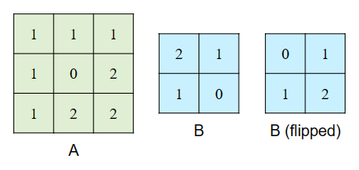
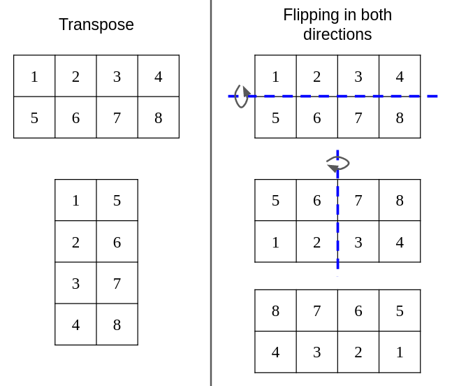
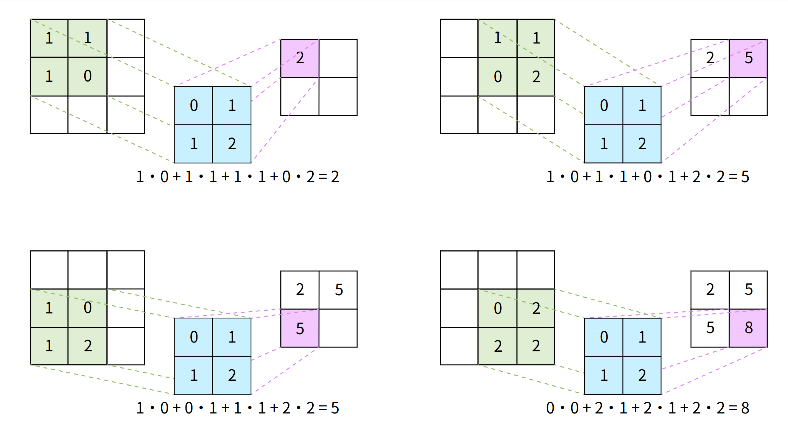
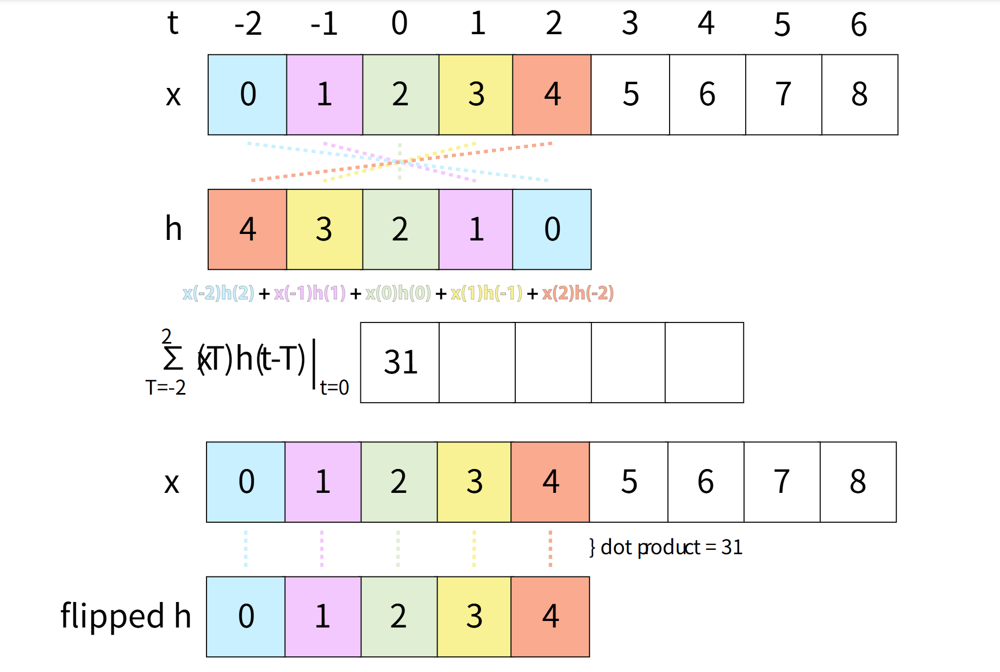

# 项目 4: CS61kaChow

 


??? note "**注意：** 在开始本项目之前，请确保已完成 Lab 0 的配置。Lab 7 是 Project 4 的前置要求，建议参考 Lecture 28-32、Discussion 10 和 Homework 8-9。"


---

## 简介

本项目的主要目标之一是探索如何加速程序运行。然而，正如真实世界的性能测试一样，许多不同因素可能会影响程序的运行效率。

本项目中，最重要的影响因素之一是 **hive 机器的负载**。Hive 机器的高负载可能会显著拖慢你的执行时间，甚至会严重误导你对代码性能的判断。

为获得更一致的测试结果，建议如下：

1. **尽早开始项目**：越接近截止时间，使用 hive 的同学越多，系统负载越高。
2. **使用 [Hivemind](https://hivemind.eecs.berkeley.edu)**：选择负载低、CPU 使用率低、用户少的 hive 机器。
3. **避开高峰时段**：在其他同学不常使用 hive 的时间段进行测试，效果更稳定。

---

## 环境配置


??? note "**必须在 hive 机器上完成本项目**，请参考 [Lab 0](https://cs61c.org/fa24/labs/lab00/) 配置 hive。"  


1. 在 hive 机器上克隆你的仓库：

```bash
git clone git@github.com:61c-student/fa24-proj4-USERNAME.git 61c-proj4
# 替换 USERNAME 为你的 GitHub 用户名
```

2. 进入你的仓库：

```bash
cd 61c-proj4
```

3.. 添加官方起始代码仓库作为 remote：

```bash
git remote add starter https://github.com/61c-teach/fa24-proj4-starter.git
```

如遇到 Git 问题，可参考 [常见错误页面](https://cs61c.org/fa24/resources/common-errors/)。

---

## 测试配置

起始代码中不包含任何测试用例。你可以运行以下命令下载课程组提供的测试：

```bash
python3 tools/create_tests.py
```

---

## 背景知识

这一节可能稍长，做题时可按需返回查看。

### 卷积（Convolutions）

关于卷积的详细定义与用途，详见：[附录：可选 - 卷积简介](#appendix-convolution)

### 应用场景：视频处理（Application: Video Processing）

本项目将卷积应用于 **视频处理**：模糊、锐化或其他滤镜操作。由于视频由一帧帧图像构成，每帧都可视为一个灰度矩阵（简化 RGB 为单通道），因此我们可以对每帧执行矩阵运算，比如卷积。

通过卷积核计算周围像素的加权平均值，可以实现“模糊”效果（即 Gaussian Blur），这也是手机拍照模糊背景的原理。

### 向量（Vectors）

本项目中，向量即 `int32_t` 类型数组（即 `int32_t *`）。

### 矩阵（Matrices）

我们提供的 `matrix_t` 结构定义如下：

```c
typedef struct {
  uint32_t rows;
  uint32_t cols;
  int32_t *data;
} matrix_t;
```

- `rows`: 行数  
- `cols`: 列数  
- `data`: 存储矩阵数据的一维数组，采用 **行优先（row-major）** 格式

例如，矩阵 `[[1, 2, 3], [4, 5, 6]]` 存储为 `[1, 2, 3, 4, 5, 6]`。

### `.bin` 文件格式

矩阵以 `.bin` 文件格式存储，文件中按顺序存储 4 字节的整数（与项目 2 相同）。文件中的第一个和第二个整数分别表示矩阵的行数和列数。其余的整数按行主序（row-major order）存储矩阵中的元素。

要查看矩阵文件，你可以运行以下命令：

```bash
xxd -e matrix_file.bin
```

将 `matrix_file.bin` 替换为你想要查看的矩阵文件。输出应该类似于以下内容：

```
00000000: 00000003 00000003 00000001 00000002  ................
00000010: 00000003 00000004 00000005 00000006  ................
00000020: 00000007 00000008 00000009           ............
```

左列是字节偏移（例如第三行起始字节是 `0x20`）。中间列是实际数据（4 字节整数，little-endian 显示）。右侧为 ASCII 显示，非可打印字符以点号代替。

文件的实际内容以 4 字节为一块列出，每行显示 4 块。第一行包含数字 3（行数）、3（列数）、1（第一个元素）和 2（第二个元素）。

这个例子代表的是一个 `3x3` 矩阵：`[1, 2, 3, 4, 5, 6, 7, 8, 9]`

---

## 任务概述（Task）

## Task 数据结构

在本项目中，我们提供了一个类型 `task_t`，定义如下：

```c
typedef struct {
  char *path;
} task_t;
```

每个任务表示一次卷积操作（我们稍后会讲解什么是卷积），并通过其 `path` 唯一标识。结构体 `task_t` 的 `path` 成员是包含该任务的文件夹的相对路径。

---

### 测试框架(testing-framework)

项目的测试文件位于 `tests` 文件夹中。起始代码中不包含任何测试，但包含一个脚本 `tools/create_tests.py`，它可以生成 `tests` 目录和测试文件。

如果你想添加自定义测试，请将其添加到 `tools/custom_tests.py` 中。你可以参考我们在 `tools/staff_tests.py` 中提供的示例。

一旦你在 `custom_tests.py` 中定义了测试，可以使用相应任务提供的 `make` 命令运行测试，测试将根据你指定的参数生成。

---

### 目录结构

运行上述测试生成脚本后，项目结构应如下所示：

```
61c-proj4/               # 项目根目录
├── src/                 # 源代码文件夹
├── tests/               # 测试用例文件夹
│   └── my_custom_test/  # 一个具体的测试文件夹
│       ├── input.txt        # 输入文件，包含任务数量和路径
│       ├── task0/           # 第一个任务
│       │   ├── a.bin        # 任务使用的矩阵 A
│       │   ├── b.bin        # 任务使用的矩阵 B
│       │   ├── ref.bin      # 我们脚本生成的参考输出矩阵
│       │   └── out.bin      # 你的程序生成的输出矩阵
│       ├── task1/           # 第二个任务，结构相同
│       ├── ...
│       └── task9/           # 第十个任务
├── tools/               # 存放工具脚本的目录
└── Makefile             # 编译和运行程序所用的 Makefile
```

`task_t` 结构体中 `path` 对于 task0 的值将是 `tests/my_custom_test/task0`。

---

### 测试(#testing)

项目使用 `Makefile` 来运行测试。`Makefile` 接收一个变量 `TEST`，用于指定包含 `input.txt` 的测试文件夹路径。

例如，要运行上面生成的测试，并且你当前正在开发 task 1，可以使用以下命令：

```bash
make task_1 TEST=tests/my_custom_test
```

---

### 调试(debugging)

虽然 `cgdb` 和 `valgrind` 在此项目中可能不如 project 1 那么有用，但在排错时仍然非常有帮助。

使用 `make` 命令运行测试时，它会输出实际执行的命令，例如：

```bash
Command: ./convolve_naive_naive tests/my_custom_test/input.txt
```

如果您想使用`cgdb`，请`cgdb`在打印的命令前添加。同样，对于`valgrind`，请在打印的命令前添加`valgrind`。例如:

```bash
cgdb --args ./convolve_naive_naive tests/my_custom_test/input.txt
valgrind ./convolve_naive_naive tests/my_custom_test/input.txt
```

---

## 任务 1：朴素卷积（Naive Convolutions）

在本项目中，你将实现并优化二维卷积（2D Convolutions），这是一种具有广泛应用的数学运算。如果你从未接触过卷积，不必担心——它可以简化为一系列点积操作（详见任务 1.3）。

### 概念概述：二维卷积

> 本项目中我们只考虑 **离散卷积** ，即输入向量和矩阵在 **离散索引处** 有值，与连续卷积不同（后者在实数域上有值）。如果你在其他课程中学习过卷积，下面的流程可能与你习惯的略有不同。

 **卷积** 是将两个向量或矩阵相乘以判断它们 **重叠程度** 的一种方式，这种方式有很多不同的应用。首先让我们了解卷积的基本操作：
 
 

卷积（convolution）是指将两个向量或矩阵进行卷积操作，例如矩阵 A 和矩阵 B。我们假设矩阵 B 的尺寸总是小于矩阵 A。

1. 将矩阵 B 在两个维度上 **翻转** 。注意，**翻转 != 转置** 。翻转保持维度不变（MxN → MxN），而转置会交换维度（MxN → NxM）。
 
 
2. 将翻转后的 B 与矩阵 A 左上角重叠，执行 **元素乘积并求和** ，结果作为输出矩阵的第一个值。
3. 将 B 向右滑动 1 个单位，重复此过程，直到 B 超出 A 的边界。此时，将 B 重置到 A 的第一列并向下移动一行。
4. 重复整个过程，直到覆盖 A 的右下角。完成后即得卷积结果。
 

你可以假设矩阵 B 的高度和宽度都小于或等于矩阵 A 的高度和宽度。

??? note "输出矩阵的尺寸通常与输入矩阵不同。建议你手动做几个卷积实例，了解它们之间的关系。"

---

### 实现

推荐阅读：[矩阵背景](#matrices)，[任务结构背景](#task)

你需要在 `compute_naive.c` 中实现 `convolve` 函数。可以假设 `b_matrix` 比 `a_matrix` 小（即如果 `a_matrix` 是 m×n，`b_matrix` 是 k×l，则 `k < m` 且 `l < n`）。

| 项目         | 类型                 | 描述 |
|--------------|----------------------|------|
| 参数         | `matrix_t* a_matrix` | 指向第一个矩阵的指针 |
|              | `matrix_t* b_matrix` | 指向第二个矩阵的指针 |
|              | `matrix_t** output_matrix` | 输出结果矩阵的指针。你必须在 `convolve` 内部分配内存 |
| 返回值       | `int`                | 成功返回 0，出错返回 -1 |

---

### 测试与调试

推荐阅读：[测试框架背景](#testing-framework)，[目录结构背景](#directory-structure)，[测试使用](#testing), [调试](#debugging), 

你可以运行工作人员提供的测试用例来调试这个任务：

```bash
make task_1 TEST=tests/test_tiny  
make task_1 TEST=tests/test_small  
make task_1 TEST=tests/test_large
```

如果你还没有这些测试，请先拉取 starter 文件！

如果你希望创建额外的测试，请参考 [测试框架](#testing-framework)，以及 [测试使用](#testing) 和 [调试](#debugging) 部分来了解如何运行测试。

请务必创建不同尺寸和维度的测试用例！自动评分器会使用各种大小的数据来测试你的程序的正确性和加速比。


# Task 2: 优化

此时你应该已经完成了 `compute_naive.c` 中的基本实现。你将在 `compute_optimized.c` 中实现所有优化。


## 任务 2.1：SIMD

**推荐资源：** [Lab 7](https://cs61c.org/fa24/labs/lab07/)、[Discussion 9](https://cs61c.org/fa24/discussions/disc10/)、[Homework 9](https://us.prairielearn.com/pl/course_instance/149014/assessment/2390722)

在 `compute_optimized.c` 中使用 SIMD 指令优化你的 naive 解法。本项目使用的是 32 位整数，因此每个 256 位的 AVX 向量可以同时存储 8 个整数并执行 8 次操作。

你可以参考 [Intel Intrinsics Guide](https://www.intel.com/content/www/us/en/docs/intrinsics-guide/index.html) 来查找所需的指令。你需要使用 `__m256i` 类型来保存 8 个整数，并通过 `_mm256_*` 指令进行操作。除非你对齐了内存，否则应使用非对齐版本的指令。

??? note "如果你的 `convolve` 函数依赖辅助函数，请一并用 SIMD 指令重写它们。不要忘记处理尾部元素（tail case）！"

??? hint "你可能需要查看 AVX 指令集相关的内置函数（intrinsic functions），它在卷积过程中处理某些操作时会非常有帮助。我们知道这些函数数量很多，但**查阅文档并找到与你任务相关的信息是一个非常有用的技能。"


## 任务 2.2：OpenMP

**推荐资源：** [Lab 7](https://cs61c.org/fa24/labs/lab07/)、[Discussion 10](https://cs61c.org/fa24/discussions/disc10/)、[Homework 9](https://us.prairielearn.com/pl/course_instance/149014/assessment/2390722)

在 `compute_optimized.c` 中使用 OpenMP 指令进一步优化你的 SIMD 实现。并非所有函数都适合用 OpenMP 优化。你可以参考 [OpenMP Summary Card](https://inst.eecs.berkeley.edu/~cs61c/sp21/resources-pdfs/OpenMP3.0-SummarySpec.pdf) 获取更多信息。

## 任务 2.3：算法优化

如果你的 SIMD + OpenMP 解法还达不到预期速度提升，说明还有算法层面的优化空间。这一部分比前两小节更开放，优化方法将依赖你当前的实现方式与算法。

## 任务 2.4：测试与调试

**推荐资源：** [测试框架](#testing-framework)、[目录结构](#directory-structure)、[测试](#testing)、[调试](#debugging)

运行此任务的测试（注意使用 `make task_2` 而非 `task_1`）：

```bash
make task_2 TEST=tests/test_tiny
make task_2 TEST=tests/test_small
make task_2 TEST=tests/test_large
```

如果没有测试，请先拉 starter code！你也可以参考测试框架部分编写更多测试。
如果你想创建额外的测试，请参考 [测试框架](#testing-framework) 部分来了解如何编写测试，以及 [测试](#testing) 和 [调试](#debugging) 部分来获取运行测试的说明。

在 CGDB 中可以直接打印向量：``print *(type_in_vector *)&variable_name@num_elems_in_vector``


例如，如果你想打印一个 256-bit 宽度的向量中的值，你可以使用以下命令：

```gdb
(gdb) print *(int32_t *)&my_vector@8
$1 = {123, 123, 123, 123, 123, 123, 123, 123}
```

---


# Benchmarks（基准测试）

> ⚠️ 运行时间与加速比可能受 Hive 机器负载影响。我们建议你查看 [Hivemind](https://hivemind.eecs.berkeley.edu) 选择合适的服务器。更多性能一致性技巧见引言部分。

我们会测试如下类型：

- **Optimized：** 使用你写的 `compute_optimized.c` 和助教提供的 `compute_naive.c`
    - 默认限制使用 4 个线程进行 OpenMP 测试


# 加速要求

| 名称       | 文件夹名称             | 加速率 |
|------------|-------------------------|---------|
| 随机       | `test_ag_random`        | 8.70x   |
| 增加       | `test_ag_increasing`    | 8.05x   |
| 减少       | `test_ag_decreasing`    | 8.70x   |


# 性能评分计算

自动评分器的性能部分评分使用以下公式计算：  
`score = log(x) / log(t)`  
其中 `x` 是提交在特定基准测试中实现的加速率，`t` 是该基准的目标加速率。


# 附录：`io.o` 中的辅助函数

我们提供了一些在 `io.o` 中的辅助函数。我们只提供了将在链接时与你的程序链接的目标文件，不提供源代码，以避免泄露其他项目的解法。


### `read_tasks`

| 类别        | 参数 / 返回类型          | 描述 |
|-------------|--------------------------|------|
| **参数**     | `char *input_file`        | 输入文件的路径（`input.txt`）。 |
|             | `int *num_tasks`          | 设置 `*num_tasks` 为输入文件中的任务数量。 |
|             | `task_t ***tasks`         | 设置 `*tasks` 为一个 `task_t *` 数组，每个指向一个表示任务的 `task_t` 结构体。 |
| **返回值**   | `int`                     | 成功返回 0，出错返回 -1。 |

### `get_a_matrix_path`

| 类别        | 参数 / 返回类型          | 描述 |
|-------------|--------------------------|------|
| **参数**     | `task_t *task`            | 指向任务的指针。 |
| **返回值**   | `char *`                  | 给定任务的矩阵 A 的路径。 |

### `get_b_matrix_path`

| 类别        | 参数 / 返回类型          | 描述 |
|-------------|--------------------------|------|
| **参数**     | `task_t *task`            | 指向任务的指针。 |
| **返回值**   | `char *`                  | 给定任务的矩阵 B 的路径。 |

### `get_output_matrix_path`

| 类别        | 参数 / 返回类型          | 描述 |
|-------------|--------------------------|------|
| **参数**     | `task_t *task`            | 指向任务的指针。 |
| **返回值**   | `char *`                  | 给定任务的输出矩阵的路径。 |

### `read_matrix`

| 类别        | 参数 / 返回类型          | 描述 |
|-------------|--------------------------|------|
| **参数**     | `char *path`              | 要读取矩阵的路径。 |
|             | `matrix_t **matrix`       | 设置 `*matrix` 为存储在 `path` 中的矩阵。 |
| **返回值**   | `int`                     | 成功返回 0，出错返回 -1。 |

### `write_matrix`

| 类别        | 参数 / 返回类型          | 描述 |
|-------------|--------------------------|------|
| **参数**     | `char *path`              | 要写入矩阵的路径。 |
|             | `matrix_t *matrix`        | 要写入的矩阵。 |
| **返回值**   | `int`                     | 成功返回 0，出错返回 -1。 |

# 附录： (可选) 视频处理

## 查看输出

由于 Hive 机器是无头的（没有图形界面），你需要先将 GIF 文件复制到本地机器才能查看它们。

1. **查找** 输出 GIF 的路径。通常是：
   ```
   ~/61c-proj4/tests/name_of_your_test/outX.gif
   ```
   例如：
   ```
   ~/61c-proj4/tests/test_gif_kachow_blur/out0.gif
   ```

   - 假设你的仓库文件夹名为 `61c-proj4`。如果不是，请相应替换。
   - 可以使用 `ls` 和 `cd` 命令在 Hive 上浏览文件。

2. **打开** 一个新的终端窗口。

3. **导航** 到你希望保存 GIF 的目录。

4. **运行** 以下命令（将 `cs61c-???` 替换为你的用户名，`path_to_gif` 替换为步骤 1 中找到的实际路径）：

   ```bash
   scp cs61c-???@hive1:path_to_gif .
   ```

现在该文件应该可以在你的本地机器上访问，你可以使用你选择的图像查看器打开它。

# 附录： 卷积(appendix-convolution)

本附录中的内容不在本课程的范围之内。

卷积是一个数学操作，广泛应用于信号处理与分析、计算机视觉、图像与音频处理、机器学习、概率与统计等领域。常见的应用包括 [图像中的边缘检测](https://web.archive.org/web/20241212231541/https://en.wikipedia.org/wiki/Edge_detection)、[图像中的模糊（散景）](https://web.archive.org/web/20241212231541/https://en.wikipedia.org/wiki/Bokeh)、[音频中的混响](https://web.archive.org/web/20241212231541/https://en.wikipedia.org/wiki/Reverberation) 和创建 [卷积神经网络](https://web.archive.org/web/20241212231541/https://en.wikipedia.org/wiki/Convolutional_neural_network) 等。

本附录将仅概述一维离散时间卷积。离散时间意味着一个函数仅在离散的、等间隔的整数索引处定义。此外，下面的解释非常简略，可能有些复杂，因此对于本项目来说，不理解卷积是完全可以接受的。如果你想深入了解卷积及其如何与信号交互，务必选修 [EE120](https://web.archive.org/web/20241212231541/https://www2.eecs.berkeley.edu/Courses/EE120/)。

接下来，让我们开始吧 

数学上，卷积是一种函数乘法，决定了两个函数的重叠程度。然而，在实际应用中，卷积是一个系统如何响应信号的方式。信号可以是任何数学函数，系统可以是任何接受此函数并提供输出的东西。该输出同样是一个函数。

我们可以用以下方式描述信号和系统：

```
x(t) -> H -> y(t)
```

其中，x(t) 和 y(t) 是函数，H 是系统。

卷积所需的重要系统特性是线性和时间不变性。

**线性：**  
线性的一项特性是，如果你将一个信号输入到一个被某个常数乘过的系统，它将以原始输出信号乘以同样的常数进行响应。

```
αx(t) = x̂(t) -> H -> ŷ(t) = αy(t)
```

此外，线性还意味着，如果你传递信号的和，系统将输出它们对应输出的和。

```
x_1(t) + x_2(t) = x̂(t) -> H -> ŷ(t) = y_1(t) + y_2(t)
```

将这两者结合起来：

```
αx_1(t) + βx_2(t) = x̂(t) -> H -> ŷ(t) = αy_1(t) + βy_2(t)
```

**时间不变性：**  
时间不变性意味着，如果你将一个时间平移的输入信号传递给系统，它将以相同的时间平移响应。

```
αx(t - T) = x̂(t) -> H -> ŷ(t) = αy(t - T)
```

接下来，我们将仅检查线性和时间不变（LTI）系统。

为了确定一个系统如何响应任何信号，可以将一个脉冲信号传递给系统。使用的脉冲函数称为克罗内克δ（Kronecker Delta），定义如下：

```
x(t) = 1 iff t = 0, else x(t) = 0 ∀ t | t ≠ 0
```

接下来，我们将此函数记作：𝛿(t)。

𝛿(t) 的一个重要性质是，当它与另一个函数 x(t) 相乘时，结果是一个新函数，该函数在 t = 0 时等于 x(0)，而其他地方为 0。这是因为 𝛿(t) 在 t = 0 时等于 1，其他地方为 0。这个性质可以写作：

```
x(t)𝛿(t) = x(0)𝛿(t)
```

当 𝛿(t) 被某个值 T 移动时，这个性质仍然成立，因此更一般地：

```
x(t)𝛿(t - T) = x(T)𝛿(t-T)
```

这意味着，我们可以通过将函数与平移的 𝛿(t) 相乘，来获取函数在任何整数时间点 t 的单个值。知道这一点后，我们可以通过将包含单个点的函数相加来重建 x(t)。这意味着，x(t) 可以表示为一个带有缩放的 delta 函数的和，如下所示：

```
∑x(T)𝛿(t-T) from T = -∞ to ∞ = … + x(-1)𝛿(t + 1) + x(0)𝛿(t) + x(1)𝛿(t - 1) + …
```

这是 delta 函数的一个非常有用的性质，因为我们可以传递这个和，而不是传递 x(t) 本身，以此获得系统输出的更多信息，但首先我们必须研究系统如何响应 𝛿(t)。

当 𝛿(x) 输入到系统时，输出被称为脉冲响应。

```
𝛿(t) -> H -> h(t)
```

有几种方法可以找到 h(t)，其中一种方法是物理测试系统，输入一个脉冲并测量输出。知道这一点后，让我们看看当我们传入缩放的 delta 函数和时会发生什么。由于系统是 LTI 的，传入的缩放输入和将产生相应的缩放输出和。此外，时间平移的输入将给出同样值的时间平移输出。这意味着：

```
x(t) = … + x(-1)𝛿(t + 1) + x(0)𝛿(t) + x(1)𝛿(t - 1) + … -> H -> … + x(-1)h(t + 1) + x(0)h(t) + x(1)h(t - 1) + … = y(t)
```

输出可以表示为：

```
∑x(T)h(t-T) from T = -∞ to ∞
```

这定义了 x(t) 和 h(t) 的卷积，运算符用符号 * 表示。系统通过将 x(t) 与脉冲响应进行卷积来响应 x(t)。卷积也是一个交换运算，尽管证明留给读者作为练习。和的表达式还表明，为什么练习 1.2 中的一个向量必须翻转才能直接将向量相乘。x(T) 从 -∞ 开始评估并与 h(t-T) 相乘，h(t-T) 从 +∞ 开始评估，因此如果不翻转，你必须有两个指针，一个从第一个向量的开始处开始，另一个从第二个向量的末尾处开始，朝相反方向前进。通过翻转 h(t - T) 为 h(-t + T)，它也从 -∞ 到 +∞ 进行评估，从而使两个向量能够直接相乘，找到 t 时的输出。由于卷积是交换的，这也不重要哪个向量被翻转。

最后一点，注意到输入和：

```
∑x(T)𝛿(t-T) from T = -∞ to ∞
```

也是卷积，x(t) 和 𝛿(t) 之间的卷积，它等于 x(t)。这意味着 𝛿(t) 是卷积的单位元，对于任何 x(t)，都有：

```
x(t)*𝛿(t) = x(t)
```

 

